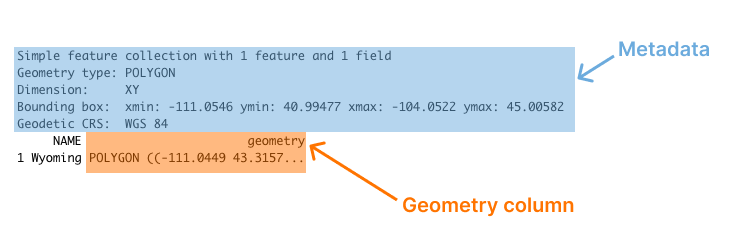

```{r}
i <- 1
chapter_number <- 4
source("_common.R")
```

# R is a Full-Fledged Map-Making Tool

When I first started learning R, I had no idea it could make maps. I thought of R as a tool to work with numbers, not shapes. So I was surprised when I first saw people making maps with R. You absolutely can make maps in R. And not just prosaic maps. Beautiful maps that use high-quality design principles. Maps that are good enough to be featured in top media outlets. 

When many people hear "maps" they immediately think of ArcGIS. But this tool is expensive, with business licenses for ArcGIS starting at $500 per year. Excel has added support for map-making in recent years, but features are limited (making maps based on street addresses, for example, is not possible). There is QGIS, an open-source tool similar to ArcGIS. But if you don't already use QGIS, you have to learn another tool. And, if you're working in R, the mental tax that comes from context switching between tools is significant. Learning to make maps in R means you can do everything, for free, in one tool. 

And the best part of making maps in R is that we can use what we learned about high-quality data visualization in Chapter \@ref(data-viz-chapter). Maps are a form of data visualization and the principles discussed in that chapter apply here as well. 

Many people assume that making maps requires a lot of specialized knowledge. It doesn't. There are a few things you need to know in order to work with geospatial data used to make maps. But once you understand the basics, you too can make high-quality maps in R. To show how anyone can make high-quality maps in R, I spoke with Abdoul Madjid. A polyglot developer, Madjid has been making maps with R for several years. In January 2022, he made a beautiful map that shows rates of COVID-19 in the US throughout 2021. Madjid is not a geospatial information system (GIS) specialist, but he has learned how to work with geospatial data in R in a way that enables him to make beautiful maps like this one. I spoke with Madjid and he explained how he obtained the data, analyzed it, and made his COVID-19 map, which you can see in Figure \@ref(fig:madjid-covid-map) below.

```{r results='asis'}
print_nostarch_file_name(file_type_to_print = "png")
```

```{r madjid-covid-map, out.width="100%", fig.cap="Abdoul Madjid's map of COVID in the United States in 2021"}
knitr::include_graphics("assets/covid-map.png")
```

```{r results='asis'}
save_image_for_nostarch(here::here("assets/covid-map.png"))
```

In this chapter, we will begin by diving into geospatial data, giving you the minimum you need to know in order to make maps in R. We'll then walk through Abdoul Madjid's code, looking at the choices he made that resulted in this high-quality map. I then offer some guidance on where you can finding and working with geospatial data to make your own maps. The chapter concludes with some thoughts about why R is such a good tool for making maps.

## The Briefest of Primers on Geospatial Data {-}

You don't need to be a GIS expert to make maps (I'm not and I do). But you do need to understand a few things about how geospatial data works. Here is the briefest of primers on geospatial data. 

There are two main types of geospatial data: vector and raster. Vector data uses points, lines, and polygons to represent the world. Raster data, which often comes from digital photographs, ties each pixel in the photograph to a specific geographic location. Vector data tends to be simpler to work with, and we will be using it exclusively in this chapter (when I use the term "geospatial data" in this chapter, I'm referring to vector data).

If you are making maps today in R, consider yourself lucky. Changes in recent years have made it much simpler to work with geospatial data, and to build maps with R. Before then, there were competing standards for geospatial data, and each standard required learning a different approach. Today, though, the simple features model (often abbreviated as sf) for working with vector geospatial data has become dominant. You should be grateful, as simple features data is way easier to work with than were previous geospatial data models. 

Geospatial data is both very similar to data you're already used to working with in R and, in some ways, very different. To see the similarities and differences, let's look at how simple features data works. In this section, I'll just show you data and the maps we make with that data, providing the bare minimum you need to know in order to understand how simple features data works. This section won't show code, but the sections that follow, which explain how to work with geospatial data, will. 

Let's begin by taking a look at some simple features geospatial data that represents the U.S. state of Wyoming. Here's what it looks like.

```{r}
library(tigris)
library(sf)

wyoming <- states(progress_bar = FALSE) %>%
  st_transform("WGS84") %>%
  select(NAME) %>%
  filter(NAME == "Wyoming") %>%
  st_cast(to = "POLYGON")

wyoming
```

You can see that we have a column for state name (`NAME`) and another column called `geometry`. Overall, this looks like the output we're used to seeing with data in a data frame. But there are two major differences:

1. There is a bunch of metadata above the data frame
2. Our simple features data has a `geometry` column

You can see these differences highlighted in Figure \@ref(fig:sf-data-output) below.

```{r results='asis'}
print_nostarch_file_name(file_type_to_print = "png")
```

```{r sf-data-output, out.width="100%", fig.cap="The output of sf data with metadata and the geometry column highlighted"}

```

```{r results='asis'}
save_image_for_nostarch(here::here("assets/sf-data.png"))
```

Let's discuss each of these differences.

### Metadata {-}

Above the main output, we see a section that starts with the text "Simple feature collection with 1 feature and 1 field." The feature here is the row and the field is the variable (`NAME`) that contains non-spatial data (the `geometry` column, which contains geospatial data, will be discussed below). This line, and the lines that follow, are metadata about the geospatial data in the `wyoming` object.

#### Geometry Type {-}

The geometry type shows the type of geospatial data we're working with. POLYGON (geometry types are typically written in all caps) means a relatively simple shape that can be represented by a single polygon. We can use ggplot to display this data. Note that `geom_sf()` is a special geom designed to work with simple features (sf) data. 

```{r wyoming-map-code, echo = TRUE, include = FALSE}
wyoming %>%
  ggplot() +
  geom_sf()
```

We can see the resulting map of Wyoming. It may not look like much, but, hey, I wasn't the one who chose to make Wyoming a nearly perfect rectangle! 

```{r results='asis'}
print_nostarch_file_name()
```

```{r wyoming-map-plot, ref.label = "wyoming-map-code", echo = FALSE, include = TRUE, fig.cap="A map of Wyoming"}
```

```{r results='asis'}
save_figure_for_nostarch()
```

POLYGON is one of several geometry types that sf data can be used to represent. Others include:

POINT: Used to display something like a pin on a map that shows a single location. Here's a map showing the location of a single electric vehicle charging station in Wyoming.

```{r results='asis'}
print_nostarch_file_name()
```

```{r ev-stations-map, fig.cap = "A map of a single electric vehicle charging station in Wyoming"}
wy_ev_stations <- read_csv("data/ev-charging-stations.csv") %>%
  janitor::clean_names() %>%
  filter(state == "WY") %>%
  filter(fuel_type_code == "ELEC") %>%
  st_as_sf(
    coords = c("x", "y"),
    crs = "WGS84"
  ) %>%
  select(objectid)

ggplot() +
  geom_sf(data = wyoming) +
  geom_sf(
    data = slice(wy_ev_stations, 1),
    shape = 21,
    fill = "#ff7400",
    color = "white",
    size = 3
  )
```

```{r results='asis'}
save_figure_for_nostarch()
```

LINESTRING: A set of points that can be connected with lines, this geometry type is often used to represent roads. Here's an example I've added of a LINESTRING showing a section of U.S. Highway 30 that runs through Wyoming. 

```{r results='asis'}
print_nostarch_file_name()
```

```{r wy-roads-map, fig.cap = "A map of a section of U.S. Highway 30 running through Wyoming"}
wy_roads <- primary_secondary_roads(
  state = "Wyoming",
  progress_bar = FALSE
) %>%
  janitor::clean_names()

wy_roads %>%
  filter(linearid == 11010932011560) %>%
  ggplot() +
  geom_sf(data = wyoming) +
  geom_sf(
    color = "#ff7400",
    linewidth = 1
  )
```

```{r results='asis'}
save_figure_for_nostarch()
```

Each of these has a MULTI- variation (MULTIPOINT, MULTILINESTRING, and MULTIPOLYGON) to combine multiple instances of their "single" variation in one row of data. For example, the data used to make Figure \@ref(fig:wyoming-ev-stations-map) below, which shows all electric vehicle charging stations in Wyoming, is MULTIPOINT.

```{r results='asis'}
print_nostarch_file_name()
```

```{r wyoming-ev-stations-map, fig.cap = "A map of all electric vehicle charging stations in Wyoming"}
ggplot() +
  geom_sf(data = wyoming) +
  geom_sf(
    data = wy_ev_stations,
    color = "#ff7400",
    size = 3
  )
```

```{r results='asis'}
save_figure_for_nostarch()
```

MULTILINESTRING data can be seen if we show not one road, but all major roads in Wyoming, as in Figure \@ref(fig:wyoming-roads-map).

```{r results='asis'}
print_nostarch_file_name()
```

```{r wyoming-roads-map, fig.cap = "A map of all major roads in Wyoming"}
wy_roads %>%
  ggplot() +
  geom_sf(data = wyoming) +
  geom_sf(
    color = "#ff7400",
    linewidth = 1
  )
```

```{r results='asis'}
save_figure_for_nostarch()
```

MULTIPOLYGON data occurs when, for example, we have a state made up of multiple polygons. To see what I mean, let's take a look at a map of Wyoming counties. First, let's look at simple features data used to represent the 23 counties in the state. We can see that the geometry type of this data is MULTIPOLYGON (in addition, the repeated MULTIPOLYGON text in the `geometry` column indicates that each row contains a shape of type MULTIPOLYGON; see section on the `geometry` column below). 

```{r}
wy_counties <- counties(state = "Wyoming",
                        progress_bar = FALSE) %>%
  st_transform("WGS84") %>%
  select(NAME)

wy_counties
```

Figure \@ref(fig:wyoming-counties-map) is a map made with this data. You can see the multiple polygons that make up the map.

```{r results='asis'}
print_nostarch_file_name()
```

```{r wyoming-counties-map, fig.cap = "A map of Wyoming counties"}
wy_counties %>%
  ggplot() +
  geom_sf()
```

```{r results='asis'}
save_figure_for_nostarch()
```

#### Dimensions {-}

The next line we see in our geospatial data frame metadata is dimension. For our Wyoming data, we had the text `Dimension: XY`. Dimensions refer to the type of geospatial data we're working with. When we see `XY`, this means the data is two-dimensional. This is what we will see in all of the geospatial data used in this chapter. There are two other dimensions (`Z` and `M`) that you see much more rarely. Since `Z` and `M` are both less common and not relevant to the maps we're discussing in this chapter, I'll leave them for you to investigate further.

#### Bounding Box {-}

The penultimate element we see in the metadata is the bounding box. For our `wyoming` object, it looks like this:

`Bounding box:  xmin: -111.0569 ymin: 40.99475 xmax: -104.0522 ymax: 45.0059`

A bounding box represents the smallest area in which we can fit all of our geospatial data. What we see in our metadata is the four corners of this bounding box. For Wyoming, the `ymin` value of 40.99475 and `ymax` value of 45.0059 represent the lowest and highest latitude, respectively, that the polygon that represents the state can fit into (the x values do the same for longitude). Bounding boxes are calculated automatically and are not typically something you have to worry about altering.

#### Geodetic CRS {-}

The final piece of metadata above our data frame is the "Geodetic CRS." This refers to the coordinate reference system (CRS) used to project our data when we plot it. The problem with representing any geospatial data is that we're projecting data used to represent the three-dimensional earth onto a two-dimensional map. Doing so requires us to choose a coordinate reference system that determines what type of projection to use when making our map. 

Let's look at a couple projections of our map of Wyoming counties. We'll begin by looking at the data we're using to make our maps. As we can see in the line `Geodetic CRS:  WGS 84`, this uses a coordinate reference system known as WGS84. If we plot our map with this data, Figure \@ref(fig:wyoming-counties-map-wgs84) what it looks like. 

```{r results='asis'}
print_nostarch_file_name()
```

```{r wyoming-counties-map-wgs84, fig.cap = "A map of Wyoming counties using the WGS84 projection"}
wy_counties %>%
  ggplot() +
  geom_sf()
```

```{r results='asis'}
save_figure_for_nostarch()
```

To see how different a map that uses a different projection can look, check out another map of Wyoming counties, this time using what's known as the "Albers equal-area conic convenience projection." Whereas Wyoming looked perfectly horizontal in Figure \@ref(fig:wyoming-counties-map-wgs84) above, in Figure \@ref(fig:wyoming-counties-map-5070) below it appears to be tilted. 

```{r results='asis'}
print_nostarch_file_name()
```

```{r wyoming-counties-map-5070, fig.cap = "A map of Wyoming counties using the Albers equal-area conic convenience projection"}
wy_counties %>%
  st_transform(5070) %>%
  ggplot() +
  geom_sf()
```

```{r results='asis'}
save_figure_for_nostarch()
```

If you're curious about how to change projections when making maps of your own, fear not. I'll show you how to do so when we look at Abdoul Madjid's map. And if you want to know how to choose appropriate projections for your maps, check out the conclusion of the chapter.

### The `geometry` Column {-}

In addition to the metadata above our data frame, there is another difference between geospatial data and traditional data frames. All simple features data has a `geometry` column. As you probably guessed from the name, this column holds the data needed to make our maps.

Think back to when you were a kid and you did connect-the-dots drawings. As you added lines to connect one point to the next, the subject of your drawing was eventually revealed. The geometry column is similar. It has a set of numbers, each of which corresponds to a point. If you're using LINESTRING/MULTILINESTRING or POLYGON/MULTIPOLYGON simple features data, ggplot uses the data in the geometry column to draw each point and then add lines to connect the points (if you're using POINT/MULTIPOINT data, it just draws the points but doesn't connect them). 

If it sounds complicated, don't worry: you never have to worry about the details. The first time I looked in any depth at a geometry column was when I wrote this chapter. What you need to know is this: simple features data has a `geometry` column, and it's what ggplot uses to make maps.

## How to Make High-Quality Maps {-}

Now that we've explained the basics of geospatial data, let's make a map. All those concepts you just learned about geometry types, dimensions, bounding boxes, projections, and the `geometry` column will come into play as we return to the COVID-19 map that Abdoul Madjid made. Let's walk through the code Madjid used to make his map. I've made some small modifications to the code in order to make the final map fit on the page, but what you'll see below is nearly identical to the original code. 

Let's begin by loading few packages to create Madjid's COVID-19 map. We'll use the `tidyverse` for data importing, manipulation, and plotting (with ggplot). The `albersusa` package will give us the geospatial data we need and the `sf` package will enable us to change its coordinate reference system to use an appropriate projection. The `zoo` package has functions for calculating rolling averages and the `colorspace` package gives us a color scale that highlights the data well. 

```{r echo = TRUE}
library(tidyverse)
library(albersusa)
library(sf)
library(zoo)
library(colorspace)
```

### Importing Our Data {-}

Next, let's import the data we need. There are three pieces of data we'll import:

1. COVID rates by state over time
1. State populations
1. Geospatial data to make our map of the United States

Madjid imported each of these pieces of data separately and then merged them, and we'll do the same.

First, we import COVID data. This data comes directly from the *New York Times*, which publishes daily case rates by state as a CSV file on their GitHub account. I've dropped the `fips` variable (FIPS, which stands for Federal Information Processing Standards, are numeric codes used to represent states) because we can just use the state name instead.

```{r echo = TRUE}
covid_data <- read_csv("https://raw.githubusercontent.com/nytimes/covid-19-data/master/us-states.csv") %>%
  select(-fips)
```

If we take a look at this data we can see the arrival of the first COVID cases in the United States in January 2020. 

```{r}
covid_data
```

The map that Abdoul Madjid made shows not absolute rates, but per capita rates. So, to recreate his maps, we need to have data on population by state. Madjid downloaded this data as a CSV. The code below imports this data, keeps the `State` and `Pop` (population) variables, and saves it as an object called `usa_states`. 

```{r echo = TRUE}
usa_states <- read_csv("data/population-by-state.csv") %>%
  select(State, Pop)
```

Let's see what `usa_states` looks like.

```{r}
usa_states
```

Finally, we'll bring in our geospatial data and save it as an object called `usa_states_geom`. The `usa_sf()` function from the `albersausa` package gives us simple features data for all U.S. states (and, conveniently, puts Alaska and Hawaii in a location and at a scale that they are easy to see). This data includes multiple variables, but we only need the state name so we only keep the `name` variable. 

Madjid then used the `st_transform()` function from the `sf` package to change the coordinate reference system. The CRS that he used comes from the `us_laea_proj` object, which comes from the `alberusa` package. Remember the Albers equal-area conic convenience projection we used to change the appearance of our Wyoming counties map? This is the same projection. Here's the full code to import `usa_states_geom`.

```{r echo = TRUE}
usa_states_geom <- usa_sf() %>%
  select(name) %>%
  st_transform(us_laea_proj)
```

### A Short Detour to Discuss Projections {-}

Let's pause for a moment to plot our geospatial data. As we saw when making our maps of Wyoming, it only takes three lines to make a map from our simple features data.

```{r echo = TRUE, eval = FALSE}
usa_states_geom %>%
  ggplot() +
  geom_sf()
```

In Figure \@ref(fig:us-map-albers-projection), we can see the curvature of the longitude and latitude lines and see how the land curves along with them.

```{r results='asis'}
print_nostarch_file_name()
```

```{r us-map-albers-projection, fig.cap = "A map of the United States using the Albers equal-area conic convenience projection"}
usa_states_geom %>%
  ggplot() +
  geom_sf()
```

```{r results='asis'}
save_figure_for_nostarch()
```

If we want to see the same data projected with a different coordinate reference system, we can import the data again using the `usa_sf()` function, but without setting the CRS to the Albers equal-area conic convenience projection. I'm also only keeping the `name` variable in order to make our output easier to read. 

```{r echo = TRUE}
usa_states_wgs84 <- usa_sf() %>% 
  select(name)
```

I saved this object as `usa_states_wgs84` because, as you can see below, the `usa_sf()` function returns data that uses the WGS84 projection. Here's what it looks like.

```{r}
usa_states_wgs84
```

We can now use the same three lines of code (switching out `usa_states_geom` for `usa_states_wgs84`) to plot our map.

```{r echo = TRUE, eval = FALSE}
usa_states_wgs84 %>%
  ggplot() +
  geom_sf()
```

If we take a look at the resulting map in Figure \@ref(fig:us-map-wgs84-projection) below, we can see how different it looks. The curvature of the latitude and longitude lines is gone and the shape of the United States has changed as well, looking far more straight than our previous map. 

```{r results='asis'}
print_nostarch_file_name()
```

```{r us-map-wgs84-projection, fig.cap = "A map of the United States using the WGS84 projection"}
usa_states_wgs84 %>%
  ggplot() +
  geom_sf()
```

```{r results='asis'}
save_figure_for_nostarch()
```

There are many, many different projections you can use. The conclusion of this chapter talks about how to select appropriate projections when making your own maps.

### Importing COVID Cases Data {-}

Next, we need to calculate the number of daily COVID cases. We have to do this because the `covid_data` data frame gives us cumulative cases by state. So, to calculate the number of cases per day for each state, Madjid grouped the data by state using the `group_by()` function, then created a new variable called `pd_cases`, which represents the number of cases in the previous day (he uses the `lag()` function  to create this variable). Some days do not have cases counts for the previous day so, in these cases, Madjid set the value as 0 using the `replace_na()` function. Finally, Madjid created a new variable called `daily_cases`. For this variable, he used the `case_when()` function to set up a condition: if the `cases` variable (cases on that day) is greater than the `pd_cases` variable (cases one day prior), then `daily_cases` is equal to `cases` minus `pd_cases`; otherwise, set `daily_cases` to be equal to 0. Since we grouped the data by state at the beginning, we must now remove this grouping using the `ungroup()` function. 

```{r echo = TRUE}
covid_cases <- covid_data %>%
  group_by(state) %>%
  mutate(
    pd_cases = lag(cases)
  ) %>%
  replace_na(list(pd_cases = 0)) %>%
  mutate(
    daily_cases = case_when(
      cases > pd_cases ~ cases - pd_cases,
      TRUE ~ 0
    )
  ) %>%
  ungroup() %>%
  arrange(state, date)
```

We can now take a look at the `covid_cases` data frame we created. The variable we care about for the next step is `daily_cases`.

```{r}
covid_cases
```

### Calculating Incidence Rate {-}

We're not quite done calculating values. The data that Madjid used to make his map was not daily case counts. Instead, it was a five-day rolling average of cases per 100,000 people. Madjid created a new data frame called `covid_cases_rm` (rm for rolling mean). The first step in its creation is to use the `rollmean()` function from the `zoo` package to create a `roll_cases` variable. The `k` argument is the number of days (five in order to calculate the five-day rolling average) and the `fill` argument determines what happens in cases like the first day where we can't calculate a five-day rolling mean because there are no days prior to this day (Madjid set these values to be NA). Here is that section of the code:

```{r echo = TRUE, eval = FALSE}
covid_cases %>%
  mutate(roll_cases = rollmean(
    daily_cases,
    k = 5,
    fill = NA
  ))
```

After calculating `roll_cases`, Madjid started work on calculating per capita case rates. To do this, he needed population data so he joined the population data from the `usa_states` data frame with the `covid_cases` data. He then dropped rows with missing population data (the `Pop` variable). In practice, this meant getting rid of several U.S. territories (American Samoa, Guam, Northern Marianas Islands, and Virgin Islands). 

```{r echo = TRUE, eval = FALSE}
left_join(usa_states,
          by = c("state" = "State")) %>%
  drop_na(Pop)
```

Next, Madjid created a per capita case rate variable called `incidence_rate` by multiplying the `roll_cases` variable by 100,000 and then dividing it by the population of each state. Rather than keeping raw values (for example, the Florida on June 29, 2021 had a rate of 57.77737 cases per 100,000 people), Madjid used the `cut()` function to convert the values into categories. His code in this section makes values of ">0" (greater than 0), ">5", and so on up to a maximum value of ">50". 

```{r echo = TRUE, eval = FALSE}
mutate(incidence_rate = 10^5 * roll_cases / Pop) %>%
  mutate(incidence_rate = cut(incidence_rate,
                              breaks = c(seq(0, 50, 5), Inf),
                              include.lowest = TRUE) %>%
           factor(labels = paste0(">", seq(0, 50, 5))))
```

The last step is to filter to only include 2021 data because Madjid's map only shows that year and select only the variables (`state`, `date`, and `incidence_rate`) we'll need to create our map. The full code to create the `covid_cases_rm` data frame is below.

```{r}
covid_cases_rm <- covid_cases %>%
  mutate(roll_cases = rollmean(
    daily_cases,
    k = 5,
    fill = NA
  )) %>%
  left_join(
    usa_states,
    by = c("state" = "State")
  ) %>%
  drop_na(Pop) %>%
  mutate(incidence_rate = 10^5 * roll_cases / Pop) %>%
  mutate(incidence_rate = cut(
    incidence_rate,
    breaks = c(seq(0, 50, 5), Inf),
    include.lowest = TRUE
  ) %>%
    factor(labels = paste0(">", seq(0, 50, 5)))) %>%
  filter(year(date) == 2021) %>%
  select(state, date, incidence_rate)
```

Let's now take a look at the `covid_cases_rm` data frame. 

```{r}
covid_cases_rm
```

### Adding Geospatial Data {-}

We've now used two (COVID case data and state population data) of our three data sources to create the `covid_cases_rm` data frame that we'll use to make our map. Let's use our third data source: the geospatial data we saved as `usa_states_geom`. We start with this data frame and then merge our `covid_cases_rm` data frame into it, matching the `name` variable from `usa_states_geom` to the `state` variable in `covid_cases_rm`. Being able to merge together regular data frames with geospatial data is possible with simple features data, another mark in its favor. 

```{r echo = TRUE, eval = FALSE}
usa_states_geom %>%
  left_join(covid_cases_rm, by = c("name" = "state"))
```

Next, Madjid created a new variable called `fancy_date`. As the name implies, it's a nicely formatted version of the date so that we get "Jan. 01" instead of "2021-01-01." The `format()` function does the formatting while the `fct_inorder()` function makes it so that the `fancy_date()` variable will display in order by date (rather than, say, putting August before January because it comes first alphabetically). Last, we use the `relocate()` function to put the `fancy_date` column next to the `date` column. We save this data frame as `usa_states_geom_covid`. 

```{r}
usa_states_geom_covid <- usa_states_geom %>%
  left_join(covid_cases_rm, by = c("name" = "state")) %>%
  mutate(fancy_date = fct_inorder(format(date, "%b. %d"))) %>% 
  relocate(fancy_date, .before = incidence_rate)
```

If we take a look at the `usa_states_geom_covid` data frame, we can see the metadata and `geometry` columns discussed above.

```{r}
usa_states_geom_covid 
```

### Recreating the COVID Map {-}

It was a lot of work to end up with the surprisingly simple data frame `usa_states_geom_covid`, but it's all we need in order to make our map. The data may be simple, but the code that Abdoul Madjid used to make his map is quite complex. Let's look at it in pieces. 

But before doing so, two quick notes: 

First: The final map is actually multiple maps, one for each day in 2021. Combining 365 days makes for a large final product. So, instead of showing every day for each step, I'm going to filter the `usa_states_geom_covid` to just show the first six days in January. I do this using the code below and save the result as a data frame called `usa_states_geom_covid_six_days`. 

```{r echo = TRUE}
usa_states_geom_covid_six_days <- usa_states_geom_covid %>%
  filter(date <= as.Date("2021-01-06"))
```

Here's what this data looks like:

```{r}
usa_states_geom_covid_six_days
```

Second: the final product that Abdoul Madjid made is giant in order to fit all 365 days. I've had to change sizes of a few elements below to make them fit in this book. I've kept the overall structure of the code, but changed a few specific elements (for example, making text sizes smaller) so that everything fits.

#### Making the Basic Map

Now that we have six days of data, let's make some maps. Abdoul Madjid's map-making code has three main parts:

1. Making the basic map
1. Changing colors
1. Making tweaks to the theme

The three lines of code that we used above to make our Wyoming maps come back again, with some adornments to improve the quality of our map. Below, we can see that we're using `geom_sf()` to plot our geospatial data. Madjid modified a couple arguments, using `size = .05` to make the state borders less prominent and `color = "grey55"` to make the borders a medium grey color. Then, because he made one map for each day, he used the `facet_wrap()` function. The `vars(fancy_date)` code specifies that the `fancy_date` variable should be used to do the faceting (in other words, make one map for each day) and `strip.position = "bottom"` moves the labels "Jan. 01", "Jan. 02", and so on to the bottom of the maps. 

```{r echo = TRUE, eval = FALSE}
usa_states_geom_covid_six_days %>%
  ggplot() +
  geom_sf(
    aes(fill = incidence_rate),
    size = .05,
    color = "grey55"
  ) +
  facet_wrap(
    vars(fancy_date),
    strip.position = "bottom"
  )
```

The resulting map can be seen in Figure \@ref(fig:basic-map). 

```{r results='asis'}
print_nostarch_file_name()
```

```{r basic-map, fig.cap = "A map showing the incidence rate of COVID for the first six days of 2021"}
usa_states_geom_covid_six_days %>%
  ggplot() +
  geom_sf(
    aes(fill = incidence_rate),
    size = .05,
    color = "grey55"
  ) +
  facet_wrap(
    vars(fancy_date),
    strip.position = "bottom"
  )
```

```{r results='asis'}
save_figure_for_nostarch()
```

#### Changing Colors

Next, Madjid tweaked the colors of his maps. He used the `scale_fill_discrete_sequential()` function from the `colorspace` package to set the color scale. This function is quite similar to the `scale_fill_viridis_d()` function that Cédric Scherer and Georgios Karamanis used to make their drought data visualization in Chapter \@ref(data-viz-chapter). Both visualizations use the "rocket" palette, with the fill scale going from a tan at the low end to a black at the high end. Madjid then used the `name` argument to set the title for the legend. By default, it would use the variable name (`incidence_rate`), but Madjid improves it by using "COVID-19 INCIDENCE RATE" instead.

```{r}
usa_states_geom_covid_six_days %>%
  ggplot() +
  geom_sf(
    aes(fill = incidence_rate),
    size = .05,
    color = "grey55"
  ) +
  facet_wrap(
    vars(fancy_date),
    strip.position = "bottom"
  ) +
  scale_fill_discrete_sequential(
    palette = "Rocket",
    name = "COVID-19 INCIDENCE RATE"
  )
```

Our in-progress map can be seen in Figure \@ref(fig:map-with-rocket-palette) below.

```{r results='asis'}
print_nostarch_file_name()
```

```{r map-with-rocket-palette, fig.cap = "The COVID map with the rocket palette added"}
usa_states_geom_covid_six_days %>%
  ggplot() +
  geom_sf(
    aes(fill = incidence_rate),
    size = .05,
    color = "grey55"
  ) +
  facet_wrap(
    vars(fancy_date),
    strip.position = "bottom"
  ) +
  scale_fill_discrete_sequential(
    palette = "Rocket",
    name = "COVID-19 INCIDENCE RATE"
  )
```

```{r results='asis'}
save_figure_for_nostarch()
```

I've actually only shown a portion of the code that Abdoul Madjid used within the `scale_fill_discrete_sequential()` function. He also used the `guide` argument and the `guide_legend()` function to make tweaks to the legend. His code does the following:

- Puts the colored squares in one row (`nrow = 1`) rather than the default (all in a single column)
- Sets the height and width of each colored square (.3 centimeters for each)
- Sets the font family, size, and margin of both the labels (the ">0," ">5," and so on) with `label.theme` and the title ("COVID-19 INCIDENCE RATE") with `title.theme`
- Puts the title on top of the legend (`title.position = "top"`) and centers it (`title.hjust = .5`)

```{r echo = TRUE, eval = FALSE}
usa_states_geom_covid_six_days %>%
  ggplot() +
  geom_sf(
    aes(fill = incidence_rate),
    size = .05,
    color = "transparent"
  ) +
  facet_wrap(
    vars(fancy_date),
    strip.position = "bottom"
  ) +
  scale_fill_discrete_sequential(
    palette = "Rocket",
    name = "COVID-19 INCIDENCE RATE",
    guide = guide_legend(
      nrow = 1,
      keyheight = unit(.3, "cm"),
      keywidth = unit(.3, "cm"),
      label.theme = element_text(
        family = "Times New Roman",
        size = rel(6),
        margin = margin(
          r = 5,
          unit = "pt"
        )
      ),
      title.theme = element_text(
        family = "Times New Roman",
        size = rel(9),
        margin = margin(
          b = .1,
          unit = "cm"
        )
      ),
      title.position = "top",
      title.hjust = .5
    )
  )
```

I'm saving the map as it is now as the object `map_with_legend_tweaks` so that we can add onto it below.

```{r}
map_with_legend_tweaks <- usa_states_geom_covid_six_days %>%
  ggplot() +
  geom_sf(
    aes(fill = incidence_rate),
    size = .05,
    color = "transparent"
  ) +
  facet_wrap(
    vars(fancy_date),
    strip.position = "bottom"
  ) +
  scale_fill_discrete_sequential(
    palette = "Rocket",
    name = "COVID-19 INCIDENCE RATE",
    guide = guide_legend(
      nrow = 1,
      keyheight = unit(.3, "cm"),
      keywidth = unit(.3, "cm"),
      label.theme = element_text(
        family = "Times New Roman",
        size = rel(6),
        margin = margin(
          r = 5,
          unit = "pt"
        )
      ),
      title.theme = element_text(
        family = "Times New Roman",
        size = rel(9),
        margin = margin(
          b = .1,
          unit = "cm"
        )
      ),
      title.position = "top",
      title.hjust = .5
    )
  )
```

If we view our map at this point, it won't actually look like much because the legend is currently quite large in relation to the maps. In order to change this, and to make some other tweaks to improve the look-and-feel of our maps, Madjid made multiple tweaks to the maps themselves. He did this using the `theme()` function from the `ggplot2` package. One benefit of making maps with ggplot is that all of the tweaks you use when making a regular plot can be carried over to your maps as well. Many of the tweaks within the `theme()` function below are similar to those seen in Chapter \@ref(data-viz-chapter). 

#### Tweaking the Theme

Let's review the changes that Abdoul Madjid made to his maps using ggplot themes. He began by applying `theme_minimal()` to his map. This removes the ugly gray background that ggplot applies to plots (and maps). He then applied additional tweaks using the `theme()` function. Let's start by looking at the tweaks to the legend. 

##### Legend

While the code in the `scale_fill_discrete_sequential()` function customized individual elements *within* the legend (for example, the size of the colored squares), the code below customizes the legend as a whole. Madjid moved the legend to the top of the maps using `legend.position = "top"` and added a bit of spacing around the legend with `legend.box.spacing = unit(.25, "cm")`.

```{r echo = TRUE, include = FALSE}
map_with_legend_tweaks +
  theme_minimal() +
  theme(
    legend.position = "top",
    legend.box.spacing = unit(.25, "cm")
  )
```

We can see the result of these tweaks in Figure \@ref(fig:map-with-more-legend-tweaks) below.

```{r results='asis'}
print_nostarch_file_name()
```

```{r map-with-more-legend-tweaks, fig.cap = "The COVID map with additional tweaks to the legend"}
map_with_legend_tweaks +
  theme_minimal() +
  theme(
    legend.position = "top",
    legend.box.spacing = unit(.25, "cm")
  )
```

```{r results='asis'}
save_figure_for_nostarch()
```

As I did above, I'm saving the map as it is at this point (in this case, to an object called `map_with_more_legend_tweaks`) to avoid having to reprint all of the code for each map (I do the same thing in the sections below).

```{r}
map_with_more_legend_tweaks <- map_with_legend_tweaks +
  theme_minimal() +
  theme(
    legend.position = "top",
    legend.box.spacing = unit(.25, "cm"))
```

##### Text

Next, Madjid made tweaks to the title and caption. Below, we added the title and caption using this `labs()` function. Then, we see how Madjid used the `theme()` function to tweak these elements as well as the label for each map ("Jan. 01", "Jan. 02", and so on). He makes all text use Times New Roman and makes it a nearly black color using the hex code #111111. This sets defaults for all text elements, but Madjid also made tweaks to individual elements as well. He set the size of the title to be 2.5 times that of other text elements (`size = rel(2.5)`), made it bold (`face = "bold"`) and centered (`hjust = 0.5`), and added 0.25 centimeter margins on the top and bottom (`hjust = 0.5, margin = margin(t = .25, b = .25, unit = "cm")`). He made the same tweaks to the caption, with the exception of adjusting the font size. And finally, Abdoul Madjid adjusted the size and bolding of the individual map labels using `strip.text`.

```{r map-with-text-tweaks-code, echo = TRUE, eval = FALSE}
map_with_more_legend_tweaks +
  labs(title = "2021 · A pandemic year",
       caption = "Incidence rates are calculated for 100,000 people in each state.
                  Inspired from a graphic in the DIE ZEIT newspaper of November 18, 2021.
                  Data from NY Times · Tidytuesday Week-1 2022 · Abdoul ISSA BIDA.") +
  theme(
    text = element_text(family = "Times New Roman", 
                        color = "#111111"),
    plot.title = element_text(
      size = rel(2.5),
      face = "bold",
      hjust = 0.5,
      margin = margin(t = .25, 
                      b = .25, 
                      unit = "cm")
    ),
    plot.caption = element_text(
      hjust = .5,
      face = "bold",
      margin = margin(t = .25, 
                      b = .25, 
                      unit = "cm")),
    strip.text = element_text(size = rel(0.75), 
                              face = "bold")
  )
```

The resulting map shows up in Figure \@ref(fig:map-with-text-tweaks) below.

```{r map-with-text-tweaks, ref.label = "map-with-texttweaks-code", fig.cap = "The COVID map with tweaks to the title, captions, and strip text"}
```

```{r}
map_with_text_tweaks <- map_with_more_legend_tweaks +
  labs(title = "2021 · A pandemic year",
       caption = "Incidence rates are calculated for 100,000 people in each state.
                  Inspired from a graphic in the DIE ZEIT newspaper of November 18, 2021.
                  Data from NY Times · Tidytuesday Week-1 2022 · Abdoul ISSA BIDA.") +
  theme(
    text = element_text(family = "Times New Roman", 
                        color = "#111111"),
    plot.title = element_text(
      size = rel(2.5),
      face = "bold",
      hjust = 0.5,
      margin = margin(t = .25, 
                      b = .25, 
                      unit = "cm")
    ),
    plot.caption = element_text(
      hjust = .5,
      face = "bold",
      margin = margin(t = .25, 
                      b = .25, 
                      unit = "cm")),
    strip.text = element_text(size = rel(0.75), 
                              face = "bold")
  )
```

##### Grid Lines and Axis Text

Our map is looking good! Just a few tweaks left to get it close to Abdoul Madjid's original. By default, maps made with the `geom_sf()` function have axis text and lines to show longitude and latitude. Madjid removed them using the `element_blank()` function on `panel.grid` and `axis.text`.

```{r echo = TRUE, eval = FALSE}
map_with_text_tweaks +
  theme(
    panel.grid = element_blank(),
    axis.text = element_blank()
  )
```

The result, seen in Figure \@ref(fig:map-with-grid-tweaks), is a much nicer-looking set of maps. 

```{r results='asis'}
print_nostarch_file_name()
```

```{r map-with-grid-tweaks, fig.cap = "The COVID map without the grid lines and axis text"}
map_with_text_tweaks +
  theme(
    panel.grid = element_blank(),
    axis.text = element_blank()
  )
```

```{r results='asis'}
save_figure_for_nostarch()
```


```{r}
map_with_grid_and_axis_tweaks <- map_with_text_tweaks +
  theme(
    panel.grid = element_blank(),
    axis.text = element_blank()
  )
```

##### Background and Margin

The last bit of tweaking that Abdoul Madjid did was to adjust the margins around the final set of maps and give the whole thing a light gray background. The former is done within `plot.margin` while the latter is done using `plot.background`. Setting the fill color of #e5e4e2 gives it that light gray background while the `color = NA` ensures there is no outline around the plot (without that code, it would have a black border).

```{r echo = TRUE, eval = FALSE}
map_with_grid_and_axis_tweaks +
  theme(
    plot.margin = margin(t = .25, 
                         r = .25, 
                         b = .25, 
                         l = .25, 
                         unit = "cm"),
    plot.background = element_rect(fill = "#e5e4e2", 
                                   color = NA)
  )
```

And there we have it: Figure \@ref(fig:map-with-background-tweaks) our recreation of Abdoul Madjid's COVID-19 map.

```{r results='asis'}
print_nostarch_file_name()
```

```{r map-with-background-tweaks, fig.cap = "The COVID map with tweaks to the margins and the background color"}
map_with_grid_and_axis_tweaks +
  theme(
    plot.margin = margin(t = .25, 
                         r = .25, 
                         b = .25, 
                         l = .25, 
                         unit = "cm"),
    plot.background = element_rect(fill = "#e5e4e2", 
                                   color = NA)
  )
```

```{r results='asis'}
save_figure_for_nostarch()
```

## In Conclusion: R is a Map-Making Swiss Army Knife {-}

If this chapter has inspired you to want to make your own maps in R, fantastic! As we've seen from Abdoul Madjid's work, you can use R both to gather and analyze geospatial data as well make maps it. R is a map-making Swiss army knife. 

In the first part of this chapter, I gave you a quick overview of how geospatial data works. You may now be wondering: okay, great, but how do I actually make my own maps? Let's talk about where you can find geospatial data. 

### Finding Geospatial Data {-}

First, a reminder: we're exclusively discussing vector data in the simple features format. While there are other types of geospatial data, simple features data is the easiest to get started with. 

With that said, there are two ways to access geospatial data. The first is to import raw data. Geospatial data can take a number of different formats. While ESRL shapefiles (with the .shp extension) are the most common, there is also GeoJSON (.geojson), KML (.kml), and others (chapter 8 of *Geocomputation with R* by Robin Lovelace, Jakub Nowosad, and Jannes Muenchow discusses the range of formats). The good news for us is that there is a single function that can read in pretty much any type of geospatial data. That function is `read_sf()` from the `sf` package. Let's show an example of how it works. 

I downloaded geospatial data from the website geojson.xyz on United States state boundaries in GeoJSON format, saving it in the `data` folder as states.geojson. I can then import this data using the `read_sf()` function. I use the `dsn` argument (dsn stands for data source name) to tell `read_sf()` where to find the file. I then save this as the object `us_states`. 

```{r echo = TRUE}
us_states <- read_sf(dsn = "data/states.geojson")
```

Let's now take at `us_states`. The data has 41 variables so, to keep things legible, let's just keep a couple: `name` (of the state) and `geometry`. I can show these two by selecting only `name` because, when working with simple features data, the `geometry` column is unaffected by operations to all other variables. We can see all of the metadata we discussed above (geometry type, dimensions, bounding box, and coordinate reference system) as well as the data itself.

```{r}
us_states %>% 
  select(name)
```

To prove that this is geospatial data like that we've seen throughout this chapter, let's make a map with it. I'll use the same three lines we've used throughout this chapter.

```{r echo = TRUE, eval = FALSE}
us_states %>% 
  ggplot() +
  geom_sf() 
```

And there we have it: Figure \@ref(fig:geojson-us-map) shows a map of all 50 states.

```{r results='asis'}
print_nostarch_file_name()
```

```{r geojson-us-map, fig.cap = "A map of the United States made with GeoJSON data"}
us_states %>% 
  ggplot() +
  geom_sf() 
```

```{r results='asis'}
save_figure_for_nostarch()
```

Working with raw geosaptial data in this way is sometimes necessary. But not always. That's because there are R packages that provide functions to access geospatial data. Abdoul Madjid used the `usa_sf()` function from the `albersusa` package to bring in his geospatial data. Another package for accessing geospatial data related to the United States is called `tigris`. This package has a number of well-named functions for bringing in different types of data. One of these is the `states()` function. We can load the `tigris` package and run the `states()` function. Let's use the `cb = TRUE` argument to not use the most detailed shapefile and set the resolution to a more manageable "20m" (without these changes, the shapefile we'd get would be large and slow to work with). We then save the result as `states_tigris`.

```{r}
library(tigris)

states_tigris <- states(cb = TRUE, resolution = "20m")
```

The `states_tigris` object has 14 variables, but let's just keep the `NAME` and `geometry` variables in order to make the output easier to read. Our output has 52 rows (referred to in the output as features): the 50 states as well as the District of Columbia and Puerto Rico.

```{r}
states_tigris %>% 
  select(NAME)
```

We can plot this as well, but before doing so, I'm going to use the `shift_geometry()` function from `tigris`. This will put Alaska, Hawaii, and Puerto Rico in places that it is easier to see all states. It also resizes these three states to make them easier to see on a map alongside the continental United States. This is similar to what the `usa_sf()` function from `albersusa` did above.

```{r echo = TRUE, eval = FALSE}
states_tigris %>% 
  shift_geometry() %>%
  ggplot() +
  geom_sf()
```

The map, using data and the `shift_geometry` function from the `tigris` package are seen in Figure \@ref(fig:tigris-us-map) below.

```{r results='asis'}
print_nostarch_file_name()
```

```{r tigris-us-map, fig.cap = "A map of the United States made with data from the tigris package"}
states_tigris %>% 
  shift_geometry() %>%
  ggplot() +
  geom_sf()
```

```{r results='asis'}
save_figure_for_nostarch()
```

The `tigris` package has functions to get geospatial data on counties, census tracts, roads, and more. Kyle Walker, developer of the package, has also written an entire book, titled *Analyzing US Census Data: Methods, Maps, and Models in R*, that is a great place to learn more about how to use it.

If you're looking for data outside of the United States, fear not! The `rnaturalearth` package provides functions to import geospatial data from across the world. This package has a number of functions, but let's look at one: `ne_countries()`. This function gets geospatial data on countries throughout the world. I'm using two arguments in the code below: `returnclass = "sf"` to get data in simple features format and `continent = "Africa"` to only get some countries. I save the result to an object called `africa_countries`.

```{r}
library(rnaturalearth)

africa_countries <- ne_countries(returnclass = "sf",
                                 continent = "Africa")
```

We can see our data below (as above, I'm keeping only the country name and the `geometry` column for legibility).

```{r}
africa_countries %>% 
  select(name)
```

And we can plot our data on a map with the same three lines as always.

```{r echo = TRUE, include = FALSE}
africa_countries %>% 
  ggplot() +
  geom_sf()
```

The resulting map shows up in Figure \@ref(fig:africa-map).

```{r results='asis'}
print_nostarch_file_name()
```

```{r africa-map, fig.cap = "A map of Africa made with data from the rnaturalearth package"}
africa_countries %>% 
  ggplot() +
  geom_sf()
```

```{r results='asis'}
save_figure_for_nostarch()
```

If you need geospatial data, start by looking for a package like `albersusa`,  `tigris`, or `rnaturalearth`. If you can't find a package to access geospatial data, you can always fall back on using `read_sf()` from the `sf` package. No matter what, there is a way to get your geospatial data into R!

### Using Appropriate Projections {-}

Once you have access to geospatial data and are ready to map it, you need to think about which projection to use. If you're looking for a simple answer to this question, you're going to be disappointed. As Robin Lovelace, Jakub Nowosad, and Jannes Muenchow put it in their book *Geocomputation with R*, "the question of *which* CRS [to use] is tricky, and there is rarely a 'right' answer." 

If you feel overwhelmed with choosing a projection, there is a package to help. The `crsuggest` package, also made by Kyle Walker, can give you ideas for a projection to use. The `suggest_top_crs()` function will return a CRS that is well-suited for your data. Let's load `crsuggest` and try it out on our `africa_countries` data. 

```{r echo = TRUE, eval = FALSE}
library(crsuggest)

africa_countries %>% 
  suggest_top_crs()
```

The `suggest_top_crs` function returns the projection number 28232. We can now use this value in combination with the `st_transform` function in order to change the projection before we plot. 

```{r echo = TRUE, include = FALSE}
africa_countries %>%
  st_transform(28232) %>% 
  ggplot() +
  geom_sf()
```

When we run this code, we see in Figure \@ref(fig:africa-map-different-projection) below, Africa mapped with a different projection. 

```{r results='asis'}
print_nostarch_file_name()
```

```{r africa-map-different-projection, fig.cap = "A map of Africa made with projection number 28232"}
africa_countries %>%
  st_transform(28232) %>% 
  ggplot() +
  geom_sf()
```

```{r results='asis'}
save_figure_for_nostarch()
```

### Bring Your Existing R Skills to Geospatial Data {-}

Abdoul Madjid's process for analyzing data involved a few steps: he began by doing analysis on traditional data frames (recall the data on COVID rates and that on state populations). Once he had done his analysis on these data frames, he merged them with his geospatial data to create the `usa_states_geom_covid` data frame that he used to make his map. The ability to merge traditional data frames with geospatial data is a huge benefit of working with simple features data. 

Simple features data, as we've seen, looks almost exactly like a traditional data frame with two differences: 1) metadata and 2) a `geometry` column. And here's the thing with simple features data: it acts just like a traditional data frame, too. While Madjid did all of his analysis in traditional data frames before merging them with simple features data, you can also work directly on your geospatial data. All of the basic data wrangling and analysis functions from the `tidyverse` work on a simple features object. 

To demonstrate this, let's return to the `africa_countries` simple features data. Let's select two variables (`name` and `pop_est`) to see the name and population of the countries. 

```{r echo = TRUE, eval = FALSE}
africa_countries %>% 
  select(name, pop_est)
```

The output we get is this:

```{r}
africa_countries %>% 
  select(name, pop_est)
```

Let's now work with these two variables. What if I want to make a map that shows which African countries have populations over 20 million? To do so, I'd need a variable that calculates whether each country has a population over 20 million. I can do this using `mutate()` and the `if_else()` functions, creating a new variable called `population_above_20_million` that is TRUE if a country's population is over 20 million and FALSE otherwise. 

```{r echo = TRUE, eval = FALSE}
africa_countries %>% 
  select(name, pop_est) %>% 
  mutate(population_above_20_million = if_else(pop_est > 20000000, TRUE, FALSE))
```

We can then take this code and pipe it into ggplot, setting the `fill` aesthetic property to be equal to `population_above_20_million`. 

```{r echo = TRUE, eval = FALSE}
africa_countries %>% 
  select(name, pop_est) %>% 
  mutate(population_above_20_million = if_else(pop_est > 20000000, TRUE, FALSE)) %>% 
  ggplot(aes(fill = population_above_20_million)) +
  geom_sf()
```

And we end up with the map in Figure \@ref(fig:africa-map-20m).

```{r results='asis'}
print_nostarch_file_name()
```

```{r africa-map-20m, fig.cap = "A map of Africa that highlights countries with populations above 20 million people"}
africa_countries %>% 
  select(name, pop_est) %>% 
  mutate(population_above_20_million = if_else(pop_est > 20000000, TRUE, FALSE)) %>% 
  ggplot(aes(fill = population_above_20_million)) +
  geom_sf()
```

```{r results='asis'}
save_figure_for_nostarch()
```

This is a simple example of the type of data wrangling and analysis you can do on simple features data. The larger lesson is this: all of the skills you've worked hard to develop to work with data in R will also serve you well when working with geospatial data. 

### Why R is Best Tool for Making Maps {-}

This chapter has been a short, if exhausting, romp through the world of map-making in R. We've discussed the basics needed to understand geospatial data, seen how Abdoul Madjid applied this knowledge and principles of high-quality data visualization to make his map, learned how to get your own geospatial data, and how to project it appropriately to make your own maps. 

Over the years, I've come to believe that R is not just any old tool for making maps, but the best tool for making maps. It's way more flexible than Excel, way less expensive than ArcGIS, and doesn't require you to learn another tool like QGIS. But R as a map-making tool isn't just good for these reasons. It's good because you can use the general skills you've developed working with traditional data frames to your work with geospatial data. And the same ggplot code that makes your graphs shine will also help you make maps look great. 

That's what Abdoul Madjid did when making his map of COVID in the United States in 2021. Madjid is not a GIS expert, and that's kind of the point. He combined an understanding of the basics of geospatial data, fundamental R skills, and knowledge of data visualization principles to make a beautiful map. Now it's your turn to do the same.


