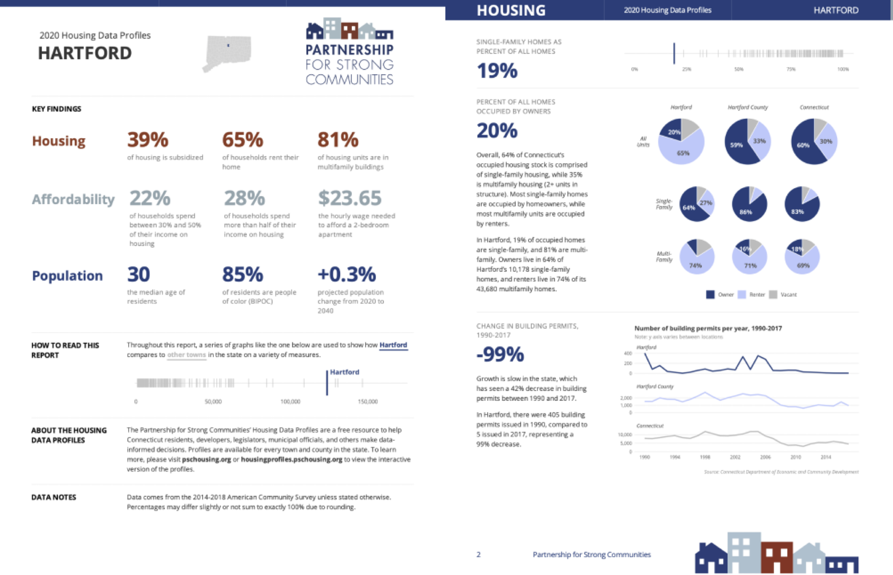
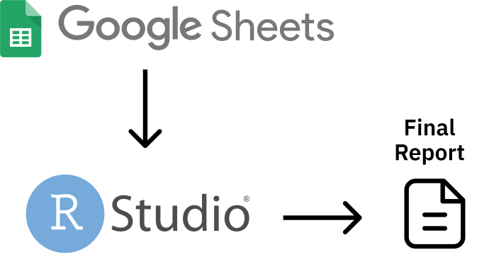

# Why R Without Statistics?

In early 2020, as COVID spread across the world, the government of New Zealand began planning their response. New Zealand had one major advantage that other countries lacked: being a remote island. This bought the country some time, but those working in the government knew that this head start would not last forever. Unless they quickly developed a plan to tackle COVID, New Zealand faced the same bleak future that other countries were already beginning to experience. 

Of course, New Zealand did develop a plan to tackle COVID. As one of the few countries to largely keep COVID out in 2020 and 2021, New Zealand came to be seen as a model for how to respond to a global pandemic. While other countries were forced into repeated lockdowns due out of control COVID spread, life in New Zealand remained largely normal. 

There are many reasons why New Zealand was so successful in tackling COVID. One of these was its use of R. Yes, R. 

To understand how R helped New Zealand tackle COVID, let's go back a bit before the pandemic. In the years leading up to 2020, the Ministry of Health had begun to transition from SAS to R. So when COVID finally arrived on the shores of New Zealand in February 2020, they had the knowledge of R to use it as their main analysis and reporting tool.

But while people at Ministry of Health had R skills, they did not have a reporting system in place for a virus like COVID. Government officials and the general public needed to know how many cases there were in New Zealand and whether these cases were the result of international arrivals or community spread. And they didn't need to know just once. They needed to know every day. As Chris Knox, who led a team at the Ministry of Health focused on the COVID response in 2021 and 2022 told me, 

> Our general infectious disease reporting was not designed to be day to day. There were systems in place for reporting at the end of the year after everything had been tidied up. 

Creating a system to report daily on COVID data was no small feat. But because the Ministry of Health was already using R, they were able to leverage its power to make their reporting efficient. 

The work did involve complex analysis. Case reports from across New Zealand would go into a database. The Ministry of Health team would then pull data to generate reports on cases throughout the country. But the reporting requirements were high. The team had to produce three daily reports:

1. A 9:00am summary of cases for high-level government officials.
2. An 11:00am situation report, complete with charts and tables, sent out to a wide range of government officials.
3. A 1:00pm public release of data on a Ministry of Health website.

There were a few tricky steps along the way. The team had to make sure to not double count cases from previous days before separating out international arrival and community spread cases.   But, again, these reports did not involve any complex statistics. They were, quite literally, counting cases. 

So why am I discussing the New Zealand Ministry of Health's use of R, a tool designed for statistics, to generate reports where the most complex statistic is counting? I'm using this example to highlight the power of R because it shows things that R can do that go beyond complex statistics.

Specifically, the way that the New Zealand Ministry of Health used R shows the power of a code-based tool to make work more reproducible. Reproducible is really just a fancy way of saying that it was way, way easier to make those three daily reports using R than it would have been with a point-and-click tool like Excel. 

Reproducibility is a fancy word that often hides its true value. I used to hear it and think it referred to scientists recreating each other's experiments in order to validate their results. But reproducibility really just means that code you write today can be run in another context. Sometimes this means someone else running your code. But sometimes it means you running the code you wrote last week. If last week's code works when you run it again this week, it's reproducible. 

Getting previously written code to run day after day was key to the success of the New Zealand Ministry of Health team reporting on COVID cases. Producing the three daily reports manually would have quickly become untenable. But the process become viable because they wrote R code once and reused it day after day. 

This isn't to say that the original code the team wrote never changed. Reporting requirements shifted with time and the team at the Ministry of Health had to adapt. Chris Knox told me that, "at some points, the reporting requirements changed every day." Fortunately, they could tweak their R code and re-run it to produce reports that met the new reporting needs.

R was an important tool in enabling a small team to generate daily reports that were key to New Zealand's successful COVID response. It allowed a team of five or six people to produce reports much more efficiently than would otherwise have been possible. In spite of this, the intensity of the work led to some burnout. As team members left and new members joined, the Ministry of Health found that, again, R was key to their success. Because the team used code for their work, a new team member could read it, get themselves up to speed, and quickly begin contributing. The public nature of a code-based workflow stands in marked contrast the all-too-common situation where an outsized amount of institutional knowledge is found in one person's brain (let's call him Larry). If Larry leaves, the team's work grinds to a halt. R not only makes work more efficient, it also ensures long-term continuity. Chris Knox described how this played out at the New Zealand Ministry of Health:

> Setting up Larry's analysis in Excel is usually faster than writing it up in code, but it's harder to onboard people into that type of environment. If you have to just sit down, run this code, look for error messages, almost anyone can do that.

R also made collaboration among the Ministry of Health team easier. Being able to review code allowed team members to improve their collective work and learn from each other. To understand the true benefit this offers, consider again our friend Larry. If Larry works in Excel, say, so much of his work is hidden. Team members can't see the set of points-and-clicks that Larry carries out to do his analysis. His colleagues can't improve his work, and it's much harder for them to learn from Larry. 

R often feels intimidating to newcomers, especially those new to coding. But what the story of New Zealand's COVID response shows us it that the power of R is huge. R was the main tool in a workflow that made it possible for a small team to produce regular reports every day for months on end. These reports didn't involve any kind of complex statistics – they were literally counts of COVID cases. But the reproducibility of their R-based workflow is where the true value is found. As Chris Knox put it, "trying to do what we did in a point-and-click environment is not possible." But with R, a small team helped a small island stay safe from COVID.

## How I Came to Use R {-}

My own relationship with R goes back to 2016. At the time, I was a consultant, helping non-profits, government agencies, and educational institutions to measure the effectiveness of their work is (a field known as [program evaluation](https://www.cdc.gov/evaluation/index.htm)). A lot of my work involved conducting surveys, analyzing the resulting the data, and sharing the results with clients. 

The work itself was fine, but the tools I was using to do it were getting on my nerves. Well, one tool really: Excel. 

Now look, this is not a place for an anti-Excel rant. Excel is a fine tool that has empowered millions to work with data in ways they would never have been able to otherwise. 

But I found Excel extremely tedious. The amount of pointing and clicking I had to do when working with the amount of data I had got old fast. Each time I would conduct a survey, I'd know that it would yield an avalanche of data and that my wrists would end up exhausted from hours of pointing and clicking. 

No matter what I did, analyzing data and creating charts in Excel just involved a lot of repetitive pointing and clicking. Kind of like this:

{width=100%}


Endless pointing and clicking was just one problem I faced using Excel. Annoying though it was, it didn't affect the quality of my work. Or so I thought until I recalled a project I had worked on a few years earlier. 

In this project, I was looking at which school districts in the state of Oregon have [outdoor education programs known as Outdoor School](https://oregonstate.app.box.com/s/83g5sjdm88xgqdxfze0ri7qo4uff5sj7). As part of this project, I had to download data on all school districts throughout Oregon, filter to only include relevant districts with fifth or sixth graders (the ages Outdoor School takes place), and then merge this with data that I collected as part of a survey I conducted. 

I did the work in Excel, using a lot of (you guessed it!) pointing and clicking. The problem came when I was almost done with the project. I've blocked the details from my memory (as I've done with most things Excel-related), but what I do recall is not being 100% certain I had done my filtering and joining correctly. And, to make it worse, I had no way to check my work. Why? Because all my pointing and clicking was ephemeral, gone in the ether as soon as I had completed it. 

I finished the Outdoor School project and submitted my report. The work I did was *probably* accurate, but maybe it wasn't? 

Now, you may be reading this thinking: why didn't you write down the steps you used in Excel so you could retrace them later? Sure, I could (and should) have done that. But let's be honest: most of us don't. 

We're human. We're lazy. We all make mistakes. And without a straightforward way to audit your work (and keeping a list of all of your Excel points and clicks in a separate document is not, in my view, straightforward), mistakes will happen. If you've used Excel to work with data, I guarantee you've made a mistake, just like me. 

The good news is that it's okay. There's a solution. And that solution is R. 

If I were to redo that project on Outdoor School with R, here's what I'd do differently. Rather than watching points and clicks disappear into the ether, I'd write code that would serve as a record of everything I did. This code would: 

Download data on all school districts:


```r
# Download the data directly from the Oregon Department of Education website
download.file(url = "https://www.oregon.gov/ode/educator-resources/assessment/Documents/TestResults2019/pagr_schools_ela_tot_raceethnicity_1819.xlsx",
              destfile = here::here("data/pagr_schools_ela_tot_raceethnicity_1819.xlsx"))
```


```r
# Import the downloaded data and use the `clean_names()` function to make the variable names easy to work with
oregon_schools <- read_excel(here::here("data/pagr_schools_ela_tot_raceethnicity_1819.xlsx")) %>% 
  clean_names()
```

Filter to only include districts with fifth or sixth graders:


```r
# Start with the oregon_schools data from above
oregon_schools_fifth_sixth_grade <- oregon_schools %>% 
  
  # Only keep schools with fifth or sixth graders
  filter(grade_level == "Grade 5" | grade_level == "Grade 6") %>% 
  
  # Only keep the variables we need
  select(district_id:school) %>% 
  
  # There are multiple observations of the same school, just keep one of each
  distinct()
```


Join the filtered data on school districts with my survey data:


```r
# Use the school_id variable to join the survey data with the oregon_schools_fifth_sixth_grade from above 
left_join(survey_data, oregon_schools_fifth_sixth_grade,
          by = "school_id")
```

## Code is Just a Written Record of Your Work {-}

Code can be scary. Having to write code is one of the reasons many people never learn R. But code is just a list of things you want to do to your data. It may be written in a hard-to-parse syntax (though it gets easier over time), but it's just a set of steps. The same steps that we should write out when we're working in Excel, but never do. Rather than having a separate document with my steps written down, I can see my steps in my code. See that line that says filter? Guess what it's doing? Yep, it's filtering!

If I had done things this way when working on the Outdoor School project, I could have looked back at any point to make sure what I thought was happening to my data was in fact happening. That nagging sensation I had near the end of the project that I may have made a mistake in one of my early points or clicks? It never would have come up because I could have just reviewed my code to make sure it did what I thought it did. And if it didn't, I could rewrite and rerun my code to get updated results. 

Using R won't mean you'll never make mistakes again (trust me, you will). But it will mean that you can easily spot your mistakes, make changes, and fix any issues. 

I started learning R to avoid tedious pointing and clicking. But what I found was that R improved my work in ways I never expected. It's not just that my wrists are less tired. I now have more confidence that my work is accurate. 

## R Can Do Much More Than Just Statistics {-}

I used to feel ashamed about the way I use R. I use R, a tool for statistical analysis, but I don't use it for complex statistical analysis. I don't do machine learning. I don't know what a random forest is. I've never run a regression in R. [The only statistics I do in R are descriptive statistics](https://rfortherestofus.com/2018/12/descriptive-stats-r/): counts, sums, averages, that type of thing. 

For a long time, I felt like I wasn't a "real" R user. Real R users, in my mind, used R for hardcore stats. I "only" used R for descriptive stats. I sometimes felt like I was using a souped up sports car to drive 20 miles an hour to the grocery store. What was the point in using a high-powered machine like R to do "simple" things?  

Eventually, I realized that this framing misses the point. [R started out as a tool created by statisticians for other statisticians](https://rss.onlinelibrary.wiley.com/doi/10.1111/j.1740-9713.2018.01169.x). But, over a quarter century since its creation, R can do much more than statistical analysis. 

My own use of R is an example of this. I think of my work with R in three buckets:

**Illuminate** through data visualization: making graphs, maps, and tables that look good and share results effectively. 

{width=100%}

**Communicate** by doing reporting with RMarkdown: moving away from the inefficient and error-prone workflow of using multiple tools to create reports by instead doing it all in the one tool that I think of as [R's killer feature](https://rfortherestofus.com/2019/03/r-killer-feature-rmarkdown/). 

A typical workflow looks like this:

1. Analyze data in SPSS
2. Copy data into Excel to make graphs
3. Copy graphs into Word and write your report


{width=100%}


What happens, though, if you forget to include some data at step one? Or if you need to produce the same report with new data? You have to manually repeat the steps. It's painful.

With R, things are different. You do your data analysis, make your graphs, and write your report all in one tool (RStudio). Once you like what you have, you export it to a format (like Word) to share. 

{width=100%}

And, best of all, if you forget to include data or need to produce your report again with new data, just re-run your code and you end up with a new Word document, ready to share. 

**Automate** tedious practices: Remember my Excel-burdened wrists? Since I moved to R I've found so many ways to automate tedious practices, from gathering data directly from the U.S. Census Bureau to pulling survey results in from Google Sheets and more.

{width=100%}

The main reason I've come to accept that my way of using R is as valid as anyone else's has come through realizing that more "sophisticated" R users are doing many of the same things I am. Sure, they may also be doing statistical analyses that I am not, but everyone who uses R needs to illuminate, communicate, and automate.  

Canadian statistician Sharla Gelfand has [talked about how they used R to automate an annual report on nursing registration exams in Ontario](https://twitter.com/sharlagelfand/status/1135962094938009601). Sharla told me in 2019 that, despite being a statistician, [the most statistical thing they did was calculating a median](https://rfortherestofus.com/2019/09/my-r-journey-sharla-gelfand/).

Take a look at the R community on Twitter (where users congregate under the #rstats hashtag). What gets people most excited is not the latest complex statistical analysis. [It's tips and tricks on the foundational work that everyone who uses R needs to do](https://twitter.com/dgkeyes/status/1479473689225695234). Things like:

- [Making illuminating data visualizations](https://twitter.com/CedScherer/status/1220843943224578050) as part of the [Tidy Tuesday project](https://github.com/rfordatascience/tidytuesday).


- [Video tutorials on how to communicate through effective presentations using R](https://twitter.com/spcanelon/status/1424932510065209348).


- [Love letters to the `clean_names()` function from the `janitor` package, which automates the process of making messy variable names easy to work with in R](https://twitter.com/WeAreRLadies/status/1228049014601342976). 


No matter what else you do in R, you have to **illuminate** your findings and **communicate** your results. And, the more you use R, the more you'll find yourself wanting to **automate** things you used to do manually (your wrists will thank you). I realize now that the things that I use R for *are* the things that everyone uses R for. R was created for statistics. But today people are just as likely to use R without statistics. 

Ten years ago, if you had told me I'd be writing a book on R, I'd have laughed. As someone with an extremely non-quantitative background (I did a PhD in anthropology) who never used R in graduate school, I never thought I'd be in a position to teach people about R. But here we are. And I'm excited to be your guide on this journey through the ways you can use R without statistics. 

If I only used R for the things I thought "real" R users used it for, I wouldn't be writing this book. But, instead of slogging away in the world of complex statistical analysis, far outside of my area of expertise, I have found a place for myself in the world of R. Expanding my conception of what this tool can do has enabled me to get more out of R.

And here's the thing: if I, a qualitatively-trained anthropologist whose most complex statistical use for R is calculating averages, can find value in R, so can you. No matter what your background or what you think about R right now, using R without statistics can transform how you work in the future. 

## How This Book Works {-}

This book shows the many ways that people use R without statistics. It's not comprehensive (trust me, there are many ways people use R not covered here). But I hope the ideas inspire you to think about learning to use R (if you're not yet an R user) or (if you are already on board the R train) learning to use R in ways you hadn't previously considered. 

Each chapter focuses on one novel use of R. You'll begin by learning about a user or users who have transformed their work using R. You'll learn about a problem they had and how R helped them to solve it.We'll dive into their code, analyzing it line by line in order to help you understand how they used R. Each chapter will conclude with a short summary, offering lessons you can take from this novel way of using R. 

I've tried to choose topics for each chapter that are relevant to a broad audience. Things like data visualization, report generation, and creating your own functions are things that anyone, no matter what you use R for, will find valuable. 

There are some great topics that I thought to include but were just too narrow in their focus (for example, [the world of generative art made with R](https://blog.djnavarro.net/posts/2021-10-19_rtistry-posts/). If, at any point while you're reading this book, you think, "why didn't David include X topic?" please know that X might be a great topic, but I can only cover so much. The fact that you're able to come up with other ideas for things that R can do is a) fantastic and b) a further display of R's versatility. I eagerly await your follow-up book highlighting the myriad other things R can do that I am unable to cover in this book!

## A Favor to Ask {-}

Pedants of the world (as one of you, I come in peace), I have a favor to ask. 

This book is called R Without Statistics. But it's not meant to be taken literally. Of course it's true that if you're making a graph you're using statistics. So, before you start typing an angry email to me, please know that R Without Statistics is a mindset rather than a literal statement. 

We're all using R with statistics already. Let's also learn to use R without statistics. 


