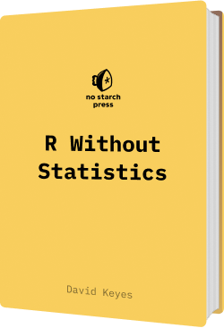

--- 
title: "R Without Statistics"
author: "David Keyes"
# date: "2023-05-09"
site: bookdown::bookdown_site
documentclass: book
url: https://book.rwithoutstatistics.com
cover-image: mock-cover.png
description: |
  Since R was invented in 1993, it has become a widely used programming language for statistical analysis. From academia to the tech world and beyond, R is used for a wide range of statistical analysis. R Without Statistics will show ways that R can be used beyond complex statistical analysis. Readers will learn about a range of uses for R, many of which they have likely never even considered.
biblio-style: apalike
---

# About the Book {-}

This is the in-progress version of *R Without Statistics*, a forthcoming book from [No Starch Press](https://www.nostarch.com/).

<hr>

Since R was invented in 1993, it has become a widely used programming language for statistical analysis. From academia to the tech world and beyond, R is used for a wide range of statistical analysis.

R's ubiquity in the world of statistics leads many to assume that it is only useful to those who do complex statistical work. But as R has grown in popularity, the number of ways it can be used has grown as well. Today, R is used for:

-   Data visualization

-   Map making

-   Sharing results through reports, slides, and websites

-   Automating processes

-   And much more!

The idea that R is only for statistical analysis is outdated and inaccurate. But, without a single book that demonstrates the power of R for non-statistical purposes, this perception persists.

**Enter R Without Statistics.**

R Without Statistics will show ways that R can be used beyond complex statistical analysis. Readers will learn about a range of uses for R, many of which they have likely never even considered.

Each chapter will, using a consistent format, cover one novel way of using R.

1.  Readers will first be introduced to an R user who has done something novel and learn how using R in this way transformed their work.

2.  Following this, there will be code samples that demonstrate exactly how the R user did the thing they are being profiled for.

3.  Finally, there will be a summary, with lessons learned from this novel way of using R.

Written by David Keyes, Founder and CEO of [R for the Rest of Us](https://rfortherestofus.com/), R Without Statistics will be published by [No Starch Press](https://nostarch.com/).

<!--chapter:end:index.Rmd-->

# (PART\*) Introduction {-}

<!--chapter:end:part-introduction.Rmd-->

# Introduction

In early 2020, countries across the world struggled to contain the spread of COVID. One country, though, succeeded where others did not: New Zealand. There are many reasons why New Zealand was so successful in tackling COVID. One of these was R (yes, R). 

How did a humble tool for data analysis help New Zealand fight COVID? R helped a team at the Ministry of Health to generate daily reports on  cases throughout New Zealand. These reports (there were three each day, each for a slightly different audience) were essential in helping officials develop policies that kept New Zealand largely COVID-free. It was a big lift for a small team. Producing these reports every day with a tool like Excel would not have been feasible. As team leader Chris Knox told me, "Trying to do what we did in a point-and-click environment is not possible." But with R, a few staff members wrote R code that they could re-run every day to produce updated reports. 

The reports that the New Zealand Ministry of Health produced did not involve any complicated statistics – they were literally counts of COVID cases. The value that the team got was from everything else R can do: data analysis and visualization, report creation, and automating workflows. Many people think of R as simply a tool for statistics. But, over a quarter century since its creation, R can do much more than statistical analysis, and New Zealand used R to keep its residents safe from COVID.  

I used to feel ashamed about the way I use R. As someone with an extremely non-quantitative background (I did a PhD in anthropology) who never used R in graduate school, I use R, a tool for statistical analysis, but I don't use it for complex statistical analysis. For a long time, I felt like I wasn't a "real" R user. Real R users, in my mind, used R for hardcore stats; I "only" used R for descriptive stats. 

But eventually, I realized that, no matter what else you do in R, you have to **illuminate** your findings and **communicate** your results. And, the more you use R, the more you'll find yourself wanting to **automate** things you used to do manually. I realize now that the things that I use R for *are* the things that everyone uses R for. R was created for statistics. But today people are just as likely to use R without statistics. 

I'm excited to be your guide on this journey through the ways you can use R without statistics. If I, a qualitatively-trained anthropologist whose most complex statistical use for R is calculating averages, can find value in R, so can you. No matter your background or what you think about R right now, using R without statistics can transform your work. 

## Who This Book is For {-}

This book is for you if you are either a current R user keen to explore new ways of using R or a non-R user wondering if R is right for you. I've written *R Without Statistics* so that it should make sense even if you've never written a line of R code. But if you have written many lines of R code, the book should help you learn plenty of new techniques to up your R game. 

## About This Book {-}

This book shows the many ways that people use R without statistics. Each chapter focuses on one novel use of R. You'll begin by learning about R users who have transformed their work using R. You'll learn about a problem they had and how R helped them to solve it. We'll dive into their code, breaking it down to help you understand how they used R. Each chapter will conclude with a short summary, offering lessons you can take from this novel way of using R. The book has three parts:

### Part 1: Illuminate {-}

In the first part, you'll learn about ways to use R to illuminate your findings.

- **Chapter 2: Principles of Data Visualization**  This chapter breaks down a visualization by Cédric Scherer and Georgios Karamanis on drought in the United States. In doing so, it shows important principles that can help you to make high-quality data visualization.
- **Chapter 3: Making Your Own Theme**  This chapter shows how journalists at the BBC made a custom theme for the data visualization package known as `ggplot2`. We'll break down the `bbplot` package and in the process you'll learn how to make your own theme.
- **Chapter 4: Creating Maps**  This chapter walks through the code that Abdoul Madjid used to make a map showing COVID rates in the United States in 2021. You'll learn how to use the `ggplot2` package to make high-quality maps.
- **Chapter 5: Creating High-Quality Tables**  This chapter will show you how to use the `gt` package to make high-quality tables in R. Based on a conversation with Tom Mock, you'll learn to apply design principles to ensure your tables communicate effectively.

### Part 2: Communicate {-}

The second part of the book focuses on using R Markdown to communicate efficiently. 

- **Chapter 6: Writing Reports in R Markdown**  This chapter introduces R Markdown through a conversation with Alison Hill. A tool that allows you go from data import to final report, all in R, R Markdown can transform how you communicate. This chapter will introduce the basics to help you get started with R Markdown.
- **Chapter 7: Parameterized Reporting**  One of the advantages of using R Markdown is that you can produce multiple reports at the same time using a technique called parameterized reporting. In this chapter, I speak with staff members at the Urban Institute about how they used R to produce fiscal briefs for all 50 U.S. states. In the process, you'll learn how parameterized reporting works and how you can use it.
- **Chapter 8: Making Slideshow Presentations with `xaringan`**  In addition to traditional reports, R Markdown can be used to make slides. You'll come away from this chapter, which is based on my conversation with Silvia Canelón, ready to make your own presentations with the `xaringan` package.
- **Chapter 9: Building Websites with distill**  R Markdown can also make websites. In this chapter, I speak with Matt Herman about how he used the `distill` package to make a website about COVID-19 rates in Westchester County, New York. The chapter will show you how to create your own website with R Markdown and `distill`.

### Part 3: Automate {-}

The last part of the book focuses on ways you can use R to automate your work.

- **Chapter 10: Accessing Online Data**  In addition to working with data you already have, R can help you to automatically access data. This chapter shows two packages that can bring in data: `googlesheets4` for working with Google Sheets and `tidycensus` for working with United States Census Bureau data. Through conversations with Meghan Harris and Kyle Walker, you'll learn how the packages work, and how you can use them to automate the process of accessing data.
- **Chapter 11: Code Once, Run Twice: Creating Your Own Functions**  One of the major benefits of R is that you can create your own functions to automate common tasks. In this chapter, I show a few example functions that I and others have made. You'll come away ready to make your own R functions.
- **Chapter 12: Bundle Your Functions Together in Your Own R Package**  Once you have a set of functions that you use regularly, you'll want to bundle them into a package. Doing so makes it easy for you and others to use the code you've written. I speak with Travis Gerke and Garrick Aden-Buie about how they created packages to improve the work of researchers at the Moffitt Cancer Center. This chapter will set you up to make your own R package.

Before we dive into the book, I have a favor to ask. This book is called *R Without Statistics*. But it's not meant to be taken literally. Of course it's true that if you're making a graph you're using statistics. Before you start typing an angry email, please know that R Without Statistics is a mindset, not a statement meant to be taken literally. We're all using R with statistics already. Let's learn to use R without statistics. 

<!--chapter:end:introduction.Rmd-->


# An R Programming Crash Course {#howto-chapter}

R has a well-earned reputation for being hard to learn. Especially for those who come to R without programming experience, it can be hard to figure out how things work. This chapter is designed to help those who have never used R before. I'll start from scratch, showing you what you need to download in order to use R, and how to work with data using functions, objects, packages, and projects. If you have some experience with R, feel free to skip this chapter. But if you're just starting out, this chapter will help you understand the basics, and help you make sense of the rest of the book.

## Getting Set Up {-}

One of the more confusing things for people just starting out is that you need two pieces of software in order to use R. The first is R itself, which provides the underlying computational tools that make R work. The second is RStudio, which makes working with R much easier. The best way to understand the relationship between R and RStudio is with this analogy from the book *Modern Dive*  by Chester Ismay and Albert Kim. R is the engine that makes your work with data go. RStudio is like a dashboard that makes it easier to work with your data by providing a more user-friendly interface. 

Let's download each piece and get started. To download R, go to https://cloud.r-project.org/ and choose your operating system, as seen in Figure \@ref(fig:cran-download-r)


\begin{figure}
\includegraphics[width=1\linewidth]{assets/download-r} \caption{The Comprehensive R Archive Network where you can download R}(\#fig:cran-download-r)
\end{figure}


Once you download and install R, open it and you can work at the command line. For example, I can type 2 + 2, hit enter, and I will see 4, as seen in Figure \@ref(fig:r-console).


\begin{figure}
\includegraphics[width=1\linewidth]{assets/r-console} \caption{The R console}(\#fig:r-console)
\end{figure}


Simple math problems are only the start; you can do pretty much anything in R. No matter what you're planning to do, you're probably not super impressed with the R interface. A few brave souls work only using the command line we're looking at, but most do not. RStudio is where most R coders do their work. RStudio is like a skin that lives on top of R itself. It doesn't provide new functionality to R, but it wraps R in a much more user-friendly interface, providing a way to see your files, outputs, and more. You can download RStudio at https://posit.co/download/rstudio-desktop/. Install RStudio as you would any other app and open it up. RStudio has several panels. The first time you open RStudio, you'll see these the three panels shown in Figure \@ref(fig:rstudio-no-project) below.


\begin{figure}
\includegraphics[width=1\linewidth]{assets/rstudio-no-project} \caption{The RStudio editor}(\#fig:rstudio-no-project)
\end{figure}


The left side panel should look familiar. It is what we saw when working in R. This is known as the **console**. You'll use it to add code and see results. This panel, like the others we'll discuss, has several tabs (terminal and background jobs) for more advanced usages. For now, we'll stick to the default tab. Let's look at the bottom right panel next. This **files** panel shows all of the files on my computer. Finally, the top right panel shows my **environment**. The environment shows the objects (discussed below) I have available to me when working in RStudio. There's one more panel that you'll typically have when working in RStudio. But to make it appear, we need to create an R script file. 

## R Script Files {-}

If you work in the console, either in RStudio or in R itself, you don't have a record of your code. Say you sit down today and write code to import your data, analyze it, and make some graphs. You don't want to have to recreate that code from scratch tomorrow. The way to save your code is by using files. Files allow you to save all of the code you have written. There are two types of files we'll discuss in this book:

1. R script files, which only contain code.
2. R Markdown files, which contain code combined with text. 

We'll talk about R Markdown files starting in Chapter \@ref(rmarkdown-chapter). Let's start with R script files, which use the .R extension. To create an R script file, go to File > New File > R Script. When you create a new R script file, you'll now have a fourth panel in the top left, which you can see in Figure \@ref(fig:rstudio-four-panels). I'll save this file in my `Documents` folder as `sample-code.R`. 


\begin{figure}
\includegraphics[width=1\linewidth]{assets/rstudio-four-panels} \caption{RStudio with four panels}(\#fig:rstudio-four-panels)
\end{figure}


I can now use the same syntax in my R script file that I did when working in just R. If I type `2 + 2` in the R script file and hit the **Run** button, 4 will show up in the console pane. If you're looking to learn R, it's probably not to help you figure out the answer to 2 + 2. Instead, you probably want to read in your own data and do analysis on it. Let's work with some real data. 

## Working with Data {-}

To explain how you work with data in R, we need go on a bit of a detour. We'll make stops to discuss RStudio functions, objects, packages, and projects before we import and take a look at our data.

Conceptually, working with data in R is very different than working with data in a tool like Excel. In Excel, your data and any analysis you do on it all live in the same place: a spreadsheet. With R, you typically have data that lives in some external source (for example, an Excel spreadsheet or a CSV file). In order to work with this data in R, you have to run code to import it. It's only once you've run this code, which is made up of functions, that you have the data available in R. 

## Functions {-}

Let's say I have a CSV file called `population-by-state.csv` in my `Documents` folder that I want to import to R. To import it into R, you might think to add a line like this in the `sample-code.R` file:


```r
read.csv(file = "/Users/davidkeyes/Documents/population-by-state.csv")
```

This line shows the `read.csv()` function. Functions in R are pieces of code that you can run to do specific things. Functions have a name and arguments, which are surrounded by parentheses. Looking at the `read.csv()` function, the name, which appears before the open parentheses, is `read.csv`. Within the parentheses, we have the text `file = "Documents/population-by-state.csv"`. Here we can see the argument `file`. The text after the equals sign gives the location of the file we want to read in. Arguments work in this way: the argument name, followed by the equals sign, followed by some value. This allows us to do something general (like importing a CSV) while allowing us to choose the specific file to run the function on. Functions can have multiple arguments as well, each of which is separated by a comma. For example, this would read in the same file, but skip the first row.


```r
read.csv(file = "/Users/davidkeyes/Documents/population-by-state.csv",
				 skip = 1)
```

At this point, you might think to run the code in order to import your data. You can do so by selecting the line of code and hitting the Run button (or using the keyboard shortcut Command/Control + Enter on Mac/Windows). Running this code causes this text show up in the console pane. 


```
#>    rank                State      Pop  Growth  Pop2018
#> 1     1           California 39613493  0.0038 39461588
#> 2     2                Texas 29730311  0.0385 28628666
#> 3     3              Florida 21944577  0.0330 21244317
#> 4     4             New York 19299981 -0.0118 19530351
#> 5     5         Pennsylvania 12804123  0.0003 12800922
#> 6     6             Illinois 12569321 -0.0121 12723071
#> 7     7                 Ohio 11714618  0.0033 11676341
#> 8     8              Georgia 10830007  0.0303 10511131
#> 9     9       North Carolina 10701022  0.0308 10381615
#> 10   10             Michigan  9992427  0.0008  9984072
#> 11   11           New Jersey  8874520 -0.0013  8886025
#> 12   12             Virginia  8603985  0.0121  8501286
#> 13   13           Washington  7796941  0.0363  7523869
#> 14   14              Arizona  7520103  0.0506  7158024
#> 15   15            Tennessee  6944260  0.0255  6771631
#> 16   16        Massachusetts  6912239  0.0043  6882635
#> 17   17              Indiana  6805663  0.0165  6695497
#> 18   18             Missouri  6169038  0.0077  6121623
#> 19   19             Maryland  6065436  0.0049  6035802
#> 20   20             Colorado  5893634  0.0356  5691287
#> 21   21            Wisconsin  5852490  0.0078  5807406
#> 22   22            Minnesota  5706398  0.0179  5606249
#> 23   23       South Carolina  5277830  0.0381  5084156
#> 24   24              Alabama  4934193  0.0095  4887681
#> 25   25            Louisiana  4627002 -0.0070  4659690
#> 26   26             Kentucky  4480713  0.0044  4461153
#> 27   27               Oregon  4289439  0.0257  4181886
#> 28   28             Oklahoma  3990443  0.0127  3940235
#> 29   29          Connecticut  3552821 -0.0052  3571520
#> 30   30                 Utah  3310774  0.0499  3153550
#> 31   31          Puerto Rico  3194374  0.0003  3193354
#> 32   32               Nevada  3185786  0.0523  3027341
#> 33   33                 Iowa  3167974  0.0061  3148618
#> 34   34             Arkansas  3033946  0.0080  3009733
#> 35   35          Mississippi  2966407 -0.0049  2981020
#> 36   36               Kansas  2917224  0.0020  2911359
#> 37   37           New Mexico  2105005  0.0059  2092741
#> 38   38             Nebraska  1951996  0.0137  1925614
#> 39   39                Idaho  1860123  0.0626  1750536
#> 40   40        West Virginia  1767859 -0.0202  1804291
#> 41   41               Hawaii  1406430 -0.0100  1420593
#> 42   42        New Hampshire  1372203  0.0138  1353465
#> 43   43                Maine  1354522  0.0115  1339057
#> 44   44              Montana  1085004  0.0229  1060665
#> 45   45         Rhode Island  1061509  0.0030  1058287
#> 46   46             Delaware   990334  0.0257   965479
#> 47   47         South Dakota   896581  0.0204   878698
#> 48   48         North Dakota   770026  0.0158   758080
#> 49   49               Alaska   724357 -0.0147   735139
#> 50   50 District of Columbia   714153  0.0180   701547
#> 51   51              Vermont   623251 -0.0018   624358
#> 52   52              Wyoming   581075  0.0060   577601
#>     Pop2010 growthSince2010 Percent    density
#> 1  37319502          0.0615  0.1184   254.2929
#> 2  25241971          0.1778  0.0889   113.8081
#> 3  18845537          0.1644  0.0656   409.2229
#> 4  19399878         -0.0051  0.0577   409.5400
#> 5  12711160          0.0073  0.0383   286.1704
#> 6  12840503         -0.0211  0.0376   226.3967
#> 7  11539336          0.0152  0.0350   286.6944
#> 8   9711881          0.1151  0.0324   188.3054
#> 9   9574323          0.1177  0.0320   220.1041
#> 10  9877510          0.0116  0.0299   176.7351
#> 11  8799446          0.0085  0.0265  1206.7609
#> 12  8023699          0.0723  0.0257   217.8776
#> 13  6742830          0.1563  0.0233   117.3249
#> 14  6407172          0.1737  0.0225    66.2016
#> 15  6355311          0.0927  0.0208   168.4069
#> 16  6566307          0.0527  0.0207   886.1845
#> 17  6490432          0.0486  0.0203   189.9644
#> 18  5995974          0.0289  0.0184    89.7419
#> 19  5788645          0.0478  0.0181   624.8518
#> 20  5047349          0.1677  0.0176    56.8653
#> 21  5690475          0.0285  0.0175   108.0633
#> 22  5310828          0.0745  0.0171    71.6641
#> 23  4635649          0.1385  0.0158   175.5707
#> 24  4785437          0.0311  0.0147    97.4271
#> 25  4544532          0.0181  0.0138   107.0966
#> 26  4348181          0.0305  0.0134   113.4760
#> 27  3837491          0.1178  0.0128    44.6872
#> 28  3759944          0.0613  0.0119    58.1740
#> 29  3579114         -0.0073  0.0106   733.7507
#> 30  2775332          0.1929  0.0099    40.2918
#> 31  3721525         -0.1416  0.0095   923.4964
#> 32  2702405          0.1789  0.0095    29.0195
#> 33  3050745          0.0384  0.0095    56.7158
#> 34  2921964          0.0383  0.0091    58.3059
#> 35  2970548         -0.0014  0.0089    63.2186
#> 36  2858190          0.0207  0.0087    35.6808
#> 37  2064552          0.0196  0.0063    17.3540
#> 38  1829542          0.0669  0.0058    25.4087
#> 39  1570746          0.1842  0.0056    22.5079
#> 40  1854239         -0.0466  0.0053    73.5443
#> 41  1363963          0.0311  0.0042   218.9678
#> 42  1316762          0.0421  0.0041   153.2674
#> 43  1327629          0.0203  0.0040    43.9167
#> 44   990697          0.0952  0.0032     7.4547
#> 45  1053959          0.0072  0.0032  1026.6044
#> 46   899593          0.1009  0.0030   508.1242
#> 47   816166          0.0985  0.0027    11.8265
#> 48   674715          0.1413  0.0023    11.1596
#> 49   713910          0.0146  0.0022     1.2694
#> 50   605226          0.1800  0.0021 11707.4262
#> 51   625879         -0.0042  0.0019    67.6197
#> 52   564487          0.0294  0.0017     5.9847
```

This is R confirming that it read in the CSV file and showing us the data within it. You might think you are ready to work with your data in R. But in fact all you've done at this point is **display** the result of running the code that imports your data. To use the data again, you need to **save** the result of running the code to an object.

## Objects {-}

To save your data for reuse, you need to create an object. To do so, you would add to your data importing syntax from above. 


```r
population_data <- read.csv(file = "/Users/davidkeyes/Documents/population-by-state.csv")
```

The second half of this code is what we used above, but we've added to it. In the middle you will see this: `<-`. Known as the assignment operator, it takes what follows it and assigns it to the item on the left. To the left of the assignment operator is `population_data`. This is an **object**. Put together, the whole line reads in the CSV and assigns it to an object called `population_data`. If you run this line of code, you will now see `population_data` in your environment pane, as in Figure \@ref(fig:population-data-environment).


\begin{figure}
\includegraphics[width=1\linewidth]{assets/population-data-environment} \caption{An object in our environment pane}(\#fig:population-data-environment)
\end{figure}


This is confirmation that your data import worked and you have the `population_data` object ready for future use. Now, instead of having to rerun the code to import the data, I can simply type `population_data`, run that line, and I'll see the same output as above. Data imported to an object is known as a **data frame**.

## Packages {-}

The `read.csv()` function that we've used up to this point is one of a set of functions that come from what is known as base R. They are built into R and you simply have to type the name of the function to use it. However, one of the benefits of R being an open source language is that anyone create their own code and share it with others. R users around the world make what are called **packages**, which provide code to do specific things. 

The best analogy for understanding packages also comes from the *Modern Dive*  book. The functionality in base R is like that built into a phone. A phone can do a lot on its own. But you usually want to install apps on your phone to do specific things. Packages are like apps, giving you specific functionality that doesn't come built into base R.

You can install packages using the `install.packages()` function. For example, to install the `tidyverse` package, which provides a range of functions for data import, cleaning, analysis, visualization, and more, you would type `install.packages("tidyverse")`. I typically enter this code in the console because you only need to install a package once on your computer and so I know I won't need to rerun this code. 

To confirm that the `tidyverse` package has been installed correctly, click on the packages tab on the bottom right panel. Search for `tidyverse` and you should see it pop up, as in Figure \@ref(fig:tidyverse-installed).


\begin{figure}
\includegraphics[width=1\linewidth]{assets/tidyverse-installed} \caption{Confirmation that the tidyverse package is installed on my computer}(\#fig:tidyverse-installed)
\end{figure}


Now that we've installed the `tidyverse` package, let's use it. While you only need to install packages once per computer, you need to load packages each time you restart RStudio. You can only use functions from the `tidyverse` package if you first run the line `library(tidyverse)`. I'll go back to my `sample-code.R` file and re-import my data using a function from the `tidyverse` package. 


```r
library(tidyverse)

population_data_2 <- read_csv(file = "/Users/davidkeyes/Documents/population-by-state.csv")
```

At the top of my script I load the `tidyverse`. Then, I use the `read_csv()` function (note the `_` in place of the `.`) to import my data. This alternate function to import CSV files achieves the same goal of creating an object called `population_data_2`. If we type `population_data_2` and run the code (either by using the run button or the keyboard shortcut) you will see the output in the console. 


```
#> # A tibble: 52 x 9
#>     rank State               Pop  Growth  Pop2018  Pop2010
#>    <dbl> <chr>             <dbl>   <dbl>    <dbl>    <dbl>
#>  1     1 California     39613493  0.0038 39461588 37319502
#>  2     2 Texas          29730311  0.0385 28628666 25241971
#>  3     3 Florida        21944577  0.033  21244317 18845537
#>  4     4 New York       19299981 -0.0118 19530351 19399878
#>  5     5 Pennsylvania   12804123  0.0003 12800922 12711160
#>  6     6 Illinois       12569321 -0.0121 12723071 12840503
#>  7     7 Ohio           11714618  0.0033 11676341 11539336
#>  8     8 Georgia        10830007  0.0303 10511131  9711881
#>  9     9 North Carolina 10701022  0.0308 10381615  9574323
#> 10    10 Michigan        9992427  0.0008  9984072  9877510
#> # i 42 more rows
#> # i 3 more variables: growthSince2010 <dbl>, Percent <dbl>,
#> #   density <dbl>
```

What we see is slightly different from what we saw above using the `read.csv()` function. R describes the output as a **tibble** and only shows us the first 10 rows. This slightly different output occurs because `read_csv()` imports the data not as a data frame, but as a tibble. Both are used to describe rectangular data like what you would see in a spreadsheet. While there are some small differences between data frames and tibbles, I'll use the terms interchangeably in this book. 

## RStudio Projects {-}

So far, we've imported a CSV file from the Documents folder. But the path to the file on my computer was `/Users/davidkeyes/Documents/population-by-state.csv`. Since others will not have this exact location on their computer, if they try to run my code, it won't work. There's a solution to this problem, and it's called **RStudio projects**. 

By working in a project, you can use what are known as **relative paths** to your files. Instead of having to write out `read_csv(file = "/Users/davidkeyes/Documents/population-by-state.csv")`, you can put the CSV file in your project and then call it using `read_csv(file = "population-by-state.csv")`. This makes it easier for you, and enables others to use your code.

To create a new RStudio project, go to File > New Project. Select either New Directory or Existing Directory and choose where to put your project. If you choose New Directory, you'll need to specify that you want to create a new project. I'll do this and then choose a name for the new directory and where it should live. As seen in Figure \@ref(fig:create-new-project), you can leave the two checkboxes that ask about creating a git repository and using `renv` unchecked (these are for more advanced purposes). 


\begin{figure}
\includegraphics[width=1\linewidth]{assets/create-new-project} \caption{The RStudio prompt to create a new project}(\#fig:create-new-project)
\end{figure}


Having now created this project, there are two major differences in RStudio's appearance:

First, the files pane no longer shows every file on my computer, but instead only shows files in the `example-project` directory. Right now that's just the `example-project.Rproj` file that indicates the folder contains a project. Second, at the very top right of RStudio, you can see the name of the `example-project` project (it had previously said `Project: (None)`). If you want to make sure you're working in a project, make sure you see its name here. Both of these changes can be seen in Figure \@ref(fig:rstudio-active-project) below.


\begin{figure}
\includegraphics[width=1\linewidth]{assets/rstudio-active-project} \caption{RStudio with an active project}(\#fig:rstudio-active-project)
\end{figure}


Now that I've created a project, I'll use the Finder on my Mac computer to copy the `population-by-state.csv` file into the `example-project` directory. Once I do this, I can see it in the RStudio files pane, as in Figure \@ref(fig:rstudio-project-csv).


\begin{figure}
\includegraphics[width=1\linewidth]{assets/rstudio-project-csv} \caption{A CSV file visible in the files pane in RStudio}(\#fig:rstudio-project-csv)
\end{figure}


With this CSV file in my project, I can now import it more easily. As before, I'll start by loading the `tidyverse` package. After that, I can remove the reference to the `Documents` folder and import my data by simply using the name of the file:


```r
library(tidyverse)

population_data_2 <- read_csv(file = "population-by-state.csv")
```

I'm able to import the `population-by-state.csv` file in this way because the RStudio project sets the **working directory** to be the root of my project. With the working directory set in this way, all references to files are relative to the `.Rproj` file at the root of the project (this is where the name relative paths comes from). Now that we're working in a project, anyone can run this code because it imports the data from a location that they are guaranteed to have on their computer. 

## Data Analysis with R {-}

Now that we've imported data, let's do a bit of analysis on it. Below is a code snippet that calculates the mean population of all states using the `summarize()` function. 


```r
summarize(.data = population_data_2,
          mean_population = mean(Pop))
```

You can see that I'm using `population_data_2` with the `.data` argument, telling the `summarize()` function (which comes from the `tidyverse`) to use that data frame. The second half of the code creates a new variable called `mean_population`, which is calculated by using the `mean()` function on the `Pop` variable. Running this code will return a tibble with a single variable (`mean_population`) that is of type double (meaning numeric) and has a value of 6433422, the mean population of all states. 


```
#> # A tibble: 1 x 1
#>   mean_population
#>             <dbl>
#> 1        6433422.
```

This is a basic example of data analysis, but you can do a lot more with the `tidyverse`. One advantage of working with the `tidyverse` is that it uses what's known as the **pipe** for multi-step operations. The `tidyverse` pipe, which is written with the text `%>%`, allows us to break steps into multiple lines (the functionally equivalent so-called native pipe uses the text `|>`). For example, I can rewrite the code above to do the same thing using the pipe. 


```r
population_data_2 %>% 
  summarize(mean_population = mean(Pop))
```

This code says: start with the `population_data_2` data frame, then run the `summarize()` function on it, creating a variable called `mean_population` by calculating the mean of the `Pop` variable. 

The pipe becomes even more useful when we use multiple steps. Let's say, for example, we want to calculate the mean population of the five largest states. The code below adds a line that uses the `filter()` function (also from the `tidyverse`) to only include states where the `rank` variable (which is the rank of the total population size of all states) is less than or equal to five (in other words, rank one through five). Then, it uses `summarize()` function as we did before.


```r
population_data_2 %>% 
  filter(rank <= 5) %>% 
  summarize(mean_population = mean(Pop))
```
Running this code shows us the mean population of the five largest states. 


```
#> # A tibble: 1 x 1
#>   mean_population
#>             <dbl>
#> 1        24678497
```
Combining functions using the pipe lets us do multiple things on our data in a way that keeps our code readable and easy to understand. We've introduced only two functions for analysis at this point, but the `tidyverse` has many functions that enable you to do nearly anything you could hope to do with your data. In fact, while I've been referring to the `tidyverse` as a single package, it is actually a collection of packages that do data importing, analysis, visualization, and more. The book *R for Data Science* by Hadley Wickham, Mine Çetinkaya-Rundel, and Garrett Grolemund is the bible of `tidyverse` programming and worth reading for more details on how its many packages work. In this book, I'll introduce you to a number of packages, but because of how useful it is, the `tidyverse` will appear in every single piece of R code I write. 

## How to Get Help {-}

Now that you've learned about the basics of how R works, you're probably ready to dive in. When you do, you're going to encounter errors. Everyone does, and it's just part of working in R. Learning how to get help when you do run into issues is a key part of learning to use R successfully. There are two main strategies you can use to get unstuck.

The first is to read the documentation for functions. To access the documentation for any function, simply type the `?` and then the name of the function. For example, if I run the line `?read.csv`, I will see the documentation pop up in the bottom right panel, as in Figure \@ref(fig:readcsv-documentation).


\begin{figure}
\includegraphics[width=1\linewidth]{assets/readcsv-documentation} \caption{The documentation for the `read.csv()` function}(\#fig:readcsv-documentation)
\end{figure}


Help files can be a bit hard to decipher but at their core, they tell you what package the function comes from, what it does, its arguments, and some examples of how to use it. For additional guidance on reading documentation, I recommend the appendix of Kieran Healy's book *Data Visualization: A practical introduction* (a free online version is available at https://socviz.co/appendix.html).

In addition to providing help files in RStudio, many R packages have documentation websites. I find these easier to read and tend to use them when I am confused about how to use a function. In addition, many packages have longer articles known as vignettes that provide an overview of how the package works. Reading these can help you see how individual functions can be used in the context of a larger project. Every package I discuss in this book has a good documentation website. 

## In Conclusion: Invest Time Now to Learn R and Save Time Later {-}

Getting started with R can be challenging. I myself experienced many frustrations early on that I've since realized are quite common. This chapter has, hopefully, helped you to see how you can get started with R. Understanding how functions, objects, packages, and projects work is key to ensuring that you can successfully use R to work with your data. 

If R feels challenging, just know that it will get better with time. Best of all, the time you invest in learning to use R will repay itself many times over. My favorite example to show this is one I discuss in Chapter \@ref(parameterized-reports-chapter), which discusses a technique called parameterized reporting to automatically produce dozens, hundreds, or even thousands of reports at once. At my company, R for the Rest of Us, we worked with a client to produce reports on demographics and housing data for each of the 170 plus towns and counties in the state of Connecticut. Doing this by hand would have taken the client hundreds of hours. Using R, we were able to automate the process so they can generate the reports simply by running code. If you make multiple reports by hand, think of the hours you're spending. Reframe the time it takes to learn R as an investment in never having to do this manual labor again. When you're struggling to make sense of an inscrutable error message, you will get frustrated. But, with all of the time you'll save, I promise that it is worth the effort to learn R.


<!--chapter:end:howto.Rmd-->

---
output: html_document
editor_options: 
  chunk_output_type: inline
---

# (PART\*) Illuminate {-}

<!--chapter:end:part-illuminate.Rmd-->

---
output: html_document
editor_options: 
  chunk_output_type: console
---


# Principles of Data Visualization {#data-viz-chapter}

In the spring of 2021, nearly all of the American West was in a drought. By April of that year, officials in Southern California had declared a water emergency, citing unprecedented conditions.

This wouldn’t have come as news to those living in California and other Western states.  Drought conditions like those in the West in 2021 are becoming increasingly common. Yet communicating the extent of problem remains difficult. How can we show the data in a way that accurately represents it while making it compelling enough to get people to take notice?
This was the challenge that data-visualization designers Cédric Scherer and Georgios Karamanis took on in the fall of 2021. Working with the magazine *Scientific American* to create a data visualization of drought conditions over the last two decades in the United States, they turned to the ggplot2 package to transform what could have been dry data (pardon the pun) into a visually arresting and impactful graph.

In this chapter, I show how Scherer and Karamanis made their data visualization. We begin by looking at why the data visualization is effective. Next, we talk about the grammar of graphics, a theory to make sense of graphs that underlies the ggplot2 package that Scherer, Karamanis, and millions of others use to make data visualization. We then return to the drought graph, recreating it step-by-step using ggplot2. In the process, we pull out some key principles of high-quality data visualization that you can use to improve your own work.

## The Drought Visualization {-}

There was nothing unique about the data that Scherer and Karamanis used. Other news organizations had relied on the same data, from the National Drought Center, in their stories. But Scherer and Karamanis visualized it in a way that it both grabs attention and communicates the scale of the phenomenon. Figure \@ref(fig:final-viz) shows a section of the final visualization. Showing four regions over the last two decades, the increase in drought conditions, especially in California and the Southwest, is made apparent.


\begin{figure}
\includegraphics[width=1\linewidth]{data-viz_files/figure-latex/final-viz-1} \caption{A section of the final drought visualization. If you’re incredibly eagle-eyed, you’ll see a few minor elements that differ from the version published in *Scientific American*. These are things I had to change to make the plots fit in this book (for example, altering the text size and putting legend text on two rows) or things that *Scientific American* added in post-production (such as annotations).}(\#fig:final-viz)
\end{figure}


To understand why this visualization is effective, let’s break it down into pieces. At the broadest level, the data visualization is notable for its minimalist aesthetic. There are, for example, no grid lines and few text labels, as well as little text along the axes. What Scherer and Karamanis have done is remove what statistician Edward Tufte, in his 1983 book *The Visual Display of Quantitative Information*, calls *chartjunk*. Tufte wrote (and researchers, as well as data visualization designers since, have generally agreed) that extraneous elements often hinder, rather than help, our understanding of charts.

Need proof that Scherer and Karamanis’s decluttered graph is better than the alternative? Figure \@ref(fig:cluttered-viz) shows a version with a few small tweaks to the code to include grid lines and text labels on axes. Prepare yourself for clutter!


\begin{figure}
\includegraphics[width=1\linewidth]{data-viz_files/figure-latex/cluttered-viz-1} \caption{The cluttered version of the drought visualization}(\#fig:cluttered-viz)
\end{figure}


Again, it’s not just that this cluttered version looks worse. The clutter actively inhibits understanding. Rather than focus on overall drought patterns (the point of the graph), our brain gets stuck reading repetitive and unnecessary axis text.

One of the best ways to reduce clutter is to break a single chart into what are known as *small multiples*. When we look closely at the data visualization, we see that it is not one chart but actually a set of charts. Each rectangle represents one region in one year. If we filter to show the Southwest region in 2003 and add axis titles, we can see in Figure \@ref(fig:viz-sw-2003) that the x axis shows the week while the y axis shows the percentage of that region at different drought levels.


\begin{figure}
\includegraphics[width=1\linewidth]{data-viz_files/figure-latex/viz-sw-2003-1} \caption{A drought visualization for the Southwest in 2003}(\#fig:viz-sw-2003)
\end{figure}


Zooming in on a single region in a single year also makes the color choices more obvious. The lightest bars show the percentage of the region that is abnormally dry while the darkest bars show the percentage in exceptional drought conditions. These colors, as we’ll see shortly, are intentionally chosen to make differences in the drought levels visible to all readers.
When I asked Scherer and Karamanis to speak with me about this data visualization, they initially told me that the code for this piece might be too simple to highlight the power of R for data visualization. No, I told them, I want to speak with you precisely because the code is not super complex. The fact that Scherer and Karamanis were able to produce this complex graph with relatively simple code shows the power of R for data visualization. And it is possible *because* of a theory called the grammar of graphics.


## The Grammar of Graphics {-}

If you’ve used Excel to make graphs, you’re probably familiar with the menu shown in Figure \@ref(fig:excel-chart-chooser). When working in Excel, your graph-making journey begins by selecting the type of graph you want to make. Want a bar chart? Click the bar chart icon. Want a line chart? Click the line chart icon.


\begin{figure}
\includegraphics[width=1\linewidth]{assets/excel-chart-chooser} \caption{The Excel chart chooser menu}(\#fig:excel-chart-chooser)
\end{figure}


f you’ve only ever made data visualization in Excel, this first step may seem so obvious that you’ve never even considered the process of creating data visualization in any other way. But there are different models for thinking about graphs. Rather than conceptualizing graphs types as being distinct, we can recognize the things that they have in common and use these commonalities as the starting point for making them.

This approach to thinking about graphs comes from the late statistician Leland Wilkinson. For years, Wilkinson thought deeply about what data visualization is and how we can describe it. In 1999, he published a book called *The Grammar of Graphics* that sought to develop a consistent way of describing all graphs. In it, Wilkinson argued that we should think of plots not as distinct types à la Excel, but as following a grammar that we can use to describe *any* plot. Just as English grammar tells us that a noun is typically followed by a verb (which is why “he goes” works, while the opposite, “goes he,” does not), knowledge of the grammar of graphics allows us to understand why certain graph types “work.” 

Thinking about data visualization through the lens of the grammar of graphics allow us to see, for example, that graphs typically have some data that is plotted on the x axis and other data that is plotted on the y axis. This is the case no matter whether the graph is a bar chart or a line chart, for example. Consider Figure \@ref(fig:bar-line-chart), which shows two charts that use identical data on life expectancy in Afghanistan.


\begin{figure}
\includegraphics[width=1\linewidth]{data-viz_files/figure-latex/bar-line-chart-1} \caption{A bar chart and a line chart showing identical data on Afghanistan life expectancy}(\#fig:bar-line-chart)
\end{figure}


While they look different (and would, to the Excel user, be different types of graphs), Wilkinson’s grammar of graphics allows us to see their similarities. (Incidentally, Wilkinson’s feelings on graph-making tools like Excel became clear when he wrote that “most charting packages channel user requests into a rigid array of chart types.”)

When Wilkinson wrote his book, no data visualization tool could implement his grammar of graphics. This would change in 2010, when Hadley Wickham announced the ggplot2 package for R in an article titled “A Layered Grammar of Graphics.” By providing the tools to implement Wilkinson’s ideas, ggplot2 would come to revolutionize the world of data visualization.

## Working With ggplot2 {-}

The ggplot2 R package (which I, like nearly everyone in the data visualization world, will refer to simply as ggplot) relies on the idea of plots having multiple layers. Let’s walk through some of the most important layers. We’ll begin by selecting variables to map to aesthetic properties. Then we’ll choose a geometric object to use to represent our data. Next we’ll change the aesthetic properties of our chart (the color scheme, for example) using a `scale_` function. And finally we’ll use a `theme_` function to set the overall look-and-feel of our plot.

### The First Layer: Mapping Data to Aesthetic Properties {-}

When creating a graph with ggplot, we begin by mapping data to aesthetic properties. All this really means is that we use things like the x or y axis, color, and size (the so-called aesthetic properties) to represent variables. To make this concrete, we’ll use the data on life expectancy in Afghanistan, introduced in the previous section, to generate a plot. We can create this data with the following code:


```r
library(tidyverse)

gapminder_10_rows <- read_csv("https://data.rwithoutstatistics.com/gapminder_10_rows.csv")
```

Here’s what the `gapminder_10_rows` data frame looks like:


```
#> # A tibble: 10 x 6
#>    country     continent  year lifeExp      pop gdpPercap
#>    <chr>       <chr>     <dbl>   <dbl>    <dbl>     <dbl>
#>  1 Afghanistan Asia       1952  28.801  8425333    779.45
#>  2 Afghanistan Asia       1957  30.332  9240934    820.85
#>  3 Afghanistan Asia       1962  31.997 10267083    853.10
#>  4 Afghanistan Asia       1967  34.02  11537966    836.20
#>  5 Afghanistan Asia       1972  36.088 13079460    739.98
#>  6 Afghanistan Asia       1977  38.438 14880372    786.11
#>  7 Afghanistan Asia       1982  39.854 12881816    978.01
#>  8 Afghanistan Asia       1987  40.822 13867957    852.40
#>  9 Afghanistan Asia       1992  41.674 16317921    649.34
#> 10 Afghanistan Asia       1997  41.763 22227415    635.34
```

If we want to make a chart with ggplot, we need to first decide which variable to put on the x axis and which to put on the y axis. Let’s say we want to show life expectancy over time. That means we would use the variable `year` on the x axis and the variable `lifeExp` on the y axis. To do so, we begin by using the `ggplot()` function: 


```r
ggplot(
  data = gapminder_10_rows,
  mapping = aes(
    x = year,
    y = lifeExp
  )
)
```

Within this function, we tell R that we’re using the data frame `gapminder_10_rows`. This is the filtered version we created from the full `gapminder` data frame, which includes over 1,700 rows of data. The line following this tells R to use `year` on the x axis and `lifeExp` on the y axis. When we run the code, what we get in Figure \@ref(fig:blank-ggplot) doesn’t look like much.


\begin{figure}
\includegraphics[width=1\linewidth]{data-viz_files/figure-latex/blank-ggplot-1} \caption{A blank chart}(\#fig:blank-ggplot)
\end{figure}


But, if you look closely, you can see the beginnings of a plot. Remember that x axis using `year`? There it is! And `lifeExp` on the y axis? Yup, it’s there too. I can also see that the values on the x and y axes match up to our data. In the `gapminder_10_rows` data frame, the first year is 1952 and the last year is 1997. The range of the x axis seems to have been created with this data, which goes from 1952 to 1997, in mind (spoiler: it was). And `lifeExp`, which goes from about 28 to about 42 will fit nicely on our y axis.

### The Second Layer: Choosing the geoms {-}

Axes are nice, but we’re missing any type of visual representation of the data. To get this, we need to add the next layer in ggplot: geoms. Short for geometric objects, geoms are functions that provide different ways of representing data. For example, if we want to add points, we use `geom_point()`: 


```r
ggplot(
  data = gapminder_10_rows,
  mapping = aes(
    x = year,
    y = lifeExp
  )
) +
  geom_point()
```

Now, in Figure \@ref(fig:gapminder-points-plot), we see that people in 1952 had a life expectancy of about 28 and that this value rose through every year in our data.


\begin{figure}
\includegraphics[width=1\linewidth]{data-viz_files/figure-latex/gapminder-points-plot-1} \caption{The same chart but with points added}(\#fig:gapminder-points-plot)
\end{figure}


Let’s say we change our mind and want to make a line chart instead. Well, all we have to do is replace `geom_point()` with `geom_line()`:


```r
ggplot(
  data = gapminder_10_rows,
  mapping = aes(
    x = year,
    y = lifeExp
  )
) +
  geom_line()
```

Figure \@ref(fig:gapminder-line-plot) shows the result.


\begin{figure}
\includegraphics[width=1\linewidth]{data-viz_files/figure-latex/gapminder-line-plot-1} \caption{The data as a line chart}(\#fig:gapminder-line-plot)
\end{figure}


To really get fancy, what if we add both `geom_point()` and `geom_line()`? 


```r
ggplot(
  data = gapminder_10_rows,
  mapping = aes(
    x = year,
    y = lifeExp
  )
) +
  geom_point() +
  geom_line()
```

This code generates a line chart with points, as seen in Figure \@ref(fig:gapminder-points-line-plot).


\begin{figure}
\includegraphics[width=1\linewidth]{data-viz_files/figure-latex/gapminder-points-line-plot-1} \caption{The data with points and a line}(\#fig:gapminder-points-line-plot)
\end{figure}


We can extend this idea further, as seen in Figure \@ref(fig:gapminder-bar-plot), swapping in `geom_col()` to create a bar chart:


```r
ggplot(
  data = gapminder_10_rows,
  mapping = aes(
    x = year,
    y = lifeExp
  )
) +
  geom_col()
```

Note that the y axis range has been automatically updated, going from 0 to 40 to account for the different geom.


\begin{figure}
\includegraphics[width=1\linewidth]{data-viz_files/figure-latex/gapminder-bar-plot-1} \caption{The data as a bar chart}(\#fig:gapminder-bar-plot)
\end{figure}


As you can see, the difference between a line chart and a bar chart isn’t as great as the Excel chart-type picker might have us think. Both can have the same aesthetic properties (namely, putting years on the x axis and life expectancies on the y axis). They simply use different geometric objects to visually represent the data.

### The Third Layer: Altering Aesthetic Properties {-}

Before we return to the drought data visualization, let’s look at a few additional layers that can help us can alter our bar chart. Say we want to change the color of our bars. In the grammar of graphics approach to chart-making, this means mapping some variable to the aesthetic property of `fill`. (Slightly confusingly, the aesthetic property of `color` would, for a bar chart, change only the outline of each bar). In the same way that we mapped `year` to the x axis and y to `lifeExp`, we can also map fill to a variable, such as year:


```r
ggplot(
  data = gapminder_10_rows,
  mapping = aes(
    x = year,
    y = lifeExp,
    fill = year
  )
) +
  geom_col()
```

The result is shown in Figure \@ref(fig:gapminder-bar-colors-plot). We see now that, for earlier years, the fill is darker, while for later years, it is lighter (the legend, added to the right of our plot, shows this).


\begin{figure}
\includegraphics[width=1\linewidth]{data-viz_files/figure-latex/gapminder-bar-colors-plot-1} \caption{The same chart, now with added colors}(\#fig:gapminder-bar-colors-plot)
\end{figure}


What if we want to change the fill colors? For that, we use a new *scale layer*. In this case, I’ll use the `scale_fill_viridis_c()` function. The c at the end of the function name refers to the fact that the data is continuous, meaning it can take any numeric value:


```r
ggplot(
  data = gapminder_10_rows,
  mapping = aes(
    x = year,
    y = lifeExp,
    fill = year
  )
) +
  geom_col() +
  scale_fill_viridis_c()
```

This function changes the default palette to one that is colorblind-friendly and prints well in grayscale. The `scale_fill_viridis_c()` function is just one of many that start with `scale_` and can alter the fill scale.


\begin{figure}
\includegraphics[width=1\linewidth]{data-viz_files/figure-latex/gapminder-viridis-plot-1} \caption{The same chart with a colorblind-friendly palette}(\#fig:gapminder-viridis-plot)
\end{figure}


### The Fourth Layer: Setting a Theme {-}

A final layer we’ll look at is the theme layer. This layer allows us to change the overall look-and-feel of plots (plot backgrounds, grid lines, and so on). Just as there are a number of `scale_` functions, there are also a number of functions that start with `theme_.` Here, we’ve added `theme_minimal()`: 


```r
ggplot(
  data = gapminder_10_rows,
  mapping = aes(
    x = year,
    y = lifeExp,
    fill = year
  )
) +
  geom_col() +
  scale_fill_viridis_c() +
  theme_minimal()
```

Notice in Figure \@ref(fig:gapminder-theme-plot) that this theme starts to declutter our plot.


\begin{figure}
\includegraphics[width=1\linewidth]{data-viz_files/figure-latex/gapminder-theme-plot-1} \caption{The same chart with `theme_minimal()` added}(\#fig:gapminder-theme-plot)
\end{figure}


We’ve now seen why Hadley Wickham described the ggplot2 package as using a layered grammar of graphics. It implements Wilkinson’s theory through the creation of multiple layers. First, we select variables to map to aesthetic properties, such as x or y axes, color, and fill. Second, we choose the geometric object (or geom) we want to use to represent our data. Third, if we want to change aesthetic properties (for example, to use a different palette), we do this with a `scale_` function. Fourth, we use a `theme_` function to set the overall look-and-feel of our plot.

We could improve the plot we’ve been working on in many ways. But rather than adding to an ugly plot, let’s instead return to the drought data visualization by Cédric Scherer and Georgios Karamanis. Going through their code will show us some familiar aspects of ggplot and reveal tips on how to make high-quality data visualization with R.

## Recreating the Drought Visualization with ggplot {-}

The drought visualization code relies on a combination of ggplot fundamentals and some less-well-known tweaks that make it really shine. In order to understand how Scherer and Karamanis made their data visualization, we’ll start out with a simplified version of their code. We’ll build it up layer by layer, adding elements as we go. 

First, let’s import the data. Scherer and Karamanis do this with the `import()` function from the `rio` package. This function is helpful because the data they are working with is in JSON format, which can be complicated to work with. The `rio` package simplifies it into just one line:


```r
library(rio)

dm_perc_cat_hubs_raw <- import("https://data.rwithoutstatistics.com/dm_export_20000101_20210909_perc_cat_hubs.json")
```

### Plotting One Region and Year {-}

Let’s start by looking at just one region (the Southwest) in one year (2003). First, we filter our data and save it as a new object called `southwest_2003`.


```r
southwest_2003 <- dm_perc_cat_hubs %>%
  filter(hub == "Southwest") %>%
  filter(year == 2003)
```

We can take a look at this object to see the variables we have to work with:


```r
southwest_2003 %>%
  slice(1:10)
#> # A tibble: 10 x 7
#>    date       hub   category percentage  year  week max_week
#>    <date>     <fct> <fct>         <dbl> <dbl> <dbl>    <dbl>
#>  1 2003-12-30 Sout~ D0           0.0718  2003    52       52
#>  2 2003-12-30 Sout~ D1           0.0828  2003    52       52
#>  3 2003-12-30 Sout~ D2           0.2693  2003    52       52
#>  4 2003-12-30 Sout~ D3           0.3108  2003    52       52
#>  5 2003-12-30 Sout~ D4           0.0796  2003    52       52
#>  6 2003-12-23 Sout~ D0           0.0823  2003    51       52
#>  7 2003-12-23 Sout~ D1           0.1312  2003    51       52
#>  8 2003-12-23 Sout~ D2           0.1886  2003    51       52
#>  9 2003-12-23 Sout~ D3           0.3822  2003    51       52
#> 10 2003-12-23 Sout~ D4           0.0828  2003    51       52
```

The `date` variable represents the start date of the week in which the observation took place. The `hub` variable is the region, and `category` is level of drought (a value of `D0` indicates the lowest level of drought, while `D5` indicates the highest level). The `percentage` variable is the percentage of that region that is in that drought category, ranging from `0` to `1`. The `year` and `week` variables are the observation year and week number (beginning with week 1). The `max_week` variable is the maximum number of weeks in a given year.

Now we can use this `southwest_2003` object for our plotting:


```r
ggplot(
  data = southwest_2003,
  aes(
    x = week,
    y = percentage,
    fill = category
  )
) +
  geom_col()
```

In the `ggplot()` function, we tell R to put `week` on the x axis and `percentage` on the y axis. We also use the `category` variable for our `fill` color. We then use `geom_col()` to create a bar chart in which the fill color of each bar represents the percentage of the region in a single week at each drought level. You can see the result in in \@ref(fig:southwest-2003-no-style-plot).


\begin{figure}
\includegraphics[width=1\linewidth]{data-viz_files/figure-latex/southwest-2003-no-style-plot-1} \caption{One year and region of the drought visualization}(\#fig:southwest-2003-no-style-plot)
\end{figure}


The colors don’t match the final version of the plot, but we can start to see the outlines of Scherer and Karamanis’s data visualization.

### Changing Aesthetic Properties {-}

Scherer and Karamanis next selected different `fill` colors for their bars. To do so, they used the `scale_fill_viridis_d()` function. The *d* here means that the data to which the fill scale is being applied has discrete categories, called D0, D1, D2, D3, D4, and D5:


```r
ggplot(
  data = southwest_2003,
  aes(
    x = week,
    y = percentage,
    fill = category
  )
) +
  geom_col() +
  scale_fill_viridis_d(
    option = "rocket",
    direction = -1
  )
```


They used the argument `option = "rocket"` to select the rocket palette (the function has several other palettes). Then they used the `direction = -1` argument to reverse the order of fill colors so that darker colors mean higher drought conditions.
Scherer and Karamanis also tweaked the appearance of the x and y axes: 


```r
ggplot(
  data = southwest_2003,
  aes(
    x = week,
    y = percentage,
    fill = category
  )
) +
  geom_col() +
  scale_fill_viridis_d(
    option = "rocket",
    direction = -1
  ) +
  scale_x_continuous(name = NULL, 
                     guide = "none") +
  scale_y_continuous(name = NULL, 
                     labels = NULL, 
                     position = "right")
```

On the x axis, they removed both the axis title (“week”) using `name = NULL` and the 0–50 text with `guide = "none"`. On the y axis, they removed the title and text showing percentages using `labels = NULL`, which functionally does the same thing as `guide = "none"`. They also moved the axis lines themselves to the right side using `position = "right"`. These axis lines are only apparent as tick marks at this point but will become more visible later. Figure \@ref(fig:southwest-2003-xy-scales-plot) shows the result of these tweaks.


\begin{figure}
\includegraphics[width=1\linewidth]{data-viz_files/figure-latex/southwest-2003-xy-scales-plot-1} \caption{One year and region of the drought visualization with adjustments to the x and y axes}(\#fig:southwest-2003-xy-scales-plot)
\end{figure}


Up to this point, we’ve focused on one of the single plots that make up the larger data visualization. But the final product that Scherer and Karamanis made is actually 176 plots visualizing 22 years and eight regions. Let’s discuss the ggplot feature they used to create all of these plots.

### Faceting the Plot {-}

One of the most useful features of ggplot is what’s known as *faceting* (or, more commonly in the data visualization world, *small multiples*). Faceting takes a single plot and makes it into multiple plots using a variable (think: a line chart showing life expectancy by country over time, but instead of multiple lines on one plot, we get multiple plots with one line per plot). With the `facet_grid()` function, we can select which variable to put in rows and which to put in columns of our faceted plot. 


```r
dm_perc_cat_hubs %>%
  filter(hub %in% c("Northwest", 
                    "California", 
                    "Southwest", 
                    "Northern Plains")) %>%
  ggplot(aes(x = week, 
             y = percentage,
             fill = category)) +
  geom_col() +
  scale_fill_viridis_d(
    option = "rocket",
    direction = -1
  ) +
  scale_x_continuous(name = NULL, 
                     guide = "none") +
  scale_y_continuous(name = NULL, 
                     labels = NULL, 
                     position = "right") +
  facet_grid(rows = vars(year), 
             cols = vars(hub), 
             switch = "y")
```

Scherer and Karamanis put `year` in rows and `hub` (region) in columns. The `switch = "y"` argument moves the year label from the right side (where it appears by default) to the left. With this code in place, we can see the final plot coming together in Figure \@ref(fig:drought-viz-faceted-plot). 


\begin{figure}
\includegraphics[width=1\linewidth]{data-viz_files/figure-latex/drought-viz-faceted-plot-1} \caption{The faceted version of the drought visualization. Space considerations require me to include only four regions, but you get the idea.}(\#fig:drought-viz-faceted-plot)
\end{figure}


Incredibly, the broad outlines of the plot took us just 10 lines to create. The rest of the code falls into the category of small polishes. That’s not to minimize how important small polishes are (very) or the time it takes to create them (lots). It does show, however, that a little bit of ggplot goes a long way.

### Applying Small Polishes {-}

Let’s look at a few of the small polishes that Scherer and Karamanis made. The first is to apply a theme, as seen in Figure \@ref(fig:drought-viz-theme-tweaks-plot). They used `theme_light()`, which removes the default gray background and changes the font to Roboto.

The `theme_light()` function is what’s known as a complete theme. So-called complete themes change the overall look-and-feel of a plot. But Scherer and Karamanis didn’t stop there. They then used the theme() function to make additional tweaks to what `theme_light()` gave them. 


```r
dm_perc_cat_hubs %>%
  filter(hub %in% c("Northwest", 
                    "California", 
                    "Southwest", 
                    "Northern Plains")) %>%
  ggplot(aes(x = week, 
             y = percentage,
             fill = category)) +
  geom_col() +
  scale_fill_viridis_d(
    option = "rocket",
    direction = -1
  ) +
  scale_x_continuous(name = NULL, 
                     guide = "none") +
  scale_y_continuous(name = NULL, 
                     labels = NULL, 
                     position = "right") +
  facet_grid(rows = vars(year), 
             cols = vars(hub), 
             switch = "y") +
  theme_light(base_family = "Roboto") +
  theme(
    axis.title = element_text(size = 14, 
                              color = "black"),
    axis.text = element_text(family = "Roboto Mono", 
                             size = 11),
    axis.line.x = element_blank(),
    axis.line.y = element_line(color = "black", 
                               size = .2),
    axis.ticks.y = element_line(color = "black", 
                                size = .2),
    axis.ticks.length.y = unit(2, "mm"),
    legend.position = "top",
    legend.title = element_text(color = "#2DAADA", 
                                face = "bold"),
    legend.text = element_text(color = "#2DAADA"),
    strip.text.x = element_text(hjust = .5, 
                                face = "plain", 
                                color = "black", 
                                margin = margin(t = 20, b = 5)),
    strip.text.y.left = element_text(angle = 0, 
                                     vjust = .5, 
                                     face = "plain", 
                                     color = "black"),
    strip.background = element_rect(fill = "transparent", 
                                    color = "transparent"),
    panel.grid.minor = element_blank(),
    panel.grid.major = element_blank(),
    panel.spacing.x = unit(0.3, "lines"),
    panel.spacing.y = unit(0.25, "lines"),
    panel.background = element_rect(fill = "transparent", 
                                    color = "transparent"),
    panel.border = element_rect(color = "transparent", 
                                size = 0),
    plot.background = element_rect(fill = "transparent", 
                                   color = "transparent", 
                                   size = .4),
    plot.margin = margin(rep(18, 4))
  )
```

The code in the `theme()` function does many different things, but let’s take a look at a few of the most important. First, it moves the legend from the right side (the default) to the top of the plot. Then, an `angle = 0` argument rotates the year text in the columns so that it is no longer angled. Without this argument, the years would be much less readable. 

Next, the `theme()` function makes the distinctive axis lines and ticks that show up on the right side of the final plot. Calling `element_blank()` removes all grid lines. Finally, three lines remove the borders and make each of the individual plots have a transparent background.

Keen readers such as yourself may now be thinking, “Wait. Didn’t the individual plots have a gray background behind them?” Yes, dear reader, they did. Scherer and Karamanis made these with a separate geom, `geom_rect()`: 


```r
geom_rect(
  aes(
    xmin = .5,
    xmax = max_week + .5,
    ymin = -0.005,
    ymax = 1
  ),
  fill = "#f4f4f9",
  color = NA,
  size = 0.4
)
```

They set some additional aesthetic properties specific to this geom: `xmin`, `xmax`, `ymin`, and `ymax`, which determine the boundaries of the rectangle it produces. The result is a gray background drawn behind each small multiple, as seen in Figure \@ref(fig:drought-viz-theme-tweaks-plot).


\begin{figure}
\includegraphics[width=1\linewidth]{data-viz_files/figure-latex/drought-viz-theme-tweaks-plot-1} \caption{Figure 1-16	Faceted version of the drought visualization with gray backgrounds behind each small multiple}(\#fig:drought-viz-theme-tweaks-plot)
\end{figure}


Finally, consider the tweaks made to the legend. We previously saw a simplified version of the `scale_fill_viridis_d()` function. Here is a more complete version: 


```r
scale_fill_viridis_d(
  option = "rocket",
  direction = -1,
  name = "Category:",
  labels = c(
    "Abnormally Dry",
    "Moderate Drought",
    "Severe Drought",
    "Extreme Drought",
    "Exceptional Drought"
  )
)
```

The `name` argument sets the legend title, and the `labels` argument determines the labels that show up in the legend. Figure \@ref(fig:drought-viz-legend-tweaks) shows the result of these changes.


\begin{figure}
\includegraphics[width=1\linewidth]{data-viz_files/figure-latex/drought-viz-legend-tweaks-1} \caption{Drought visualization with changes made to the legend text}(\#fig:drought-viz-legend-tweaks)
\end{figure}


Rather than D0, D1, D2, D3, and D4, we now have Abnormally Dry, Moderate Drought, Severe Drought, Extreme Drought, and Exceptional Drought.

### The Complete Visualization Code {-}

While I've showed you a nearly complete version of the code, I have made some small changes along the way to make it easier to understand. If you're curious to see the full code Cédric and Georgios used to create the data viz, here it is. There are a few additional tweaks to colors and spacing, but nothing major beyond what we've seen so far. 


```r
ggplot(dm_perc_cat_hubs, aes(week, percentage)) +
  geom_rect(
    aes(
      xmin = .5,
      xmax = max_week + .5,
      ymin = -0.005,
      ymax = 1
    ),
    fill = "#f4f4f9",
    color = NA,
    size = 0.4,
    show.legend = FALSE
  ) +
  geom_col(
    aes(
      fill = category,
      fill = after_scale(addmix(darken(fill, .05, 
                                       space = "HLS"), 
                                "#d8005a", 
                                .15)),
      color = after_scale(darken(fill, .2, 
                                 space = "HLS"))
    ),
    width = .9,
    size = 0.12
  ) +
  facet_grid(rows = vars(year), 
             cols = vars(hub), 
             switch = "y") +
  coord_cartesian(clip = "off") +
  scale_x_continuous(expand = c(.02, .02), 
                     guide = "none", 
                     name = NULL) +
  scale_y_continuous(expand = c(0, 0), 
                     position = "right", 
                     labels = NULL, 
                     name = NULL) +
  scale_fill_viridis_d(
    option = "rocket",
    name = "Category:",
    direction = -1,
    begin = .17,
    end = .97,
    labels = c(
      "Abnormally Dry",
      "Moderate Drought",
      "Severe Drought",
      "Extreme Drought",
      "Exceptional Drought"
    )
  ) +
  guides(fill = guide_legend(nrow = 2,
                             override.aes = list(size = 1))) +
  theme_light(base_size = 18, 
              base_family = "Roboto") +
  theme(
    axis.title = element_text(size = 14, 
                              color = "black"),
    axis.text = element_text(family = "Roboto Mono", 
                             size = 11),
    axis.line.x = element_blank(),
    axis.line.y = element_line(color = "black", 
                               size = .2),
    axis.ticks.y = element_line(color = "black", 
                                size = .2),
    axis.ticks.length.y = unit(2, "mm"),
    legend.position = "top",
    legend.title = element_text(color = "#2DAADA", 
                                size = 18, 
                                face = "bold"),
    legend.text = element_text(color = "#2DAADA", 
                               size = 16),
    strip.text.x = element_text(size = 16, 
                                hjust = .5, 
                                face = "plain", 
                                color = "black", 
                                margin = margin(t = 20, b = 5)),
    strip.text.y.left = element_text(size = 18, 
                                     angle = 0, 
                                     vjust = .5, 
                                     face = "plain", 
                                     color = "black"),
    strip.background = element_rect(fill = "transparent", 
                                    color = "transparent"),
    panel.grid.minor = element_blank(),
    panel.grid.major = element_blank(),
    panel.spacing.x = unit(0.3, "lines"),
    panel.spacing.y = unit(0.25, "lines"),
    panel.background = element_rect(fill = "transparent", 
                                    color = "transparent"),
    panel.border = element_rect(color = "transparent", 
                                size = 0),
    plot.background = element_rect(fill = "transparent", 
                                   color = "transparent", 
                                   size = .4),
    plot.margin = margin(rep(18, 4))
  )
```

There are a few additional tweaks to colors and spacing, but most of the code reflects what you’ve seen so far.


## In Conclusion: ggplot is Your Data Viz Secret Weapon {-}

You may start to think of ggplot as a solution to all of your data visualization problems. And yes, you have a new hammer, but no, everything is not a nail. If you look at the version of the data visualization that appeared in *Scientific American* in November 2021, you’ll see that some of its annotations aren’t visible in our recreation. That’s because they were added in post-production. While you could have found ways to create them in ggplot, it’s often not the best use of your time. Get yourself 90 percent of the way there with ggplot and then use Illustrator, Figma, or a similar tool to finish your work.

Even so, ggplot is a very powerful hammer, used to make plots that you’ve seen in *The New York Times*, FiveThirtyEight, the BBC, and other well-known news outlets. Although not the only tool that can generate high-quality data visualization, it makes the process straightforward. The graph by Scherer and Karamanis shows this in several ways:

- **It strips away extraneous elements, such as grid lines, in order to keep the focus on the data itself**. Complete themes such as `theme_light()` and the `theme()` function allowed Scherer and Karamanis to create a decluttered visualization that communicates effectively.

- **It uses well-chosen colors**. The `scale_fill_viridis_d()` allowed them to create a color scheme that demonstrates differences between groups, is colorblind friendly, and shows up well when printed in grayscale.

- **It uses small multiples to break data from two decades and eight regions into a set of graphs that come together to create a single plot**. With a single call to the `facet_grid()` function, Scherer and Karamanis created over 100 small multiples that the tool automatically combined into a single plot.

Learning to create data visualization in ggplot involves a significant time investment. But the long-term payoff is even greater. Once you learn how ggplot works, you can look at others’ code and learn how to improve your own. By contrast, when you make a data visualization in Excel, the series of point-and-click steps disappears into the ether. To recreate a visualization you made last week, you’ll need to remember the exact steps you used, and to make someone else’s data visualization, you’ll need them to write up their process for you.

Because code-based data visualization tools allow you to keep that record of the steps you made, you don’t have to be the most talented designer to make high-quality data visualization with ggplot. You can study others’ code, adapt it to your own needs, and create your own data visualization that is beautiful and communicates effectively.

<!--chapter:end:data-viz.Rmd-->

---
output: html_document
editor_options: 
  chunk_output_type: console
---


# Making Your Own Theme {#custom-theme-chapter}

In 2018, BBC data journalists Nassos Stylianou and Clara Guibourg, along with their team, developed a custom ggplot theme that matches the BBC’s style. By introducing this bbplot package for others to use, they changed their organization’s culture, removed bottlenecks, and allowed the BBC to visualize data more creatively.

To understand the significance of these changes, it’s helpful to know how things worked at the BBC before the introduction of `bbplot.` In the mid-2010s, journalists who wanted to make data visualization had two choices:

1. They could use an internal tool. This tool could create data visualizations but was limited to the predefined charts it had been designed to generate.

1. They could use Excel to create mockups and then work with a graphic designer to finalize the charts. This approach led to better results, and was way more flexible, but required extensive, time-consuming back-and-forth with a designer. 

Neither of these choices was ideal, and they limited the BBC’s data visualization output. R freed the journalists from having to work with a designer. It wasn’t that the designers were bad (they weren’t), but ggplot allowed the journalists to explore different visualizations on their own. Working with a designer required the journalists to have a fully-formed idea that the designer could take and improve upon. 

As the team improved their ggplot skills, they realized that it might be possible to produce more than just exploratory data visualizations. Could they create production-ready charts in R that could go straight onto the BBC website? In this chapter, I discuss the power of custom ggplot themes. I then go through the code in the `bbplot` package to learn how custom themes work. I wrap up the chapter by exploring the impact that bbplot had, not only on a technical level, but also as a catalyst for a larger culture change.

## The Power of a Theme {-}

As Stylianou, Guibourg, and their colleagues realized, so much of the work involved in making a professional chart consists of small tweaks. What font should you use? Where should the legend go? Should axes have titles? Should charts have grid lines? These questions may seem small, but they have a big impact on the final product. 

And these are the types of questions to which a custom theme can provide answers. Custom themes force everyone who uses them follows style guidelines and ensures that all data visualization is on brand. What’s more, when more experienced R users in an organization make a custom theme, other less experienced users can take advantage of their work to make sure their plots follow organizational style guidelines. Custom themes, as we’ll see below when we dive into the bbplot code, involve a set of code that makes a set of small tweaks to all plots. Rather than forcing everyone to copy the long code to tweak each plot they make, putting this code into a custom theme allows everyone to apply the theme with one line of code. 


## Using bbplot to Style a Penguin Plot {-}

The bbplot package has two functions: `bbc_style()` and `finalise_plot()`. The latter deals with things like adding the BBC logo, saving plots in the correct dimensions, and other tasks done after the plot is complete (we’ll discuss it a bit later on). For now, let’s look at the `bbc_style()` function, which applies a custom ggplot theme to any plot, making all plots look consistent and follow BBC style guidelines.


## Creating an Example Plot {-}

To show how this function works, let's create a plot. We'll do so using the `palmerpenguins` package, which has data on penguins living on three islands in Antarctica. To give you a sense of what this data looks like, let's load the `palmerpenguins` and `tidyverse` packages.


```r
library(palmerpenguins)
library(tidyverse)
```

We now have data that we can work with in an object called `penguins`. Here's what the first ten rows look like.


```
#> # A tibble: 344 x 8
#>    species island    bill_length_mm bill_depth_mm
#>    <fct>   <fct>              <dbl>         <dbl>
#>  1 Adelie  Torgersen           39.1          18.7
#>  2 Adelie  Torgersen           39.5          17.4
#>  3 Adelie  Torgersen           40.3          18  
#>  4 Adelie  Torgersen           NA            NA  
#>  5 Adelie  Torgersen           36.7          19.3
#>  6 Adelie  Torgersen           39.3          20.6
#>  7 Adelie  Torgersen           38.9          17.8
#>  8 Adelie  Torgersen           39.2          19.6
#>  9 Adelie  Torgersen           34.1          18.1
#> 10 Adelie  Torgersen           42            20.2
#> # i 334 more rows
#> # i 4 more variables: flipper_length_mm <int>,
#> #   body_mass_g <int>, sex <fct>, year <int>
```

To get our data in a more usable format, let’s count how many penguins live on each island. We do this with the `count()` function from the `dplyr` package (one of several packages that are loaded when we load the `tidyverse`). This gives us some simple data that we can use for plotting:


This gives us some simple data that we can use for plotting below.


```
#> # A tibble: 3 x 2
#>   island        n
#>   <fct>     <int>
#> 1 Biscoe      168
#> 2 Dream       124
#> 3 Torgersen    52
```

Because we're going to use this data multiple times below, let's save it as an object called `penguins_summary`.


```r
penguins_summary <- penguins %>%
  count(island)
```

Now that we’ve got some data to work with, we’re ready to create a plot. Before showing what `bbplot` does, let’s make our plot with the ggplot defaults. Here is the code we’ll use: 


We use our `penguins_summary` data frame, putting the island on the x axis and the count of the number of penguins (n) on the y axis, and making each bar a different color with the fill aesthetic property. We’ll modify this plot multiple times, so to simplify this process, we save it as an object called penguins_plot. The resulting plot is seen in Figure \@ref(fig:basic-penguins-plot-plot).


\begin{figure}
\includegraphics[width=1\linewidth]{custom-theme_files/figure-latex/basic-penguins-plot-plot-1} \caption{A chart with the default theme}(\#fig:basic-penguins-plot-plot)
\end{figure}


It isn’t the most aesthetically pleasing chart. The gray background is ugly, the y axis title is hard to read because it’s angled, and the text size overall is quite small. But don’t worry: we’ll be improving it soon!

### Applying the `bbc_style()` Function {-}  

Now that we have a basic plot to work with, let's make it look like a BBC chart. To do this, we load the `bbplot` package:


```r
library(bbplot)
```

We can then apply the `bbc_style()` function to our `penguins_plot`. 


```r
penguins_plot +
  bbc_style()
```

Take a look at what happens in Figure \@ref(fig:penguins-bbc-style-plot) with the application of `bbc_style()` to our plot.


\begin{figure}
\includegraphics[width=1\linewidth]{custom-theme_files/figure-latex/penguins-bbc-style-plot-1} \caption{The same chart with BBC style}(\#fig:penguins-bbc-style-plot)
\end{figure}


Way different, right? Larger font size, legend on top, no axis titles, stripped down grid lines, and a white background. These are the major changes that the `bbc_style()` function makes. Let's look at them one by one. 

### Breaking Down the Custom Theme {-}

Here is the code for the bbc_style() function (taken from the `bbplot` GitHub repository at https://github.com/bbc/bbplot, with some minor tweaks for readability). The first line gives the function a name and indicates that what follows is, in fact, a function definition. We’ll discuss functions more in Chapter \@ref(functions).


```r
bbc_style <- function() {
  font <- "Helvetica"
  
  ggplot2::theme(
    
    # TEXT FORMAT
    # This sets the font, size, type and colour 
    # of text for the chart's title
    plot.title = ggplot2::element_text(
      family = font,
      size = 28,
      face = "bold",
      color = "#222222"
    ),
    # This sets the font, size, type and colour
    # of text for the chart's subtitle,
    # as well as setting a margin between the title and the subtitle
    plot.subtitle = ggplot2::element_text(
      family = font,
      size = 22,
      margin = ggplot2::margin(9, 0, 9, 0)
    ),
    # This leaves the caption text element empty, 
    # because it is set elsewhere in the finalise plot function
    plot.caption = ggplot2::element_blank(),
    
    # LEGEND FORMAT
    # This sets the position and alignment of the legend, 
    # removes a title and background for it
    # and sets the requirements for any text within the legend.
    # The legend may often need some more manual tweaking 
    # when it comes to its exact position based on the plot coordinates.
    legend.position = "top",
    legend.text.align = 0,
    legend.background = ggplot2::element_blank(),
    legend.title = ggplot2::element_blank(),
    legend.key = ggplot2::element_blank(),
    legend.text = ggplot2::element_text(
      family = font,
      size = 18,
      color = "#222222"
    ),
    
    # AXIS FORMAT
    # This sets the text font, size and colour for the axis test, 
    # as well as setting the margins and removes lines and ticks.
    # In some cases, axis lines and axis ticks are things we would 
    # want to have in the chart - 
    # the cookbook shows examples of how to do so.
    axis.title = ggplot2::element_blank(),
    axis.text = ggplot2::element_text(
      family = font,
      size = 18,
      color = "#222222"
    ),
    axis.text.x = ggplot2::element_text(margin = ggplot2::margin(5, b = 10)),
    axis.ticks = ggplot2::element_blank(),
    axis.line = ggplot2::element_blank(),
    
    # GRID LINES
    # This removes all minor gridlines and adds major y gridlines.
    # In many cases you will want to change this to remove 
    # y gridlines and add x gridlines.
    # The cookbook shows you examples for doing so.
    panel.grid.minor = ggplot2::element_blank(),
    panel.grid.major.y = ggplot2::element_line(color = "#cbcbcb"),
    panel.grid.major.x = ggplot2::element_blank(),
    
    # BLANK BACKGROUND
    # This sets the panel background as blank, removing the standard 
    # grey ggplot background colour from the plot.
    panel.background = ggplot2::element_blank(),
    
    # STRIP BACKGROUND
    # This sets the panel background for facet-wrapped plots to white,
    # removing the standard grey ggplot background colour and sets the 
    # title size of the facet-wrap title to font size 22.
    strip.background = ggplot2::element_rect(fill = "white"),
    strip.text = ggplot2::element_text(size = 22, hjust = 0)
  )
}
```


You'll see that instead of loading the package `ggplot2` with the code `library(ggplot2)` and then using the `theme()` function, the code below uses `ggplot2::theme()`. This indicates that the `theme()` function comes from the `ggplot2` package. Writing code in this way is something that is done when making an R package, something we'll discuss in Chapter \@ref(custom-packages).

Nearly all of the code in the `bbc_style()` function exists within the `theme()` function from ggplot2. Remember from Chapter \@ref(data-viz-chapter) that `theme()` makes additional tweaks to an existing theme; it isn’t a complete theme like `theme_light()`, which will change the whole look-and-feel of your plot. In other words, by jumping straight into the `theme()` function, `bbc_style()` makes tweaks to the ggplot defaults. 

As you can see, the `bbc_style()` function does a lot of tweaking. Let's go through the changes it makes, section by section. 

### Text Formatting {-}

The first code section formats the text. It defines a variable called `font` and assigns it the value `Helvetica.` This allows later sections to simply write font rather than repeating `Helvetica` over and over again. Also, if the BBC team ever wanted to use a different font, they could change `Helvetica` to, say, `Comic Sans` and update the font of all BBC plots (though I suspect higher-ups at the BBC might not be on board).


Subsequent pieces of this section make changes to the title, subtitle, and caption using the following pattern:


```r
AREA_OF_CHART = ELEMENT_TYPE(
  PROPERTY = VALUE
)
```

We begin by selecting an area of the chart (for example, `plot.title`). Then, we say what type of element it is: `element_text()`, `element_line()`, `element_rect()`, or `element_blank()`. For now, we’re working with `element_text()` to handle formatting the title, subtitle, and caption. Within the element type, we give values to properties. This can be, say, setting the font family (the property) to Helvetica (the value).

One of the main things the `bbc_style()` function does is bump up the text size. Increasing font size helps with legibility, especially when plots made using the bbplot package are viewed on smaller mobile devices. The code first formats the title (with `plot.title`) using Helvetica 28-point bold font in a nearly black color (that’s the hex code #222222). The subtitle (using `plot.subtitle`) is 22-point Helvetica. Some spacing is added between the title and subtitle using the margin() function, which gives the spacing, in points, for the top (9), right (0), bottom (9), and left (0) sides. Finally, the caption (through the `plot.caption` argument) is removed using the `element_blank()` function. This is done because the `finalise_plot()` function in the `bbplot` package adds elements, including a caption and the BBC logo to the bottom of plots.


```r
penguins_plot +
  theme(
    plot.title = element_text(
      family = font,
      size = 28,
      face = "bold",
      color = "#222222"
    ),
    plot.subtitle = element_text(
      family = font,
      size = 22,
      margin = margin(9, 0, 9, 0)
    ),
    plot.caption = element_blank()
  )
```

We can see these changes in Figure \@ref(fig:penguins-plot-text-formatting-plot).


\begin{figure}
\includegraphics[width=1\linewidth]{custom-theme_files/figure-latex/penguins-plot-text-formatting-plot-1} \caption{Our chart with only text formatting changed}(\#fig:penguins-plot-text-formatting-plot)
\end{figure}


We then save our plot as an object in order to work with it in the next section.


```r
penguins_plot_text <- penguins_plot +
  theme(
    plot.title = element_text(
      family = font,
      size = 28,
      face = "bold",
      color = "#222222"
    ),
    plot.subtitle = element_text(
      family = font,
      size = 22,
      margin = margin(9, 0, 9, 0)
    ),
    plot.caption = element_blank()
  )
```

### Legend Formatting {-}

Next, we deal with the legend, putting it on top of the plot and left-aligning the text within it. Then, we remove the legend background (which would show up only if the background color of the entire plot were different), title, and legend key (the borders on the red, green, and blue boxes that show the island names). Finally, we make the legend’s text 18-point Helvetica with the same nearly black color.


```r
penguins_plot_text +
  theme(
    legend.position = "top",
    legend.text.align = 0,
    legend.background = element_blank(),
    legend.title = element_blank(),
    legend.key = element_blank(),
    legend.text = element_text(
      family = font,
      size = 18,
      color = "#222222"
    )
  )
```

We can see the result in Figure \@ref(fig:penguins-plot-legend-plot).


\begin{figure}
\includegraphics[width=1\linewidth]{custom-theme_files/figure-latex/penguins-plot-legend-plot-1} \caption{Our chart with changes to the legend}(\#fig:penguins-plot-legend-plot)
\end{figure}


And again, we save this plot so we can continue to alter it below.


```r
penguins_plot_legend <- penguins_plot_text +
  theme(
    legend.position = "top",
    legend.text.align = 0,
    legend.background = element_blank(),
    legend.title = element_blank(),
    legend.key = element_blank(),
    legend.text = element_text(
      family = font,
      size = 18,
      color = "#222222"
    )
  )
```

### Axis Formatting {-}

Next are the axes. The code first removes axis titles because, as Nassos told me, these tend to take up a lot of chart real estate, and you can use the title and subtitle to make it clear what the axes show. 


```r
penguins_plot_legend +
  theme(
    axis.title = element_blank(),
    axis.text = element_text(
      family = font,
      size = 18,
      color = "#222222"
    ),
    axis.text.x = element_text(margin = margin(5, b = 10)),
    axis.ticks = element_blank(),
    axis.line = element_blank()
  )
```


All text on axes becomes 18-point Helevetica and nearly black. The text on the x axis (in our case, Biscoe, Dream, and Torgersen) gets a bit of spacing around it. And, finally, we remove both axis ticks and axis lines. We can see the changes to our axes in Figure \@ref(fig:penguins-plot-axes-plot).


\begin{figure}
\includegraphics[width=1\linewidth]{custom-theme_files/figure-latex/penguins-plot-axes-plot-1} \caption{Our chart with changes to axis formatting}(\#fig:penguins-plot-axes-plot)
\end{figure}


Let's now save this plot as an object for future tweaks.


```r
penguins_plot_axes <- penguins_plot_legend +
  theme(
    axis.title = element_blank(),
    axis.text = element_text(
      family = font,
      size = 18,
      color = "#222222"
    ),
    axis.text.x = element_text(margin = margin(5, b = 10)),
    axis.ticks = element_blank(),
    axis.line = element_blank()
  )
```

### Grid Lines Formatting {-}

Now that we’ve tweaked overall text formatting, the legend, and the axes, let’s move onto grid lines. The approach here is fairly straightforward: remove all minor grid lines and the major grid lines on the x axis, keeping only major grid lines on the y axis, but making them a light gray (using the #cbcbcb hex code).


```r
penguins_plot_axes +
  theme(
    panel.grid.minor = element_blank(),
    panel.grid.major.y = element_line(color = "#cbcbcb"),
    panel.grid.major.x = element_blank()
  )
```

We can see the result of these tweaks to the grid lines in Figure \@ref(fig:penguins-plot-gridlines-plot).


\begin{figure}
\includegraphics[width=1\linewidth]{custom-theme_files/figure-latex/penguins-plot-gridlines-plot-1} \caption{Our chart with tweaks to the grid lines}(\#fig:penguins-plot-gridlines-plot)
\end{figure}


And, once again, we save our plot to an object.


### Background Formatting {-}

The previous iteration of our plot still had a gray background. The `bbc_style()` function removes this with the following code.


```r
penguins_plot_grid_lines +
  theme(
    panel.background = element_blank()
  )
```

The plot without the gray background is seen in Figure \@ref(fig:penguins-plot-no-bg).


\begin{figure}
\includegraphics[width=1\linewidth]{custom-theme_files/figure-latex/penguins-plot-no-bg-1} \caption{Our chart with the gray background removed}(\#fig:penguins-plot-no-bg)
\end{figure}


There we go! We’ve recreated the Penguin plot using the `bbc_style()` function. 

### Small Multiples Formatting {-}

However, you may recall that the function contains a bit more code, to modify strip.background and strip.text. These elements become relevant in small multiples charts like the one discussed in Chapter 2. Let’s turn our penguin chart into a small multiples chart to see these components of the BBC’s theme. I’ve used the code from the bbc_style() function, minus the sections that deal with small multiples, to make Figure \@ref(fig:penguin-facetted-plot).


\begin{figure}
\includegraphics[width=1\linewidth]{custom-theme_files/figure-latex/penguin-facetted-plot-1} \caption{Small multiples chart with no changes to the strip text formatting}(\#fig:penguin-facetted-plot)
\end{figure}


When we use the `facet_wrap()` function, to make a small multiples chart, we are left with one chart per island. But note that, by default, the text above each chart is noticeably smaller than the rest of the chart. And the gray background behind the text stands out when we have removed the gray background from other parts of the chart. The consistency we’ve worked toward is now gone, with small text that is out of proportion to the other text in the chart and a gray background that sticks out like a sore thumb in a chart with an all white background. 

I’ve saved the code used to make Figure \@ref(fig:penguin-facetted-plot) as an object, `penguins_plot_weight.` We now use this object in order to show how to change the text that shows up above each small multiples chart (called the *strip* in ggplot): 


```r
penguins_plot_weight +
  theme(
    strip.background = element_rect(fill = "white"),
    strip.text = element_text(size = 17, hjust = 0, face = "bold")
  )
```

We remove the background (or, more accurately, color it white). Then we make the text larger, bold, and left aligned using `hjust = 0`. I did have to make the text size slightly smaller to fit in the book and added code to make it bold. You can see the result in Figure \@ref(fig: penguins-plot-facetted-bbc-plot).


\begin{figure}
\includegraphics[width=1\linewidth]{custom-theme_files/figure-latex/penguins-plot-facetted-bbc-plot-1} \caption{Small multiples chart in the BBC style}(\#fig:penguins-plot-facetted-bbc-plot)
\end{figure}


If you take a look at any chart on the BBC site, you'll see how similar it is to our chart. All of the tweaks in the `bbc_style()` function (text formatting, legends, axes, grid lines, and backgrounds) that we used to make our example show up in charts seen by millions on the BBC website.

### What About Colors? {-}

You might be thinking: wait, what about the color of the bars? Doesn’t the theme change those? It’s a common point of confusion. If we read the documentation for the `theme()` function, though, it becomes clearer why this is the case:

> Themes are a powerful way to customize the non-data components of your plots: i.e. titles, labels, fonts, background, gridlines, and legends.

Color (or, technically, in the case of the bar charts we have made in this chapter, fill) is used in plots as an aesthetic property to show something about data. In our small multiples chart, for instance, fill is mapped to the island (Biscoe is salmon, Dream is green, and Torgersen is blue). As we saw in Chapter \@ref(data-viz-chapter), we can change fill using the various `scale_fill_` functions. It is because fill is tied to the data rather than being about the overall look-and-feel that ggplot themes do not, on their own, change this component of plots.

## In Conclusion: Code is the Catalyst for Culture Change {-}

When Stylianou and Guibourg started developing a custom theme for the BBC, they had one question: would they be able to create graphs in R that could go directly onto the BBC website? And, wouldn’t you know, they succeeded! The `bbplot` package allowed them to make plots with a consistent look-and-feel that followed BBC standards and, most importantly, did not need help from a designer.

You can see many of the principles of high-quality data visualization discussed in Chapter \@ref(data-viz-chapter) in this custom theme. In particular, the removal of extraneous elements (axis titles and grid lines, for instance) helps keep the focus on the data itself. And because applying the theme requires users to add only a single line to their ggplot code, it became simple to get others on board. Users had only to append `bbc_style()` to their code to produce a BBC-style plot.

Over time, others at the BBC noticed the data journalism team’s production-ready graphs and wanted to make their own. The team members set up R trainings for their colleagues and developed a “cookbook” (found at https://bbc.github.io/rcookbook/) that showed how to make various types of charts. Soon, the quality and quantity of BBC’s data visualization exploded. Stylianou told me, “I don’t think there’s been a day where someone at the BBC hasn’t used the package to produce a graphic.” 

Now that you’ve seen how custom ggplot themes work, I hope you might be inspired to make one of your own. As you’ve seen, custom themes are a set of small tweaks that you can apply to plots to give them a consistent look-and-feel. Developing a custom theme can take your data visualization from meh to wow. And, once you’ve written the code, it only takes one line of code to apply your custom theme. If a custom theme can transform the data visualization work of the BBC, imagine what it can do for you.

<!--chapter:end:custom-theme.Rmd-->

---
output: html_document
editor_options: 
  chunk_output_type: console
---


# Creating Maps {#maps-chapter}

When I first started learning R, I considered it a tool for working with numbers, not shapes, so I was surprised when I saw people using it to make maps. Abdoul Madjid, a developer, has been creating maps with R for several years. Recently, he used one to visualize rates of COVID-19 in the United States in 2021. 

You might think you need specialized mapmaking software like ArcGIS to make maps, but this tool is expensive, and while Excel has added support for map-making in recent years, its features are limited (for example, you can’t use it to make maps based on street addresses). Even QGIS, an open source tool similar to ArcGIS, still requires learning new skills. 

Using R for map-making has benefits. It lets you perform all of your data manipulation tasks with one tool and apply the principles of high-quality data visualization discussed in Chapter \@ref(data-viz-chapter). For example, Madjid used R to obtain his data, analyze it, and make his COVID-19 map, which you can see in Figure \@ref(fig:madjid-covid-map).


\begin{figure}
\includegraphics[width=1\linewidth]{assets/covid-map} \caption{Abdoul Madjid's map of COVID in the United States in 2021}(\#fig:madjid-covid-map)
\end{figure}


In this chapter, we’ll explore principles of working with geospatial data, then walk through Madjid’s code to understand how he created this high-quality map. We’ll also discuss where to find geospatial data and how to use it to make your own maps. 

## The Briefest of Primers on Geospatial Data {-}

You don’t need to be a GIS expert to make maps. But you do need to understand a few things about how geospatial data works, starting with its two main types: vector and raster. *Vector* data uses points, lines, and polygons to represent the world. *Raster* data, which often comes from digital photographs, ties each pixel in an image to a specific geographic location. Vector data tends to be easier to work with, and we’ll be using it exclusively in this chapter.

In the past, working with geospatial data meant mastering competing standards, each of which required learning a different approach. Today, though, most people use the *simple features* model for working with vector geospatial data (often abbreviated as *sf*), which is way easier to understand. For example, take a look at some simple features geospatial data that represents the US state of Wyoming:


You can see that the data has two columns, one for the state name (NAME) and another called geometry. This data looks like the data frames you’re used to encountering, aside from two major differences: There’s a bunch of metadata above the data frame, and our simple features data contains geographical data in a variable called `geometry.` The metadata begins with the text “Simple feature collection with 1 feature and 1 field” (because the `geometry` column must be present in order for a data frame to be geospatial data it is not counted as a field). The feature referenced here is the row, and the field is the `NAME` variable, which contains non-spatial data (the `geometry` column will be discussed below). This line, and the lines that follow, are metadata about the geospatial data in the `wyoming` object. Let’s look at each part of this simple features data.

### Geometry Type {-}

The geometry type represents the shape of the geospatial data we’re working with. These types are typically written in all caps. In this case, the relatively simple `POLYGON` type represents a single polygon. We can use ggplot to display this data by calling `geom_sf()`, a special geom designed to work with simple features data:


```r
wyoming <- read_sf("https://data.rwithoutstatistics.com/wyoming.geojson")

wyoming %>%
  ggplot() +
  geom_sf()
```

Figure \@ref(fig:wyoming-map-plot) shows the resulting map of Wyoming. It may not look like much, but, hey, I wasn’t the one who chose to make Wyoming a nearly perfect rectangle!


\begin{figure}
\includegraphics[width=1\linewidth]{maps_files/figure-latex/wyoming-map-plot-1} \caption{A map of Wyoming}(\#fig:wyoming-map-plot)
\end{figure}


`POLYGON` is one of several geometry types that `sf` data can be used to represent. 


Other geometry types used in simple feature data include `POINT`, to display elements such as a pin on a map that represents a single location. Figure \@ref(fig:ev-stations-map) is a map showing the location of a single electric vehicle charging station in Wyoming.


\begin{figure}
\includegraphics[width=1\linewidth]{maps_files/figure-latex/ev-stations-map-1} \caption{A map of a single electric vehicle charging station in Wyoming}(\#fig:ev-stations-map)
\end{figure}


The `LINESTRING` geometry type is for set of points that can be connected with lines, often used to represent roads. The `LINESTRING` in Figure \@ref(fig:wy-roads-map) shows a section of US Highway 30 that runs through Wyoming.


\begin{figure}
\includegraphics[width=1\linewidth]{maps_files/figure-latex/wy-roads-map-1} \caption{A map of a section of U.S. Highway 30 running through Wyoming}(\#fig:wy-roads-map)
\end{figure}


Each of these geometry types has a `MULTI` variation (`MULTIPOINT`, `MULTILINESTRING`, and `MULTIPOLYGON`) that combines multiple instances of the type in one row of data. For example, the data used to make Figure \@ref(fig:wyoming-ev-stations-map), which shows all electric vehicle charging stations in Wyoming, is `MULTIPOINT`.


\begin{figure}
\includegraphics[width=1\linewidth]{maps_files/figure-latex/wyoming-ev-stations-map-1} \caption{A map of all electric vehicle charging stations in Wyoming}(\#fig:wyoming-ev-stations-map)
\end{figure}


Likewise, we can use MULTILINESTRING data to show not just one road, but all major roads in Wyoming, as in Figure \@ref(fig:wyoming-roads-map).


\begin{figure}
\includegraphics[width=1\linewidth]{maps_files/figure-latex/wyoming-roads-map-1} \caption{A map of all major roads in Wyoming}(\#fig:wyoming-roads-map)
\end{figure}


Lastly, we could use MULTIPOLYGON data to, for example, depict a state made up of multiple polygons. To see what I mean, take a look at a map of Wyoming’s counties. We can import this data with the following code:


The following simple features data represents the 23 counties in the state: 


```
#> Simple feature collection with 23 features and 1 field
#> Geometry type: MULTIPOLYGON
#> Dimension:     XY
#> Bounding box:  xmin: -111.0546 ymin: 40.99477 xmax: -104.0522 ymax: 45.00582
#> Geodetic CRS:  WGS 84
#> # A tibble: 23 x 2
#>    NAME                                             geometry
#>    <chr>                                  <MULTIPOLYGON [°]>
#>  1 Lincoln     (((-110.54 42.287, -110.54 42.286, -110.54 4~
#>  2 Fremont     (((-109.33 42.869, -109.33 42.869, -109.33 4~
#>  3 Uinta       (((-110.58 41.579, -110.58 41.579, -110.58 4~
#>  4 Big Horn    (((-107.5 44.64, -107.5 44.64, -107.5 44.641~
#>  5 Hot Springs (((-108.16 43.471, -108.16 43.46, -108.16 43~
#>  6 Washakie    (((-107.68 44.166, -107.68 44.166, -107.68 4~
#>  7 Converse    (((-105.92 43.495, -105.92 43.495, -105.91 4~
#>  8 Sweetwater  (((-109.57 40.998, -109.57 40.998, -109.57 4~
#>  9 Crook       (((-104.46 44.181, -104.46 44.181, -104.46 4~
#> 10 Carbon      (((-106.32 41.383, -106.32 41.382, -106.32 4~
#> # i 13 more rows
```


We can see that the geometry type of this data is `MULTIPOLYGON`. In addition, the repeated `MULTIPOLYGON` text in the geometry column indicates that each row contains a shape of type `MULTIPOLYGON`. Figure \@ref(fig:wyoming-counties-map) is a map made with this data. 


\begin{figure}
\includegraphics[width=1\linewidth]{maps_files/figure-latex/wyoming-counties-map-1} \caption{A map of Wyoming counties}(\#fig:wyoming-counties-map)
\end{figure}


You can easily see the multiple polygons that make up the map.

### The Dimensions {-}

Next, the geospatial data frame contains the data’s *dimensions*, or the type of geospatial data we’re working with. In the Wyoming example, it looks like this: `Dimension: XY`, meaning the data is two-dimensional, as in the case of all the geospatial data used in this chapter. There are two other dimensions (`Z` and `M`) that you’ll see much more rarely. I’ll leave them for you to investigate further.

### Bounding Box {-}

The penultimate element in the metadata is the bounding box. A *bounding box* represents the smallest area in which we can fit all of our geospatial data. For our `wyoming` object, it looks like this:

`Bounding box:  xmin: -111.0569 ymin: 40.99475 xmax: -104.0522 ymax: 45.0059`

The `ymin` value of 40.99475 and `ymax` value of 45.0059 represent the lowest and highest latitude, respectively, that the state’s polygon can fit into. The x values do the same for the longitude. Bounding boxes are calculated automatically, and you don’t typically have to worry about altering them.

### The Geodetic CRS {-}

The last piece of metadata specifies the *coordinate reference system* used to project our data when we plot it. The problem with representing any geospatial data is that we’re displaying information about the three-dimensional Earth on a two-dimensional map. Doing so requires us to choose a coordinate reference system that determines what type of correspondence, or *projection*, to use when making our map.

The data for the Wyoming counties map includes the line `Geodetic CRS: WGS 84`, indicating the use of a coordinate reference system known as *WGS84*. To see a different projection, check out the same map using what’s known as the *Albers equal-area conic convenience projection*. While Wyoming looked perfectly horizontal in Figure \@ref(fig:wyoming-counties-map), the version in Figure \@ref(fig:wyoming-counties-map-wgs84) appears to be tilted.


\begin{figure}
\includegraphics[width=1\linewidth]{maps_files/figure-latex/wyoming-counties-map-wgs84-1} \caption{A map of Wyoming counties using the WGS84 projection}(\#fig:wyoming-counties-map-wgs84)
\end{figure}


If you’re curious about how to change projections when making maps of your own, fear not. You’ll see how to do this when we look at Abdoul Madjid’s map. And if you want to know how to choose appropriate projections for your maps, check out the conclusion of the chapter.

### The `geometry` Column {-}

In addition to the metadata, our simple features data differs from traditional data frames in another respect: its `geometry` column. As you probably guessed from the name, it holds the data needed to make our maps.

To understand how this works, consider the connect-the-dots drawings you probably completed as a kid. As you added lines to connect one point to the next, the subject of your drawing became clear. The geometry column is similar. It has a set of numbers, each of which corresponds to a point. If you’re using `LINESTRING/MULTILINESTRING` or `POLYGON/MULTIPOLYGON` simple features data, ggplot uses the numbers in the geometry column to draw each point and then adds lines to connect the points. If you’re using `POINT/MULTIPOINT` data, it draws the points but doesn’t connect them.

Once again, you never have to worry about these details or look in any depth at the `geometry` column. 

## Recreating the COVID Map {-}

Now that you understand the basics of geospatial data, let’s walk through the code Madjid used to make his COVID-19 map., which makes use of the geometry types, dimensions, bounding boxes, projections, and the `geometry` column we just explored. (I’ve made some small modifications to the code to make the final map fit on the page.) Let’s begin by loading few packages: 


```r
library(tidyverse)
library(albersusa)
library(sf)
library(zoo)
library(colorspace)
```

We’ll use `tidyverse` to import data, manipulate it, and plot it (with ggplot). The `albersusa` package will give us access to geospatial data, and the `sf` package will enable us to change its coordinate reference system to use an appropriate projection. The `zoo` package has functions for calculating rolling averages, and the `colorspace` package gives us a color scale that highlights the data well.

### Importing the Data {-}

Next, let’s import the data we need. We require three pieces of data: COVID rates by state over time, state populations, and geospatial information. Madjid imported each of these pieces of data separately and then merged them, and we’ll do the same.

First, we import COVID data. This data comes directly from *The New York Times*, which publishes daily case rates by state as a CSV file on its GitHub account. I’ve dropped the `fips` variable; Federal Information Processing Standards (FIPS) are numeric codes used to represent states, but we can reference states by their names instead:


```r
covid_data <- read_csv("https://data.rwithoutstatistics.com/covid-us-states.csv") %>%
  select(-fips)
```

If you take a look at this data, you can see the arrival of the first COVID cases in the United States in January 2020.


```
#> # A tibble: 61,102 x 4
#>    date       state      cases deaths
#>    <date>     <chr>      <dbl>  <dbl>
#>  1 2020-01-21 Washington     1      0
#>  2 2020-01-22 Washington     1      0
#>  3 2020-01-23 Washington     1      0
#>  4 2020-01-24 Illinois       1      0
#>  5 2020-01-24 Washington     1      0
#>  6 2020-01-25 California     1      0
#>  7 2020-01-25 Illinois       1      0
#>  8 2020-01-25 Washington     1      0
#>  9 2020-01-26 Arizona        1      0
#> 10 2020-01-26 California     2      0
#> # i 61,092 more rows
```

Madjid’s map shows per capita rates (rates per 100,000 people) rather than absolute rates (the rates without consideration for a state’s population). So, to recreate his maps, we need to obtain data on each state’s population. Madjid downloaded this data as a CSV:  


```r
usa_states <- read_csv("https://data.rwithoutstatistics.com/population-by-state.csv") %>%
  select(State, Pop)
```

We import this data, keep the `State` and `Pop` (population) variables, and save it as an object called `usa_states.` Let’s see what `usa_states` looks like:


```
#> # A tibble: 52 x 2
#>    State               Pop
#>    <chr>             <dbl>
#>  1 California     39613493
#>  2 Texas          29730311
#>  3 Florida        21944577
#>  4 New York       19299981
#>  5 Pennsylvania   12804123
#>  6 Illinois       12569321
#>  7 Ohio           11714618
#>  8 Georgia        10830007
#>  9 North Carolina 10701022
#> 10 Michigan        9992427
#> # i 42 more rows
```

Finally, we’ll bring in our geospatial data and save it as an object called usa_states_geom: 


```r
usa_states_geom <- usa_sf() %>%
  select(name) %>%
  st_transform(us_laea_proj)
```

The `usa_sf()` function from the `albersusa` package gives us simple features data for all US states (and, conveniently, places Alaska and Hawaii in locations, and at a scale, that make them easy to see). This data includes multiple variables, but we need only the state names, so we keep the name variable only.

We then used the `st_transform()` function from the `sf` package to change the coordinate reference system. The one used here comes from the `us_laea_proj` object, from the `albersusa` package. Remember the *Albers equal-area conic convenience projection* we used to change the appearance of our Wyoming counties map? This is the same projection. 

### Calculating Daily COVID Cases {-}

Next, we need to calculate the number of daily COVID cases. We have to do this because the `covid_data` data frame gives us cumulative cases by state, but not the number of cases per day:


```r
covid_cases <- covid_data %>%
  group_by(state) %>%
  mutate(
    pd_cases = lag(cases)
  ) %>%
  replace_na(list(pd_cases = 0)) %>%
  mutate(
    daily_cases = case_when(
      cases > pd_cases ~ cases - pd_cases,
      TRUE ~ 0
    )
  ) %>%
  ungroup() %>%
  arrange(state, date)
```

We use the `group_by()` function to calculate totals for each state, then create a new variable called `pd_cases`, which represents the number of cases in the previous day (we can use the `lag()` function to assign data to this variable). Some days do not have cases counts for the previous day, so in these cases, we set the value to 0 using the `replace_na()` function. Finally, we create a new variable called `daily_cases.` To set the value of this variable, we use the `case_when()` function to set up a condition: if the `cases` variable (which holds the cases on that day) is greater than the `pd_cases` variable (which holds cases from one day prior), then `daily_cases` is equal to cases minus `pd_cases`; otherwise, we set `daily_cases` to be equal to 0. Because we grouped the data by state at the beginning, we must now remove this grouping using the `ungroup()` function before arranging our data by state and date. Now take a look at the `covid_cases` data frame we created: 


```
#> # A tibble: 61,102 x 6
#>    date       state   cases deaths pd_cases daily_cases
#>    <date>     <chr>   <dbl>  <dbl>    <dbl>       <dbl>
#>  1 2020-03-13 Alabama     6      0        0           6
#>  2 2020-03-14 Alabama    12      0        6           6
#>  3 2020-03-15 Alabama    23      0       12          11
#>  4 2020-03-16 Alabama    29      0       23           6
#>  5 2020-03-17 Alabama    39      0       29          10
#>  6 2020-03-18 Alabama    51      0       39          12
#>  7 2020-03-19 Alabama    78      0       51          27
#>  8 2020-03-20 Alabama   106      0       78          28
#>  9 2020-03-21 Alabama   131      0      106          25
#> 10 2020-03-22 Alabama   157      0      131          26
#> # i 61,092 more rows
```

In the next step, we’ll make use of the  daily_cases variable.

### Calculating Incidence Rates {-}

We’re not quite done calculating values. The data that Madjid used to make his map didn’t include daily case counts. Instead, it contained a five-day rolling average of cases per 100,000 people. A *rolling average* is the average case rate in a certain time period. Quirks of reporting (for example, not reporting on weekends but instead rolling Saturday and Sunday cases into Monday) can make the value for any single day less reliable. Using a rolling average smooths things out. Here is the code to generate this data:


```r
covid_cases %>%
  mutate(roll_cases = rollmean(
    daily_cases,
    k = 5,
    fill = NA
  ))
```

We create a new data frame called `covid_cases_rm` (where `rm` stands for rolling mean). The first step in its creation is to use the `rollmean()` function from the zoo package to create a `roll_cases` variable, which holds the average number of cases in the five-day period surrounding a single date. The `k` argument is the number of days for which we want to calculate the rolling average (five, in our case), and the `fill` argument determines what happens in cases like the first day, where we can’t calculate a five-day rolling mean because there are no days prior to this day (Madjid set these values to be NA).

After calculating `roll_cases`, we need to calculate per capita case rates. To do this, we needed population data, so we join the population data from the `usa_states` data frame with the `covid_cases` data: 


```r
left_join(usa_states,
          by = c("state" = "State")) %>%
  drop_na(Pop)
```

We then drop rows with missing population data (the `Pop` variable). In practice, this means getting rid of several US territories (American Samoa, Guam, Northern Marianas Islands, and Virgin Islands).
Next, we created a per capita case rate variable called `incidence_rate` by multiplying the `roll_cases` variable by 100,000 and then dividing it by the population of each state: 


```r
mutate(incidence_rate = 10^5 * roll_cases / Pop) %>%
  mutate(incidence_rate = cut(incidence_rate,
                              breaks = c(seq(0, 50, 5), Inf),
                              include.lowest = TRUE) %>%
           factor(labels = paste0(">", seq(0, 50, 5))))
```

Rather than keeping raw values (for example, on June 29, 2021, Florida had a rate of 57.77737 cases per 100,000 people), we use the `cut()` function to convert the values into categories: values of `>0` (greater than zero), `>5` (greater than five), and so on, up to a maximum value of `>50` (greater than 50).

The last step is to filter the data so it includes only 2021 data (the only year depicted in Madjid’s map) and select only the variables (`state`, `date`, and `incidence_rate`) we’ll need to create our map. Here is the final `covid_cases_rm` data frame.


```
#> # A tibble: 18,980 x 3
#>    state   date       incidence_rate
#>    <chr>   <date>     <fct>         
#>  1 Alabama 2021-01-01 >50           
#>  2 Alabama 2021-01-02 >50           
#>  3 Alabama 2021-01-03 >50           
#>  4 Alabama 2021-01-04 >50           
#>  5 Alabama 2021-01-05 >50           
#>  6 Alabama 2021-01-06 >50           
#>  7 Alabama 2021-01-07 >50           
#>  8 Alabama 2021-01-08 >50           
#>  9 Alabama 2021-01-09 >50           
#> 10 Alabama 2021-01-10 >50           
#> # i 18,970 more rows
```

We now have a data frame that we can combine with our geospatial data.

### Adding Geospatial Data {-}

We’ve now used two of our three data sources (COVID case data and state population data) to create the `covid_cases_rm` data frame we’ll need to make the map. Let’s now use the third data source: the geospatial data we saved as `usa_states_geom.` Simple features data allows us to merge regular data frames and geospatial data, another mark in its favor:


```r
usa_states_geom %>%
  left_join(covid_cases_rm, by = c("name" = "state"))
```

We merge our `covid_cases_rm` data frame into the geospatial data, matching the name variable from `usa_states_geom` to the state variable in `covid_cases_rm`. Next, we create a new variable called `fancy_date.` As the name implies, it’s a nicely formatted version of the date (for example, *Jan 01* instead of *2021-01-01*): 


```r
usa_states_geom_covid <- usa_states_geom %>%
  left_join(covid_cases_rm, by = c("name" = "state")) %>%
  mutate(fancy_date = fct_inorder(format(date, "%b. %d"))) %>% 
  relocate(fancy_date, .before = incidence_rate)
```

The `format()` function does the formatting while the `fct_inorder()` function makes the `fancy_date` variable sort data by date (rather than, say, alphabetically, which would put August before January). Last, we use the `relocate()` function to put the `fancy_date` column next to the date column. We save this data frame as `usa_states_geom_covid`.  Take a look at it: 


```
#> Simple feature collection with 18615 features and 4 fields
#> Geometry type: MULTIPOLYGON
#> Dimension:     XY
#> Bounding box:  xmin: -2100000 ymin: -2500000 xmax: 2516374 ymax: 732103.3
#> Projected CRS: +proj=laea +lat_0=45 +lon_0=-100 +x_0=0 +y_0=0 +a=6370997 +b=6370997 +units=m +no_defs
#> First 10 features:
#>       name       date fancy_date incidence_rate
#> 1  Arizona 2021-01-01    Jan. 01            >50
#> 2  Arizona 2021-01-02    Jan. 02            >50
#> 3  Arizona 2021-01-03    Jan. 03            >50
#> 4  Arizona 2021-01-04    Jan. 04            >50
#> 5  Arizona 2021-01-05    Jan. 05            >50
#> 6  Arizona 2021-01-06    Jan. 06            >50
#> 7  Arizona 2021-01-07    Jan. 07            >50
#> 8  Arizona 2021-01-08    Jan. 08            >50
#> 9  Arizona 2021-01-09    Jan. 09            >50
#> 10 Arizona 2021-01-10    Jan. 10            >50
#>                          geometry
#> 1  MULTIPOLYGON (((-1111066 -8...
#> 2  MULTIPOLYGON (((-1111066 -8...
#> 3  MULTIPOLYGON (((-1111066 -8...
#> 4  MULTIPOLYGON (((-1111066 -8...
#> 5  MULTIPOLYGON (((-1111066 -8...
#> 6  MULTIPOLYGON (((-1111066 -8...
#> 7  MULTIPOLYGON (((-1111066 -8...
#> 8  MULTIPOLYGON (((-1111066 -8...
#> 9  MULTIPOLYGON (((-1111066 -8...
#> 10 MULTIPOLYGON (((-1111066 -8...
```

We can see the metadata and `geometry` columns we discussed.

### Making the Map {-}

It took a lot of work to end up with the surprisingly simple data frame `usa_states_geom_covid.` And while the data may be simple, the code Madjid used to make his map is quite complex. In this section, we walk through it in pieces.

The final map is actually multiple maps, one for each day in 2021. Combining 365 days makes for a large final product, so instead of showing the code for every single day, we’ll filter the `usa_states_geom_covid` to show just the first six days in January: 


```r
usa_states_geom_covid_six_days <- usa_states_geom_covid %>%
  filter(date <= as.Date("2021-01-06"))
```

We save the result as a data frame called `usa_states_geom_covid_six_days`. Here’s what this data looks like:


```
#> Simple feature collection with 306 features and 4 fields
#> Geometry type: MULTIPOLYGON
#> Dimension:     XY
#> Bounding box:  xmin: -2100000 ymin: -2500000 xmax: 2516374 ymax: 732103.3
#> Projected CRS: +proj=laea +lat_0=45 +lon_0=-100 +x_0=0 +y_0=0 +a=6370997 +b=6370997 +units=m +no_defs
#> First 10 features:
#>        name       date fancy_date incidence_rate
#> 1   Arizona 2021-01-01    Jan. 01            >50
#> 2   Arizona 2021-01-02    Jan. 02            >50
#> 3   Arizona 2021-01-03    Jan. 03            >50
#> 4   Arizona 2021-01-04    Jan. 04            >50
#> 5   Arizona 2021-01-05    Jan. 05            >50
#> 6   Arizona 2021-01-06    Jan. 06            >50
#> 7  Arkansas 2021-01-01    Jan. 01            >50
#> 8  Arkansas 2021-01-02    Jan. 02            >50
#> 9  Arkansas 2021-01-03    Jan. 03            >50
#> 10 Arkansas 2021-01-04    Jan. 04            >50
#>                          geometry
#> 1  MULTIPOLYGON (((-1111066 -8...
#> 2  MULTIPOLYGON (((-1111066 -8...
#> 3  MULTIPOLYGON (((-1111066 -8...
#> 4  MULTIPOLYGON (((-1111066 -8...
#> 5  MULTIPOLYGON (((-1111066 -8...
#> 6  MULTIPOLYGON (((-1111066 -8...
#> 7  MULTIPOLYGON (((557903.1 -1...
#> 8  MULTIPOLYGON (((557903.1 -1...
#> 9  MULTIPOLYGON (((557903.1 -1...
#> 10 MULTIPOLYGON (((557903.1 -1...
```

Madjid’s map is giant, as it includes all 365 days. We’ll change the size of a few elements so they fit in this book. 

#### Generating the Basic Map {-}

Now that we have six days of data, let’s make some maps. We’ll revisit the three lines of code used to make our Wyoming maps, with some adornments to improve the quality of the visualization:  


```r
usa_states_geom_covid_six_days %>%
  ggplot() +
  geom_sf(
    aes(fill = incidence_rate),
    size = .05,
    color = "grey55"
  ) +
  facet_wrap(
    vars(fancy_date),
    strip.position = "bottom"
  )
```

We use `geom_sf()` to plot the geospatial data, modifying a couple arguments. We use `size = .05` to make the state borders less prominent and `color = "grey55"` to set the borders to a medium gray color. Then, to make one map for each day, we use the `facet_wrap()` function. The `vars(fancy_date)` code specifies that the `fancy_date` variable should be used to do the faceting (in other words, make one map for each day) and `strip.position = "bottom"` moves the labels *Jan. 01*, *Jan. 02*, and so on to the bottom of the maps. You can see the resulting map in Figure \@ref(fig:basic-map).


\begin{figure}
\includegraphics[width=1\linewidth]{maps_files/figure-latex/basic-map-1} \caption{A map showing the incidence rate of COVID for the first six days of 2021}(\#fig:basic-map)
\end{figure}


#### Applying Data Visualization Principles to the Map {-}

From here on out, all of the code that Abdoul Madjid uses is to improve the appearance of the maps. Many of the tweaks you will see below will feel familiar if you've read Chapter \@ref(data-viz-chapter). And that's a great benefit of making maps with ggplot: you can apply the same data visualization principles you learned when making charts to your maps as well. 

The `scale_fill_discrete_sequential()` function from the `colorspace` package sets the color scale. Madjid uses the "rocket" palette (the same palette that that Cédric Scherer and Georgios Karamanis used in Chapter \@ref(data-viz-chapter)) and changes the legend title to “COVID-19 INCIDENCE RATE.” Within the `guide_legend()` function, Madjid puts adjusts the position and alignment as well as text properties of the title. He also puts the colored squares in one row, adjusts their height and width, and tweaks the text properties of the labels  (the “>0,” “>5,” and so on).

Next, Madjid adds a title and caption using the `labs()` function. From there on, Madjid uses `theme_minimal()` (again, the same theme that Scherer and Karamanis used in Chapter \@ref(data-viz-chapter)) before making tweaks using the `theme()` function. These tweaks include: 

- Setting the font and text color. 
- Making the title and caption bold, adjusting their size, alignment, and the margins around them. 
- Adjusting the size of the strip text (the *Jan 01*, *Jan 02*, and so on) and making it bold. 
- Putting the legend on top of the maps and adding a bit of spacing around it.
- Removing grid lines and the longitude and latitude lines.
- Adding a bit of padding around the entire visualization and making the background a light gray.


```r
usa_states_geom_covid_six_days %>%
  ggplot() +
  geom_sf(
    aes(fill = incidence_rate),
    size = .05,
    color = "transparent"
  ) +
  facet_wrap(
    vars(fancy_date),
    strip.position = "bottom"
  ) +
  scale_fill_discrete_sequential(
    palette = "Rocket",
    name = "COVID-19 INCIDENCE RATE",
    guide = guide_legend(
      title.position = "top",
      title.hjust = .5,
      title.theme = element_text(
        family = "Times New Roman",
        size = rel(9),
        margin = margin(
          b = .1,
          unit = "cm"
        )
      ),
      nrow = 1,
      keyheight = unit(.3, "cm"),
      keywidth = unit(.3, "cm"),
      label.theme = element_text(
        family = "Times New Roman",
        size = rel(6),
        margin = margin(
          r = 5,
          unit = "pt"
        )
      )
    )
  ) +
  labs(title = "2021 · A pandemic year",
       caption = "Incidence rates are calculated for 100,000 people in each state.
                  Inspired from a graphic in the DIE ZEIT newspaper of November 18, 2021.
                  Data from NY Times · Tidytuesday Week-1 2022 · Abdoul ISSA BIDA.") +
  theme_minimal() +
  theme(
    text = element_text(family = "Times New Roman", 
                        color = "#111111"),
    plot.title = element_text(
      size = rel(2.5),
      face = "bold",
      hjust = 0.5,
      margin = margin(t = .25, 
                      b = .25, 
                      unit = "cm")
    ),
    plot.caption = element_text(
      hjust = .5,
      face = "bold",
      margin = margin(t = .25, 
                      b = .25, 
                      unit = "cm")),
    strip.text = element_text(size = rel(0.75), 
                              face = "bold"),
    legend.position = "top",
    legend.box.spacing = unit(.25, "cm"),
    panel.grid = element_blank(),
    axis.text = element_blank(),
    plot.margin = margin(t = .25, 
                         r = .25, 
                         b = .25, 
                         l = .25, 
                         unit = "cm"),
    plot.background = element_rect(fill = "#e5e4e2", 
                                   color = NA)
  )

```

And there we have it: Figure \@ref(fig:final-map-map) shows our recreation of Abdoul Madjid’s COVID-19 map.


\begin{figure}
\includegraphics[width=1\linewidth]{maps_files/figure-latex/final-map-map-1} \caption{Our recreation of Abdoul Madjid's map}(\#fig:final-map-map)
\end{figure}


## Making Your Own Maps {-}

You may now be wondering: okay, great, but how do I actually make my own maps? Let’s talk about where you can find geospatial data, how to choose a projection, and how to wrangle geospatial data to get it ready for mapping.

### Importing Raw Data {-}

There are two ways to access simple features geospatial data. The first is to import raw data. Geospatial data can take a number of different formats. While ESRI shapefiles (with the *.shp* extension) are the most common, you might also encounter GeoJSON files (*.geojson*), KML files (*.kml*), and others. Chapter 8 of *Geocomputation with R* by Robin Lovelace, Jakub Nowosad, and Jannes Muenchow discusses this range of formats. 

The good news for us is that a single function can read pretty much any type of geospatial data: `read_sf()` from the `sf` package. Let’s show an example of how it works. Say you’ve downloaded geospatial data about United States state boundaries from the website *geojson.xyz* in GeoJSON format, then saved it in the *data* folder as *states.geojson*. You can then import this data using the `read_sf()` function: 


```r
us_states <- read_sf(dsn = "data/states.geojson")
```

The dsn argument (which stands for data source name) tells read_sf() where to find the file. We save the data as the object `us_states`.

### Accessing Geospatial Data Using R Functions {-}

You’ll sometimes have to work with raw data in this way, but not always. That’s because certain R packages provide functions for accessing geospatial data. Madjid used the `usa_sf()` function from the `albersusa` package to acquire his. Another package for accessing geospatial data related to the United States, `tigris`, has a number of well-named functions for different types of data. For example, we can load the `tigris` package and run the `states()` function: 


```r
library(tigris)

states_tigris <- states(cb = TRUE, 
                        resolution = "20m",
                        progress_bar = FALSE)
```

We use the `cb = TRUE` argument to opt us out of using the most detailed shapefile and set the resolution to a more manageable 20m. Without these changes, the shapefile we’d get would be large and slow to work with. We also set `progress_bar = FALSE` so we won’t see the messages that `tigris` shares while it loads data. We then save the result as `states_tigris`.

The `tigris` package has functions to get geospatial data about counties, census tracts, roads, and more. Kyle Walker, developer of the package, wrote a book, *Analyzing US Census Data: Methods, Maps, and Models in R*, if you’d like to learn more about how to use it.

If you’re looking for data outside of the United States, fear not! The `rnaturalearth` package provides functions for importing geospatial data from across the world. For example, `ne_countries()` can retrieve geospatial data about various countries: 


```r
library(rnaturalearth)

africa_countries <- ne_countries(returnclass = "sf",
                                 continent = "Africa")
```

This code uses two arguments: `returnclass = "sf"` to get data in simple features format, and `continent = "Africa"` to get only countries on the African continent. If we save the result to an object called `africa_countries`, we can plot the data on a map: 


```r
africa_countries %>% 
  ggplot() +
  geom_sf()
```

Figure \@ref(fig:africa-map) shows the resulting map.


\begin{figure}
\includegraphics[width=1\linewidth]{maps_files/figure-latex/africa-map-1} \caption{A map of Africa made with data from the rnaturalearth package}(\#fig:africa-map)
\end{figure}


If you need geospatial data, start by looking for a package like `albersusa`, `tigris`, or `rnaturalearth.` If you can’t find one, fall back on using `read_sf()` from the `sf` package.

### Using Appropriate Projections {-}

Once you have access to geospatial data, you need to decide which projection to use. If you’re looking for a simple answer to this question, you’ll be disappointed. As Robin Lovelace, Jakub Nowosad, and Jannes Muenchow put it in their book *Geocomputation with R*, “the question of *which* CRS [to use] is tricky, and there is rarely a ‘right’ answer.”

If you feel overwhelmed by the task of choosing a projection, the `crsuggest` package, also by Kyle Walker, can give you ideas. Its `suggest_top_crs()` function returns a coordinate reference system that is well-suited for your data. Let’s load `crsuggest` and try it out on our `africa_countries` data:


```r
library(crsuggest)

africa_countries %>% 
  suggest_top_crs()
```

The `suggest_top_crs()` function returns the projection number 28232. We can now use this value in combination with the `st_transform()` function in order to change the projection before we plot. 


```r
africa_countries %>%
  st_transform(28232) %>% 
  ggplot() +
  geom_sf()
```

When run, this code generates the map in Figure \@ref(fig:africa-map-different-projection). 


\begin{figure}
\includegraphics[width=1\linewidth]{maps_files/figure-latex/africa-map-different-projection-1} \caption{A map of Africa made with projection number 28232}(\#fig:africa-map-different-projection)
\end{figure}


As you can see, we’ve mapped Africa with a different projection.

### Bring Your Existing R Skills to Geospatial Data {-}

The ability to merge traditional data frames with geospatial data is a huge benefit of working with simple features data. Remember that for his COVID map, Madjid analyzed traditional data frames before merging them with geospatial data. But because simple features data acts just like traditional data frames, we can just as easily apply the data-wrangling and analysis functions from `tidyverse` directly to a simple features object. To demonstrate this, let’s return to the `africa_countries` simple features data, selecting two variables (`name` and `pop_est`) to see the name and population of the countries: 


```r
africa_countries %>% 
  select(name, pop_est)
```

The output looks like the following:


```
#> Simple feature collection with 51 features and 2 fields
#> Geometry type: MULTIPOLYGON
#> Dimension:     XY
#> Bounding box:  xmin: -17.62504 ymin: -34.81917 xmax: 51.13387 ymax: 37.34999
#> Geodetic CRS:  +proj=longlat +datum=WGS84 +no_defs +ellps=WGS84 +towgs84=0,0,0
#> First 10 features:
#>               name  pop_est                       geometry
#> 1         Tanzania 53950935 MULTIPOLYGON (((33.90371 -0...
#> 2        W. Sahara   603253 MULTIPOLYGON (((-8.66559 27...
#> 11 Dem. Rep. Congo 83301151 MULTIPOLYGON (((29.34 -4.49...
#> 12         Somalia  7531386 MULTIPOLYGON (((41.58513 -1...
#> 13           Kenya 47615739 MULTIPOLYGON (((39.20222 -4...
#> 14           Sudan 37345935 MULTIPOLYGON (((24.56737 8....
#> 15            Chad 12075985 MULTIPOLYGON (((23.83766 19...
#> 25    South Africa 54841552 MULTIPOLYGON (((16.34498 -2...
#> 26         Lesotho  1958042 MULTIPOLYGON (((28.97826 -2...
#> 48        Zimbabwe 13805084 MULTIPOLYGON (((31.19141 -2...
```

Say we want to make a map showing which African countries have populations larger than 20 million. To do so, we’d need to first calculate this value for each country. Let’s do this using the `mutate()` and `if_else()` functions, which will return `TRUE` if a country’s population is over 20 million and `FALSE` otherwise, then store the result in a variable called `population_above_20_million`:


```r
africa_countries %>% 
  select(name, pop_est) %>% 
  mutate(population_above_20_million = if_else(pop_est > 20000000, TRUE, FALSE))
```

We can then take this code and pipe it into ggplot, setting the `fill` aesthetic property to be equal to `population_above_20_million`. 


```r
africa_countries %>% 
  select(name, pop_est) %>% 
  mutate(population_above_20_million = if_else(pop_est > 20000000, TRUE, FALSE)) %>% 
  ggplot(aes(fill = population_above_20_million)) +
  geom_sf()
```

This code generates the map shown in Figure \@ref(fig:africa-map-20m).


\begin{figure}
\includegraphics[width=1\linewidth]{maps_files/figure-latex/africa-map-20m-1} \caption{A map of Africa that highlights countries with populations above 20 million people}(\#fig:africa-map-20m)
\end{figure}


This is a simple example of the data wrangling and analysis you can perform on simple features data. The larger lesson is this: any skill you’ve developed for working with data in R will serve you well when working with geospatial data.

## In Conclusion: R is a Map-Making Swiss Army Knife {-}

In this short romp through the world of map-making in R, we discussed the basics of simple features geospatial data, reviewed how Abdoul Madjid applied this knowledge to make his map, discussed how to get your own geospatial data, and covered how to project it appropriately to make your own maps.

R may very well be the best tool for making maps. It’s way more flexible than Excel, way less expensive than ArcGIS, and uses syntax you already know. It also lets you use the skills you’ve developed for working with traditional data frames and the ggplot code that makes your visualizations look great. After all, Madjid isn’t a GIS expert, but he combined a basic understanding of geospatial data, fundamental R skills, and knowledge of data-visualization principles to make a beautiful map. Now it’s your turn to do the same.

<!--chapter:end:maps.Rmd-->

---
output: html_document
editor_options: 
  chunk_output_type: console
---


# Making High-Quality Tables {#tables-chapter}

In his book *Fundamentals of Data Visualization*, Claus Wilke writes that "tables are an important tool for visualizing data." This statement might seem might odd. Tables are often seen as the opposite of data visualization: plots are (or should be) highly-designed tools of communication; tables are where we dump numbers for the few nerds who care to read them. But Wilke sees things differently. Tables should not be data dumps devoid of design. He writes: "because of their apparent simplicity, they may not always receive the attention they need." 

Tables should be treated as data visualization because *that is exactly what they are*. As the term data visualization has become codified, it has become a synonym for graphs. But think about what the phrase data visualization really means. Don't overthink it. It simply means to visualize data. And while bars, lines, and points in graphs are visualizations, so too are numbers in a table. When we make tables, we visualize our data. 

And since we're visualizing data, we should care about design. Need proof that good design matters when it comes to making tables? Look at tables made by reputable news organizations. Data dumps these are not. News organizations, whose job is to communicate clearly and effectively, pay a lot of attention to table design. 

We saw in Chapter \@ref(data-viz-chapter) that a few simple but significant tweaks can drastically improve the quality of our graphs. In this chapter, we'll see that a little bit of work can go a long way toward improving our tables. 

The good news for you is that R is a great tool for making high-quality tables. If you are writing reports in R Markdown (which you can learn about in \@ref(rmarkdown-chapter)), you can write code that will generate a table when you export your document. Working with the same tool to generate tables alongside your text and data visualization means you don't have to copy and paste your data, running the risk of human error. 

Generating tables in Microsoft Word, the tool that many use to make tables, has other potential pitfalls. Claus Wilke found that his version of Word had 105 built-in table styles. Of those, around 80 percent violated some key principles of table design. Wilke writes: 

> So if you pick a Microsoft Word table layout at random, you have an 80% chance of picking one that has issues. And if you pick the default, you will end up with a poorly formatted table every time.

In R, there are a number of packages to make a wide range of tables. And within these packages, there are a number of functions designed to make sure your tables follow important design principles. 

The rest of this chapter will examine what these design principles are and show how to apply them in your tables made in R. We'll begin by with a brief trip into the world of table design. After examining the principles that Claus Wilke and other experts recommend, we'll learn how to apply these principles. For this chapter, I spoke with Tom Mock of Posit (the company that makes RStudio), who has become something of an R table connoisseur. His 2020 blog post "10+ Guidelines for Better Tables in R" takes table design principles and shows how to implement them using the `gt` package. We'll walk through examples of Tom's code to show how small tweaks can make a big difference in improving your tables.

## Table Design Principles {-}

Advice on data visualization has become ubiquitous in the last few years. Books, articles, blog posts, and more talk about how to make your graphs communicate effectively. Table design advice is less common, but it is out there. In addition to Claus Wilke, others including Jon Schwabish and Stephen Few have written about table design. All three of these experts come to discussing tables after having written about making effective graphs. The principles they discuss, not surprisingly, will sound similar to data visualization advice. The principles of effective communication apply no matter the form in which data is ultimately presented. 

The principles below are adapted primarily from a conversation I had with Tom Mock, which focuses on his tables blog post. That blog post shows how to implement in R the ten table design principles that Jon Schwabish discusses in his article "Ten Guidelines for Better Tables." Schwabish cites Stephen Few's work on table design. As you can see, the world of table design is closely connected. Rather than trying to and show every single principle that Schwabish discusses and Mock implements in R, I've selected what I think are six of the most important. 

In this chapter, I use the `gt` package. This is one of the most popular table-making packages and, as we'll see below, it uses good design principles by default. The code below is a lightly adapted version of the code in Mock's blog post. 

### Principle One: Minimize Clutter {-}

As with data visualization, one of the most important principles of table design is to minimize clutter. One of the most important ways we can do this is by removing unnecessary elements. One of the most common unnecessary elements that clutter tables is gridlines. To show you how we can make more effective tables by removing gridlines, let's first load the packages we need. We're relying on the `tidyverse` package for general data manipulation functions, `gapminder` for the data we'll use, and `gt` to make the tables.


```r
library(tidyverse)
library(gapminder)
library(gt)
library(gtExtras)
```

As we saw in Chapter \@ref(data-viz-chapter), the `gapminder` package provides data on country-level demographic statistics. To make a data frame we'll use for our table, let's use just a few countries (the first four in alphabetical order: Afghanistan, Albania, Algeria, and Angola) and a few years (1952, 1972, and 1992). The `gapminder` data has many years but we only need a few to demonstrate table-making principles. 


I've created a data frame called `gdp`. Let's see what it looks like.


```
#> # A tibble: 4 x 4
#>   Country      `1952`  `1972`  `1992`
#>   <chr>         <dbl>   <dbl>   <dbl>
#> 1 Afghanistan  779.45  739.98  649.34
#> 2 Albania     1601.1  3313.4  2497.4 
#> 3 Algeria     2449.0  4182.7  5023.2 
#> 4 Angola      3520.6  5473.3  2627.8
```

Now that we've created the data frame we can work with, it's time to talk about reducing clutter by getting rid of gridlines. Often, you see tables that look like this:


\begin{figure}
\includegraphics[width=1\linewidth]{nostarch/temp/F05001} \caption{Table with gridlines everywhere}(\#fig:unnamed-chunk-6)
\end{figure}

Having gridlines around every single cell in our table is unnecessary and creates visual clutter that distracts from the goal of communicating clearly. A table with minimal or even no gridlines is a much more effective communication tool. 


\begin{figure}
\includegraphics[width=1\linewidth]{nostarch/temp/F05002} \caption{Table with only horizontal gridlines}(\#fig:table-horizontal-gridlines)
\end{figure}


You know how I mentioned before that `gt` uses good table design principles by default? This is a great example of it. The second table, with minimal gridlines, requires just two lines. We pipe our `gdp` data into the `gt()` function, which creates a table. 


```r
gdp %>% 
  gt()
```

To make the example with gridlines everywhere, we would have to add additional code. The code that follows `gt()` here adds gridlines. 


```r
gdp %>% 
  gt() %>% 
  tab_style(
    style = cell_borders(
      side = "all",
      color = "black",
      weight = px(1),
      style = "solid"
    ),
    locations = list(
      cells_body(
        everything()
      ),
      cells_column_labels(
        everything()
      )
    )
  ) %>% 
  opt_table_lines(extent = "none")
```

Since I don't recommend doing this, I won't walk through the code. The important thing to remember is that you get good defaults using `gt()`. Take advantage of them!

If we wanted to remove additional gridlines, we could use the following code. The `tab_style()` function uses a two-step approach:

1. Identify the style we want to modify (in this case the borders).
1. Tell the function where to apply these styles.

Here, we tell `tab_style()` that we want to modify the borders using the `cell_borders()` function, making our borders transparent. Then, we say that we want this to apply to the `cells_body()` location (other options include `cells_column_labels()` for the row with country, 1952, 1972, and 1992). 


```r
gdp %>% 
  gt() %>% 
  tab_style(
    style = cell_borders(color = "transparent"),
    locations = cells_body()
  )
```

Doing this gives us a table with no gridlines at all in the body.


\begin{figure}
\includegraphics[width=1\linewidth]{nostarch/temp/F05003} \caption{Table with gridlines only on the header row and bottom}(\#fig:unnamed-chunk-11)
\end{figure}


I'll then save this table as an object called `table_no_gridlines` so that we can add onto it below.


### Principle Two: Differentiate the Header from the Body {-}

While reducing clutter is an important goal, going too far can have negative consequences. A table with no gridlines at all can make it hard to differentiate between the header row and the table body. 


\begin{figure}
\includegraphics[width=1\linewidth]{nostarch/temp/F05004} \caption{Table with all gridlines removed}(\#fig:unnamed-chunk-14)
\end{figure}

We saw how to use appropriate gridlines above. We can make our header row bold to make it stand out even more. We start with the `table_no_gridlines` object (our saved table from above). Then, we apply our formatting with the `tab_style()` function two-step, first saying we want to alter the text (using the `cell_text()` function) by setting the weight to bold and then saying we want this to happen only to the header row (using the `cells_column_labels()` function). 


```r
table_no_gridlines %>% 
  tab_style(
    style = cell_text(weight = "bold"),
    locations = cells_column_labels()
  )
```

We can see what our table with headers bolded looks like below.


\begin{figure}
\includegraphics[width=1\linewidth]{nostarch/temp/F05005} \caption{Table with header row bolded}(\#fig:unnamed-chunk-17)
\end{figure}

Let's save this table as `table_bold_header` in order to reuse it below and add additional formatting on top of what's already there.


### Principle Three: Align Appropriately {-}

A third principle of high-quality table design is appropriate alignment. Specifically, numbers in tables should be right-aligned. Tom Mock explains why:

> Left-alignment or center-alignment of numbers impairs the ability to clearly compare numbers and decimal places. Right-alignment lets you align decimal places and numbers for easy parsing.

We can see this in action. In the table below, we've left aligned 1952, center aligned 1972, and right aligned 1992. You can see how much easier it is to compare the values in 1992 than in the other two columns. In both 1952 and 1972, it is much more difficult to compare the numeric values because the numbers in the same columns (the tens place, for example) are not in the same vertical position. In 1992, however, the number in the tens place in Afghanistan (4) aligns with the number in the tens place in Albania (9) and all other countries. This vertical alignment makes it easier to scan the table. 


\begin{figure}
\includegraphics[width=1\linewidth]{nostarch/temp/F05006} \caption{Table with year columns aligned left, center, and right}(\#fig:unnamed-chunk-20)
\end{figure}

As with other tables, we've actually had to override the defaults to get the `gt` package to misalign the columns (code shown below). By default, `gt` will right align numeric values. So, just don't change anything and you'll be golden!


```r
table_bold_header %>% 
  cols_align(align = "left",
             columns = 2) %>% 
  cols_align(align = "center",
             columns = 3) %>% 
  cols_align(align = "right",
             columns = 4)
```

Right alignment is best practice for numeric columns, but for text columns, we want to use left alignment. As Jon Scwabish points out, it's much easier to read longer text cells when they are left aligned. This is even easier to see if we add a country with a long name to our table. I've added Bosnia and Herzegovina and saved this as a data frame called `gdp_with_bosnia`. 


```r
gdp_with_bosnia
#> # A tibble: 5 x 4
#>   Country                 `1952`  `1972`  `1992`
#>   <chr>                    <dbl>   <dbl>   <dbl>
#> 1 Afghanistan             779.45  739.98  649.34
#> 2 Albania                1601.1  3313.4  2497.4 
#> 3 Algeria                2449.0  4182.7  5023.2 
#> 4 Angola                 3520.6  5473.3  2627.8 
#> 5 Bosnia and Herzegovina  973.53 2860.2  2546.8
```

Let's then take the `gdp_with_bosnia` data frame and create a table with the country column center aligned. In this table, it is hard to scan the country names and that center-aligned column just looks a bit weird.


\begin{figure}
\includegraphics[width=1\linewidth]{nostarch/temp/F05007} \caption{Table with country column center aligned}(\#fig:unnamed-chunk-25)
\end{figure}

This is another example where we've had to change the `gt` defaults to mess things up. The `gt` package has good default alignment practices for other column types as well. In addition to right aligning numeric columns by default, it will also left align character columns. So, if we don't touch anything, `gt` will give us the alignment we're looking for.


\begin{figure}
\includegraphics[width=1\linewidth]{nostarch/temp/F05008} \caption{Table with country column left aligned}(\#fig:unnamed-chunk-27)
\end{figure}

If you ever do want to override the default alignments, you can use the `cols_align()` function. Within this function, we use the `columns` argument to tell `gt` which columns to align and the `align` argument to select our alignment. That table above with the country names center aligned? Here's how I made it.


```r
gdp_with_bosnia %>% 
  gt() %>% 
  tab_style(
    style = cell_borders(color = "transparent"),
    locations = cells_body()
  ) %>% 
  tab_style(
    style = cell_text(weight = "bold"),
    locations = cells_column_labels()
  ) %>% 
  cols_align(columns = "Country",
             align = "center")
```

### Principle Four: Use the Right Level of Precision {-}

In all of the tables we've made so far, we've used the data exactly as it came to us. In all of the numeric columns, we have data to four decimal places. This is almost certainly too many. Having more decimal places than necessary makes our table harder to read. There is always a balance between what Jon Schwabish describes as "necessary precision and a clean, spare table." I've also heard it described that, if adding additional decimal places would change some action, keep them; otherwise, take them. out My general experience is that people tend to leave too many decimal places in, assuming that accuracy to a very high degree is more important than it is (and, in the process, they reduce the legibility of their tables).

Looking at our GDP table, we can use the `fmt_currency()` function to format our numeric values. The `gt` package has a whole series of functions for formatting values in tables. All of these functions start with `fmt_`. In the code below, we set `fmt_currency()` to be applied to the 1952, 1972, and 1992 columns. I then use `decimals` argument to tell `fmt_currency()` to format the values with zero decimal places (the difference between a GDP of \$799.4453 and \$779 is unlikely to lead to different decisions so I'm comfortable with sacrificing precision for legibility). 


```r
table_bold_header %>%
  fmt_currency(
    columns = c(`1952`, `1972`, `1992`),
    decimals = 0
  ) 
```

What we end up with is values formatted as dollars, with a thousands-place comma automatically added by `fmt_currency()` to make the values even easier to read. 


\begin{figure}
\includegraphics[width=1\linewidth]{nostarch/temp/F05009} \caption{Table with numbers rounded to whole numbers and dollar sign added}(\#fig:unnamed-chunk-31)
\end{figure}

Let's now save our table for reuse below.


### Principle Five: Use Color Intentionally {-}

Up to this point, our table has not had any color. We're now going to add some, using color to highlight outliers. Especially for those readers who want to scan your table, highlighting outliers with color can help significantly. Let's make the highest value in any single year a different color. To do this, we again use the `tab_style()` function. Within this function, I'm using the `cell_text()` function to change both the color of text to orange and make it bold. I'm then using the `locations` argument to say that we want to adjust cells in the body of the table. Within the `cells_body()` function, we have to specify both the columns we want to apply our change to and the rows. If we just look at 1952, we see that we set the columns equal to that year. The rows are set to a more complicated formula. The text rows = `1952` == max(`1952`) means that the text transformation will occur in rows where the value is equal to the maximum value in that year. 


```r
table_whole_numbers %>% 
  tab_style(style = cell_text(color = "orange",
                              weight = "bold"),
            locations = cells_body(
              columns = `1952`,
              rows = `1952` == max(`1952`)
            )) 
```

We then repeat this same code for 1972 and 1992, with the result shown below.


\begin{figure}
\includegraphics[width=1\linewidth]{nostarch/temp/F05010} \caption{Table with color added to show the highest value in each year}(\#fig:unnamed-chunk-35)
\end{figure}

As always, we save this table to avoid having to repeat all of the formatting code we've created up to this point.


### Principle Six: Add Data Visualization Where Appropriate {-}

Adding color to highlight outliers is one way to help guide the reader's attention. Another way is to incorporate graphs into tables. Tom Mock has developed an add-on package for `gt` called `gtExtras` that makes it possible to do just this. In our table that we've made we might want to show the trend of GDP by country. To do that, we'll add a new column that shows this trend using a sparkline (essentially, a simple line chart). The `gt_plt_sparkline()` function that we'll use to do this requires us to have a single column with all of the values needed to make the sparkline. We'll create a variable called `Trend` using `group_by()` and `mutate()`. This variable will be a list of the values for each country (so, for Afghanistan, it would be 779.4453145, 739.9811058, and 649.3413952). We'll save this as an object called `gdp_with_trend`.


```r
gdp_with_trend <- gdp %>% 
  group_by(Country) %>% 
  mutate(Trend = list(c(`1952`, `1972`, `1992`))) %>% 
  ungroup()
```

From there, we create our table, same as before. But at the end of our code, we add the `gt_plt_sparkline()` function. Within this function, we specify which column to use to create the sparkline (`Trend`). We set `label = FALSE` to remove text labels that `gt_plt_sparkline()` adds by default. And we add `palette = c("black", "transparent", "transparent", "transparent", "transparent")` to make the sparkline black and all other elements of it transparent (by default, the function will make different parts of the sparkline different colors). 


```r
gdp_with_trend %>% 
  gt() %>% 
  tab_style(
    style = cell_borders(color = "transparent"),
    locations = cells_body()
  ) %>%
  tab_style(
    style = cell_text(weight = "bold"),
    locations = cells_column_labels()
  ) %>%
  fmt_currency(
    columns = c(`1952`, `1972`, `1992`),
    decimals = 0
  ) %>% 
  tab_style(style = cell_text(color = "orange",
                              weight = "bold"),
            locations = cells_body(
              columns = `1952`,
              rows = `1952` == max(`1952`)
            )) %>% 
  tab_style(style = cell_text(color = "orange",
                              weight = "bold"),
            locations = cells_body(
              columns = `1972`,
              rows = `1972` == max(`1972`)
            )) %>% 
  tab_style(style = cell_text(color = "orange",
                              weight = "bold"),
            locations = cells_body(
              columns = `1992`,
              rows = `1992` == max(`1992`)
            )) %>% 
  gt_plt_sparkline(column = Trend,
                   label = FALSE,
                   palette = c("black", "transparent", "transparent", "transparent", "transparent"))
```

This stripped-down sparkline now allows the reader to see the trend for each country at a glance. 


\begin{figure}
\includegraphics[width=1\linewidth]{nostarch/temp/F05011} \caption{Table with sparkline added to show trend over time}(\#fig:unnamed-chunk-40)
\end{figure}


## Conclusion {-}

Many of the tweaks we made to create an effective table are quite subtle. Things like removing excess gridlines, bolding header text, right aligning numeric values, and adjusting the level of precision can often go unnoticed. But skip them and your table will be far less effective. What we ended up with is not flashy, but it does communicate clearly, which is the main goal of tables. 

We used the `gt` package to make a high-quality table. One benefit of using this package is that we were able to use the `gt_plt_sparkline()` function from the `gtExtras` package to easily add a sparkline to our table. `gtExtras` does way more than this, though. This package has a set of "theme" functions to allow you to make your tables look like those made by FiveThirtyEight, the *New York Times*, the *Guardian*, and other news outlets. I've removed the formatting we created and instead used the `gt_theme_538()` function to make our tables look like they came from that organization. 


```r
gdp %>% 
  group_by(Country) %>% 
  mutate(Trend = list(c(`1952`, `1972`, `1992`))) %>% 
  ungroup() %>% 
  gt() %>% 
  tab_style(style = cell_text(color = "orange",
                              weight = "bold"),
            locations = cells_body(
              columns = `1952`,
              rows = `1952` == max(`1952`)
            )) %>% 
  tab_style(style = cell_text(color = "orange",
                              weight = "bold"),
            locations = cells_body(
              columns = `1972`,
              rows = `1972` == max(`1972`)
            )) %>% 
  tab_style(style = cell_text(color = "orange",
                              weight = "bold"),
            locations = cells_body(
              columns = `1992`,
              rows = `1992` == max(`1992`)
            )) %>% 
  fmt_currency(
    columns = c(`1952`, `1972`, `1992`),
    decimals = 0
  ) %>% 
  gt_plt_sparkline(column = Trend,
                   label = FALSE,
                   palette = c("black", "transparent", "transparent", "transparent", "transparent")) %>% 
  gt_theme_538()
```

Take a look at tables on the FiveThirtyEight website and you'll see the similarities to this table.


\begin{figure}
\includegraphics[width=1\linewidth]{nostarch/temp/F05012} \caption{Table redone in FiveThirtyEight style}(\#fig:unnamed-chunk-43)
\end{figure}

Add-on packages like `gtExtras` are common in the table-making landscape. If you are working with the `reactable` package to make interactive tables, for example, you can also use the `reactablefmtr` to add interactive sparklines, themes, and more. The functionality that you get from these packages is enough to never make you go back to making tables in Word!

No matter which package you use to make tables, it's essential to treat them as worthy of as much thought as data visualization (because, let me remind you, tables *are* data visualization). Good tables are well designed; they are not data dumps. And fortunately for us, R is well-suited to making well designed tables. The `gt` package, as we've repeatedly seen, has good defaults built in. Oftentimes, you don't need to change much to end up with high-quality tables. 

And it's not just that we have good packages to make tables. R is a great tool for making tables because it's the tool you're already using to create your reports (especially if you're using R Markdown, a tool we discuss in \@ref(rmarkdown-chapter)). What better than using just a few lines of code to make publication-ready tables? 

<!--chapter:end:tables.Rmd-->

# (PART\*) Communicate {-}

<!--chapter:end:part-communicate.Rmd-->


# Communicating with R Markdown {#rmarkdown-chapter}

Imagine this: It’s January, and you’ve collected surveys about customer satisfaction with your new product. Now you’re ready to analyze the data and write up your results. Your workflow looks something like this:

1.	Download your data from Google Sheets and import it into a statistical analysis tool like SPSS.
2.	Use SPSS to clean and analyze your data.
3.	Export summaries of your data as Excel spreadsheets.
4.	Use Excel to make some charts.
5.	Write your report in Word, copying in your charts from Excel along the way.

Sound familiar? If so, you’re not alone. Many people use this workflow for data analysis. But what happens when, in February, new surveys roll in, and you have to redo your report? Yup, back through steps one through five. You might think this multi-tool process works for one-time project, but let’s be honest: few projects are really one-time. For example, you might realize you forgot to include a few surveys in your original analysis or catch a mistake.

R Markdown combines data analysis, data visualization, and other R code with narrative text to create a document that can be exported to many formats, including Word, PDF, and HTML, so that you can share them with non-R users. When you use a single tool, your workflow becomes way more efficient. Need to recreate that January report in February to see if customers are liking your product more this month? Just rerun your code and you’ve got a new report, complete with the newest data. Need to fix an error in your analysis? Adjust your code, rerun it, and your corrected report is ready to go.
In this chapter, we’ll break down the pieces of R Markdown documents, then talk about some potential pitfalls and best practices. 


## How R Markdown Works {-}

To create an R Markdown document while working in RStudio, go to File > New File > R Markdown (it is possible to make R Markdown documents with other editors, but the process looks a bit different). Choose a title, author, and date, as well as your default output format (HTML, PDF, or Word). All of these values can be changed later. Press OK, and RStudio will create an R Markdown document with some placeholder content, as seen in Figure \@ref(fig:default-rmd-content).


\begin{figure}
\includegraphics[width=1\linewidth]{assets/default-rmd-content} \caption{The placeholder content in a new R Markdown document}(\#fig:default-rmd-content)
\end{figure}


My first step is always to delete the content and replace it with my own. Let’s create a report about penguins using data from the `palmerpenguins` package. I’ve broken it into pieces by year, and we’ll use just the 2007 data. Here is the content I’ll add to my R Markdown document.


````markdown
---
title: "Penguins Report"
author: "David"
date: "2024-01-12"
output: word_document
---
  
```{r setup, include = FALSE}
knitr::opts_chunk$set(include = TRUE, 
                      echo = FALSE,
                      message = FALSE,
                      warning = FALSE)
```

```{r}
library(tidyverse)
```

```{r}
penguins <- read_csv("https://raw.githubusercontent.com/rfortherestofus/r-without-statistics/main/data/penguins-2007.csv")
```

# Introduction

We are writing a report about the **Palmer Penguins**. These penguins are *really* amazing. There are three species:

- Adelie
- Gentoo
- Chinstrap

## Bill Length

We can make a histogram to see the distribution of bill lengths.

```{r}
penguins %>% 
  ggplot(aes(x = bill_length_mm)) +
  geom_histogram() +
  theme_minimal()
```

```{r}
average_bill_length <- penguins %>% 
  summarize(avg_bill_length = mean(bill_length_mm,
                                   na.rm = TRUE)) %>% 
  pull(avg_bill_length)
```

The chart shows the distribution of bill lengths. The average bill length is `r average_bill_length` millimeters.
````

This document has several pieces, each of which we will discuss below. First, though, let’s skip straight to the finish line by doing what’s called knitting our document (also known as rendering or, in plain English, exporting). The Knit button at the top of RStudio converts the R Markdown document into whatever format we selected upon creating it (Figure \@ref(fig:knit-button)).


\begin{figure}
\includegraphics[width=1\linewidth]{assets/knit-button} \caption{The knit button in RStudio}(\#fig:knit-button)
\end{figure}


We’ve set the output format to be Word (see the `output_format: word_document line`), so you should now have a Word document. Some features were not visible in R Markdown but should appear in Word: the histogram, for example. This is because the R Markdown document doesn’t directly include this plot. Rather, it includes the code needed to produce the plot when knitted.
It may seem convoluted to constantly knit R Markdown documents to Word, but this workflow allows us to update our reports at any point with new code or data. This ability is known as *reproducibility*, and it is central to the value of R Markdown. 

## Document Structure {-}

All R Markdown documents have three main pieces: one YAML section, multiple R code chunks, and sections of Markdown text. Figure \@ref(fig:rmarkdown-pieces) shows these parts of an R Markdown document.


\begin{figure}
\includegraphics[width=1\linewidth]{assets/rmarkdown-pieces} \caption{All of the pieces of an R Markdown document}(\#fig:rmarkdown-pieces)
\end{figure}


Let's take these pieces one at a time.

### The YAML Metadata {-}

The YAML section is the very beginning of an R Markdown document. (The name YAML comes from the recursive acronym *YAML ain’t markup language*, whose meaning isn’t important for our purposes.) Three dashes indicate its beginning and end, and the text inside of it contains metadata about the R Markdown document. Here is my YAML:


```yaml
---
title: "Penguins Report"
author: "David Keyes"
date: "2024-01-12"
output: word_document
---
```

As you can see, it provides the title, author, date, and output format. The title, author, and date will go on the top of the knitted report while the output determines what format that knitted report takes. All elements of the YAML are given in `key: value` syntax where `key` is the piece of metadata (for example, title) followed by its `value`.

### The Code Chunks {-}

R Markdown documents have a different structure from the R script files you might be familiar with (those with the *.R* extension). R script files treat all content as code unless you comment out a line by putting a pound sign (`#`) in front of it. In the following code, the first line is a comment while the second line is code.


````default
```{r}
# Import our data
data <- read_csv("data.csv")
```
````

In R Markdown, the situation is reversed. Everything after the YAML is treated as text unless we specify otherwise by creating what are known as *code chunks*. These start with three back ticks (\`\`\`), followed by the lowercase letter `r` surrounded by curly brackets ( `{}` ). Another three back ticks indicate the end of the code chunk:


````default
```{r}
library(tidyverse)
```
````

If you’re working in RStudio, code chunks should have a light gray background. 

Anything in the code chunk is treated as R code when we knit. For example, this code chunk will produce a histogram in the final Word document.


````markdown
```{r}
penguins %>% 
  ggplot(aes(x = bill_length_mm)) +
  geom_histogram() +
  theme_minimal()
```
````

The histogram made from this code can be seen in Figure \@ref(fig:simple-histogram).

\begin{figure}
\includegraphics[width=1\linewidth]{rmarkdown_files/figure-latex/simple-histogram-1} \caption{A simple histogram}(\#fig:simple-histogram)
\end{figure}

#### Code Chunk Options {-}

A special code chunk at the top of each R Markdown document, known as the *setup code chunk*, gives instructions for what should happen when knitting a document. It contains the following code chunk options:

- `echo`: Do you want to show the code itself in our knitted document? 

- `include`: Do you want to show the output of the code chunk? 

- `message`: Do you want to include any messages that code generates? For example, this message shows up when you run `library(tidyverse)`:


```default
── Attaching core tidyverse packages ───── tidyverse 1.3.2.9000 ──
✔ dplyr     1.0.10     ✔ readr     2.1.3 
✔ forcats   0.5.2      ✔ stringr   1.5.0 
✔ ggplot2   3.4.0      ✔ tibble    3.1.8 
✔ lubridate 1.9.0      ✔ tidyr     1.2.1 
✔ purrr     1.0.1      
── Conflicts───── tidyverse_conflicts() ──
✖ dplyr::filter() masks stats::filter()
✖ dplyr::lag()    masks stats::lag()
```
 
 
- `warning`: Do you want to include any messages that the code might generate? For example, here is the message you get when creating a histogram using `geom_histogram()`:


```default
`stat_bin()` using `bins = 30`. Pick better value with `binwidth`.
```

In cases where you’re using R Markdown to generate a report for a non-R user, you likely want to hide the code, messages, and warnings but show the output (which would include any visualizations you generate). To do this, create a `setup` code chunk that looks like this:


````markdown
```{r setup, include = FALSE}
knitr::opts_chunk$set(include = TRUE, 
                      echo = FALSE,
                      message = FALSE,
                      warning = FALSE)
```
````

The setup code chunk is a bit of a brain twister. The `include = FALSE` option on the first line applies to the setup code chunk itself. It tells R Markdown to not include the output of the setup code chunk on knitting. The options within `knitr::opts_chunk$set()` apply to all future code chunks. apply to all subsequent code chunks. However, you can also override these global code chunk options on individual chunks. If I wanted my Word document to show both the plot itself and the code used to make it, I could set `echo = TRUE` for that code chunk only:


````markdown
```{r echo = TRUE}
penguins %>% 
  ggplot(aes(x = bill_length_mm)) +
  geom_histogram() +
  theme_minimal()
```
````

Because include is already set to TRUE within knitr::opts_chunk$set() in the setup code chunk, I don’t need to specify it again.

### Markdown Text {-}

Markdown is a way to style plain text. If you were writing directly in Word, you could just press the B button to make text bold, for example, but R doesn’t have such a button. If you want your knitted Word document to include bold text, you need to use Markdown indicate this in the document. 

Markdown text sections (which have a white background in R Studio) will be converted into formatted text in the Word document after knitting. Figure \@ref(fig:markdown-text-to-word) highlights the equivalent sections in our R Markdown and Word documents.


\begin{figure}
\includegraphics[width=1\linewidth]{assets/markdown-text-to-word} \caption{Markdown text in R Markdown and its equivalent in a knitted Word document}(\#fig:markdown-text-to-word)
\end{figure}


As you can see, the text `# Introduction` in R Markdown gets converted to a first-level heading, while `## Bill Length` becomes a second-level heading. By adding hashes, you can create up to six levels of headings. In RStudio, headers are easy to find because they show up in blue.

Text without anything before it becomes body text in Word. To create italic text, add single asterisks around it (\*like this\*). To make text bold, use double asterisks (\*\*Palmer Penguins\*\*).

You can make bulleted lists by placing a dash at the beginning of a line and adding your text after it:


```markdown
- Adelie
- Gentoo
- Chinstrap
```

To make ordered lists, replace the dashes with numbers. You can either number each line consecutively or, as I’ve done below, just repeat 1. In the knitted document, the proper numbers will automatically generate.


```markdown
1. Adelie
1. Gentoo
1. Chinstrap
```

Formatting text in Markdown might seem more complicated than doing so in Word. But if we want to switch from a multi-tool workflow to a reproducible R Markdown-based workflow, we need to remove all manual actions from the process so we can easily repeat it in the future.

### Inline R Code {-}

R Markdown documents can also include little bits of code within Markdown text. To see how this inline code works, take a look at the following sentence of the R Markdown document:


```markdown
The average bill length is `r average_bill_length` millimeters.
```

Inline R code begins with a backtick and the lowercase letter r and ends with another backtick. Here, it tells R to print the value of the variable `average_bill_length`, which we’ve defined as follows in the code chunk above the inline code:


````markdown
```{r}
average_bill_length <- penguins %>% 
  summarize(avg_bill_length = mean(bill_length_mm,
                                   na.rm = TRUE)) %>% 
  pull(avg_bill_length)
```
````

This code calculates the average bill length and saves it as average_bill_length. Having created this variable, I can then use it in my inline R code. As a result, the Word document includes the sentence “The average bill length is 43.9219298.” 
One benefit of using inline R code is that you avoid having to copy and paste values, which is error-prone. Inline R code also makes it possible to automatically calculate values on the fly whenever we re-knit the R Markdown document with new data. To show you how this works, let’s make a new report using data from 2008. To do this, I need to change only one line, the one that reads the data:


```r
penguins <- read_csv("https://raw.githubusercontent.com/rfortherestofus/r-without-statistics/main/data/penguins-2008.csv")
```

Now that I’ve switched *penguins-2007.csv* to *penguins-2008.csv*, I can re-knit my report and get a new Word document, complete with updated results. Figure \@ref(fig:penguins-report-2008) shows our new knitted Word document.


\begin{figure}
\includegraphics[width=1\linewidth]{assets/penguins-report-2008} \caption{The knitted Word document with 2008 data}(\#fig:penguins-report-2008)
\end{figure}


The histogram is based on 2008 data, as is the average bill length of 43.5412281. These update automatically because every time I hit knit, the code is rerun, regenerating plots and recalculating values. As long as the data has the same structure, updating a report requires just a click of the knit button.

### Running Code Chunks Interactively {-}

You can run the code within an R Markdown document in two ways. The first is by knitting the entire document. The second way is to run code chunks manually (also known as interactively) by hitting the little green play button at the top-right of a code chunk. The down arrow next to it will run all code until that point. We can see these buttons in Figure \@ref(fig:code-chunk-buttons-annotated).


\begin{figure}
\includegraphics[width=1\linewidth]{assets/code-chunk-buttons-annotated} \caption{The buttons on code chunks in RStudio}(\#fig:code-chunk-buttons-annotated)
\end{figure}


You can also use the Cmd key on Mac and the Ctrl key on Windows, followed by Enter, to run pieces of code, just like in an R script file. Running code interactively is a good way to test that portions of code work before you knit the entire document.
The one downside to running code interactively is that you can sometimes make mistakes that make your R Markdown document fail to knit. That is because, in order to knit, an R Markdown document must contain all the code it uses. If you are working interactively and, say, load data in a separate file, you will be unable to knit your R Markdown document. When working in R Markdown, always keep all code within a single document.

The code must also be in the right order. An R Markdown document that looks like this, for example, will give you an error if you try to knit it:


````markdown
---
title: "Penguins Report"
author: "David Keyes"
date: "2024-01-12"
output: word_document
---

```{r setup, include=FALSE}
knitr::opts_chunk$set(include = TRUE, 
                      echo = FALSE,
                      message = FALSE,
                      warning = FALSE)
```

```{r}
penguins <- read_csv("https://raw.githubusercontent.com/rfortherestofus/r-without-statistics/main/data/penguins-2008.csv")
```

```{r}
penguins %>% 
  ggplot(aes(x = bill_length_mm)) +
  geom_histogram() +
  theme_minimal()
```

```{r}
library(tidyverse)
```
````

This happens because you are attempting to use tidyverse functions (read_csv(), as well as various ggplot functions) before you load the tidyverse package. Figure \@ref(fig:rmarkdown-order-annotated) highlights the problem.


\begin{figure}
\includegraphics[width=1\linewidth]{assets/rmarkdown-order-annotated} \caption{An R Markdown document with code chunks in the wrong order}(\#fig:rmarkdown-order-annotated)
\end{figure}


Alison Hill, one of the most prolific R Markdown educators, tells her students to “knit early and often.” This practice makes it easier to isolate issues that make knitting fail. Hill describes her typical R Markdown workflow as spending 75 percent of her time working on a new document and 25 percent of her time knitting to check that the R Markdown document works.


## Quarto {-}

In 2022, a new publishing tool similar to R Markdown was released. Known as Quarto, this tool takes what R Markdown has done for R and extends it to other languages, including Python, Julia, and Observable JS. As I write this book, Quarto is starting to gain more traction. Luckily, the concepts you’ve learned about in this chapter apply to Quarto as well. Quarto documents have a YAML section, code chunks, and Markdown text. You can export Quarto documents to HTML, PDF, and Word documents. There are some minor differences in syntax between R Markdown and Quarto documents, but if you know how to use R Markdown, you should easily pick up Quarto as well. The documentation at *https://quarto.org/* is a great place to read more about all of the Quarto features and learn how to get started using it.

## In Conclusion: R Markdown Opens up All Sorts of Possibilities {-}

We started this chapter with the example of a report that needs to be regenerated monthly. Using R Markdown, we can reproduce this report every month without changing our code. Even if we lost the final Word document, we could quickly recreate it. Or, as Jenny Bryan and Jim Hester, as part of their rstats.wtf workshop, put it in Figure \@ref(fig:if-you-liked-it):


\begin{figure}
\includegraphics[width=1\linewidth]{assets/if-you-liked-it-you-should-have-saved-the-source-for-it} \caption{A meme explaining why you should save your source and not care about knitted documents}(\#fig:if-you-liked-it)
\end{figure}


Best of all, working with R Markdown makes it possible to do things in seconds that would have previously taken hours. In a world where making a single report requires three tools and five steps, you may not want to work on it. As a research scientist who used R Markdown regularly, Alison Hill says it enabled her to work on reports before she had received all of the data. She could write code that worked with partial data and rerun it with the final data at any time. 

In this chapter, we’ve just scratched the surface of what R Markdown can do. The next chapter will show how to use it to instantly generate hundreds of reports. Magic indeed!

<!--chapter:end:rmarkdown.Rmd-->

---
params:
  state: "Alabama"
---


# Generate Multiple Reports at Once with Parameterized Reporting {#parameterized-reports-chapter}

In mid-2020, staff at the Urban Institute were tasked with developing State Fiscal Briefs. The Urban Institute, a Washington D.C.-based think tank, regularly produces economic and social policy research and the State Fiscal Briefs were designed to provide an overview of the fiscal situation of all U.S. states as well as the District of Columbia. At a time when COVID-19 had brought much economic activity to a halt, these reports would show just how bad their fiscal situation had become. 

For Urban Institute staff, the main challenge was how to produce these reports. Each one would have extensive text and multiple charts so creating the reports by hand was not feasible. They needed a way to automate the process. Fortunately, the Urban Institute has a strong cadre of R users. Three of them – Safia Sayed, Livia Mucciolo, and Aaron Williams – worked together to create the State Fiscal Briefs using parameterized reporting, a technique that uses R Markdown to make multiple reports simultaneously. Parameterized reporting allowed them to make 51 beautiful reports that could be embedded on the Urban Institute website. A snippet of three of these reports is shown in Figure \@ref(fig:state-fiscal-briefs).


\begin{figure}
\includegraphics[width=1\linewidth]{assets/state-fiscal-briefs} \caption{A portion of three of the State Fiscal Briefs}(\#fig:state-fiscal-briefs)
\end{figure}


In this chapter, I'll begin by explaining what parameterized reporting is. We'll then work through a simplified version of the type of code that the Urban Institute used in order to demonstrate parameterized reporting in action. We'll conclude with some reflections on the value of parameterized reporting. Throughout the chapter, you'll hear insights about parameterized reporting from my interview with the Urban Institute staff members Sayed, Mucciolo, and Williams. 

## How Parameterized Reporting Works {-}

If you've ever had to make multiple reports at the same time, you know what a drag it can be. Especially if you're using the multi-tool workflow described in Chapter \@ref(rmarkdown-chapter) (analysis in SPSS, data visualization in Excel, report writing in Word), it can take a long time to make just one report. Take that amount of work and multiply it by 10, 20, 50 or, in the case of the team at the Urban Institute, 51 and it can start to feel overwhelming. Parameterized reporting is the solution to this problem.

The workflow for making parameterized reports looks like this:

1. Make a report template in R Markdown
2. Add a parameter (for example, state) in the YAML of your R Markdown document
3. Use that parameter to generate a report for one state to make sure you can knit your document
4. Create a separate R script file with a function to knit your report for one state
5. Run this function for all states

This five-step workflow can generate dozens, hundreds, even thousands of reports at once.

### Creating an R Markdown Document with Parameters {-}

It might sound a bit complicated so let's show it in action. I've taken the code that the Urban Institute staff used to make their State Fiscal Briefs and simplified it significantly. And, instead of focusing on fiscal data, I've used data you may be more familiar with: COVID-19 rates (the data is from mid-2022). We can see the R Markdown document below. 


````markdown
---
title: "Urban Institute COVID Report"
output: html_document
params:
state: "Alabama"
---
  
  ```{r setup, include=FALSE}
knitr::opts_chunk$set(
  echo = FALSE,
  warning = FALSE,
  message = FALSE
)
```

```{r}
library(tidyverse)
library(urbnthemes)
library(here)
library(scales)
```

# `r params$state`

```{r}
cases <- tibble(state.name) %>%
  rbind(state.name = "District of Columbia") %>%
  left_join(
    read_csv("united_states_covid19_cases_deaths_and_testing_by_state.csv",
      skip = 2
    ),
    by = c("state.name" = "State/Territory")
  ) %>%
  select(
    total_cases = `Total Cases`, state.name,
    cases_per_100000 = `Case Rate per 100000`
  ) %>%
  mutate(cases_per_100000 = parse_number(cases_per_100000)) %>%
  mutate(case_rank = rank(-cases_per_100000, ties.method = "min"))
```

```{r}
state_text <- if_else(params$state == "District of Columbia", str_glue("the District of Columbia"), str_glue("state of {params$state}"))

state_cases_per_100000 <- cases %>%
  filter(state.name == params$state) %>%
  pull(cases_per_100000) %>%
  comma()

state_cases_rank <- cases %>%
  filter(state.name == params$state) %>%
  pull(case_rank)
```

In `r state_text`, there were `r state_cases_per_100000` cases per 100,000 people in the last seven days. This puts `r params$state` at number `r state_cases_rank` of 50 states and the District of Columbia. 

```{r fig.height = 8}
set_urbn_defaults(style = "print")

cases %>%
  mutate(highlight_state = if_else(state.name == params$state, "Y", "N")) %>%
  mutate(state.name = fct_reorder(state.name, cases_per_100000)) %>%
  ggplot(aes(
    x = cases_per_100000,
    y = state.name,
    fill = highlight_state
  )) +
  geom_col() +
  scale_x_continuous(labels = comma_format()) +
  theme(legend.position = "none") +
  labs(
    y = NULL,
    x = "Cases per 100,000"
  )
```
````

If we knit this document, we end up with a simple HTML document, seen in Figure \@ref(fig:alabama-covid-report).


\begin{figure}
\includegraphics[width=1\linewidth]{assets/alabama-covid-report} \caption{A screenshot of the Alabama COVID report}(\#fig:alabama-covid-report)
\end{figure}


All of the text and charts in our report come the `cases` data frame. Let's take a look at that so we can keep it in mind throughout the chapter.


```
#> # A tibble: 51 x 4
#>    total_cases state.name  cases_per_100000 case_rank
#>    <chr>       <chr>                  <dbl>     <int>
#>  1 1302945     Alabama                26573        18
#>  2 246345      Alaska                 33675         2
#>  3 2025435     Arizona                27827        10
#>  4 837154      Arkansas               27740        12
#>  5 9274208     California             23472        35
#>  6 1388702     Colorado               24115        33
#>  7 766172      Connecticut            21490        42
#>  8 264376      Delaware               27150        13
#>  9 5965411     Florida                27775        11
#> 10 2521664     Georgia                23750        34
#> # i 41 more rows
```

Returning to the R Markdown document, the combination of YAML, R code chunks, and markdown text should look familiar if you've read chapter \@ref(rmarkdown-chapter). There's even some inline R code. The one piece that you haven't seen is the two lines in the YAML that look like this:


```markdown
params:
state: "Alabama"
```

These lines allow us to define a variable, in this case `state`. We can then use this variable throughout the rest of our R Markdown document using this syntax: `params$variable_name` (replacing `variable_name` with `state` or any name you set in the YAML). Take a look at this line:


```markdown
# `r params$state`
```

Where we see `params$state` in our inline R code, this is converted to Alabama when we knit (it also becomes a Heading 1 because the line starts with a hash). You can see the result in Figure \@ref(fig:alabama-covid-report-header).


\begin{figure}
\includegraphics[width=1\linewidth]{assets/alabama-covid-report-header} \caption{A screenshot of the Alabama COVID report}(\#fig:alabama-covid-report-header)
\end{figure}


This variable created using `params` in our YAML is the parameter that gives parameterized reporting its name. This use of our parameter to dynamically generate text using inline R code also shows up later on. Take a look at this code:


```markdown
In `r state_text`, there were `r state_cases_per_100000` cases per 100,000 people in the last seven days. This puts `r params$state` at number `r state_cases_rank` of 50 states and the District of Columbia. 
```

When we knit our document, we see the following text:

> In state of Alabama, there were 26,573 cases per 100,000 people in the last seven days. This puts Alabama at number 18 of 50 states and the District of Columbia.

This text is automatically generated. The inline R code `` `r state_text` `` prints the value of the variable `state_text`. And `state_text` is determined by this `if_else()` statement:


```r
state_text <- if_else(params$state == "District of Columbia", str_glue("the District of Columbia"), str_glue("state of {params$state}"))
```

This line of code says that, if `params$states` is District of Columbia, then make `state_text` equal to "the District of Columbia." If `params$state` does not equal District of Columbia, then `state_text` gets the value "state of Alabama" (or whatever the state name is). This allows us to put `state_text` in a sentence and have it work no matter whether our state parameter is a state or the District of Columbia. 

The values of the `state_cases_per_100000` and `state_cases_rank` variables are also calcualted dynamically using our `state` parameter. This section of code shows how we filter the `cases` data frame (which has data for all states) to keep just the data for the state in `params$state`. We then use the `pull()` function to get a single value and do a bit of formatting with the `comma()` function from the `scales` package to make `state_cases_per_100000` show up as 26,573 (rather than 26573) before putting these variables into our inline R code.


```r
state_cases_per_100000 <- cases %>%
filter(state.name == params$state) %>%
pull(cases_per_100000) %>%
comma()

state_cases_rank <- cases %>%
filter(state.name == params$state) %>%
pull(case_rank)
```

Writing sentences using inline R code that dynamically updates based on the value of our parameter allows us to create a report for any state with numbers specific to that state.

We can see them our parameter used in other places as well. Take a look at this section from the last code chunk. This creates a variable called `highlight_state`. Working in the `cases` data frame, we check if the `state.name` is equal to `params$state`. If it is, `highlight_state` gets the value "Y". If not, it gets "N." 


```r
cases %>%
mutate(highlight_state = if_else(state.name == params$state, "Y", "N"))
```

We can see what the relevant columns in our data look like after these two lines:


```
#> # A tibble: 51 x 2
#>    state.name  highlight_state
#>    <chr>       <chr>          
#>  1 Alabama     Y              
#>  2 Alaska      N              
#>  3 Arizona     N              
#>  4 Arkansas    N              
#>  5 California  N              
#>  6 Colorado    N              
#>  7 Connecticut N              
#>  8 Delaware    N              
#>  9 Florida     N              
#> 10 Georgia     N              
#> # i 41 more rows
```

Later down, our ggplot code uses the `highlight_state` variable for the `fill` aesthetic. What this means is that, when we create our bar chart, the state that is in our variable `params$state` (Alabama) is highlighted in yellow while all of the other states are blue. If you're eagle-eyed, you may have noticed a reference to the `urbnthemes` package and the line of code that says `set_urbn_defaults(style = "print")`. This package provides a custom ggplot theme for all graphs and the `set_urbn_defaults(style = "print")` line applies that theme (in a slightly different way than we saw in Chapter \@ref(custom-theme-chapter), but with the same result). The Urban Institute-styled chart with Alabama highlighted is seen in Figure \@ref(fig:alabama-covid-chart) below.


\begin{figure}
\includegraphics[width=1\linewidth]{assets/alabama-covid-chart} \caption{A bar chart showing Alabama highlighted}(\#fig:alabama-covid-chart)
\end{figure}


We've now seen how setting a parameter in the YAML gives us the ability to dynamically generate text and charts in our knitted report. But we've only generated one report so far. How can we now create all 51 reports? Your first thought might be to manually update the YAML. You could go in, change Alabama to Alaska, and knit again in order to get a report for that state. You could then do this same thing for all states. But it would be tedious, and we're trying to avoid that. Let's automate it instead.

### Creating an R Script File to Render Multiple Reports {-}

At this point, we're going to move out of R Markdown and into an R script file (I tend to call mine `render.R`). The first thing to know is that, while you've seen how to knit an R Markdown document using the Knit button, you can do the same thing with code. There is a package called `rmarkdown` and a function within it called `render()`. If I load the `rmarkdown` package and then use the `render()` function, as in the code below, the resulting HTML document will be generated.


```r
library(rmarkdown)
render(input = "urban-covid-budget-report.Rmd")
```

Using this code, our HTML document will be called `urban-covid-budget-report.html` (the same name as the R Markdown document, but replacing the .Rmd with .html). We can change its name by using the `output_file` argument in the `render()` function. 


```r
render(
input = "urban-covid-budget-report.Rmd",
output_file = "Alabama.html"
)
```

We can also tell the `render()` function to use parameters we give it (parameters we provide here override those in the R Markdown document itself). This code would tell R to use Alaska for our `state` parameter and save the resulting HTML file as Alaska.html. 


```r
render(
input = "urban-covid-budget-report.Rmd",
output_file = "Alaska.html",
params = list(state = "Alaska")
)
```

This approach works, but to get all 51 reports, we'd still have to manually change the state name in our YAML and update the `render()` function each time before we run it. Things really get interesting when we write code that generates all reports for us automatically. We do this in three steps.

#### Step 1: Create a Vector of All States {-}

First, we create a vector (in colloquial terms, a list of items) of all state names and the District of Columbia. The team at the Urban Institute does this by using the built-in dataset `state.name`, which has all 50 state names in a vector. They turn it into a `tibble` (for our purposes, the same thing as a data frame) and then use the `rbind()` function to add on the District of Columbia. Finally, they use the `pull()` function to get one single column and save this as `state`. 


```r
state <- tibble(state.name) %>%
rbind("District of Columbia") %>%
pull(state.name)
```

We can see what `state` looks like below.


```
#>  [1] "Alabama"              "Alaska"              
#>  [3] "Arizona"              "Arkansas"            
#>  [5] "California"           "Colorado"            
#>  [7] "Connecticut"          "Delaware"            
#>  [9] "Florida"              "Georgia"             
#> [11] "Hawaii"               "Idaho"               
#> [13] "Illinois"             "Indiana"             
#> [15] "Iowa"                 "Kansas"              
#> [17] "Kentucky"             "Louisiana"           
#> [19] "Maine"                "Maryland"            
#> [21] "Massachusetts"        "Michigan"            
#> [23] "Minnesota"            "Mississippi"         
#> [25] "Missouri"             "Montana"             
#> [27] "Nebraska"             "Nevada"              
#> [29] "New Hampshire"        "New Jersey"          
#> [31] "New Mexico"           "New York"            
#> [33] "North Carolina"       "North Dakota"        
#> [35] "Ohio"                 "Oklahoma"            
#> [37] "Oregon"               "Pennsylvania"        
#> [39] "Rhode Island"         "South Carolina"      
#> [41] "South Dakota"         "Tennessee"           
#> [43] "Texas"                "Utah"                
#> [45] "Vermont"              "Virginia"            
#> [47] "Washington"           "West Virginia"       
#> [49] "Wisconsin"            "Wyoming"             
#> [51] "District of Columbia"
```

#### Step 2: Create a Tibble with Data to Render All Reports {-}

The second step is to create a tibble with information needed to render all 51 reports. We do this by creating an object called `reports`. This object has multiple arguments that we can pass to the `render()` function. Above, we used `render()` with the `input` and `output_file` arguments, but you can also pass the `params` argument to give it parameters to use when knitting. The code below generates a tibble with 51 rows and three variables. 


```r
reports <- tibble(
input = "urban-covid-budget-report.Rmd",
output_file = str_glue("{state}.html"),
params = map(state, ~ list(state = .))
)
```

In all rows, the `input` variable is set to `urban-covid-budget-report.Rmd`. The value of `output_file` is set with `str_glue()` to be equal to the name of the state, followed by ".html" (for example, `Alabama.html`). The `params` variable is the most complicated. It is what's known as a named list. This data structure is what is needed to use parameters in our R Markdown document, where, for example, we set `state` to be equal to Alabama. We create the `params` variable with the `map()` function from the `purrr` package, which creates our named list, telling R to set the value of each row as `state = "Alabama"` and so on for all states.


```
#> # A tibble: 51 x 3
#>    input                         output_file    params      
#>    <chr>                         <glue>         <list>      
#>  1 urban-covid-budget-report.Rmd Alabama.html   <named list>
#>  2 urban-covid-budget-report.Rmd Alaska.html    <named list>
#>  3 urban-covid-budget-report.Rmd Arizona.html   <named list>
#>  4 urban-covid-budget-report.Rmd Arkansas.html  <named list>
#>  5 urban-covid-budget-report.Rmd California.ht~ <named list>
#>  6 urban-covid-budget-report.Rmd Colorado.html  <named list>
#>  7 urban-covid-budget-report.Rmd Connecticut.h~ <named list>
#>  8 urban-covid-budget-report.Rmd Delaware.html  <named list>
#>  9 urban-covid-budget-report.Rmd Florida.html   <named list>
#> 10 urban-covid-budget-report.Rmd Georgia.html   <named list>
#> # i 41 more rows
```

If we look at the `reports` tibble, we can see these variables. The `params` variable just shows up as `<named list>`, but if we open it in the viewer (you can do so by clicking the name `reports` in your Environment tab in RStudio), we can see the output more clearly. Figure \@ref(fig:params-named-list) shows this.


\begin{figure}
\includegraphics[width=1\linewidth]{assets/params-named-list} \caption{The named list column shown in the RStudio viewer}(\#fig:params-named-list)
\end{figure}


#### Step 3: Render All of the Reports {-}

Once we've created the `reports` tibble, we're ready for our third and final step: rendering all of our reports. The code that generates all of the reports is only one line. We use the `pwalk()` function from the `purrr` package. This function has two arguments: 1) a data frame or tibble (`reports` in our case), and 2) a function to run on each row of this tibble (`render` though note that you do not include open and close parentheses typically seen with functions).


```r
pwalk(reports, render)
```

When we run this code, it runs the `render()` function for each row in `reports`, each time passing in the values for `input`, `output_file`, and `params`. It is the equivalent of typing out code like this that runs the `render()` function for each of the 51 states:


```r
render(
input = "urban-covid-budget-report.Rmd",
output_file = "Alabama.html",
params = list(state = "Alabama")
)

render(
input = "urban-covid-budget-report.Rmd",
output_file = "Alaska.html",
params = list(state = "Alaska")
)

render(
input = "urban-covid-budget-report.Rmd",
output_file = "Arizona.html",
params = list(state = "Arizona")
)

# And so on for all states
```

Putting all three steps together, here's what my full R script file looks like:


```r
# Load packages
library(tidyverse)
library(rmarkdown)

# Create a vector of all states and the District of Columbia
state <- tibble(state.name) %>%
rbind("District of Columbia") %>%
pull(state.name)

# Create a tibble with information on the:
# input R Markdown document
# output HTML file
# parameters needed to knit the document
reports <- tibble(
input = "urban-covid-budget-report.Rmd",
output_file = str_glue("{state}.html"),
params = map(state, ~ list(state = .))
)

# Generate all of our reports
pwalk(reports, render)
```

Being able to tell R to run the Alabama row to generate its report, then the Alaska row, then the Arizona row, and then all other states is a huge time-saver. If I run the `pwalk(reports, render)` code, I will quickly see 51 HTML documents appear. And each one will be a report for that state, complete with a customized graph and accompanying text. 

## Best Practices for Working with Parameterized Reporting {-}

Working with parameterized reporting is incredibly powerful. It can also present some challenges. I asked the team at the Urban Institute for their thoughts on best practices for parameterized reporting. Their feedback focused on one topic: considering outliers. 

The first example they gave is one we have already seen: Washington D.C. In a project making state-level reports, Washington D.C. is an outlier because it is not technically a state. Having done extensive parameterized reporting, the Urban Institute team knew that they would need to alter the language in the text so that it didn't talk about Washington D.C. as a state. As we saw above, a quick `if_else()` statement made it possible to avoid referring to Washington D.C. as a state in the inline R code.

Another best practice that the Urban Institute team recommends is to manually generate and review reports with the shortest and longest text length of the parameter you're working with (in the State Fiscal Briefs, this would be Iowa and District of Columbia). Making and reviewing these reports manually allows you to see places where the length of the text may cause unexpected results. Titles in charts can be cut off, page breaks in PDF or Word documents may be messed up by text that runs onto multiple lines, and so on. A few minutes of manual review early on can make the automated process of generating multiple reports much smoother in the end.

## In Conclusion: Parameterized Reporting Makes New Reporting Options Possible {-}

In this chapter, we've worked through the example of the State Fiscal Briefs that the Urban Institute team made using parameterized reporting. Automating the production of 51 reports was a huge time-saver, though at this scale, it still would be feasible to make these reports by hand. But near the end of our interview, Aaron Williams gave me an example of another project the Urban Institute team works on. This project involves making county-level reports. With over 3,000 counties in the United States, making these reports by hand is not realistic. With parameterized reporting, though, it is the same exact process to make 3,000 reports as it is to make 51. Parameterized reporting makes new reporting options possible. 

Parameterized reporting also makes your work more accurate. If the Urban Institute were to make these reports using, say, SPSS, Excel, and Word, there would be a ton of copying and pasting between programs. Humans are fallible, and mistakes occur no matter how hard we try to avoid them. Computers, on the other hand, do not make copy-paste errors. Letting computers handle the tedious work of making multiple reports significantly reduces the chance of error. As Safia Sayed told me, "using R Markdown made it not only quicker, but much more accurate, and we were able to pull in more information because of that and make more interesting calculations and observations."

In Chapter \@ref(rmarkdown-chapter), I talked about reproducibility as being able to update a monthly report. Parameterized reporting is another example of reproducibility. Not only can we reproduce reports across time, we can also reproduce them across all states (or any other parameter). It's just another example of how R doesn't simply replace other tools, but makes things you had previously considered impossible suddenly feel possible. 

As with many things with R, when you're starting out it can feel like a heavy lift to produce reports using parameterized reporting. Initially, it is. You have to make sure that your code works not just for, say, one state, but for all 51. There can be challenges with outliers. You have to master the syntax to knit your reports from an R script file. But once you have your R Markdown document and accompanying R script file for rendering, it is straightforward to produce multiple reports at once. It may be more work in the beginning, but it is far, far less work in the end.

<!--chapter:end:parameterized-reports.Rmd-->


# Create Beautiful Presentations with R Markdown {#presentations-chapter}

Remember how we talked in Chapter \@ref(rmarkdown-chapter) about the multi-tool workflow from SPSS to Excel to Word? That leaves out one of the most common tools in many people's workflow: PowerPoint. Reporting happens in presentations as often as it does in Word-based reports. 

In Chapter \@ref(rmarkdown-chapter), we talked about the R Markdown-based workflow having the benefit of keeping everything in one tool. You may be wondering at this point if creating presentations will require us to add another tool, like PowerPoint. Do you need to do your analysis, data visualization, and table making in R and then copy everything to PowerPoint by hand? No! R has robust presentation-making capabilities. 

In this chapter, we'll learn how to make presentations in R using the `xaringan` package. This package, which uses R Markdown to make presentations, is one of several you can use to make slides, but it is the most widely used. To learn more about the capabilities of `xaringan`, I spoke with Silvia Canelón, a data analyst in the Urban Health Lab at the University of Pennsylvania. Canelón has done extensive teaching on the `xaringan` package and has thought deeply about its benefits. As you'll hear in this chapter, these benefits include, but also go well beyond, making good-looking slides. 

## How `xaringan` Works {-} 

To get started with `xaringan`, you need to first install the package using the standard approach: `install.packages("xaringan")`. Once it is installed, you can go to File > New File > R Markdown. You're probably thinking that you want to go to the Presentation tab. Doing so will give you several options for making slides, as you can see in Figure \@ref(fig:new-rmarkdown-presentation).


\begin{figure}
\includegraphics[width=1\linewidth]{assets/new-rmarkdown-presentation} \caption{The options presented to create a new presentation}(\#fig:new-rmarkdown-presentation)
\end{figure}


These are other formats you can use to make slides (and yes, you can knit an R Markdown document to PowerPoint). However, if you want to make a presentation with `xaringan` (and, as I will explain below, I think it's the best option), you should go to the From Template tab. From there, scroll down until you find the template called Ninja Presentation. Select that, hit OK, and you'll get a blank R Markdown document. Figure \@ref(fig:new-xaringan-document) shows you what to look for.


\begin{figure}
\includegraphics[width=1\linewidth]{assets/new-xaringan-document} \caption{The options presented to create a new presentation}(\#fig:new-xaringan-document)
\end{figure}


Just as when we created a regular R Markdown document, creating a new `xaringan` presentation will give us some default content. I'm going to delete that and add my own contents which you can see below.


````markdown
---
title: "Penguins Report"
author: "David Keyes"
date: "2024-01-12"
output: xaringan::moon_reader
---

```{r setup, include=FALSE}
knitr::opts_chunk$set(include = TRUE, 
                      echo = FALSE,
                      message = FALSE,
                      warning = FALSE)
```

```{r}
library(tidyverse)
```

```{r}
penguins <- read_csv("https://raw.githubusercontent.com/rfortherestofus/r-without-statistics/main/data/penguins-2008.csv")
```

# Introduction

We are writing a report about the **Palmer Penguins**. These penguins are *really* amazing. There are three species:

- Adelie
- Gentoo
- Chinstrap

## Bill Length

We can make a histogram to see the distribution of bill lengths.

```{r}
penguins %>% 
  ggplot(aes(x = bill_length_mm)) +
  geom_histogram() +
  theme_minimal()
```

```{r}
average_bill_length <- penguins %>% 
  summarize(avg_bill_length = mean(bill_length_mm,
                                   na.rm = TRUE)) %>% 
  pull(avg_bill_length)
```

The chart shows the distribution of bill lengths. The average bill length is `r average_bill_length` millimeters.
````

This code should look familiar because it is exactly the same as the R Markdown document we created in Chapter \@ref(rmarkdown-chapter) with one line changed in the YAML. Instead of  `output: word_document` we now have `output: xaringan::moon_reader`. With this change, we will now get slides rather than a Word document. Let's try hitting the Knit button to see what it looks like. When I hit Knit, I get an HTML file with the same name as R Markdown document (in my case, `xaringan-example.Rmd` and `xaringan-example.html`). If I open up the HTML document, I see Figure \@ref(fig:penguins-report-slide-1).


\begin{figure}
\includegraphics[width=1\linewidth]{assets/penguins-report-slide-1} \caption{The first slide of my presentation}(\#fig:penguins-report-slide-1)
\end{figure}


This is the first thing to know about `xaringan`: the slides it produces are HTML files. It may seem odd to get slides as HTML files, but it offers several advantages over formats like PowerPoint, as we'll see below. 

If we scroll to the next slide with the right arrow key, we'll see content that looks familiar. Figure \@ref(fig:penguins-report-slide-2) shows this slide, which has the same text and a cut-off version of the histogram we made in Chapter \@ref(rmarkdown-chapter).


\begin{figure}
\includegraphics[width=1\linewidth]{assets/penguins-report-slide-2} \caption{The second slide of my presentation}(\#fig:penguins-report-slide-2)
\end{figure}


At this point, we've learned two things about how `xaringan` works:

1. **The overall syntax for making slides with `xaringan` is nearly identical to that used to make reports with R Markdown.** We copied in the content of our R Markdown document, changed one line, and we see the same output, just in slide format. The YAML, markdown text, and code chunks work exactly the same. 

2. **We need to make a few tweaks to make our content fit on our slides.** When we're working in an R Markdown document that will be knitted to Word, its length doesn't matter because reports can be one page or 100 pages. Working with `xaringan`, however, we need to think about how much content will fit on one slide. Our cut-off histogram shows us what happens without doing this. Let's fix it.

### Breaking Content Across Slides {-}

Let's make our histogram fully visible by putting it on its own slide. To make a new slide, we add three dashes at any point in our R Markdown document. I've copied the relevant portion of the document and added these dashes. 


````markdown
---

## Bill Length

We can make a histogram to see the distribution of bill lengths.

```{r}
penguins %>% 
  ggplot(aes(x = bill_length_mm)) +
  geom_histogram() +
  theme_minimal()
```
````

If I knit again, what was one slide is now broken into two: an Introduction slide and a Bill Length slide. We can see both in Figure \@ref(fig:penguins-report-2-pages).


\begin{figure}
\includegraphics[width=1\linewidth]{assets/penguins-report-2-pages} \caption{The presentation broken into two slides}(\#fig:penguins-report-2-pages)
\end{figure}


If I look closely, I can see that the bottom of histogram is ever so slightly cut off. I can fix this by adjusting its size. We do this using the code chunk option `fig.height` to make our figure four inches tall.


````markdown
---

## Bill Length

We can make a histogram to see the distribution of bill lengths.

```{r fig.height = 4}
penguins %>%
  ggplot(aes(x = bill_length_mm)) +
  geom_histogram() +
  theme_minimal()
```
````

Doing this makes the histogram fit on the slide and also reveals the text that was hidden below. 

### Incrementally Revealing Content {-}

When presenting, it's often useful to only show a portion of the content on each slide at a time. Let's say, for example, we know that when we're presenting the first slide, we want to talk a bit about each penguin species. Rather than have all three species visible when we open this slide, it would be nice to have the names come up one at a time. We can do this using what `xaringan` calls incremental reveal. 

To use this feature, we put two dashes between any content we want to incrementally reveal. This code, for example, will let us show Adelie on the screen, then Adelie and Gentoo, then Adelie, Gentoo, and Chinstrap.


```markdown
# Introduction

We are writing a report about the **Palmer Penguins**. These penguins are *really* amazing. There are three species:

- Adelie

--

- Gentoo

--

- Chinstrap

```

When presenting your slides, you'll use the right arrow to incrementally reveal the species. We can see what this looks like in Figure \@ref(fig:incremental-reveal).


\begin{figure}
\includegraphics[width=1\linewidth]{assets/incremental-reveal} \caption{One slide shown with incremental reveal}(\#fig:incremental-reveal)
\end{figure}


### Aligning Content {-}

When designing your presentation, you'll also likely want to control the alignment of content. We do this by adding what are known as content classes. You can surround any content with the classes `.left[]`, `right[]`, and `center[]` to align them. For example, on our slide that creates a histogram and associated text, we could put `.center[]` around the code chunk that makes the histogram:


````markdown
## Bill Length

We can make a histogram to see the distribution of bill lengths.

.center[
```{r fig.height = 4}
penguins %>% 
  ggplot(aes(x = bill_length_mm)) +
  geom_histogram() +
  theme_minimal()
```
]

```{r}
average_bill_length <- penguins %>% 
  summarize(avg_bill_length = mean(bill_length_mm,
                                   na.rm = TRUE)) %>% 
  pull(avg_bill_length)
```

The chart shows the distribution of bill lengths. The average bill length is `r average_bill_length` millimeters.
````

Doing this would center the chart on our slide, as we can see in Figure \@ref(fig:center-chart).


\begin{figure}
\includegraphics[width=1\linewidth]{assets/center-chart} \caption{A slide with the chart centered}(\#fig:center-chart)
\end{figure}


There are also built-in options to make two-column layouts. Adding `pull-left[]` and `pull-right[]` in this way will make two equally spaced columns.


````markdown
## Bill Length

We can make a histogram to see the distribution of bill lengths.

.pull-left[
```{r fig.height = 4}
penguins %>% 
  ggplot(aes(x = bill_length_mm)) +
  geom_histogram() +
  theme_minimal()
```
]

.pull-right[
```{r}
average_bill_length <- penguins %>% 
  summarize(avg_bill_length = mean(bill_length_mm,
                                   na.rm = TRUE)) %>% 
  pull(avg_bill_length)
```

The chart shows the distribution of bill lengths. The average bill length is `r average_bill_length` millimeters.
]
````

We can see what this looks like in Figure \@ref(fig:slide-two-columns) below.


\begin{figure}
\includegraphics[width=1\linewidth]{assets/slide-two-columns} \caption{A slide with two columns}(\#fig:slide-two-columns)
\end{figure}


You can also use the content classes `.left-column[]` and `.right-column[]` to make a layout with a narrow left column and wide right column. The code below puts the text on the left and the histogram on the right.


````markdown
## Bill Length

We can make a histogram to see the distribution of bill lengths.

.right-column[
```{r fig.height = 4}
penguins %>% 
  ggplot(aes(x = bill_length_mm)) +
  geom_histogram() +
  theme_minimal()
```
]

.left-column[
```{r}
average_bill_length <- penguins %>% 
  summarize(avg_bill_length = mean(bill_length_mm,
                                   na.rm = TRUE)) %>% 
  pull(avg_bill_length)
```

The chart shows the distribution of bill lengths. The average bill length is `r average_bill_length` millimeters.
]
````

We can see the slide output in Figure \@ref(fig:slide-two-columns-v2).


\begin{figure}
\includegraphics[width=1\linewidth]{assets/slide-two-columns-v2} \caption{A slide with a smaller left column and a larger right column}(\#fig:slide-two-columns-v2)
\end{figure}


In addition to aligning particular pieces of content on slides, we can also everything using the `.left`, `right`, and `center` classes. To do this, you specify the class right after the three dashes that indicate a new slide and before any content. 


````markdown
---

class: center

## Bill Length

We can make a histogram to see the distribution of bill lengths.

```{r fig.height = 4}
penguins %>% 
  ggplot(aes(x = bill_length_mm)) +
  geom_histogram() +
  theme_minimal()
```

```{r}
average_bill_length <- penguins %>% 
  summarize(avg_bill_length = mean(bill_length_mm,
                                   na.rm = TRUE)) %>% 
  pull(avg_bill_length)
```

The chart shows the distribution of bill lengths. The average bill length is `r average_bill_length` millimeters.
````

Doing this would give us a fully-centered slide, as seen in Figure \@ref(fig:slide-centered) below.


\begin{figure}
\includegraphics[width=1\linewidth]{assets/slide-centered} \caption{A fully centered slide}(\#fig:slide-centered)
\end{figure}


You can also use the class `.middle` to vertically center the slide, as we'll see in the next section.

### Adding Background Images to Slides {-}

The same syntax that we just used to center our entire slide can also enable us to add a background image. Below I've created a new slide, added the classes `center` and `middle` to horizontally and vertically align the content, and added a background image, surrounding the path to the image with `url()`.


```markdown
class: center, middle
background-image: url("penguins.jpg")

## Penguins
```

Doing this gives me a slide with a picture of penguins in the background with the text Penguins in front of it. Figure \@ref(fig:xaringan-background-image) shows the output.


\begin{figure}
\includegraphics[width=1\linewidth]{assets/xaringan-background-image} \caption{A slide that uses a background image}(\#fig:xaringan-background-image)
\end{figure}


### Customizing our Slides Further {-}

One issue with the slide we just made is that it's hard to read the word "Penguins." It would probably be best if we could make the text bigger and a different color. To do this, we need to use some CSS, the language used to style HTML documents (remember, when we knit our `xaringan` presentation, we end up with an HTML document). If you're thinking, "I'm reading this book to learn R, not CSS," don't worry. You just have to know a bit of CSS to make tweaks to your slides.

To add custom CSS, I'm going to create a code chunk. To tell R Markdown that this code chunk contains CSS, not R, I put the text "css" in between the curly brackets. I can then add CSS like this to tell R Markdown to make the h2 (the second-level header) 150px and white. I have to add the `.remark-slide-content` before the h2 in order to make sure we target the specific element in our presentation (remark comes from remark.js, a JavaScript library to make presentations that `xaringan` uses under the hood).


````css
```{css}
.remark-slide-content h2 {
  font-size: 150px;
  color: white;
}
```
````

We can see our slide in Figure \@ref(fig:penguins-report).


\begin{figure}
\includegraphics[width=1\linewidth]{assets/penguins-report} \caption{The title slide with changes to the font to make the text more visible}(\#fig:penguins-report)
\end{figure}


If I wanted to change the font, I could do so with some additional CSS. The first line of this code will make a font called Inter available to use in our slides (we do this because not everyone has this font installed on their computers). The two lines I added will make the h2 use the Inter font and make it bold. 


````css
```{css}
@import url('https://fonts.googleapis.com/css2?family=Inter:wght@400;700&display=swap');

.remark-slide-content h2 {
  font-size: 150px;
  color: white;
	font-family: Inter;
  font-weight: bold;
}
```
````

The slide with bold Inter font is visible in Figure \@ref(fig:penguins-report-inter).


\begin{figure}
\includegraphics[width=1\linewidth]{assets/penguins-report-inter} \caption{The title slide with changes to the font to make the text more visible}(\#fig:penguins-report-inter)
\end{figure}


Because `xaringan` slides are built as HTML documents, the sky is the limit in terms of customizing them with CSS. Of course, you have to know the ins and outs of CSS, and if you're reading this book, you're probably more into R than CSS.Fortunately, there are two ways you can customize your slides without knowing CSS.

The first way is to use pre-built themes. R users have made `xaringan` themes that you can apply to your slides to change the overall look-and-feel. If you run this code, you will get a list of all of these themes.


```r
names(xaringan:::list_css())
```

Doing this will show the following output:


```
#>  [1] "chocolate-fonts"  "chocolate"       
#>  [3] "default-fonts"    "default"         
#>  [5] "duke-blue"        "fc-fonts"        
#>  [7] "fc"               "glasgow_template"
#>  [9] "hygge-duke"       "hygge"           
#> [11] "ki-fonts"         "ki"              
#> [13] "kunoichi"         "lucy-fonts"      
#> [15] "lucy"             "metropolis-fonts"
#> [17] "metropolis"       "middlebury-fonts"
#> [19] "middlebury"       "nhsr-fonts"      
#> [21] "nhsr"             "ninjutsu"        
#> [23] "rladies-fonts"    "rladies"         
#> [25] "robot-fonts"      "robot"           
#> [27] "rutgers-fonts"    "rutgers"         
#> [29] "shinobi"          "tamu-fonts"      
#> [31] "tamu"             "uio-fonts"       
#> [33] "uio"              "uo-fonts"        
#> [35] "uo"               "uol-fonts"       
#> [37] "uol"              "useR-fonts"      
#> [39] "useR"             "uwm-fonts"       
#> [41] "uwm"              "wic-fonts"       
#> [43] "wic"
```

You can then choose a theme you'd like to use. To use the theme, you adjust your YAML as follows. This code tells `xaringan` to use the default CSS as well as customizations made in the `metropolis` and `metropolis-fonts` CSS files (these come bundled with `xaringan` so you don't need to do anything beyond installing the package to access them).


```yaml
---
title: "Penguins Report"
author: "David Keyes"
date: "2024-01-12"
output:
  xaringan::moon_reader:
    css: [default, metropolis, metropolis-fonts]
---
```

You can see how this theme changes the look-and-feel of our slides in Figure \@ref(fig:xaringan-metropolis) below.


\begin{figure}
\includegraphics[width=1\linewidth]{assets/xaringan-metropolis} \caption{A slide using the metropolis theme}(\#fig:xaringan-metropolis)
\end{figure}


If writing custom CSS is the totally flexible but more challenging option to tweaking your `xaringan` slides, using a custom theme is way simpler but a lot less flexible. A nice middle ground is to use the `xaringanthemer` package by Garrick Aden-Buie. This package has several built-in themes and also allows you to easily create your own custom `xaringan` theme. After installing the `xaringanthemer` package, you adjust the css line in your YAML to use the `xaringan-themer.css` file.


```yaml
---
title: "Penguins Report"
author: "David Keyes"
date: "2024-01-12"
output:
  xaringan::moon_reader:
    css: xaringan-themer.css
---
```

With this in place, you can now customize your slides by using the `style_xaringan()` function. This function has over 60 arguments, allowing you to tweak nearly any part of your `xaringan` slides. To make the same changes that we made above with custom CSS, I'll use just a few of the arguments. One particularly nice thing about the `xaringanthemer` package is that you can use any font available on Google Fonts by simply adding its name to `header_font_family` or any other similar argument (no need to run the line above that made the Inter font available to us). To make the same changes that I made with custom CSS above, I would add a code chunk at the top of my document that looks like this:


````markdown
```{r}
library(xaringanthemer)

style_xaringan(
  header_h2_font_size = "150px",
  header_color = "white",
  header_font_weight = "bold",
  header_font_family = "Inter"
)
```
````

I could show you what my slide with the penguin image background looks like, but trust me, it's exactly identical to the slide we made previously with custom CSS.

## In Conclusion: The Advantages of `xaringan` {-}

Now that we've discussed how to use `xaringan`, let's talk a bit about why you might consider switching to it for your presentations. In my conversation with Silvia Canelón, she brought up three main reasons.

First, if you're already working in R and R Markdown, being able to produce slides in the same tool is a game changer. Say you've written a report that you've knitted to a Word document. You can now reuse your code from that R Markdown document and use it to make figures, tables, and more in your `xaringan` slides. 

Second, because `xaringan` creates slides as HTML documents, you can post them online (we'll discuss ways to do this in Chapter \@ref(websites-chapter)). No need to email or print out your slides for your viewers. Just share the link to your slides and you're done.

The third benefit of using `xaringan` is accessibility. As Canelón put it to me, "when [people] have the HTML version of the slides, they have some control over what it looks like." People with limited vision are able to access HTML documents in ways that are accessible to them. They can, for example, increase the text size or use screen readers. Making presentations with `xaringan` isn't just a cool trick. It also means more people can engage with your slides. 

<!--chapter:end:presentations.Rmd-->


# Make Websites to Share Results Online {#websites-chapter} 

In summer 2020, Matt Herman moved with his family from Brooklyn to Westchester County, New York. It was the first summer of the COVID pandemic, and Herman was shocked to see that the high-quality data put out by the City of New York was not replicated in Westchester County. At a time before vaccines were available, daily choices depended on access to good data. Not having data made simple decisions, like whether to take children to the park, feel impossible.

Matt Herman was not just any person with an interest in COVID data. He was also, at the time, the Deputy Director of the ChildStat Data Unit in the Office of Research and Analytics at the New York City Administration for Children’s Services. This handful of a title meant that he was skilled at working with data. And with these skills, Herman realized that he could create a COVID Westchester County COVID data resource that he and others needed. The data was out there; it just needed someone to make it accessible.

What Herman ended up creating was the Westchester COVID-19 Tracking website. Built entirely in R, this website had charts, maps, tables, and text that summarized the latest COVID data for Westchester County. Although the website is no longer consistently updated, it is still available at https://westchester-covid.mattherman.info/ (a screenshot is in Figure \@ref(fig:westchester-website-screenshot)), and it shows what is possible with R. 


\begin{figure}
\includegraphics[width=1\linewidth]{assets/westchester-website} \caption{A screenshot of the Westchester COVID-19 website}(\#fig:westchester-website-screenshot)
\end{figure}


The code that Herman wrote to make the website is a set of R Markdown files, strung together with the `distill` package. You may not think of R as a tool for making websites, but it can make them quite well – and `distill` makes it straightforward. If you already use R to work with your data, creating a website is a great way to share your results.

In this chapter, I'll explain the basics of how `distill` works by creating a simple website with it (the Westchester COVID-19  website that Matt Herman created is quite complicated so I'll use examples from it, but won't walk through it line by line). Within this website, we'll show how to create things like different page layouts, navigation menus, interactive graphics, and more. We'll then discuss different strategies to host your website. We'll conclude with some reflections on why the `distill` package to make websites is a great option for R users looking to get their results online.

## Creating a Website With the `distill` Package {-}

There are a few different ways to make websites using R Markdown. There is the `blogdown` package, which uses the Hugo static site generator under the surface. It is flexible but finicky (updates to Hugo themes are notorious for breaking `blogdown` websites). For those looking for a simple option, the `distill` package is the way to go. It's what Matt Herman and many others have used to quickly and attractively get R Markdown-based websites up and running.

To understand how `distill` works, think back to when we have knitted our R Markdown documents to HTML (for example, in chapter \@ref(rmarkdown-chapter)). These have all been one-offs, with a single R Markdown document generating a single HTML file. A website, on the other hand, is a collection of HTML files. The `distill` package is what enables us to use multiple R Markdown documents to create multiple HTML files, and have them all connected with a navigation menu and more.

To create a `distill` website, you'll first need to install the package using `install.packages("distill")`. Once you've done that, the easiest way to start a `distill` website project is to go to File > New Project > New Directory. Once you get the menu visible in Figure \@ref(fig:new-distill-website), scroll down and select Distill Website.


\begin{figure}
\includegraphics[width=1\linewidth]{assets/new-distill-website} \caption{Menu to create a new distill website}(\#fig:new-distill-website)
\end{figure}


Once you do that, you'll see the menu in Figure \@ref(fig:create-distill-website). Here, in addition to specifying the directory and subdirectory where your project will live on your computer, you'll also want to give your website a title. You can also select Configure for GitHub Pages if you'd like. GitHub Pages is an easy way to get your website online, and I'll show how it works below. I'm going to create a new website called COVID Website and select the option to configure it for GitHub Pages.


\begin{figure}
\includegraphics[width=1\linewidth]{assets/create-distill-website} \caption{Giving your distill website a name}(\#fig:create-distill-website)
\end{figure}


Let's now take a look at the files in our project. In addition to the `covid-website.Rproj` file that indicates that we're working in an RStudio project, we've got two R Markdown documents (`about.Rmd` and `index.Rmd`), a `_site.yml` file, and a `docs` folder. The `docs` folder is where the rendered HTML files that make up our website will go, and we'll talk about them later. Let's begin by looking at the two R Markdown documents and the `_site.yml` file.

## Working with R Markdown Documents in `distill` {-}

If we open up the `index.Rmd` file, we see the following code. 


````markdown
---
title: "COVID Website"
description: |
  Welcome to the website. I hope you enjoy it!
site: distill::distill_website
---

```{r setup, include=FALSE}
knitr::opts_chunk$set(echo = FALSE)

# Learn more about creating websites with Distill at:
# https://rstudio.github.io/distill/website.html

# Learn more about publishing to GitHub Pages at:
# https://rstudio.github.io/distill/publish_website.html#github-pages
```
````

For the most part, this looks like a standard R Markdown document. In the YAML, we can see a couple differences with other R Markdown documents we've worked with: the `description` parameter and the line that says `site: distill::distill_website`. The `description` specifies text that will go below the title of each page, as seen in Figure \@ref(fig:website-description).


\begin{figure}
\includegraphics[width=1\linewidth]{assets/website-description} \caption{The default website description}(\#fig:website-description)
\end{figure}


The `site: distill::distill_website` specifies that the R Markdown document is the root page of a `distill` website. This means that when we knit, R Markdown knows to create a website, rather than an individual HTML file.

On top of these two new parameters, we also are missing one parameter that we've seen in other R Markdown documents. This is the `output` parameter, which we've used to specify the output format of our R Markdown document on knitting. The reason we don't have this `output` parameter in our R Markdown documents is that we specify the output for the entire website in our `_site.yml` file.

## Setting Options for Our Website with `_site.yml` {-}

The promise of `distill` is that it we can make several R Markdown documents and combine them into a website. To do this, we need a place to tell R which R Markdown documents make up the website, what the knitted files should look like, what the website should be called, and more. This all happens in the `_site.yml` file. If we open up the `_site.yml` file, we see the following code. 


```yaml
name: "covid-website"
title: "COVID Website"
description: |
  COVID Website
output_dir: "docs"
navbar:
  right:
    - text: "Home"
      href: index.html
    - text: "About"
      href: about.html
output: distill::distill_article
```

Let's go backwards through this file, starting with the `output: distill::distill_article` line. This line specifies that all R Markdown documents should be rendered using the `distill_article` format. This format, which we'll discuss more below, allows for things such as layouts of different widths, asides (parenthetical items that live in a sidebar next to the main content), easily customizable CSS, and more.

Next, let's look at the `navbar` section. This, as you might guess from the name, is where we define the top navigation bar on our website. Our navigation bar is placed on the right side (swapping `right` for `left` would switch its position) with two pages: Home and About. Figure \@ref(fig:navbar) below highlights the navigation bar created from our code.


\begin{figure}
\includegraphics[width=1\linewidth]{assets/navbar} \caption{The website navigation bar}(\#fig:navbar)
\end{figure}


Breaking down the `navbar` code, the `text` parameter determines what shows up in the menu. For example, if I wanted to change "About" to "About this Website", I would change this portion of the `_site.yml` to this:


```yaml
navbar:
  right:
    - text: "Home"
      href: index.html
    - text: "About this Website"
      href: about.html
```

 The `href` parameter determines where the text in the navigation bar links to. You'll probably have noticed that the HTML files linked to have the same names as our R Markdown documents. This is because of the behavior we saw in Chapter \@ref(rmarkdown-chapter), where the names of HTML files are the same as the R Markdown documents used to create them, swapping out `.Rmd` for `.html` (so, for example, `index.Rmd` becomes `index.html`). 
 
 Moving up in the `_site.yml` file, the `output_dir` parameter determines where the rendered HTML files live when we generate our website. The `docs` directory is listed here because we selected the Configure for GitHub Pages option when creating our website (more on this below). However, you can change the output directory to any folder you choose. The `description` parameter provides a short description of the website that will show up in search results. Finally, we have the `title` and `name`. The `title` parameter creates the title for the entire website and shows up in the top left of the navigation bar by the default. The `name` parameter determines the URL for your website (if you don't change anything, it will be the name of the directory where your `distill` project lives).

## Building our Site {-}

So far, we've looked at our R Markdown documents and the `_site.yml` file. We haven't, however, created our website. There are three ways to do this. 

The first option is to use the Build Website button, which can be found in the Build tab of the top right pane on RStudio, seen in Figure \@ref(fig:build-website) below.


\begin{figure}
\includegraphics[width=1\linewidth]{assets/build-website} \caption{The build website button}(\#fig:build-website)
\end{figure}


The second option to build your website is to use the function `rmarkdown::render_site()`. You can run this in the console or in an R script file. The third option, applicable if you're working in RStudio, is to use the keyboard shortcut command/control (Mac/Windows) + shift + B. 

All three options will render all of the R Markdown documents and add the top navigation bar to them, with the options specified in the `_site.yml` file. To find the rendered files, look in the output directory you specified (for us, that was `docs`). Open up any HTML file and you'll find your website, which should look like Figure \@ref(fig:covid-website-default-content).


\begin{figure}
\includegraphics[width=1\linewidth]{assets/covid-website-default-content} \caption{The COVID website with default content}(\#fig:covid-website-default-content)
\end{figure}


 
## Custom CSS {-}

Websites made with `distill` tend to look similar (it's the tradeoff of working with a simple approach). But you can change how your website looks using some custom CSS. The `distill` package even provides a function to simplify the process.

To get started, the easiest approach is to run the `create_theme()` function from `distill`. Doing so will create a file called `theme.css`, which we can see below.


```css
/* base variables */

/* Edit the CSS properties in this file to create a custom
   Distill theme. Only edit values in the right column
   for each row; values shown are the CSS defaults.
   To return any property to the default,
   you may set its value to: unset
   All rows must end with a semi-colon.                      */

/* Optional: embed custom fonts here with `@import`          */
/* This must remain at the top of this file.                 */

html {
  /*-- Main font sizes --*/
  --title-size:      50px;
  --body-size:       1.06rem;
  --code-size:       14px;
  --aside-size:      12px;
  --fig-cap-size:    13px;
  /*-- Main font colors --*/
  --title-color:     #000000;
  --header-color:    rgba(0, 0, 0, 0.8);
  --body-color:      rgba(0, 0, 0, 0.8);
  --aside-color:     rgba(0, 0, 0, 0.6);
  --fig-cap-color:   rgba(0, 0, 0, 0.6);
  /*-- Specify custom fonts ~~~ must be imported above   --*/
  --heading-font:    sans-serif;
  --mono-font:       monospace;
  --body-font:       sans-serif;
  --navbar-font:     sans-serif;  /* websites + blogs only */
}

/*-- ARTICLE METADATA --*/
d-byline {
  --heading-size:    0.6rem;
  --heading-color:   rgba(0, 0, 0, 0.5);
  --body-size:       0.8rem;
  --body-color:      rgba(0, 0, 0, 0.8);
}

/*-- ARTICLE TABLE OF CONTENTS --*/
.d-contents {
  --heading-size:    18px;
  --contents-size:   13px;
}

/*-- ARTICLE APPENDIX --*/
d-appendix {
  --heading-size:    15px;
  --heading-color:   rgba(0, 0, 0, 0.65);
  --text-size:       0.8em;
  --text-color:      rgba(0, 0, 0, 0.5);
}

/*-- WEBSITE HEADER + FOOTER --*/
/* These properties only apply to Distill sites and blogs  */

.distill-site-header {
  --title-size:       18px;
  --text-color:       rgba(255, 255, 255, 0.8);
  --text-size:        15px;
  --hover-color:      white;
  --bkgd-color:       #0F2E3D;
}

.distill-site-footer {
  --text-color:       rgba(255, 255, 255, 0.8);
  --text-size:        15px;
  --hover-color:      white;
  --bkgd-color:       #0F2E3D;
}

/*-- Additional custom styles --*/
/* Add any additional CSS rules below                      */
```

Within that file, there are a set of what are known as CSS variables. Most of them have names that clearly show their purpose. Our `theme.css` file contains the default values for our CSS variables. If we want to make tweaks, we simply change them. For example, I've taken a section of the `theme.css` file and made the title and text size larger and made the background color a light blue.


```markdown
.distill-site-header {
  --title-size:       28px;
  --text-color:       rgba(255, 255, 255, 0.8);
  --text-size:        20px;
  --hover-color:      white;
  --bkgd-color:       #6cabdd;
}
```

Before we rebuild our site to see these changes, we need to do one other thing: tell `distill` to use this custom CSS when rendering. We do this by adding this line in the `_site.yml` file: `theme: theme.css`. Our `_site.yml` will now look like this:


```yaml
name: "covid-website"
title: "COVID Website"
description: |
  COVID Website
theme: theme.css
output_dir: "docs"
navbar:
  right:
    - text: "Home"
      href: index.html
    - text: "About"
      href: about.html
output: distill::distill_article
```

Now we can generate our site again using any of the three options above. The website with our CSS tweaks can be seen in Figure \@ref(fig:covid-website-css-tweaks) below.


\begin{figure}
\includegraphics[width=1\linewidth]{assets/covid-website-css-tweaks} \caption{The COVID website with tweaks to the CSS}(\#fig:covid-website-css-tweaks)
\end{figure}


As you can see in the `theme.css` file, there are a lot of CSS variables we can change to tweak the appearance of our website. Playing around with them and rebuilding your site is a great way to figure out what does what.
 
## Adding Content to Our Website {-}

So far, we've only been talking about customizing what our website looks like. But if we look at our website, it only has placeholder content, and there's not much of it. Let's talk now about adding content to our `distill` website.

The advantage of creating content in a `distill` website, of course, is that you do it just as you would with any other R Markdown document. All of the markdown text and code chunks that we discussed in Chapter \@ref(rmarkdown-chapter) will work in `distill` as well. 

I've written some code below that creates a table, a map, and a chart on our COVID website. After the YAML and `setup` code chunk, we load several packages: 

1. `tidyverse` for data import, manipulation, and plotting (with ggplot)
1. `janitor` for the `clean_names()` function, which makes our variable names easier to work with 
1. `tigris` to import geospatial data on states
1. `gt` for making nice tables, as discussed in \@ref(tables-chapter)
1. `lubridate` to work with dates

In the next code chunk, we import and clean the data. We also create a variable called `most_recent_day`, which allow us to use inline R code to put an always-up-to-date latest day in our text (see the header directly below this code chunk). 

We then make a table that shows the death rates per 100,000 people in four states (the table would be long if we showed all 50 states). Next, we make a map of this same data, but for all states. Finally, we make a chart that shows COVID death rates over time (for legibility in this book, we only show four states).


````markdown
---
title: "COVID Website"
description: "Information about COVID rates in the United States over time"
site: distill::distill_website
---

```{r setup, include=FALSE}
knitr::opts_chunk$set(echo = FALSE,
                      warning = FALSE,
                      message = FALSE)
```

```{r}
# Load packages

library(tidyverse)
library(janitor)
library(tigris)
library(gt)
library(lubridate)
```

```{r}
# Import data

us_states <- states(cb = TRUE, 
                    resolution = "20m",
                    progress_bar = FALSE) %>%
  shift_geometry() %>% 
  clean_names() %>% 
  select(geoid, name) %>% 
  rename(state = name) %>% 
  filter(state %in% state.name)

covid_data <- read_csv("https://data.rwithoutstatistics.com/us-states-covid-rolling-average.csv") %>% 
  filter(state %in% state.name) %>% 
  mutate(geoid = str_remove(geoid, "USA-")) 

most_recent_day <- covid_data %>% 
  slice_max(order_by = date,
            n = 1) %>% 
  distinct(date) %>% 
  mutate(date_nice_format = str_glue("{month(date, label = TRUE, abbr = FALSE)} {day(date)}, {year(date)}")) %>% 
  pull(date_nice_format)
```

# COVID Death Rates as of `r most_recent_day`

This table shows COVID death rates per 100,000 people in four states states.

```{r}
# Make table

covid_data %>% 
  filter(state %in% c("Alabama",
                      "Alaska",
                      "Arizona",
                      "Arkansas")) %>% 
  slice_max(order_by = date,
            n = 1) %>% 
  select(state, deaths_avg_per_100k) %>% 
  arrange(state) %>% 
  set_names("State", "Death rate") %>% 
  gt() %>% 
  tab_style(
    style = cell_text(weight = "bold"),
    locations = cells_column_labels()
  )
```

We can see this same death rate data for all states on a map.

```{r}
# Make map

most_recent <- us_states %>% 
  left_join(covid_data, by = "state") %>% 
  slice_max(order_by = date,
            n = 1) 

most_recent %>% 
  ggplot(aes(fill = deaths_avg_per_100k)) +
  geom_sf() +
  scale_fill_viridis_c(option = "rocket") +
  labs(fill = "Deaths per\n100,000 people") +
  theme_void()
```

# COVID Death Rates Over Time

The following chart shows COVID death rates from the start of COVID in early 2020 until `r most_recent_day`.

```{r}
# Make chart

covid_data %>% 
  filter(state %in% c("Alabama",
                      "Alaska",
                      "Arizona",
                      "Arkansas")) %>% 
  ggplot(aes(x = date,
             y = deaths_avg_per_100k,
             group = state,
             fill = deaths_avg_per_100k)) +
  geom_col() +
  scale_fill_viridis_c(option = "rocket") +
  theme_minimal() +
  labs(title = "Deaths per 100,000 people over time") +
  theme(legend.position = "none",
        plot.title.position = "plot",
        plot.title = element_text(face = "bold"),
        panel.grid.minor = element_blank(),
        axis.title = element_blank()) +
  facet_wrap(~state,
             nrow = 2)
```
````

We can see what this website looks like in Figure \@ref(fig:covid-website-static-page) below.


\begin{figure}
\includegraphics[width=1\linewidth]{assets/covid-website-static-page} \caption{The COVID website with a table, map, and chart}(\#fig:covid-website-static-page)
\end{figure}


## Using Different Layouts {-}

One nice feature of `distill` is the ability to make the output of certain code chunks larger. To show how this works, let's focus on our map. Because many states are quite small, especially in the northeast, it's a bit challenging to see them. If we could make the entire map bigger, that would be helpful. 

The `distill` package has four layouts that you can apply to a code chunk to make its output wider: `l-body-outset` (a bit wider than default), `l-page` (wider still), `l-screen` (full screen), and `l-screen-inset` (full screen with a bit of a buffer). Let's apply `l-screen-inset` to the map code chunk as follows:


````markdown
```{r layout = "l-screen-inset"}
# Make map

most_recent <- us_states %>% 
  left_join(covid_data, by = "state") %>% 
  slice_max(order_by = date,
            n = 1) 

most_recent %>% 
  ggplot(aes(fill = deaths_avg_per_100k)) +
  geom_sf() +
  scale_fill_viridis_c(option = "rocket") +
  labs(fill = "Deaths per\n100,000 people") +
  theme_void()
```
````

Doing this makes our map wider (and taller), and, as a result, much easier to read. You can see what the entire page looks like in Figure \@ref(fig:covid-website-static-page-wide-map) below.


\begin{figure}
\includegraphics[width=1\linewidth]{assets/covid-website-static-page-wide-map} \caption{The COVID website with the map made larger}(\#fig:covid-website-static-page-wide-map)
\end{figure}


## Making Our Content Interactive {-}

Up to this point, all of the content we've added to our website has been static. There is none of the interactivity common in websites. Since we're developing a website, it makes sense to take advantage of the medium. Matt Herman uses interactive graphics and maps on his Westchester County COVID website. Figure \@ref(fig:westchester-website-tooltip), for example, shows a simple tooltip that allows the user to see results for any single day.


\begin{figure}
\includegraphics[width=1\linewidth]{assets/westchester-website-tooltip} \caption{Interactive tooltips showing new cases by day}(\#fig:westchester-website-tooltip)
\end{figure}


Herman also makes interactive tables with the `DT` package, allowing the user to scroll through the data and sort by any of the variables in it by clicking on its name. The table can be seen in Figure \@ref(fig:dt-table).


\begin{figure}
\includegraphics[width=1\linewidth]{assets/dt-table} \caption{An interactive table made with the DT package}(\#fig:dt-table)
\end{figure}


Let's add some interactivity to our national COVID website. We'll begin by making our table interactive. Remember how we had to only include four states in order to keep our table from getting super long? With an interactive table, we can avoid this. The `reactable` package, like the `DT` package, is a great option for interactive tables. If we swap out the `gt` package code we used to make our static table with the `reactable()` function, we can show all states. 


```r
library(reactable)

covid_data %>% 
  slice_max(order_by = date,
            n = 1) %>% 
  select(state, deaths_avg_per_100k) %>% 
  arrange(state) %>% 
  set_names("State", "Death rate") %>% 
  reactable()
```

The `reactable` package shows ten rows by default, with pagination added below our table, as seen in Figure \@ref(fig:covid-website-reactable).


\begin{figure}
\includegraphics[width=1\linewidth]{assets/covid-website-reactable} \caption{An interactive table built with reactable}(\#fig:covid-website-reactable)
\end{figure}


The `reactable()` function also enables sorting by default. Although we used the `arrange()` function in our code above to sort by state name, if users click the "Death rate" column, the table will be sorted by that variable. Figure \@ref(fig:covid-website-reactable-sorted) shows this.


\begin{figure}
\includegraphics[width=1\linewidth]{assets/covid-website-reactable-sorted} \caption{The table sorted by death rate}(\#fig:covid-website-reactable-sorted)
\end{figure}


We can also give our chart some interactivity. To do this, we'll use the same package that Matt Herman uses: `plotly`. The basic idea with `plotly` is this: create a plot with ggplot and save it as an object. Then, pass it to the `ggplotly()` function, which turns it into an interactive plot. Here's how it would work with my chart showing COVID death rates over time.


```r
library(plotly)

covid_chart <- covid_data %>% 
  filter(state %in% c("Alabama",
                      "Alaska",
                      "Arizona",
                      "Arkansas")) %>% 
  ggplot(aes(x = date,
             y = deaths_avg_per_100k,
             group = state,
             fill = deaths_avg_per_100k)) +
  geom_col() +
  scale_fill_viridis_c(option = "rocket") +
  theme_minimal() +
  labs(title = "Deaths per 100,000 people over time") +
  theme(legend.position = "none",
        plot.title.position = "plot",
        plot.title = element_text(face = "bold"),
        panel.grid.minor = element_blank(),
        axis.title = element_blank()) +
  facet_wrap(~state,
             nrow = 2)


ggplotly(covid_chart)
```

With this code, I get an interactive chart. But the tooltip that users see on hover (see Figure \@ref(fig:covid-website-messy-tooltips) below) is cluttered and overwhelming because the `ggplotly()` function shows all data by default. 


\begin{figure}
\includegraphics[width=1\linewidth]{assets/covid-website-messy-tooltips} \caption{Messy tooltips on our COVID death rates graph}(\#fig:covid-website-messy-tooltips)
\end{figure}


To make our tooltip more informative, we can also create a single variable and then tell `ggplotly()` to just use this. Below, I begin by creating a `date_nice_format` variable so that we get, say, January 1, 2021 instead of 2021-01-01. I then combine this with the state and death rates (`deaths_avg_per_100k`) variables, saving my result as `tooltip_text`. I then add a new aesthetic property in the `ggplot()` function: `text = tooltip_text`. On its own, this doesn't do anything. But when I add `tooltip = "tooltip_text"` to the `ggplotly()` function, it changes the tooltip.


```r
covid_chart <- covid_data %>% 
  filter(state %in% c("Alabama",
                      "Alaska",
                      "Arizona",
                      "Arkansas")) %>% 
    mutate(date_nice_format = str_glue("{month(date, label = TRUE, abbr = FALSE)} {day(date)}, {year(date)}")) %>% 
  mutate(tooltip_text = str_glue("{state}<br>{date_nice_format}<br>{deaths_avg_per_100k} per 100,000 people")) %>% 
  ggplot(aes(x = date,
             y = deaths_avg_per_100k,
             group = state,
             text = tooltip_text,
             fill = deaths_avg_per_100k)) +
  geom_col() +
  scale_fill_viridis_c(option = "rocket") +
  theme_minimal() +
  labs(title = "Deaths per 100,000 people over time") +
  theme(legend.position = "none",
        plot.title.position = "plot",
        plot.title = element_text(face = "bold"),
        panel.grid.minor = element_blank(),
        axis.title = element_blank()) +
  facet_wrap(~state,
             nrow = 2)


ggplotly(covid_chart,
                 tooltip = "tooltip_text")
```

Figure \@ref(fig:covid-website-tooltip) shows what our new tooltip looks like: a simple summary of the state, nicely formatted date, and death rate on that day.


\begin{figure}
\includegraphics[width=1\linewidth]{assets/covid-website-tooltip} \caption{Easy to read interactive tooltips on the COVID death rate chart}(\#fig:covid-website-tooltip)
\end{figure}


Adding interactivity in this way is a great way to take advantage of the medium of a website. Users who might feel overwhelmed looking at the static chart can explore the interactive version, hovering to see a summary of the results on any single day.

## Hosting {-}

Making a website is great, but you also need a way to share it. There are various ways to do this, ranging from quite simple to quite complex. 

The simplest solution is to zip up the files in your `docs` folder (or whatever folder you put your rendered website in) and email your ZIP file to others. They can unzip it and open the HTML files in their browser. This works fine if you know you won't want to make changes to the data or styling of your website. But, as we discussed in \@ref(rmarkdown-chapter), what we think of as a one-time project rarely is.

A better approach is to put your entire `docs` folder in a place where others can see it. This could be an internal network, Dropbox, Google Drive, Box, or something similar. This has the advantage of being simple to implement while allowing you to only give access to those you want to see your website. You can even automate the process of copying your `docs` folder to various online file sharing sites using R packages: the `rdrop2` package works with Dropbox, `googledrive` works with Google Drive, and `boxr` works with Box. In the past, I have written code like that below, which renders my site, uses the `dir_ls()` function from the `fs` package to identify all files in the `docs` directory, and then uploads these files to Dropbox. Having your code to render and upload it to Dropbox all in one file means you can just run your entire file, generating and uploading your website in one go.


```r
library(tidyverse)
library(rmarkdown)
library(fs)
library(rdrop2)

# Render the website
render_site()

# Upload to Dropbox
website_files <- dir_ls(path = "docs",
                        type = "file",
                        recurse = TRUE)

walk(website_files, drop_upload, path = "COVID Website")
```

The most complicated yet most powerful solution is to use GitHub Pages (or a similar static hosting service). The idea is that, each time you commit your code to GitHub (or a similar service for posting code online), it deploys to URL you have set up. Learning to use GitHub is an investment (the book *Happy Git and GitHub for the useR* by Jenny Bryan is a great resource), but being able to host your website for free makes it worth the time and effort. 

Here's how GitHub Pages works. Most of the time, when you look at a file on GitHub, you see its underlying source code. If you look at an HTML file, you see the HTML code. GitHub Pages, on the other hand, doesn't show you the code of HTML files; it shows you the rendered HTML files. This is what we want when we create a website. To host your website on GitHub Pages, you'll need to first push your code to GitHub. Once you have a repository set up there, you'll go to it, then go to the Settings tab. From there, what you see should look like Figure \@ref(fig:gh-pages).


\begin{figure}
\includegraphics[width=1\linewidth]{assets/gh-pages} \caption{Setting up GitHub Pages}(\#fig:gh-pages)
\end{figure}


On this screen, you now choose how you want GitHub to deploy the raw HTML into a rendered website. The easiest approach is to keep the default source ("Deploy from a branch") and then select your default branch (usually `main` or `master`). You then select a directory where the HTML files you want to be rendered are found. You have two options: `root` or `docs`. My files are in `docs` so I'll choose that. Do you remember, way back in the beginning, how we told RStudio to configure our website for GitHub pages? Doing so put our HTML files in the `docs` folder because that is one place that GitHub Pages looks for such files. After we hit save, wait a few minutes, and GitHub will show us a URL like that in Figure \@ref(fig:gh-pages-published) where our website now lives.


\begin{figure}
\includegraphics[width=1\linewidth]{assets/gh-pages-published} \caption{The location of our website published with GitHub Pages}(\#fig:gh-pages-published)
\end{figure}


The best part about hosting your website on GitHub Pages is that, any time you make updates to your code or data, the website will update as well. If I were to run my code next week, render my website again, and push it to GitHub, GitHub Pages would automatically update the website it serves online. RMarkdown-based websites made with `distill`, combined with GitHub Pages, makes building and maintaining websites a snap.

## Conclusion {-}

During my conversation with Matt Herman, I asked him a basic but important question: why did you build the Westchester County COVID-19 website using R? Why not use a more well-known process for building websites? Herman's answer was twofold.

Herman first said that staying within R just made sense because it was where he was already doing everything else. "As a pretty strong R user," he said, "I was doing all of my data collection and manipulation and wrangling and visualization and R. Then I could also just stay in R to create the website and to create stuff that I couldn't make myself in HTML or JavaScript." 

The second reason Herman chose to build his website in R builds on the first. He's not a front-end web developer and his familiarity with HTML and Javascript is limited. But, using `distill`, `plotly`, and `DT`, he can get the benefit of HTML and Javascript because "these R packages have wrapped the JavaScript libraries." If you look at the source code of the website Herman created, you'll see sophisticated HTML and Javascript. But because the packages he uses convert R code into HTML and Javascript, he is able to build websites he would not otherwise be capable of building. 

Since we spoke, Herman has continued building websites with R. 
He and and his current colleagues at the Council of State Governments Justice Center, have made a great website using Quarto, the language-agnostic version of R Markdown. This website, found at https://projects.csgjusticecenter.org/tools-for-states-to-address-crime/, highlights crime trends throughout the United States using many of the same techniques we've discussed in this chapter. 

No matter which specific packages you use, using R gives you a quick way to develop complex websites without having to be a sophisticated front-end web developer. The websites look good and communicate well. They are one more way that R can help you share your results with the world.

<!--chapter:end:websites.Rmd-->


# Embracing Quarto, the Next-Generation Tool for Reproducible Reporting

In mid-2022, the team at Posit (the company that makes the RStudio editor, the `tidyverse`, and many other tools to support R programmers) made an announcement: they had developed a new tool called Quarto, which they described as the next-generation version of R Markdown. The Posit team explained a few of the reasons why they felt the need to develop a new tool for reproducible reporting:

1. **More consistent syntax**: As you've seen in this book, the syntax used to create different outputs with R Markdown varies. For example, the `distill` package has layout options that don't work in `xaringan`. And `xaringan` uses three dashes to indicate new slides, while three dashes in other output formats would create a horizontal line. With Quarto, the idea is to make the syntax used to create different outputs more consistent. 
2. **Support for multiple languages**: While R Markdown does work with languages such as Python, having the word R in the name was off-putting for non-R users. Creating a tool like Quarto was Posit's "attempt to bring R Markdown to everyone." Quarto makes it straightforward for users to include code from multiple languages in a single document. 
3. **Support for multiple code editors**: R Markdown is designed to work in the RStudio IDE. With the move to support additional languages, it was important to support the code editors that users of those languages prefer. Quarto works in RStudio as well as editors such as VS Code, JupyterLab, and others. 

While the benefits of Quarto are clearest for non-R users, there are also many reasons why R users may want to use Quarto. I'll focus in this chapter on the benefits for R users who use RStudio. I'll begin by explaining how to set up and use Quarto. I'll go over some of the most important differences between Quarto and R Markdown. I'll then demonstrate how to make each of the products we made in previous chapters with R Markdown using Quarto. Parameterized reporting, presentations, and websites are all things that Quarto can do, and this chapter will show you how.

## Getting Started with Quarto {-}

To get started with Quarto, we need to first install it. The good news is that newer versions of RStudio (2022.07.1 and later) come with Quarto installed. To check your RStudio version, click RStudio in the top menu bar, then click About RStudio.  If you have an older version of RStudio, update it now and Quarto will be installed for you.

Once you have Quarto installed, you're ready to work with it. We'll create a Quarto document by clicking File > New File > Quarto Document. You'll see a menu, shown in Figure \@ref(fig:TODO), that looks like what you saw when creating an R Markdown document.

TODO: Add screenshot

I'll give my document a title and choose HTML as my output format. The engine option allows users to select a different way to render documents. I'll keep the default of `Knitr`, which is the same tool that R Markdown uses to render documents. I'll keep the Use visual markdown editor unchecked (this option allows you to use an interface that looks more like Microsoft Word). The Quarto document that is created has default content, just like R Markdown documents. 


````markdown
---
title: "My Report"
format: html
---

## Quarto

Quarto enables you to weave together content and executable code into a finished document. To learn more about Quarto see <https://quarto.org>.

## Running Code

When you click the **Render** button a document will be generated that includes both content and the output of embedded code. You can embed code like this:

```{r}
1 + 1
```

You can add options to executable code like this 

```{r}
#| echo: false
2 * 2
```

The `echo: false` option disables the printing of code (only output is displayed).
````

There are some differences between R Markdown and Quarto and many things in common. Let's explore them.

## Comparing R Markdown and Quarto {-}

Looking through our newly created Quarto document, you can see how similar Quarto and R Markdown are overall. Both have the same basic structure: YAML metadata, followed by a combination of markdown text and code chunks. Despite the similarities, there are some differences. In R Markdown, we would have created an HTML document with this YAML. 

```
---
title: "My Report"
output: html_document
---
```

With Quarto, `output` is replaced with `format` and we write `html` instead of `html_document`.

```
---
title: "My Report"
format: html
---
```

A second difference between R Markdown and Quarto is that the `setup` code chunk seen in the former does not exist in the latter. Recall from Chapter \@ref(rmarkdown-chapter) that the `setup` code chunk sets default options on things like whether we show code, charts and tables, and other elements in the rendered versions of our documents. With Quarto, these options are set in the YAML. For example, if we want to hide code as well as all warnings and messages from out rendered document, we add them under `execute` in our YAML as follows (Quarto also allows you to write true and false in lower case):

```
---
title: "My Report"
format: html
execute:
  echo: false
  warning: false
  message: false
---
```

In R Markdown, if we want to override options at the individual code chunk level, we do it as follows. The code chunk below would show both the code `2 * 2` as well as the output (4).


````markdown
```{r echo = TRUE}
2 * 2
```
````

With Quarto, we use a slightly different syntax to set individual chunk-level options. You can see below how the chunk option is not set within the curly brackets, but instead in the code chunk itself. We use the text `#|` (this is known as the **hash pipe**) at the start of a line to indicate that we are setting options. 


````markdown
```{r}
#| echo: false
2 * 2
```
````

A final difference you're likely to see if you switch from R Markdown to Quarto is that option names that consist of two words are separated by a dash rather than a period. R Markdown, for example, uses the code chunk option `fig.height` to determine the height of plots.


````markdown
```{r fig.height = 10}
library(palmerpenguins)
library(tidyverse)

ggplot(penguins, aes(x = bill_length_mm,
                     y = bill_depth_mm)) +
  geom_point()
```
````

In contrast, Quarto uses `fig-height` as follows. 


````markdown
```{r}
#| fig-height: 10

library(palmerpenguins)
library(tidyverse)

ggplot(penguins, aes(x = bill_length_mm,
                     y = bill_depth_mm)) +
  geom_point()
```
````

Helpfully for those of us coming from R Markdown, `fig.height` and similar options with periods in them will continue to work if you forget to make the switch. A list of all code chunk options can be found on the Quarto website: https://quarto.org/docs/reference/cells/cells-knitr.html. 

Rendering your Quarto document to HTML (or any other format) follows the same process as R Markdown. While you use the Knit button to render an R Markdown document, with Quarto the button is called Render. Figure \@ref(fig:TODO) shows both buttons.

TODO: Add screenshot

Clicking the Render button will turn the Quarto document I created above into an HTML file, seen in Figure \@ref(fig:TODO).

TODO: Add screenshot

As you've seen, the differences between R Markdown and Quarto are mostly around syntax. All of the general concepts you learned about generating reports with the single-tool workflow described in Chapter \@ref(rmarkdown-chapter) apply to Quarto as well.

## Making Different Types of Outputs with Quarto {-}

Now that you've learned how Quarto works, let's make a few different things with it. We'll go through the outputs that you've seen how to develop in Chapters \@ref(parameterized-reporting-chapter), \@ref(presentations-chapter), and \@ref(websites-chapter).

### Parameterized Reporting with Quarto {-}

Let's start with parameterized reporting. The process of making parameterized reports with Quarto is nearly identical to how it's done with R Markdown. Below, I've taken the R Markdown document used to make the Urban Institute COVID Report in Chapter \@ref(parameterized-reporting-chapter) and adapted it for Quarto. I did so by copying the `.Rmd` file and changing its extension to `.qmd`. From there, I made the following changes:

1. Switched `output: html_document` to `format: html` in the YAML.
2. Removed the `setup` code chunk and put the options that were there in the YAML.
3. Switched the `fig.height` option in the last code chunk to `fig-height` and used the hash pipe. 


````markdown
---
title: "Urban Institute COVID Report"
format: html
params:
  state: "Alabama"
execute:
  echo: false
  warning: false
  message: false
---

```{r}
library(tidyverse)
library(urbnthemes)
library(here)
library(scales)
```

# `r params$state`

```{r}
cases <- tibble(state.name) %>%
  rbind(state.name = "District of Columbia") %>%
  left_join(read_csv("https://data.rwithoutstatistics.com/united_states_covid19_cases_deaths_and_testing_by_state.csv", skip = 2),
            by = c("state.name" = "State/Territory")) %>%
  select(total_cases = `Total Cases`, state.name,
         cases_per_100000 = `Case Rate per 100000`) %>%
  mutate(cases_per_100000 = parse_number(cases_per_100000)) %>% 
  mutate(case_rank = rank(-cases_per_100000, ties.method = "min"))
```

```{r}
state_text <- if_else(params$state == "District of Columbia", str_glue("the District of Columbia"), str_glue("state of {params$state}"))

state_cases_per_100000 <- cases %>%
  filter(state.name == params$state) %>% 
  pull(cases_per_100000) %>% 
  comma()

state_cases_rank <- cases %>%
  filter(state.name == params$state) %>% 
  pull(case_rank)
```

In `r state_text`, there were `r state_cases_per_100000` cases per 100,000 people in the last seven days. This puts `r params$state` at number `r state_cases_rank` of 50 states and the District of Columbia. 

```{r}
#| fig-height: 8

set_urbn_defaults(style = "print")

cases %>% 
  mutate(highlight_state = if_else(state.name == params$state, "Y", "N")) %>% 
  mutate(state.name = fct_reorder(state.name, cases_per_100000)) %>% 
  ggplot(aes(x = cases_per_100000,
             y = state.name,
             fill = highlight_state)) +
  geom_col() +
  scale_x_continuous(labels = comma_format()) +
  theme(legend.position = "none") +
  labs(y = NULL,
       x = "Cases per 100,000")
```
````

Despite these small differences, when rendered the report looks almost exactly the same as the one we produced in Chapter \@ref(parameterized-reporting-chapter). Also nearly identical is the process of creating one report for each state. We can take the `render.R` script file we used to make parameterized reports in Chapter \@ref(parameterized-reporting-chapter) and, with a few small tweaks, it works. In the updated `render.R` file below, I made the following tweaks:

1. Load the `quarto` package instead of the `rmarkdown` package.
2. Made the input file `urban-covid-budget-report.qmd` instead of `urban-covid-budget-report.Rmd`.
3. In the `reports` tibble I created, used `execute_params` instead of `params`.
4. On the last line, used the `quarto_render()` function instead of the `render()` function from the `markdown` package.


```r
# Load packages
library(tidyverse)
library(quarto)

# Create a vector of all states and the District of Columbia
state <- tibble(state.name) %>%
  rbind("District of Columbia") %>% 
  pull(state.name)

# Create a tibble with information on the:
# input R Markdown document
# output HTML file
# parameters needed to knit the document
reports <- tibble(
  input = "urban-covid-budget-report.qmd",
  output_file = str_glue("{state}.html"),
  execute_params = map(state, ~list(state = .))
)

# Generate all of our reports
reports %>%
  pwalk(quarto_render)
```

Just as in Chapter \@ref(parameterized-reporting-chapter), running this code will produce one report for each state. 

### Presentations {-}

Quarto can also produce presentations like those we made in Chapter \@ref(presentations-chapter). Again, the process is nearly identical to how we made slides with the `xaringan` package. To make a presentation with Quarto, click on File > New File > Quarto Presentation. You'll want to choose Reveal JS to make your slides and leave the Engine and Editor options untouched, as seen in Figure \@ref(fig:TODO).

TODO: Add screenshot

The slides we'll make use the reveal.js javascript library under the hood. Making slides in this format is the Quarto approach that is most similar to making slides with `xaringan`. Below I've taken the code used to make a presentation with `xaringan` in Chapter \@ref(presentations-chapter) and made a few updates to make it work with Quarto. 


````markdown
---
title: "Penguins Report"
author: "David Keyes"
format: revealjs
execute: 
  echo: false
  warning: false
  message: false
---

# Introduction

```{r}
library(tidyverse)
```

```{r}
penguins <- read_csv("https://raw.githubusercontent.com/rfortherestofus/r-without-statistics/main/data/penguins-2008.csv")
```

We are writing a report about the **Palmer Penguins**. These penguins are *really* amazing. There are three species:

- Adelie
- Gentoo
- Chinstrap

## Bill Length

We can make a histogram to see the distribution of bill lengths.

```{r}
penguins %>% 
  ggplot(aes(x = bill_length_mm)) +
  geom_histogram() +
  theme_minimal()
```

```{r}
average_bill_length <- penguins %>% 
  summarize(avg_bill_length = mean(bill_length_mm,
                                   na.rm = TRUE)) %>% 
  pull(avg_bill_length)
```

The chart shows the distribution of bill lengths. The average bill length is `r average_bill_length` millimeters.
````

When we render this, we get an HTML file with our slides, seen in Figure \@ref(fig:TODO) below. 

TODO: Add screenshot

Overall, the output looks similar to the default `xaringan` slides we made. However, remember how we had to manually add three dashes to make slides with `xaringan`? With Quarto, any first- or second-level headers make new slides (you can also use three dashes to make a slide break).

Quarto slides also make it possible to incrementally reveal content. Bulleted and numbered lists can be made to incrementally reveal by default by adjusting the YAML. See here how I add `incremental: true` to the YAML.


```markdown
---
title: "Penguins Report"
author: "David Keyes"
format: 
  revealjs:
	  incremental: true
execute: 
  echo: false
  warning: false
  message: false
---
```

When I do this, the content in all lists in my presentation will be revealed one item at a time. You can also set just some lists to incrementally reveal using this format:


```markdown
::: {.incremental}
- Adelie
- Gentoo
- Chinstrap
:::
```

This pattern using `:::` to start and end a section creates a section in the resulting HTML file known as a `<div>`. The HTML `<div>` tag allows you to define properties within that section. In the code above, adding `{.incremental}` sets a custom CSS class that makes the list reveal incrementally. 

We see a similar pattern when creating columns in Quarto slides. Let's say we want to create a slide with content in two columns, as in Figure \@ref(fig:TODO).

TODO: Add screenshot.

The code below is what I used to create the two-column slide. You'll see the `:::` as well as `::::`. This creates nested divs. We first have a `columns` class, which tells the HTML that all content within the `::::` should be laid out as columns. Then, we use `::: {.column width="50%"}` to start a div that takes up half of the width of the slide. With both `::::` and `:::`, we have to also have a matching closing `::::` and `:::` to indicate the end of the section.


```markdown
:::: {.columns}

::: {.column width="50%"}
Adelie
:::

::: {.column width="50%"}
Gentoo
:::

::::
```

With `xaringan` we were also able to easily center content on our slides by surrounding it with `.center[]`. Doing the same thing in Quarto is slightly more complicated. Quarto has no built-in CSS class to center content so we need to define it ourselves. I begin by creating a CSS code chunk and creating a custom class called `center-slide`. Using a bit of CSS, I tell it to center align all content (despite it saying `text-align` you'll see that it also aligns images).


````css
```{css}
.center-slide {
	text-align: center;
}
```
````

I then apply the new `center-slide` class by putting it next to the title of the slide as follows.


```css
## Bill Length {.center-slide}
```

With our custom CSS applied, the slide now has all of its content centered, as seen in Figure \@ref(fig:TODO).

TODO: Add screenshot

Working in `xaringan` we added a background image to one of our slides. We can do the same in Quarto by applying the `background-image` attribute to a slide as follows.


```css
## Penguins {background-image="penguins.jpg"}
```

This will add a slide with the text Penguins in front of an image of penguins, as seen in Figure \@ref(fig:TODO).

TODO: Add screenshot

We've started making some changes to the look-and-feel of our Quarto slides. The sky is the limit in terms of further customizations. As with `xaringan`, there are two main ways to customize your slides: 

1. Using existing themes
2. Changing the CSS

Themes are the easiest way to change what your slides look like. Quarto has many themes you can apply by adding their name to your YAML as follows:


```markdown
---
title: "Penguins Reports"
format:
  revealjs: 
    theme: dark
---
```

Using this theme will change from the default light theme to a dark theme, as seen in Figure \@ref(fig:TODO).

TODO: Add screenshot

To see the full list of available themes, go to https://quarto.org/docs/presentations/revealjs/themes.html.

You can also write custom CSS to change your slides further. Quarto uses a type of CSS called Sass. The most important practical implication  of using Sass is that we can use variables in our CSS. There are a number of variables that we can target to make changes to our slides. If you recall how the `xaringanthemer` package allowed us to target things like `header_h2_font_size` and `header_color`, using pre-existing variables with Sass will feel very similar. 

To start, I'll create a Sass file called `theme.scss` and add two sections to it as follows:


```css
/*-- scss:defaults --*/

/*-- scss:rules --*/
```

In the `scss:defaults` section, we can use the Quarto Sass variables. For example, to change the color and size of second-level headers, I would add this code:


```css
/*-- scss:defaults --*/
$presentation-heading-color: "red"
$presentation-h2-font-size: 50px;

/*-- scss:rules --*/
```

To apply these tweaks to my slides, I need to adjust my YAML to tell Quarto use my custom `theme.scss` file. I do this as follows:


```markdown
---
title: "Penguins Reports"
format:
  revealjs: 
    theme: theme.scss
---
```

Figure \@ref(fig:TODO) shows the changes applied to my slides.

TODO: Add screenshot

The `scss:defaults` is for using available variables (the full list of variables is available at https://quarto.org/docs/presentations/revealjs/themes.html#sass-variables). The `sass:rules` is where you would add additional tweaks that can't be done by targeting variables. For example, I could take my code from above to center all of the content in a slide and add it to the `scss:defaults` section. 


```css
/*-- scss:defaults --*/
$presentation-heading-color: red;
$presentation-h2-font-size: 100px;

/*-- scss:rules --*/
.center-slide {
  text-align: center;
}
```

Because rendered Quarto slides are HTML documents, you can tweak them however you'd like with custom CSS. What's more, because our slides use reveal.js under the hood, all of the features built into that Javascript library work in Quarto. There are easy ways to add transitions, animations, interactive content, and much more. The demo Quarto presentation, available at https://quarto.org/docs/presentations/revealjs/demo/, shows many of these features in action. 

### Websites {-}

Quarto can also make websites. In the same way that we were able to make slides without an external package like `xaringan`, we can also make websites without an external package like `distill`. To create a Quarto website, go to File > New Project. Then select New Project and you'll be presented with the menu in Figure \@ref(fig:TODO).

TODO: Add screenshot

Select Quarto website and you'll be prompted to choose a directory to place it in. Keep the default Engine (Knitr), check Create a git repository (this will only show up if you have already installed git) and leave everything else unchecked. Your screen should look like Figure \@ref(fig:TODO).

TODO: Add screenshot

Once you hit the Create Project button, you'll see a series of files created. There is an `index.qmd` and `about.qmd` file as well as a `_quarto.yml` and `styles.css` file. These files should sound familiar if you read Chapter \@ref(websites-chapter) on making websites with the `distill` package. The `.qmd ` files are where we'll add content; the `_quarto.yml` file is where we'll set options for the website as a whole; and the `styles.css` file is where we'll add CSS to customize the visual appearance of our website.

#### Building our Website {-}

Let's start with the `.qmd` files. If you open `index.qmd` or `about.qmd` and you'll see some default content. I'm going to delete the default content from the `index.qmd` and replace it with the content from website we made in Chapter \@ref(websites-chapter). The only element I have removed is the `layout = "l-page"` that we used to make a wider layout for the map (we'll discuss how to make different layouts in Quarto below).


````markdown
```{r}
# Load packages

library(tidyverse)
library(janitor)
library(tigris)
library(gt)
library(lubridate)
library(reactable)
```

```{r}
# Import data

us_states <- states(cb = TRUE, 
                    resolution = "20m",
                    progress_bar = FALSE) %>%
  shift_geometry() %>% 
  clean_names() %>% 
  select(geoid, name) %>% 
  rename(state = name) %>% 
  filter(state %in% state.name)

covid_data <- read_csv("https://raw.githubusercontent.com/nytimes/covid-19-data/master/rolling-averages/us-states.csv") %>% 
  filter(state %in% state.name) %>% 
  mutate(geoid = str_remove(geoid, "USA-")) 

most_recent_day <- covid_data %>% 
  slice_max(order_by = date,
            n = 1) %>% 
  distinct(date) %>% 
  mutate(date_nice_format = str_glue("{month(date, label = TRUE, abbr = FALSE)} {day(date)}, {year(date)}")) %>% 
  pull(date_nice_format)
```

# COVID Death Rates as of `r most_recent_day`

This table shows COVID death rates per 100,000 people in four states states.

```{r}
# Make table

covid_data %>% 
  slice_max(order_by = date,
            n = 1) %>%
  select(state, deaths_avg_per_100k) %>% 
  arrange(state) %>% 
  set_names("State", "Death rate") %>% 
  reactable()
```

We can see this same death rate data for all states on a map.

```{r}
# Make map

most_recent <- us_states %>% 
  left_join(covid_data, by = "state") %>% 
  slice_max(order_by = date,
            n = 1) 

most_recent %>% 
  ggplot(aes(fill = deaths_avg_per_100k)) +
  geom_sf() +
  scale_fill_viridis_c(option = "rocket") +
  labs(fill = "Deaths per\n100,000 people") +
  theme_void()
```

# COVID Death Rates Over Time

The following chart shows COVID death rates from the start of COVID in early 2020 until `r most_recent_day`.

```{r}
# Make chart

library(plotly)

covid_chart <- covid_data %>% 
  filter(state %in% c("Alabama",
                      "Alaska",
                      "Arizona",
                      "Arkansas")) %>% 
  ggplot(aes(x = date,
             y = deaths_avg_per_100k,
             group = state,
             fill = deaths_avg_per_100k)) +
  geom_col() +
  scale_fill_viridis_c(option = "rocket") +
  theme_minimal() +
  labs(title = "Deaths per 100,000 people over time") +
  theme(legend.position = "none",
        plot.title.position = "plot",
        plot.title = element_text(face = "bold"),
        panel.grid.minor = element_blank(),
        axis.title = element_blank()) +
  facet_wrap(~state,
             nrow = 2)


ggplotly(covid_chart)
```
````

At this point, I could render the `index.qmd` file individually, but I know I want to render the entire website so let's do that. You can build a Quarto website just as you did a `distill` website. Look for the Build tab in the top right of RStudio and click the button that says Render Website. The rendered website should now appear in the Viewer pane on the bottom right panel of RStudio. If you go to the Files pane on the same panel you will also see that a _site_ folder has been created. If you go into this folder you will see all of the content in your rendered site. I'll open the `index.html` file in my web browser. You can see the website in Figure \@ref(fig:TODO).

TODO: Add screenshot

As you can see, there are a lot of warnings and messages that we don't want to show. In R Markdown we removed these in our `setup` code chunk, but with Quarto we do it in the YAML. I could add this code to the `index.qmd` YAML, as we did when making a presentation, to remove all code, warnings, and messages from the output:


```markdown
execute: 
  echo: false
  warning: false
  message: false
```

However, doing this will only make changes to that one file. 

#### Using the `_quarto.yml` file to Set Options for the Website {-}

With `distill` we used the `_site.yml` file to make changes to all files in our website. In With Quarto, we use the `_quarto.yml` file for the same purpose. If open the `_quarto.yml` file, we see three sections:

1. The top sets the project type (in this case, a website).
2. The middle section is where we set the title of the website as a whole and determine the options for our navigation bar. 
3. The bottom section deals with the appearance. 


```yaml
project:
  type: website

website:
  title: "covid-website-quarto"
  navbar:
    left:
      - href: index.qmd
        text: Home
      - about.qmd

format:
  html:
    theme: cosmo
    css: styles.css
    toc: true
```

Let's start from the bottom. To remove code, warnings, and messages for all pages in our website, add the portion of the YAML to the `_quarto.yml` file. 


```yaml
format:
  html:
    theme: cosmo
    css: styles.css
    toc: true
execute: 
  echo: false
  warning: false
  message: false
```

If I now build the website again, I will see it, as in Figure \@ref(fig:TODO), with just the content I want to show. 

TODO: Add screenshot

You can add any additional options that you would add to a single `.qmd` file to this section of the `_quarto.yml` file and it will apply them across all pages of your website. 

The other parts of this section of the `_quarto.yml` file deal with the appearance of rendered files. The line `theme: cosmo` tells Quarto use the cosmo theme. There are many themes available (the full list is available at https://quarto.org/docs/output-formats/html-themes.html) and I can choose a different one to show how it changes the output.


```yaml
format:
  html:
    theme: minty
    css: styles.css
    toc: true
```

This change results in changes to the colors and fonts on the website, as seen in Figure \@ref(fig:TODO).

TODO: Add screenshot

In addition to using pre-built themes, you can also customize your website with CSS. The `css: styles.css` section in the `_quarto.yml` file indicates that Quarto will use any CSS in the `styles.css` file when rendering. For example, I can add this to the `styles.css` to make first-level headers 50 pixels.


```yaml
h1 {
  font-size: 50px;
}
```

The re-rendered `index.html`, seen in Figure \@ref(fig:TODO), shows the large headings.

TODO: Add screenshot

An alternative approach to customizing your website is to use Sass variables. The process for using Sass variables in a `.scss` file is identical to that laid out above. For example, I can create a file called `styles.scss` and add a line like this to change the body background to be the same light green as the top navigation bar. 


```yaml
/*-- scss:defaults --*/
$body-bg: #78c2ad;
```

To get Quarto to use this `styles.scss` file, I adjust the `theme` line as follows. 


```yaml
format:
  html:
		theme: [minty, styles.scss]
    css: styles.css
    toc: true
```

The syntax `theme: [minty, styles.scss]` tells Quarto to use the minty theme and then make any additional tweaks based on the `styles.scss` file. If I render my website again, I can see the light green background throughout. Figure \@ref(fig:TODO) shows the current version.

TODO: Add screenshot

Note that when you add a `.SCSS` file, the tweaks made in your CSS file are no longer applied. If you wanted to use those, you'd need to add them to the `styles.scss` file.

The line `toc: true` creates a table of contents on the side of rendered HTML files, as seen in Figure \@ref(fig:TODO) below. 

TODO: Add screenshot

You can remove it by changing `true` to `false`. This section of the `_quarto.yml` file is where you would add any additional options, such as figure height. 

The middle section of the `_quarto.yml` file deals with the title of the website as a whole as well as its navigation. I can change the title by adjusting that line. The `navbar` section functions nearly identically to how it did in Chapter \@ref(websites-chapter) when working with `distill`. The `href` is where you list the file you want to link to. The optional `text` line is where you manually specify the text that should show up for that link. Here are a couple changes to the default `_quarto.yml` to change the website title and the text for the About page link.


```yaml
website:
  title: "Quarto COVID Website"
  navbar:
    left:
      - href: index.qmd
        text: Home
      - href: about.qmd
        text: About this Website
```

Finally, we come to the top section of the `_quarto.yml`. This is the most straightforward. The line `type: website` indicates that the current project is a website. You could make additions here (for example, you could add the line `output_dir: website` to have the website render in the `website` directory rather than the default `_site` directory), but that's not necessary.

#### Layouts

When we made our website with `distill` we used `layout = "l-page"` to make the map wider. We can accomplish the same thing with Quarto, though the syntax is slightly different. With Quarto, you can adjust the width of the output using the `:::` syntax we saw above to add HTML `<div>` tags. To make the map larger on our Quarto website,  we add `:::{.column-screen-inset}` at the beginning and `:::` at the end of the code block that makes it. 


````markdown
:::{.column-screen-inset}
```{r}
#| out-width: 100%
# Make map

most_recent <- us_states %>% 
  left_join(covid_data, by = "state") %>% 
  slice_max(order_by = date,
            n = 1) 

most_recent %>% 
  ggplot(aes(fill = deaths_avg_per_100k)) +
  geom_sf() +
  scale_fill_viridis_c(option = "rocket") +
  labs(fill = "Deaths per\n100,000 people") +
  theme_void()
```
:::
````

Figure \@ref(fig:TODO) shows the wider map.

TODO: Add screenshot 

You may have noticed that I also added the line `#| out-width: 100%` in the code chunk. This is because we need to specify that the map should take up all of the available width. Without this line, the map would only take up a portion of the available width. There are a number of different output widths you can use (the full list is available at https://quarto.org/docs/authoring/article-layout.html).

#### Hosting Your Quarto Website {-}

Once we finished making our `distill` website in Chapter \@ref(websites-chapter), we talked about hosting it using GitHub Pages. You can do the same thing with a Quarto website. Recall that GitHub Pages requires you to publish your website based on the files in the root of your repository or in the `docs` folder. I'll do the latter by changing my `_quarto.yml` file so that the site outputs in the `docs` folder. To do this, I add a line to the top section of the `_quarto.yml` file.


```yaml
project:
  type: website
  output-dir: docs
```

Now, when I render my site, the HTML and other files show up in the `docs` directory. At this point, I can push my repository to GitHub, adjust the GitHub Pages settings as I did in Chapter \@ref(websites-chapter) and I will be given a URL where my Quarto website will live. 

In addition to using GitHub Pages, Quarto has a free service called Quarto Pub that makes it straightforward to get your materials online. Especially if you are not a GitHub user, this is a great option to share your work. To show you how Quarto Pub works, let me publish the website we just made to it. To get started, look for the Terminal tab on the bottom left panel of RStudio. Click it and at the prompt enter the text `quarto publish`. Doing so will bring up a list of ways you can publish your website. See Figure \@ref(fig:TODO) below.

TODO: Add screenshot

Press enter to select Quarto Pub. You'll then be asked to authorize. Type Y to do so, which will take you to quartopub.com. Sign up for an account (or sign in if you already have one). You should see a screen like Figure \@ref(fig:TODO), indicating that you have successfully signed in and authorized RStudio to connect with Quarto Pub.

TODO: Add screenshot

From there, you can return to RStudio. You'll be prompted to select a name for your website on Quarto Pub. The easiest thing is to select the same name as your project (in my case, that's `covid-website-quarto`). Enter the name and hit enter. The site will then be published and you will be taken to the site, as seen in Figure \@ref(fig:TODO).

TODO: Add screenshot

When you make updates to your site, you can republish to Quarto Pub using the same technique. Quarto Pub is probably the easiest way to publish your HTML files made with Quarto.

## Conclusion: Should You Use R Markdown or Quarto? {-}

As you've seen throughout this chapter, we can do everything we did with R Markdown in Quarto as well. You're probably wondering at this point whether you should use R Markdown or Quarto. It's a big question, and one many in the R community are thinking about. 

The first thing to know is that R Markdown is not going away. If you already use R Markdown, you don't need to switch. As of the writing of this book, I still use R Markdown for most of my work. If you have developed a workflow that uses R Markdown, by all means stick with it. 

If you are new to R and have never used R Markdown or Quarto, you may be a good candidate to start with Quarto. The developers of R Markdown have promised to continue its development, but have also said that features they develop for Quarto in the future may not be backported to R Markdown. So, if you're starting from scratch, my recommendation is to start with Quarto.

My strongest recommendation, though, is to use either R Markdown or Quarto as opposed to the multitool workflow described in Chapter \@ref(rmarkdown-chapter). Either R Markdown or Quarto will help you work more efficiently and avoid inevitable errors that come from manual copying and pasting between tools. As you've seen throughout this chapter, the differences between R Markdown and Quarto are relatively small and moving between them is not overly complicated. The biggest impact you can have, though, is from switching away from a multitool workflow to a single-tool workflow. 

<!--chapter:end:quarto.Rmd-->

# (PART\*) Automate {-}

<!--chapter:end:part-automate.Rmd-->


# Accessing Data {#accessing-data-chapter}

The switch from R Markdown to a multi-tool workflow can improve the quality of your work significantly. But R Markdown on its own does nothing to improve how you access data. In Chapter \@ref(rmarkdown-chapter) the data I worked with came from a CSV file. To get my data in CSV format, I still had to do manual work. And manual work is one thing we're working on avoiding. 

Fortunately for us, R has many ways to help you not only automate reporting with R Markdown, but also automate the process of accessing data. In this chapter, I'll discuss two such approaches. The first uses the `googlesheets4` package to bring in data directly from Google Sheets. The second uses the `tidycensus` package to access data from the United States Census Bureau. If you access data from either of these sources, this chapter will help you learn to do so efficiently. But even if you don't use Google Sheets or the Census Bureau data, this chapter can still help. R has many packages to automate the process of accessing data from a wide variety of sources (I discuss a few others below). Before you hit the export button to download your data as a CSV, see if you can find a package to automate accessing your data. Your data analysis and reporting will be more efficient and more accurate. 

## Importing Data from Google Sheets {-}

In 2020, Meghan Harris started a job at the Primary Care Research Institute at the University of Buffalo. Her title was Data Integration Specialist, which was both generic and an accurate representation of the work she would do. One of the projects Harris worked on during her time in this job was looking at people affected by opioid use disorder, and data for this project came from a variety of surveys, all of which fed into a series of Google Sheets. She started her new job faced with a jumble of Google Sheets, tasked with helping the organization to make sense of and use its data. 

If R Markdown is an improvement on the typical multitool workflow discussed in Chapter \@ref(rmarkdown-chapter), using the `googlesheets4` package to access data directly from Google Sheets represents a similar improvement compared to downloading data each time you want to update a report. Rather than going through multiple steps (downloading data, copying it into your project, adjusting your code so it imports the new data), you can write code so that it automatically brings in new data directly from Google Sheets. Whenever you need to update your report, simply run your code and the report, generated with the latest data, will be created. I'll use a simple example below to demonstrate how the `googlesheets4` package works. This example, using fake data on video game preferences, is one that Meghan Harris created to mirror her work with opioid survey data (which, for obvious reasons, is confidential). 

### Using the `googlesheets4` Package {-}

After installing the `googlesheets4` package with the standard `install.packages("googlesheets4")`, you are ready to use it. Before you access data in a Google Sheet, you will need to connect your Google account. To do this, run the `gs4_auth()` function in the console. If you have more than one Google account, you will need to select the account that has access to the Google Sheet you want to work with. Once you do so, you'll see a screen that looks like Figure \@ref(fig:tidyverse-access-r).


\begin{figure}
\includegraphics[width=1\linewidth]{assets/tidyverse-access-r} \caption{The screen asking for authorization to access your Google Sheets data}(\#fig:tidyverse-access-r)
\end{figure}


The most important thing is to check the box for "See, edit, create, and delete all your Google Sheets spreadsheets". This will ensure that R is able to access data from your Google Sheets account. Hit Continue and you'll be given the message "Authentication complete. Please close this page and return to R." The `googlesheets4` package will now save your credentials so that you can use them in the future without having to authenticate each time. 

Now that we've connected R to our Google account, we can import data. We'll import fake data that Meghan Harris created on video preferences. You can see in Figure \@ref(fig:video-game-survey-data) what it looks like in Google Sheets.


\begin{figure}
\includegraphics[width=1\linewidth]{assets/video-game-survey-data} \caption{The video game data in Google Sheets}(\#fig:video-game-survey-data)
\end{figure}


The `googlesheets4` package has a function called `read_sheet()` that allows you to pull in data directly from a Google Sheet. We can import this data with this function in the following way:


```r
library(googlesheets4)

survey_data_raw <- read_sheet("https://docs.google.com/spreadsheets/d/1AR0_RcFBg8wdiY4Cj-k8vRypp_txh27MyZuiRdqScog/edit?usp=sharing")
```

We can take a look at the `survey_data_raw` object to confirm that our data was imported. I'm using the `glimpse()` function from the `dplyr` package in order to make it easier to read. 


```r
library(tidyverse)

survey_data_raw %>% 
  glimpse()
```

The output shows that we have indeed imported the data directly from Google Sheets:


```
#> Rows: 5
#> Columns: 5
#> $ Timestamp                         <dttm> 2022-05-16 15:2~
#> $ `How old are you?`                <chr> "25-34", "45-54"~
#> $ `Do you like to play video games` <chr> "Yes", "No", "Ye~
#> $ `What kind of games do you like?` <chr> "Sandbox, Role-P~
#> $ `What's your favorite game?`      <chr> "It's hard to ch~
```

Once we have the data in R, we can now use the same workflow as always when creating reports with R Markdown. The code below is taken from an R Markdown report that Meghan Harris made to summarize the video games data. You can see the YAML, the `setup` code chunk, a chunk to load packages, followed by the code to read in data from Google Sheets. The next code chunk cleans the `survey_data_raw` object, saving the result as `survey_data_clean`. We then use this data to:

- Calculate the number of respondents and put this in the text using inline R code
- Create a table that shows the respondents broken down by age group
- Create a graph that shows how many respondents like video games

The code used to generate this report is below.


````markdown
---
title: "Video Game Survey"
output: html_document
---

```{r setup, include=FALSE}
knitr::opts_chunk$set(echo = FALSE,
                      warning = FALSE,
                      message = FALSE)
```

```{r}
library(tidyverse)
library(janitor)
library(googlesheets4)
library(gt)
```

```{r}
# Import data from Google Sheets
survey_data_raw <- read_sheet("https://docs.google.com/spreadsheets/d/1AR0_RcFBg8wdiY4Cj-k8vRypp_txh27MyZuiRdqScog/edit?usp=sharing")
```

```{r}
# Clean data
survey_data_clean <- survey_data_raw %>%
  clean_names() %>%
  mutate(participant_id = as.character(row_number())) %>%
  relocate(participant_id, .before = age) %>%
  rename(age = how_old_are_you,
         like_games = do_you_like_to_play_video_games,
         game_types = what_kind_of_games_do_you_like,
         favorite_game = whats_your_favorite_game) %>%
  mutate(age = factor(age, levels = c("Under 18", "18-24", "25-34", "35-44", "45-54", "55-64", "Over 65")))
```


# Respondent Demographics

```{r}
# Calculate number of respondents
number_of_respondents <- nrow(survey_data_clean)
```

We received responses from `r number_of_respondents` respondents. Their ages are below.

```{r}
survey_data_clean %>% 
  select(participant_id, age) %>% 
  gt() %>% 
  cols_label(
    participant_id = "Participant ID",
    age = "Age"
  ) %>% 
  tab_style(
    style = cell_text(weight = "bold"),
    locations = cells_column_labels()
  ) %>% 
  cols_align(
    align = "left",
    columns = everything()
  ) %>% 
  cols_width(
    participant_id ~ px(200),
    age ~ px(700)
  ) 
```

# Video Games

We asked if respondents liked video games. Their responses are below.

```{r}
survey_data_clean %>%
  count(like_games) %>% 
  ggplot(aes(x = like_games,
             y = n,
             fill = like_games)) +
  geom_col() +
  scale_fill_manual(values = c(
    "No" = "#6cabdd",
    "Yes" = "#ff7400"
  )) +
  labs(title = "How Many People Like Video Games?", 
       x = NULL,
       y = "Number of Participants") +
  theme_minimal(base_size = 16) +
  theme(legend.position = "none",
        panel.grid.minor = element_blank(),
        panel.grid.major.x = element_blank(),
        axis.title.y = element_blank(),
        plot.title = element_text(face = "bold",
                                  hjust = 0.5))
```
````

The resulting report can be seen in Figure \@ref(fig:video-game-report).


\begin{figure}
\includegraphics[width=1\linewidth]{assets/video-game-report} \caption{The rendered video game report}(\#fig:video-game-report)
\end{figure}


The R Markdown document here isn't revolutionary (it has the same type of things we saw in Chapter \@ref(rmarkdown-chapter)). What is different is the way we're importing our data. Because we're bringing it in directly from Google Sheets, there's no risk of, say, accidentally reading in the wrong CSV. Automating this step reduces the risk of error.

The best part is that we can re-run our code at any point to bring in updated data. The `read_sheet()` function will look for all data on the Google Sheet we specify. Our survey had five responses today, but if we run it again tomorrow and it has additional responses, they will all be included in the import. If you use Google Forms to run your survey and have the results go to a Google Sheet, you can have an always up-to-date summary report simply by clicking the Knit button in RStudio. That workflow is one that helped Meghan Harris to collect surveys and manage a wide range of data on opiod use disorder.

Importing data directly from Google Sheets takes our reproducibility one step further, making it possible not only to generate reports automatically, but also automating the process of bringing in the latest data. This process of bringing in data directly from the source applies beyond Google Sheets. There are packages to bring in data directly from Excel365 (`Microsoft365R`), Qualtrics (`qualtRics `), Survey Monkey (`surveymonkey`), and other sources. Before hitting the "Download Data" button in your data collection tool of choice, it's worth looking into whether a package exists to import data directly into R. 

For Meghan Harris, working directly with data in Google Sheets was a game-changer. She used `googlesheets4` to bring in data in multiple Google Sheets. From there, she was able to streamline analysis and reporting, which ultimately had a big impact on her organization's work. Data that had once been largely unused because accessing it was so complicated came to inform research on opioid use disorder. Bringing in data from Google Sheets with a few lines of code may seem small at first, but it can have a big impact.

## Accessing Census Data with the `tidycensus` Package {-}

If you've ever worked with data from the United States Census Bureau, you know what a hassle it can be. You've got to go to the Census Bureau website, find the data you need, download it, and then analyze it in your tool of choice. Working with Census Bureau data in this way involves a lot of pointing and clicking, and gets very tedious over time.

This tedium is what drove Texas Christian University geographer Kyle Walker to develop a package to automate the process of bringing Census Bureau data into R. Walker had previously created a package called `tigris` (introduced in Chapter \@ref(maps-chapter)) to automatically bring in shape files from the Census Bureau. As he told me, "I was using `tigris` pretty heavily in my own work to bring in the spatial data, but I didn't have a seamless way to get the demographic data as well." Drawing on his experience developing `tigris`, Walker, along with co-author Matt Herman (yes, he of the Westchester COVID-19 website discussed in Chapter \@ref(websites-chapter)), would develop the `tidycensus` package, which allows R users to bring in data directly from various Census Bureau datasets. With `tidycensus`, a user can write just a few lines of code and get data on, say, the median income in all 3,000 plus counties in the United States. 

Below, we'll show how the `tidycensus` package works. We'll do this using examples from two datasets that `tidyverse` makes it possible to work with: the every-ten-year (decennial) Census and the American Community Survey. We'll also show how we can use the data from these two sources for additional analysis and to make maps by accessing geospatial and demographic data simultaneously. While this chapter focuses on data from the United States Census Bureau, I also list other R packages that access analogous data from other countries. 

### Using `tidycensus` {-}

The `tidycensus` package is available on CRAN so you can install it as you would most packages using `install.packages("tidycensus")`. In order to use `tidycensus` you must also get an API (application programming interface) key from the Census Bureau. This key, which is free, can be obtained by going to https://api.census.gov/data/key_signup.html and entering your details. Once you receive your API key by email, you need to put it in a place where `tidycensus` can find it. The `census_api_key()` function does this for you. Your best bet, after loading the `tidycensus` package, is to run the function as follows (replacing 123456789 with your actual API key):


```r
library(tidycensus)

census_api_key("123456789", install = TRUE)
```

The `install = TRUE` argument will save your API key in your `.Renviron` file (a file designed to keep confidential information like API keys). The `tidycensus` will look for your API key there in the future so that you don't have to enter it every time you want to use the package.

Having obtained and saved our API key, we're now ready to use `tidycensus` to access data. The Census Bureau puts out many datasets, several of which can be accessed using `tidycensus`. The most common datasets to access with `tidycensus` are the decennial Census and the American Community Survey (other datasets that can be accessed are discussed in Chapter 2 of Kyle Walker's book *Analyzing US Census Data: Methods, Maps, and Models in R*). 

### Working with Decennial Census Data {-}

We'll start out by accessing data from the 2020 Census on the Asian population in each state. To do this, we use the `get_decennial()` function with three arguments: 


```r
get_decennial(geography = "state", 
              variables = "P1_006N",
              year = 2020)
```

The arguments we're using here are:

- `geography`, which tells `get_decennial()` to access data at the state level. There are many other geographies, including county, census tract, and more. 
- `variables` is where we choose the variable or variables we want to access. I know that `P2_002N` is the variable name for the total Asian, but below I'll demonstrate how to identify other variables you may want to use.
- `year` is where we select the year from which we want to access data. We're using data from the 2020 Census.

Running this code returns the following:


```
#> # A tibble: 52 x 4
#>    GEOID NAME                 variable   value
#>    <chr> <chr>                <chr>      <dbl>
#>  1 42    Pennsylvania         P1_006N   510501
#>  2 06    California           P1_006N  6085947
#>  3 54    West Virginia        P1_006N    15109
#>  4 49    Utah                 P1_006N    80438
#>  5 36    New York             P1_006N  1933127
#>  6 11    District of Columbia P1_006N    33545
#>  7 02    Alaska               P1_006N    44032
#>  8 12    Florida              P1_006N   643682
#>  9 45    South Carolina       P1_006N    90466
#> 10 38    North Dakota         P1_006N    13213
#> # i 42 more rows
```

The resulting data frame has four variables: 

1. `GEOID` is the geographic identifier given by the Census Bureau for the state. Each state has a geographic identifier, as do all counties, census tracts, and all other geographies. 
1. `NAME` is the name of each state.
1. `variable` is the name of the variable we passed to the `get_decennial()` function.
1. `value` is the numeric value for the state and variable in each row. In our case, it represents the total Asian population in each state.

Let's say we want to calculate the Asian population as a percentage of all people in each state. To do that, we'd need both the Asian population as well as the total population. How would we do this? 

#### Identifying Variables {-}

First, we'd need to know the variable names. I looked up the variable name for Asian population (`P1_006N`) without showing you how I did it. Let's backtrack so I can show you how to identify variable names. The `tidycensus` package has a function called `load_variables()` that shows us all of the variables from the decennial Census. If we run it with the argument `year` set to 2020 and `dataset` set to "pl" (pl refers to public law 94-171, which requires the Census to produce so-called redistricting summary data files every ten years).


```r
load_variables(year = 2020, 
               dataset = "pl")
```

Running this code returns the name, label (description), and concept (category) of all variables available to us. Looking at this, we can see variable `P1_006N` (it's cut off here, but in RStudio you'd see the full description). We can also see that variable `P1_001N` gives us the total population.


```
#> # A tibble: 301 x 3
#>    name    label                                     concept
#>    <chr>   <chr>                                     <chr>  
#>  1 H1_001N " !!Total:"                               OCCUPA~
#>  2 H1_002N " !!Total:!!Occupied"                     OCCUPA~
#>  3 H1_003N " !!Total:!!Vacant"                       OCCUPA~
#>  4 P1_001N " !!Total:"                               RACE   
#>  5 P1_002N " !!Total:!!Population of one race:"      RACE   
#>  6 P1_003N " !!Total:!!Population of one race:!!Whi~ RACE   
#>  7 P1_004N " !!Total:!!Population of one race:!!Bla~ RACE   
#>  8 P1_005N " !!Total:!!Population of one race:!!Ame~ RACE   
#>  9 P1_006N " !!Total:!!Population of one race:!!Asi~ RACE   
#> 10 P1_007N " !!Total:!!Population of one race:!!Nat~ RACE   
#> # i 291 more rows
```

#### Using Multiple Variables {-}

Now that we know which variables we need, we can use the `get_decennial()` function again. We used just one variable above, but we can run our code again with two variables. 


```r
get_decennial(geography = "state", 
              variables = c("P1_001N", "P1_006N"),
              year = 2020) %>% 
  arrange(NAME)
```

I've added `arrange(NAME)` after `get_decennial()` so that the results are sorted by state name, allowing us to see that we have both variables for each state.


```
#> # A tibble: 104 x 4
#>    GEOID NAME       variable    value
#>    <chr> <chr>      <chr>       <dbl>
#>  1 01    Alabama    P1_001N   5024279
#>  2 01    Alabama    P1_006N     76660
#>  3 02    Alaska     P1_001N    733391
#>  4 02    Alaska     P1_006N     44032
#>  5 04    Arizona    P1_001N   7151502
#>  6 04    Arizona    P1_006N    257430
#>  7 05    Arkansas   P1_001N   3011524
#>  8 05    Arkansas   P1_006N     51839
#>  9 06    California P1_001N  39538223
#> 10 06    California P1_006N   6085947
#> # i 94 more rows
```

#### Giving Variables More Descriptive Names {-}

I often have trouble remembering what variable names like `P1_001N` and `P1_006N` mean. Fortunately, we can adjust our code in `get_decennial()` to give our variables more meaningful names using the following syntax:


```r
get_decennial(geography = "state", 
              variables = c(total_population = "P1_001N", 
                            asian_population = "P1_006N"),
              year = 2020) %>% 
  arrange(NAME)
```

When we run this code, it is now much easier to remember which variables we are working with.


```
#> # A tibble: 104 x 4
#>    GEOID NAME       variable            value
#>    <chr> <chr>      <chr>               <dbl>
#>  1 01    Alabama    total_population  5024279
#>  2 01    Alabama    asian_population    76660
#>  3 02    Alaska     total_population   733391
#>  4 02    Alaska     asian_population    44032
#>  5 04    Arizona    total_population  7151502
#>  6 04    Arizona    asian_population   257430
#>  7 05    Arkansas   total_population  3011524
#>  8 05    Arkansas   asian_population    51839
#>  9 06    California total_population 39538223
#> 10 06    California asian_population  6085947
#> # i 94 more rows
```

Instead of "P1_001N" and "P1_006N", we have "total_population" and "asian_population." Much better!

### Analyzing Census Data {-}

Let's now return to what started us down this path: calculating the Asian population in each state as a percentage of the total. To do this, we use the code from above and add a few things to it: 

1. We use `group_by(NAME)` to create one group for each state because we want to calculate the Asian population percentage in each state.
1. We use `mutate(pct = value / sum(value))` to calculate the percentage. This line takes the `value` in each row and divides it by the `total_population` and `asian_population` rows for each state.
1. We use `ungroup()` to remove the state-level grouping.
1. We use `filter(variable == "asian_population")` to only show the Asian population percentage. 


```r
get_decennial(geography = "state", 
              variables = c(total_population = "P1_001N", 
                            asian_population = "P1_006N"),
              year = 2020) %>% 
  arrange(NAME) %>% 
  group_by(NAME) %>% 
  mutate(pct = value / sum(value)) %>% 
  ungroup() %>% 
  filter(variable == "asian_population")
```

When we run this code, we see the Asian population and the Asian population as a percentage of the total population in each state.


```
#> # A tibble: 52 x 5
#>    GEOID NAME                 variable        value      pct
#>    <chr> <chr>                <chr>           <dbl>    <dbl>
#>  1 01    Alabama              asian_popula~   76660 0.015029
#>  2 02    Alaska               asian_popula~   44032 0.056638
#>  3 04    Arizona              asian_popula~  257430 0.034746
#>  4 05    Arkansas             asian_popula~   51839 0.016922
#>  5 06    California           asian_popula~ 6085947 0.13339 
#>  6 08    Colorado             asian_popula~  199827 0.033452
#>  7 09    Connecticut          asian_popula~  172455 0.045642
#>  8 10    Delaware             asian_popula~   42699 0.041349
#>  9 11    District of Columbia asian_popula~   33545 0.046391
#> 10 12    Florida              asian_popula~  643682 0.029018
#> # i 42 more rows
```

#### Using a Summary Variable {-}

Kyle Walker knew that calculating summaries like this would be a common use case for `tidycensus`. So, to simplify things, he gives us the `summary_var` argument that we can use within `get_decennial()`. Instead of putting "P1_001N" (total population) in the `variables` argument, we can instead use it with the `summary_var` argument as follows.


```r
get_decennial(geography = "state", 
              variables = c(asian_population = "P1_006N"),
              summary_var = "P1_001N",
              year = 2020) %>% 
  arrange(NAME)
```

This returns a nearly identical data frame to what we got above, except that the total population is now a separate variable, rather than additional rows for each state.


```
#> # A tibble: 52 x 5
#>    GEOID NAME                 variable   value summary_value
#>    <chr> <chr>                <chr>      <dbl>         <dbl>
#>  1 01    Alabama              asian_p~   76660       5024279
#>  2 02    Alaska               asian_p~   44032        733391
#>  3 04    Arizona              asian_p~  257430       7151502
#>  4 05    Arkansas             asian_p~   51839       3011524
#>  5 06    California           asian_p~ 6085947      39538223
#>  6 08    Colorado             asian_p~  199827       5773714
#>  7 09    Connecticut          asian_p~  172455       3605944
#>  8 10    Delaware             asian_p~   42699        989948
#>  9 11    District of Columbia asian_p~   33545        689545
#> 10 12    Florida              asian_p~  643682      21538187
#> # i 42 more rows
```

With our data in this new format, we can calculate the Asian population as a percentage of the whole by dividing the `value` variable by the `summary_value` variable. 


```r
get_decennial(geography = "state", 
              variables = c(asian_population = "P1_006N"),
              summary_var = "P1_001N",
              year = 2020) %>% 
  arrange(NAME) %>% 
  mutate(pct = value / summary_value) %>% 
  select(-summary_value)
```

The resulting output is nearly identical.


```
#> # A tibble: 52 x 6
#>    GEOID NAME        variable   value summary_value      pct
#>    <chr> <chr>       <chr>      <dbl>         <dbl>    <dbl>
#>  1 01    Alabama     asian_p~   76660       5024279 0.015258
#>  2 02    Alaska      asian_p~   44032        733391 0.060039
#>  3 04    Arizona     asian_p~  257430       7151502 0.035997
#>  4 05    Arkansas    asian_p~   51839       3011524 0.017214
#>  5 06    California  asian_p~ 6085947      39538223 0.15393 
#>  6 08    Colorado    asian_p~  199827       5773714 0.034610
#>  7 09    Connecticut asian_p~  172455       3605944 0.047825
#>  8 10    Delaware    asian_p~   42699        989948 0.043133
#>  9 11    District o~ asian_p~   33545        689545 0.048648
#> 10 12    Florida     asian_p~  643682      21538187 0.029886
#> # i 42 more rows
```

How you choose to calculate summary statistics is up to you. The good thing is that `tidycensus` makes it easy to do either way!

#### Working with American Community Survey Data {-}

Let's switch now to accessing data from the American Community Survey (ACS). This survey, which is conducted every year, differs from the decennial Census in two major ways:

1. It is given to a sample of people rather than the entire population.
1. It includes a wider range of questions.

Despite these differences, accessing data from the ACS is nearly identical to how we access Census data. Instead of `get_decennial()`, we use the function `get_acs()`, but the arguments are the same. Here I've identified a variable I'm interested in (`B01002_001`, which shows median age) and am using it to get the data for each state.


```r
get_acs(geography = "state",
        variables = "B01002_001",
        year = 2020)
```

Here's what the output looks like:


```
#> # A tibble: 52 x 5
#>    GEOID NAME                 variable   estimate   moe
#>    <chr> <chr>                <chr>         <dbl> <dbl>
#>  1 01    Alabama              B01002_001     39.2   0.1
#>  2 02    Alaska               B01002_001     34.6   0.2
#>  3 04    Arizona              B01002_001     37.9   0.2
#>  4 05    Arkansas             B01002_001     38.3   0.2
#>  5 06    California           B01002_001     36.7   0.1
#>  6 08    Colorado             B01002_001     36.9   0.1
#>  7 09    Connecticut          B01002_001     41.1   0.2
#>  8 10    Delaware             B01002_001     41     0.2
#>  9 11    District of Columbia B01002_001     34.1   0.1
#> 10 12    Florida              B01002_001     42.2   0.2
#> # i 42 more rows
```

There are two differences we can see in the `get_acs()` output compared to that from `get_decennial()`:

1. The `value` column in `get_decennial()` is called `estimate` with `get_acs()`.
1. We have an additional column called `moe` for margin of error.

Both of these changes are because the ACS is given to a sample of the population. As a result, we don't have precise values, but rather estimates, which are extrapolations from the sample to the population as a whole. And with an estimate comes a margin of error. In our state-level data, the margins of error are relatively low, but if you get data from smaller geographies, they tend to be higher. In cases where your margins of error are high relative to your estimates, you should interpret results with caution, as there is greater uncertainty about how well the data represents the population as a whole.

#### Using ACS Data to Make Charts {-}

As we saw with Census data on the Asian population in the United States, once you access data using the `tidycensus` package, you can do whatever else you want with it. We calculated the Asian population as a percentage of the total above. Here we could take the data on median age and pipe it into ggplot in order to create a bar chart.


```r
get_acs(geography = "state",
        variables = "B01002_001",
        year = 2020) %>% 
  ggplot(aes(x = estimate,
             y = NAME)) +
  geom_col()
```

Figure \@ref(fig:median-age-chart) shows our bar chart.


\begin{figure}
\includegraphics[width=1\linewidth]{accessing-data_files/figure-latex/median-age-chart-1} \caption{A bar chart showing the median age in each state}(\#fig:median-age-chart)
\end{figure}


This chart is nothing special, but the fact that it takes just six lines of code to create most definitely is. 

#### Using ACS Data to Make Maps {-}

Kyle Walker's original motivation to build `tidycensus` came from wanting to make it easy to access demographic data, just as he had done with geospatial data in the `tigris` package. He succeeded. And one additional benefit of Walker working on both packages is that there is a tight integration between them. Using the `get_acs()` function, you can set the `geometry` argument to `TRUE` and you will get both demographic and geospatial data (which, under the hood, actually comes from the `tigris` package).


```r
get_acs(geography = "state",
        variables = "B01002_001",
        year = 2020,
        geometry = TRUE) 
```

If we take a look at the resulting data, we can see that it has the metadata and `geometry` column of simple features objects that we saw in Chapter \@ref(maps-chapter).


```
#> Simple feature collection with 52 features and 5 fields
#> Geometry type: MULTIPOLYGON
#> Dimension:     XY
#> Bounding box:  xmin: -179.1489 ymin: 17.88328 xmax: 179.7785 ymax: 71.36516
#> Geodetic CRS:  NAD83
#> First 10 features:
#>    GEOID        NAME   variable estimate moe
#> 1     35  New Mexico B01002_001     38.1 0.1
#> 2     72 Puerto Rico B01002_001     42.4 0.2
#> 3     06  California B01002_001     36.7 0.1
#> 4     01     Alabama B01002_001     39.2 0.1
#> 5     13     Georgia B01002_001     36.9 0.1
#> 6     05    Arkansas B01002_001     38.3 0.2
#> 7     41      Oregon B01002_001     39.5 0.1
#> 8     28 Mississippi B01002_001     37.7 0.2
#> 9     08    Colorado B01002_001     36.9 0.1
#> 10    49        Utah B01002_001     31.1 0.1
#>                          geometry
#> 1  MULTIPOLYGON (((-109.0502 3...
#> 2  MULTIPOLYGON (((-65.23805 1...
#> 3  MULTIPOLYGON (((-118.6044 3...
#> 4  MULTIPOLYGON (((-88.05338 3...
#> 5  MULTIPOLYGON (((-81.27939 3...
#> 6  MULTIPOLYGON (((-94.61792 3...
#> 7  MULTIPOLYGON (((-123.6647 4...
#> 8  MULTIPOLYGON (((-88.50297 3...
#> 9  MULTIPOLYGON (((-109.0603 3...
#> 10 MULTIPOLYGON (((-114.053 37...
```

We can pipe this data into ggplot to make a map with the following code.


```r
get_acs(geography = "state",
        variables = "B01002_001",
        year = 2020,
        geometry = TRUE) %>% 
  ggplot(aes(fill = estimate)) +
  geom_sf() +
  scale_fill_viridis_c()
```

The resulting map, seen in Figure \@ref(fig:median-age-map-bad) below, is less than ideal. The problem with it is that the Aleutian Islands in Alaska cross the 180-degree line of longitude, also known as the international date line. As a result, most of Alaska is on one side of the map while a small part is on the other side. What's more, both Hawaii and Puerto Rico, both being decently far from the United States mainland and relatively small, are hard to see.


\begin{figure}
\includegraphics[width=1\linewidth]{accessing-data_files/figure-latex/median-age-map-bad-1} \caption{A hard-to-read map showing median age by state}(\#fig:median-age-map-bad)
\end{figure}


Fortunately for us, Kyle Walker has a solution. If we load the `tigris` package, we can then use the `shift_geometry()` function to move Alaska, Hawaii, and Puerto Rico into places where they are more easily visible. We set the argument `preserve_area` to `FALSE` so that the giant state of Alaska is shrunk while Hawaii and Puerto Rico are made larger. 


```r
library(tigris)

get_acs(geography = "state",
        variables = "B01002_001",
        year = 2020,
        geometry = TRUE) %>% 
  shift_geometry(preserve_area = FALSE) %>% 
  ggplot(aes(fill = estimate)) +
  geom_sf() +
  scale_fill_viridis_c()
```

This lack of precision in the exact sizes of the states is more than made up for by having an easier to read map, which we can see in Figure \@ref(fig:median-age-map-good).


\begin{figure}
\includegraphics[width=1\linewidth]{accessing-data_files/figure-latex/median-age-map-good-1} \caption{An easier-to-read map showing median age by state}(\#fig:median-age-map-good)
\end{figure}


We've made a map that shows median age by state. But there's nothing to stop us from making the same map by county. Just change the `geography` argument to "county" and you'll get a map for all 3,000 plus counties. Chapter 2 of Kyle Walker's book *Analyzing US Census Data: Methods, Maps, and Models in R* discusses the various geographies available. There are also many more arguments in both the `get_decennial()` and `get_acs()` functions. We've only shown a few of the most common arguments. If you want to learn more, Walker's book is a great resource.

## Packages like `googlesheets4` and `tidycensus` Make it Easy to Access Data {-}

If you work with Census data, the `tidycensus` package is a huge timesaver. Rather than having to manually download data from the Census Bureau website, you can write R code that brings it in automatically, making it ready for analysis and reporting. If you're looking for Census data from other countries, Chapter 12 of Walker's *Analyzing US Census Data* book gives examples of packages that can help. There are R packages to bring Census data from Canada, Kenya, Mexico, Brazil, and other countries. 

What all of these packages (and the `googlesheets4` package) have in common is that they use application programming interfaces (APIs) to access data directly from its source. These packages are often referred to as "wrapper packages" because they wrap R code around the code needed to access data through APIs. You don't have to figure out how to access data through APIs yourself; you can just write some simple R code and the wrapper packages convert your code into the complex code needed to bring in the data. 

In talking with Kyle Walker, he nicely summarized the benefit of `tidycensus`, saying it does "all of the tedious aspects of getting census data so that you can focus on the fun aspects." He continued: "making maps is fun, analyzing data and finding out insights about your community is fun and interesting. But setting up a connector to an API or figuring out how to align columns [is] more tedious." 

This is the benefit of working with an open-source tool like R. Because R is extensible, others can create packages to do things that would take you extraordinary amounts of time to do on your own. You don't need to figure on your own out how to access data from Google Sheets or the Census Bureau API by yourself. You can build on the hours of work put in by the R community to make your life easier.


<!--chapter:end:accessing-data.Rmd-->


# Create Your Own R Package {#packages-chapter}

In the late 2010s, Travis Gerke and Garrick Aden-Buie were working on the Collaborative Data Services Core team at the Moffitt Cancer Center. Researchers throughout Moffitt needed to access data from several highly secure databases, and Gerke and Aden-Buie were in charge of helping them. Initially, Gerke and Aden-Buie would write R code for each researcher. But they quickly realized that they were reusing the same code over and over. Why not instead share the code with the researchers so they could run it themselves?

Travis Gerke and Garrick Aden-Buie made a package with functions to access databases. In the process they simplified their own work and improved the work of the researchers they supported. No longer did researchers have to ask for help. They could now install the package Gerke and Aden-Buie had made and use its functions themselves. 

In this chapter, I discuss how to make your own R package. While privacy concerns preclude me demonstrating the package that Travis Gerke and Garrick Aden-Buie made, they walked me through the development of a simple package that includes a custom ggplot theme. Before getting into package making, though, we'll look at making functions. We've talked about functions throughout this book, but in this chapter I'll show you how you can make your own functions. Making your own functions can have a huge improvement on your coding efficiency. And bundling your functions into a custom package can help you work with others using shared code. 

## Creating Your Own Functions {-}

Let's begin by taking an example of a relatively simple function. It comes from Bruno Rodrigues, head of the Department of Statistics and Data Strategy at the Ministry of Higher Education and Research in Luxembourg. Rodrigues is an avid R user, but the same cannot be said for all of his teammates. So he needs a way to be able to easily share data with his non-R-user colleagues. Being the avid R user that he is, he wrote some R code to help him with this task. Specifically, he wrote a function called `show_in_excel()` that would take a data frame from R, save it as a CSV file, and open the CSV file in Excel. From then on, whenever he needed to have his data in a CSV to share with colleagues, he could run his function and share away. 

Let's look at the `show_in_excel()` function that Bruno Rodrigues created. We begin by loading the `tidyverse` and `fs` packages. We'll use the `tidyverse`, which you've seen throughout this book, to create a file name and save our CSV. The `fs` package will enable us to open the CSV file in Excel (or whichever program your computer uses to open CSV files by default).


```r
library(tidyverse)
library(fs)
```

Functions have three pieces: 

1. Name
1. Body
1. Arguments

Before we look at the `show_in_excel()` function, let's look at a slightly altered version to help us understand how functions work. This function, called `show_in_excel_penguins()` opens the data on penguins that we saw in \@ref(rmarkdown-chapter) in Excel. We begin by importing the data with the `read_csv()` function before creating the `show_in_excel_penguins()` function.


```r
penguins <- read_csv("https://data.rwithoutstatistics.com/penguins-2007.csv")

show_in_excel_penguins <- function() {
  
  csv_file <- str_glue("{tempfile()}.csv")
  
  write_csv(x = penguins,
            file = csv_file,
            na = "")
  
  file_show(path = csv_file)
  
}
```

To understand how our function works, take a look at the first line. In this line, we begin by giving our function a **name**: `show_in_excel_penguins`. We next use the assignment operator (`<-`) and `function()` to specify that `show_in_excel_penguins` is not a variable name, but a function name. There's an open curly bracket (`{`) at the end of the line, which indicates the start of the function **body**.


```r
show_in_excel_penguins <- function() {
```

The meat of the function can be found in its body. This is all of the code in between the open and closed curly brackets. 


```r
show_in_excel_penguins <- function() {
  
  # Function body goes here
  
}
```

In the case of the `show_in_excel_penguins()` function we've created, the body does three things:

1. Creates a location for a CSV file to be saved using the `str_glue()` function combined with the `tempfile()` function. This creates a file at a temporary location with the .csv extension and saves it as `csv_file`. 

1. Writes `penguins` (the `x` argument in `write_csv()` refers to the data frame to be saved) to the location set in `csv_file`. We also make all `NA` values show up as blanks (by default, they will show up as the text "NA").

1. Uses the `file_show` function from the `fs` package to open the temporarily created CSV file in Excel.


```r
csv_file <- str_glue("{tempfile()}.csv")
  
write_csv(x = penguins,
          file = csv_file,
          na = "")
  
file_show(path = csv_file)
```

If you wanted to use the `show_in_excel_penguins()` function, you would run the lines where you define the function. From there on out, any time you run the code `show_in_excel_penguins()`, R will open up the `penguins` data frame in Excel.

Now, you're probably thinking: that doesn't seem like the most useful function. Why would I want to keep opening up the `penguins` data frame? You wouldn't, of course. To make your function more useful, we need to add arguments. Below is a slightly simplified version of the actual code that Bruno Rodrigues used. Everything looks the same as our `show_in_excel_penguins()` function with one exception: the first line now says `function(data)`. Items listed within the parentheses of our function definition are **arguments**. If you look further down, you'll see one other change. Within `write_csv()`, instead of `x = penguins`, we now have `x = data`. This allows us to use the function with any data, not just `penguins`. 


```r
show_in_excel <- function(data) {
  
  csv_file <- str_glue("{tempfile()}.csv")
  
  write_csv(x = data,
            file = csv_file,
            na = "")
  
  file_show(path = csv_file)
  
}
```

To use this function, you tell `show_in_excel()` what data to use and the function will open it in Excel. You can tell it to open the `penguins` data frame as follows:


```r
show_in_excel(data = penguins)
```

But, having created the function with the `data` argument, we can run it with any data we want to. This code, for example, will import COVID case data we saw in Chapter \@ref(websites-chapter) and open it in Excel.


```r
covid_data <- read_csv("https://data.rwithoutstatistics.com/us-states-covid-rolling-average.csv")

show_in_excel(data = covid_data)
```

You can also use this function at the end of a pipeline. This code filters the `covid_data` data frame to only include data from California before opening it in Excel. 


```r
covid_data %>% 
  filter(state == "California") %>% 
  show_in_excel()
```

Bruno Rodrigues could have copied the code within the `show_in_excel()` function and re-run it every time he wanted to view his data in Excel. But, by creating a function, he creates the code once and can run it as many times as necessary.

## Creating a ggplot Theme Function {-}

Let's look at one more function to make sure you understand how functions work. In the `show_in_excel()` function, nothing is changed within R; it simply allows us to view data in Excel. A more typical use case is to create a function that you use while working in R to do something to your data or, in the case below, plots. A common example is creating your own ggplot theme. 

We've seen ggplot themes in Chapters \@ref(data-viz-chapter) and \@ref(maps-chapter), but these uses were one-offs. Chapter \@ref(custom-theme-chapter) showed how the BBC made a custom theme to be used across projects. This multi-project use case shows the value of creating a function. Rather than copying your ggplot theme code from one project to the next, you can create it once and use it across all projects.

Below, we can see a custom theme that I've created for myself. Called `theme_dk()`, this function sets the defaults that I like to use in my plots, including removing axis ticks, adjusting the font size of axis titles as well as the plot title and subtitle, and putting the legend above the plot and increasing its font size. 


```r
theme_dk <- function(show_grid_lines = TRUE,
                     show_axis_titles = TRUE) {
  
  custom_theme <- theme_minimal() +
    theme(panel.grid.minor = element_blank(),
          axis.ticks = element_blank(),
          axis.title = element_text(size = 12,
                                   color = "grey50"),
          axis.title.x = element_text(margin = margin(t = 10)),
          axis.title.y = element_text(margin = margin(r = 10)),
          axis.text = element_text(size = 12,
                                   color = "grey50"),
          plot.title.position = "plot",
          plot.title = element_text(size = 20,
                                    face = "bold",
                                    margin = margin(b = 8)),
          plot.subtitle = element_text(size = 14,
                                       color = "grey50"),
          legend.text = element_text(size = 12),
          legend.position = "top")
  
  if (show_grid_lines == FALSE) {
    
    custom_theme <- custom_theme +
      theme(panel.grid.major = element_blank())
    
  }
  
  if (show_axis_titles == FALSE) {
    
    custom_theme <- custom_theme +
      theme(axis.title = element_blank(),
            axis.title.x = element_blank(),
            axis.title.y = element_blank())
    
  }
  
  custom_theme
  
}
```

I can then apply my theme as I would any other ggplot theme.


```r
penguins %>% 
  ggplot(aes(x = bill_length_mm,
             y = bill_depth_mm,
             color = island)) +
  geom_point() +
  labs(title = "A histogram of bill length and bill depth",
       subtitle = "Data from palmerpenguins package",
       x = "Bill Length",
       y = "Bill Depth",
       color = NULL) +
  theme_dk()
```

In Figure \@ref(fig:theme-dk-histogram) below, we can see what a histogram made with `theme_dk()` looks like using the same `penguins` data. 


\begin{figure}
\includegraphics[width=1\linewidth]{packages_files/figure-latex/theme-dk-histogram-1} \caption{A histogram made with my custom theme}(\#fig:theme-dk-histogram)
\end{figure}


Let's now discuss how the custom ggplot theme function works. The first three lines define our function and provide two arguments: `show_grid_lines` and `show_axis_titles`. Whereas the `data` argument in `show_in_excel()` required us to give the function data, the arguments in `theme_dk()` have defaults built in. The lines `show_grid_lines = TRUE` and `show_axis_lines = TRUE` mean that grid lines and axis titles will be visible on our plot by default. 

The first piece of the code in `theme_dk()` starts with `theme_minimal()` (for more on the specifics of making a custom theme refer to how the `bbc_style()` function was created in Chapter \@ref(custom-theme-chapter)). The changes that are then made with the `theme()` function are saved as an object called `custom_theme`.


```r
custom_theme <- theme_minimal() +
  theme(panel.grid.minor = element_blank(),
        axis.ticks = element_blank(),
        axis.title = element_text(size = 12,
                                  color = "grey50"),
        axis.title.x = element_text(margin = margin(t = 10)),
        axis.title.y = element_text(margin = margin(r = 10)),
        axis.text = element_text(size = 12,
                                 color = "grey50"),
        plot.title.position = "plot",
        plot.title = element_text(size = 20,
                                  face = "bold",
                                  margin = margin(b = 8)),
        plot.subtitle = element_text(size = 14,
                                     color = "grey50"),
        legend.text = element_text(size = 12),
        legend.position = "top")
```

One difference between `theme_dk()` and `bbc_style()` is that `theme_dk()` is a bit more flexibile. I do this using two `if` statements. While I defined the default plot to show grid lines and axis titles, if the user sets the `show_grid_lines` and `show_axis_titles` arguments to FALSE, those elements will be removed. The `if` statements test whether `show_grid_lines` and `show_axis_titles` are set to TRUE. If so, it changes the `custom_theme` object. At the end of the function, we do what's called returning an object. In this case, we return the `custom_theme` object, meaning that `custom_theme`, with or without our changes to grid lines and axis titles is returned, making it available to use in our plot.


To show an example of when we might want to remove grid lines and axis titles, I'll create a simple bar chart of the number of penguins on each island. 


```r
penguins %>% 
  count(island) %>% 
  ggplot(aes(x = island,
             y = n)) +
  geom_col() +
  labs(title = "Number of penguins on each island",
       subtitle = "Data from palmerpenguins package") +
  theme_dk(show_grid_lines = FALSE,
           show_axis_titles = FALSE)
```

When I use `theme_dk()` here, I set `show_grid_lines` and `show_axis_titles` to FALSE, removing those elements from our chart. We can see the result in Figure \@ref(fig:theme-dk-bar-chart).


\begin{figure}
\includegraphics[width=1\linewidth]{packages_files/figure-latex/theme-dk-bar-chart-1} \caption{A bar chart using my custom theme}(\#fig:theme-dk-bar-chart)
\end{figure}


Creating a function with default arguments allows us to set the options that we are most likely to want, while also giving us flexibility to change the arguments each time we use the function.

## How to Create a Package {-}

Hadley Wickham, developer of the `tidyverse` set of packages, recommends creating a function once you've copied code three times. There's another step on the road to coding efficiency: bundling your functions into a package. How do you know whether functions you write are good candidates for a package? The answer is simple: if you plan to use the function in multiple projects, put it into a package. You may find yourself copying functions from one project to another. Or perhaps you have a set of functions you've saved in a `functions.R` file that you copy into each new project you work. Both are good indications that you're ready for a project (Travis Gerke of the Moffitt Cancer Center said that a `functions.R` file "screams 'make a package'"). The `theme_dk()` function I made is an example of this. I can use it in any project where I make data visualization so let's put it in a package.

### Starting the Package {-}

To create a package in RStudio, go to the File menu, then select New Project. From there, select New Directory. You'll be given a list of options, one of which is R Package. Select that and you'll then need to give your package a name (I'm going to call mine `dk`) and decide where you want it to live on your computer. You can leave everything else as is.


\begin{figure}
\includegraphics[width=1\linewidth]{assets/create-r-package} \caption{The RStudio menu for creating your package}(\#fig:rstudio-create-package)
\end{figure}


RStudio will now create and open my package. There are a few files in the package already, including `hello.R`, which has a prebuilt function called `hello()` that, when run, prints the text "Hello, world!" in the console. Let's get rid of it and a few other default files so we're starting with a clean slate. I'll delete `hello.R`, `NAMESPACE`, and the `hello.Rd` file in the `man` directory.

Much of the work we'll do working with our package relies on the `usethis` and `devtools` packages. Install those using `install.packages()` if you don't already have them installed. Once you've done that, you're ready to add a function to the package. To do so, run the `use_r()` function from the `usethis` package. I typically run functions from `usethis` and `devtools` in the console because I only need to run them once. I also tend to run them with the syntax `package::function()`, which makes it possible to use a function without loading the package (it's also how we have to refer to functions in our package, as we'll see below). Here's how I would run the `use_r()` function:


```r
usethis::use_r("theme")
```

This function will create a file called `theme.R` in the `R` directory with the name you give it as an argument (all functions in a package go in files in the `R` folder). I can open up the file and add code to it. I'll begin by copying the `theme_dk()` function I created. We know `theme_dk()` works, but we need to change it in a few ways to make it work in a package. The easiest way to figure out what changes we need to make is to use built-in tools to check that our package is built correctly.

### Checking our Package {-}

To test that our package works, run the function `devtools::check()` (typically done in the console). This runs what is known as `R CMD check`, which makes sure that others can install your package on their system. Running `R CMD check` on the `dk` package gives us a long message. The last part is the most important:

```
── R CMD check results ─────────────── dk 0.1.0 ────
Duration: 9.5s

❯ checking DESCRIPTION meta-information ... WARNING
Non-standard license specification:
What license is it under?
Standardizable: FALSE

❯ checking for missing documentation entries ... WARNING
Undocumented code objects:
‘theme_dk’
All user-level objects in a package should have documentation entries.
See chapter ‘Writing R documentation files’ in the ‘Writing R
Extensions’ manual.

❯ checking R code for possible problems ... NOTE
theme_dk: no visible global function definition for ‘theme_minimal’
theme_dk: no visible global function definition for ‘theme’
theme_dk: no visible global function definition for ‘element_blank’
theme_dk: no visible global function definition for ‘element_text’
theme_dk: no visible global function definition for ‘margin’
Undefined global functions or variables:
element_blank element_text margin theme theme_minimal

0 errors ✔ | 2 warnings ✖ | 1 note ✖
```

Let's review the output from bottom to top. The line "0 errors ✔ | 2 warnings ✖ | 1 note ✖" gives us the three levels of issues with our package. Errors are the most severe (meaning others won't be able to install your package), followed by warnings and notes (both of which may cause problems for others). It's best practice to eliminate all errors, warnings, and notes. Let's start with the note, which shows up in this section:

```
❯ checking R code for possible problems ... NOTE
theme_dk: no visible global function definition for ‘theme_minimal’
theme_dk: no visible global function definition for ‘theme’
theme_dk: no visible global function definition for ‘element_blank’
theme_dk: no visible global function definition for ‘element_text’
theme_dk: no visible global function definition for ‘margin’
Undefined global functions or variables:
element_blank element_text margin theme theme_minimal
```

To understand what `R CMD check` is saying, we need to explain a bit about how packages work. 

### Adding Dependency Packages {-}

When you install a package using the `install.packages()` function, it often takes a while. That's because, while you are telling R to install one package, that single package likely uses functions from other packages. In order to have access to these functions, R will install these packages (known as dependencies) for you. It would be a pain if, every time you installed package, you had to manually install a whole set of dependencies. But in order to make sure that the appropriate packages are installed for any users of the `dk` package, we have to make a few changes. 

When we run `R CMD check`, we are told that we have several "Undefined global functions or variables" and "no visible global function definition" for various functions. This is because we are attempting to use functions from the `ggplot2` package, but we haven't specified that these functions are from `ggplot2`. I can use this code because I have `ggplot2` installed, but we can't assume that others will have `ggplot2` installed. In order to ensure the code will work, we need to install `ggplot2` for users when they install the `dk` package. To do this, we run the `use_package()` function from the `usethis` package as follows:


```r
usethis::use_package(package = "ggplot2")
```

After I run the `use_package()` code in the console, I get the following message:

```
✔ Setting active project to '/Users/davidkeyes/Documents/Work/R Without Statistics/dk'
✔ Adding 'ggplot2' to Imports field in DESCRIPTION
• Refer to functions with `ggplot2::fun()`
```

The first line tells me that it is working in the `dk` project. The second line tells me that the `DESCRIPTION` file has been edited. This file provides meta information about the package we're developing. If we open up the `DESCRIPTION` file (it's in the root directory of our project), we see the following:

```
Package: dk
Type: Package
Title: What the Package Does (Title Case)
Version: 0.1.0
Author: Who wrote it
Maintainer: The package maintainer <yourself@somewhere.net>
Description: More about what it does (maybe more than one line)
    Use four spaces when indenting paragraphs within the Description.
License: What license is it under?
Encoding: UTF-8
LazyData: true
Imports:
    ggplot2
```

Way down at the bottom, look for the line that says "Imports:" followed by "ggplot2" on the next line. This indicates that, when a user installs the `dk` package, the `ggplot2` package will also be installed for them. It's important to note that, while I use the `tidyverse` package (this meta package contains multiple packages, of which `ggplot2` is just one) when working on my own computer, when making your own package you want to have it install the individual packages needed to make it run. 

### Referring to Functions Correctly {-}

We'll return to the DESCRIPTION file in a bit, but for now, let's take a look at this line: "Refer to functions with `ggplot2::fun()`". It is telling us that, in order to use functions from other packages in the `dk` package, we need to refer to them in a unique way. By specifying both the package name and the function name, you ensure that the correct function is used at all times. It is rare, but there are functions with identical names across multiple packages. Using this syntax avoids any ambiguity. Remember when we ran `R CMD check` and got this?

```
Undefined global functions or variables:
element_blank element_text margin theme theme_minimal
```

This is because we were using functions without saying what package they come from. All of the functions listed here come from the `ggplot2` package so I can add `ggplot2::` before them as follows:


```r
theme_dk <- function(show_grid_lines = TRUE,
                     show_axis_titles = TRUE) {
  
  custom_theme <- ggplot2::theme_minimal() +
    ggplot2::theme(panel.grid.minor = ggplot2::element_blank(),
                   axis.ticks = ggplot2::element_blank(),
                   axis.title = ggplot2::element_text(size = 12,
                                                      color = "grey50"),
                   axis.title.x = ggplot2::element_text(
                     margin = ggplot2::margin(t = 10)
                   ),
                   axis.title.y = ggplot2::element_text(
                     margin = ggplot2::margin(r = 10)
                   ),
                   axis.text = ggplot2::element_text(size = 12,
                                                     color = "grey50"),
                   plot.title.position = "plot",
                   plot.title = 
                     ggplot2::element_text(size = 20,
                                           face = "bold",
                                           margin = ggplot2::margin(b = 8)
                     ),
                   plot.subtitle = ggplot2::element_text(size = 14,
                                                         color = "grey50"),
                   legend.text = ggplot2::element_text(size = 12),
                   legend.position = "top")
  
  if (show_grid_lines == FALSE) {
    
    custom_theme <- custom_theme +
      ggplot2::theme(panel.grid.major = ggplot2::element_blank())
    
  }
  
  if (show_axis_titles == FALSE) {
    
    custom_theme <- custom_theme +
      ggplot2::theme(axis.title = ggplot2::element_blank(),
                     axis.title.x = ggplot2::element_blank(),
                     axis.title.y = ggplot2::element_blank())
    
  }
  
  custom_theme
  
}
```

Now that I've specified that the various functions I'm using come from `ggplot2`, I can run the `devtools::check()` function again. When I do so, I now see that the notes have gone away. 

```
❯ checking DESCRIPTION meta-information ... WARNING
Non-standard license specification:
What license is it under?
Standardizable: FALSE

❯ checking for missing documentation entries ... WARNING
Undocumented code objects:
‘theme_dk’
All user-level objects in a package should have documentation entries.
See chapter ‘Writing R documentation files’ in the ‘Writing R
Extensions’ manual.

0 errors ✔ | 2 warnings ✖ | 0 notes ✔
```

However, I can see that there are still two warnings that I need to deal with. Let's do that next.

### Adding Documentation {-}

Let's look now at the "checking for missing documentation entries" warning. This warning is telling us that we need to add documentation of our `theme_dk()` function. One of the benefits of creating a package is that you can add documentation to help others use your code. In the same way that users can type `?theme_mimimal()` and see documentation about that function, we want them to also be able to type `?theme_dk()` and learn how it works. 

To create documentation for `theme_dk()`, we'll use what's known as Roxygen, which is a way to create documentation of functions in R packages using a package called `roxygen2`. To get started, place your cursor anywhere in the function. Then, go to the Code menu and select Insert Roxygen Skeleton, as seen in Figure \@ref(fig:insert-roxygen-skeleton) below.


\begin{figure}
\includegraphics[width=1\linewidth]{assets/insert-roxygen-skeleton} \caption{The menu item to insert Roxygen skeleton}(\#fig:insert-roxygen-skeleton)
\end{figure}


Doing this will add some text above the `theme_dk()` function that looks like this: 

```
#' Title
#'
#' @param show_grid_lines 
#' @param show_axis_titles 
#'
#' @return
#' @export
#'
#' @examples
```

This text is the skeleton of what is needed to create documentation of the `theme_dk()` function. Each line starts with the special characters `#'`, which indicate we're working with Roxygen. We can now go in and edit the Roxygen text to create our documentation. Starting at the top, I'll replace Title with a sentence that describes my function.

```
#' David Keyes's custom ggplot theme 
```

Next, you can see lines with the text `@param`. Roxygen automatically looks at the arguments in our function and creates a line for each one. On each line, we want to describe what the argument does. I can do this as follows.

```
#' @param show_grid_lines Should grid lines be shown (TRUE/FALSE)
#' @param show_axis_titles Should axis titles be shown (TRUE/FALSE) 
```

Going down the Roxygen skeleton, we next see `@return`. This is where we tell the user what the `dk_theme()` function returns. In our case, it is a complete `ggplot2` theme, which I document as follows:

```
#' @return A complete ggplot2 theme
```

Below `@return` is `@export`. We don't need to change anything here. Most functions in a package are known as "exported functions," meaning they are available to users of the package (in contrast, internal functions, which are only used by the package developers, do not have `@export` in the Roxygen skeleton). 

The last section is `@examples`. This is where you can give examples of code that users can run to learn how the function works. Doing this introduces some complexity and isn't required so I'm going to skip it. If you do want to learn more, Chapter 17 of the second edition of Hadley Wickham and Jenny Bryan's book *R Packages* is a great place to learn about adding examples.

Now that we've added the documentation with Roxygen, there's one more step: running `devtools::document()`. This will do two things:

1. **Create a `theme_dk.Rd` file in the `man` directory**. This file is the documentation of our `theme_dk()` function in the very specific format that R packages require You're welcome to look at it, but you can't change it since it is read only. 

1. **Create a `NAMESPACE` file**. This file lists the functions that your package makes available to users. My NAMESPACE file now looks like this:

```
# Generated by roxygen2: do not edit by hand

export(theme_dk)
```

The `theme_dk()` function is now almost ready for users. 

### Editing the `DESCRIPTION` File {-}

We can run `devtools::check()` again to see if we have fixed the issues that led to the warnings. Doing so shows that the warning about missing documentation is no longer there. However, we do still have one warning. 

```
❯ checking DESCRIPTION meta-information ... WARNING
Non-standard license specification:
What license is it under?
Standardizable: FALSE

0 errors ✔ | 1 warning ✖ | 0 notes ✔
```

This warning is telling us that we haven't given our package a license. For packages made publicly available, choosing a license is important (for information on how to choose the right one for your package, see https://choosealicense.com/). It's less important since we're developing a package for our personal use, but we can still select one. I'll use the MIT license (it allows people to do essentially whatever they want with the code) by running `usethis::use_mit_license()` (the `usethis` package has similar functions for other common licenses). Doing so returns the following:

```
✔ Setting active project to '/Users/davidkeyes/Documents/Work/R Without Statistics/dk'
✔ Setting License field in DESCRIPTION to 'MIT + file LICENSE'
✔ Writing 'LICENSE'
✔ Writing 'LICENSE.md'
✔ Adding '^LICENSE\\.md$' to '.Rbuildignore'
```

The `use_mit_license()` function handles a lot of the tedious parts of adding a license to our package. Most importantly for us, it specifies the license in the `DESCRIPTION` file. If I open up that file, I can see confirmation that I've added the MIT license.

```
Package: dk
Type: Package
Title: What the Package Does (Title Case)
Version: 0.1.0
Author: Who wrote it
Maintainer: The package maintainer <yourself@somewhere.net>
Description: More about what it does (maybe more than one line)
    Use four spaces when indenting paragraphs within the Description.
License: MIT + file LICENSE
Encoding: UTF-8
LazyData: true
Imports:
    ggplot2
```

In addition to the license, the `DESCRIPTION` file contains meta data about the package. We can make a few changes to change the Title, add an Author and Maintainer, and add a Description. My final `DESCRIPTION` file might look something like this:

```
Package: dk
Type: Package
Title: David Keyes's Personal Package
Version: 0.1.0
Author: David Keyes
Maintainer: David Keyes <david@rfortherestofus.com>
Description: A package with functions that David Keyes may find 
    useful.
License: MIT + file LICENSE
Encoding: UTF-8
LazyData: true
Imports:
    ggplot2
```

Having made these changes, let's run `devtools::check()` one more time to make sure everything is in order. When I do so, I get exactly what I hope to see:

```
0 errors ✔ | 0 warnings ✔ | 0 notes ✔
```

We've not got a package with one working function in it. If you wanted to add additional functions, you would follow the same exact procedure:

1. Create a new `.R` file with `usethis::use_r()` (you can also combine multiple functions in a single `.R` file).
1. Developer your function using the `package::function()` syntax to refer to functions from other packages.
1. Add any dependency packages with `use_package()`. 
1. Add documentation of your function.
1. Run `devtools::check()` to make sure you did everything correctly.

Your package can contain a single function, like `dk`, or as many functions as you want. 

### Installing the Package {-}

Having developed our package, we're now ready to install and use it. When you're developing your own package, installing it for your own use is relatively straightforward. Simply run `devtools::install()` and the package will be ready for you to use in any project. 

Of course, if you're developing a package, you're likely doing it not just for yourself, but for others as well. The most common way to make your package available to others is with the code-sharing website GitHub. The details of how to put your code on GitHub are beyond what we can cover here, but the book *Happy Git and GitHub for the useR* by Jenny Bryan is a great place to get started. I've pushed the `dk` package to GitHub and you can find it at https://github.com/dgkeyes/dk. If you or anyone else wants to install it, simply run the code `remotes::install_github("dgkeyes/dk")` (make sure you have the `remotes` package installed first). Once you or others install the `dk` package, anyone can just add the line `library(dk)` in any R code then use the `theme_dk()` function. We can recreate the penguin bill length and depth histogram from Chapter \@ref(functions-chapter) with the following code.


```r
library(dk)
library(tidyverse)
library(palmerpenguins)

penguins %>% 
  ggplot(aes(x = bill_length_mm,
             y = bill_depth_mm,
             color = island)) +
  geom_point() +
  labs(title = "A histogram of bill length and depth",
       subtitle = "Data from palmerpenguins package",
       x = "Bill Length",
       y = "Bill Depth",
       color = NULL) +
  theme_dk()
```

Figure \@ref(fig:theme-dk-histogram-package) shows the visualization (which is identical to that seen in Figure \@ref(fig:theme-dk-histogram)) that this code produces. 


\begin{figure}
\includegraphics[width=1\linewidth]{packages_files/figure-latex/theme-dk-histogram-package-1} \caption{A histogram made with the `theme_dk()` function from the `dk` package}(\#fig:theme-dk-histogram-package)
\end{figure}


The histogram may be identical, but the process is not. While I had to manually define and run the code to create `theme_dk()` in Chapter \@ref(functions-chapter), here I only have to run `library(dk)` and I have access to the `theme_dk()` function. And the great thing is that, if I were to make changes to `theme_dk()`, users can simply reinstall the `dk` package to get access to the most up-to-date functions. 

## In Conclusion: You're Already Ready to Make Your Own R Package {-}

In my conversation with Travis Gerke and Garrick Aden-Buie of the Moffitt Cancer Center I had a realization: the name *package* refers to packaging up of several things that allow you and others to reliably run your code. A package is a set of functions, instructions to automatically install of dependency packages, and code documentation. If you write code that you share with others through a `functions.R` file, it may or may not work on their computer. They may not have the necessary packages installed. They may be confused about how arguments work and not know where to go. If you put your functions in a package, they are close to guaranteed to work. And users will have built-in documentation to help them use the functions on their own.

Creating your own R package may seem scary, but it's not as complicated as you might think. In 2021, experienced package developer and educator Malcolm Barrett gave a talk titled "You're Already Ready: Zen and the Art of R Package Development." The abstract for the talk resonated deeply with me:

> Many believe package development is too advanced for them or that they have nothing to offer. A fundamental belief in Zen is that you are already complete, that you already have everything you need. I’ll talk about why your project is already an R package, why you’re already an R package developer, and why you already have the skills to walk the path of development.

I hope, after reading this chapter, this message resonates with you as well. 

Making packages can help you as an individual. Creating a ggplot theme like I did in this chapter, for example, can allow you to easily use it on any data visualization you make. Packages can be especially beneficial for organizations. This is exactly what Travis Gerke and Garrick Aden-Buie found during their time at the Moffitt Cancer Center. Accessing databases was so complicated that many people got stuck at that point. But when Gerke and Aden-Buie provided them with a package that contained functions to easily access the databases, Moffitt researchers began to do more with R. Gerke described the transformation: "People got to actually write code and do the data queries instead of handling administrative silliness." Developing packages can allow more advanced users to help those with less experience using R. Aden-Buie told me that packages create "a number of gradual on-ramps for people who are getting more skills in coding." Because more people are able to use these on-ramps, they come to see the value of using code. 

What's more, developing packages allows you as the package developer to shape how others work. Say you make a ggplot theme that follows the principles of high-quality data visualization (see Chapter \@ref(data-viz-chapter)). If you put this theme in a package, you can give others an easy way to follow these principles. Garrick Aden-Buie calls this a "happy path." If you create a package, you can guide people on the happy path that you think is best. Packages are a way to ensure that others use best practices without them even being aware they are doing so. 

Making your own R package is not as hard as you might think and comes with many benefits. Packages make it easy to reuse functions across projects, allow you to help others, and encourage best practices. If you haven't ever made your own R package, now's the time to give it a try.

<!--chapter:end:packages.Rmd-->

# (PART\*) Conclusion {-}


<!--chapter:end:part-conclusion.Rmd-->


# Come for the Statistics, Stay for the Community {#conclusion}

I bet you initially learned R to do statistics. It's what brings in most people, and R is an undeniably excellent tool for statistical analysis. But I hope I've convinced you that R is much more than a tool for statistics. Throughout this book, we've seen how can R help you to:

- **Illuminate** your work through data visualization, maps, and tables. 
- **Communicate** using R Markdown to make reports, presentations, and website.
- **Automate** your workflow to access data, create your own functions, and even combine your functions into your own R package.

There's a lot that you can do with R when you're not doing statistics! 

But there's something else about R that makes it worth learning, and it has nothing to do with whether or not you're using it for statistics. The best reason to learn R is the community. Whether you're just starting out or are more experienced but learning a new technique in R, R's welcoming community can offer support along the way.

There's no way around it: learning to program is hard. When I was learning R, I went through a period where I would try to start a project in R, only to encounter a problem I couldn't solve. Tail between my legs, I'd crawl back to Excel. This went on for several months, and at times I was convinced I'd never be able to use R. 

Allison Horst has seen this bumpy journey to R proficiency many times. An experienced educator and illustrator, she draws the feelings that many R learners go through. Figure \@ref(fig:errors) was definitely me as I tried to transition from Excel to R.


\begin{figure}
\includegraphics[width=1\linewidth]{assets/errors} \caption{An illustration by Allison Horst showing the frustration of getting constant error messages}(\#fig:errors)
\end{figure}


Even experienced R users feel this frustration when learning something new. I can't tell you how many times I've tried and failed to work with a complicated data structure in R known as lists. It feels like my brain just doesn't – and won't ever – get it. 

This frustration is something programmers of all languages have experienced. But R users are lucky to have an incredibly welcoming community to get help. This is a marked contrast to many other languages, where programmers have a well-earned reputation for being prickly and unhelpful. The acronym RTFM (read the f***ing manual), which some programmers use as a reply to dismiss what they consider basic questions, is the perfect encapsulation of this phenomenon. 

The R community is different. Newbies are encouraged. Questions, no matter how basic, are answered with grace. Users of diverse backgrounds are encouraged to take up R. The R community is not perfect, but it is better than most programming communities, and its welcoming nature is the best reason to take up R. 

## How the R Community Came to Be Welcoming {-}

My favorite example of how welcoming the R community is came in May 2019. Eileen Parkes, a UK-based researcher, posted that she was thinking about learning R. Her nerves were apparent, as seen in Figure \@ref(fig:eileen-parkes-tweet). 


\begin{figure}
\includegraphics[width=1\linewidth]{assets/eileen-parkes-tweet} \caption{A screenshot of Eileen Parkes wondering if she can learn how to code with R}(\#fig:eileen-parkes-tweet)
\end{figure}


Parkes received hundreds of encouraging responses from R users around the world. Things like this from data scientist Jon Harmon: "[R] is the friendliest, best documented language I ever tried, and I finally feel like I mostly know what I'm doing, after many false starts. You've got this!" The overwhelming positivity was unlike anything I had ever seen. How did the R community come to be so welcoming? I asked this question on Twitter and the answers I got focused on four main areas.

First, most R users come to R from some other discipline. They are biologists, sociologists, public health researchers, and so on, and they need a tool to analyze their data. As data scientist Ben Shaver put it, 

> Because the typical R user came to it as a means to an end, and not from a [computer science] background. People are enthusiastic about a tool that lets them do what they REALLY care about, and less likely to be pedantic about the right way to use that tool in general.

What's more, for R users who are experts in some topic, it is a humbling experience to be so accomplished in one area but have to learn something like R from scratch. As a result, most know the pain that new R users go through when starting out, and are keen to offer support.

Second, many prominent users are supportive of efforts to make the R community welcoming. This is important because, Hadley Wickham, lead developer of the tidyverse, told me, the R community wasn't always welcoming. My tweet prompted Wickham and users to recall that it had previously been commonplace to see RTFM hurled at other R users. By displaying kindness and grace, Wickham and others have helped to shift norms in the R community.

Third, R users are more gender diverse than those of other languages. Over half of the American Statistical Association's membership is made up of women. And users who come from disciplines like biology, sociology, and public health tend to include more women than languages made up of those with male-dominated backgrounds such as computer science.

Fourth, there are a number of groups that support diversity among R users. The most prominent of these is R-Ladies. Started in 2012 by Gabriela de Queiroz, this group sees its mission as "encouraging, inspiring, and empowering people of genders currently under-represented in the R community." R-Ladies has over 200 chapters in cities across the world. Through events, online networking, and more, R-Ladies has helped thousands of women and other gender diverse people find their place in the R community.

In addition to R-Ladies, there are other organizations working to make the R community welcoming to all. The Minorities in R (MiR) group is working to increase racial and ethnic diversity. Both R-Ladies and MiR receive funding from the R Consortium, which works to promote R usage around the world.

There are also places new and experienced users alike can find online and offline support. Social networks Twitter and Mastodon have a wide range of users who use the #rstats hashtag to discuss all things R. The online learning community known as R for Data Science (after the book of the same name) hosts a Slack community where users can ask questions and more experienced users provide answers. There are also local R user groups in cities around the world (many can be found on the website meetup.com) that host events. No matter your background or location, you can find a place in the R community.

## Making the R Community Welcoming for Underrepresented People Helps Everyone {-}

I'm a straight white male living in the wealthiest country in the world. It would be easy to think that efforts to make the R community welcoming make a difference to others, but not to me. That's simply not the case. To explain why, let me use what might initially seem like a far-flung example.

In 1971, the city council of Berkeley, California authorized the construction of curb cuts at fifteen high-traffic street corners. This came after years of protests by disability rights activists, who argued that sidewalks without curb cuts were discriminatory because those in wheelchairs could not traverse them. After these curb cuts were built, people began to realize that they helped not only those in wheelchairs, but others as well. As disability activist Deborah Kaplan told the podcast *99 Percent Invisible* in 2021,

> What was originally thought of as something just for people in wheelchairs ended up being just taken for granted by everybody and used in ways that weren’t even originally anticipated for the benefit of many, many more people than originally thought of.

This is exactly what has happened in the R community. Efforts to make R welcoming for underrepresented groups have benefited everyone. Those coming to R find a community ready to welcome them and answer their questions. I asked many questions early on in my R journey that could have easily been answered with RTFM. But they weren't, and, as a result, I persisted through my early struggles. I credit the community with much of the success I've had with R. And I'm happy to join others in creating a welcoming community for others looking to learn R. 

You'll often hear people say that they are a "self-taught programmer." Many people in the R community have proposed an alternative: community-taught programmer. Allison Horst has even created an illustration, seen in Figure \@ref(fig:community-supported-learning) below, that shows all of the ways that users learn with the support of the R community.


\begin{figure}
\includegraphics[width=1\linewidth]{assets/community-supported-learning} \caption{An illustration by Allison Horst demonstrating the concept of a community-taught programmer}(\#fig:community-supported-learning)
\end{figure}


Learning R is way less scary than learning other languages because you always have the support of a welcoming community. 

My goal in writing this book is to show you that R is more than just a tool for complex statistics. If I initially sucked you in with that idea, I've done my job! But as we reach the end, I hope to leave you with something very different. You may have started using R for statistics, you may now be excited to use R without statistics, but the reason you're likely to stay with R is the community. 

<!--chapter:end:conclusion.Rmd-->

