--- 
title: "R Without Statistics"
author: "David Keyes"
# date: "2022-09-14"
site: bookdown::bookdown_site
documentclass: book
url: https://book.rwithoutstatistics.com
cover-image: mock-cover.png
description: |
  Since R was invented in 1993, it has become a widely used programming language for statistical analysis. From academia to the tech world and beyond, R is used for a wide range of statistical analysis. R Without Statistics will show ways that R can be used beyond complex statistical analysis. Readers will learn about a range of uses for R, many of which they have likely never even considered.
biblio-style: apalike
---

# About the Book {-}

This is the in-progress version of *R Without Statistics*, a forthcoming book from [No Starch Press](https://www.nostarch.com/).

<hr>

Since R was invented in 1993, it has become a widely used programming language for statistical analysis. From academia to the tech world and beyond, R is used for a wide range of statistical analysis.

R's ubiquity in the world of statistics leads many to assume that it is only useful to those who do complex statistical work. But as R has grown in popularity, the number of ways it can be used has grown as well. Today, R is used for:

-   Data visualization

-   Map making

-   Sharing results through reports, slides, and websites

-   Automating processes

-   And much more!

The idea that R is only for statistical analysis is outdated and inaccurate. But, without a single book that demonstrates the power of R for non-statistical purposes, this perception persists.

**Enter R Without Statistics.**

R Without Statistics will show ways that R can be used beyond complex statistical analysis. Readers will learn about a range of uses for R, many of which they have likely never even considered.

Each chapter will, using a consistent format, cover one novel way of using R.

1.  Readers will first be introduced to an R user who has done something novel and learn how using R in this way transformed their work.

2.  Following this, there will be code samples that demonstrate exactly how the R user did the thing they are being profiled for.

3.  Finally, there will be a summary, with lessons learned from this novel way of using R.

Written by David Keyes, Founder and CEO of [R for the Rest of Us](https://rfortherestofus.com/), R Without Statistics will be published by [No Starch Press](https://nostarch.com/).

<!--chapter:end:index.Rmd-->


# (PART\*) Introduction {-}

# Why R Without Statistics?

In early 2020, as COVID spread across the world, the government of New Zealand began planning their response. New Zealand had one major advantage that other countries lacked: being a remote island. This bought the country some time, but those working in the government knew that this head start would not last forever. Unless they quickly developed a plan to tackle COVID, New Zealand faced the same bleak future that other countries were already beginning to experience. 

Of course, New Zealand did develop a plan to tackle COVID. As one of the few countries to largely keep COVID out in 2020 and 2021, New Zealand came to be seen as a model for how to respond to a global pandemic. While other countries were forced into repeated lockdowns due out of control COVID spread, life in New Zealand remained largely normal. 

There are many reasons why New Zealand was so successful in tackling COVID. One of these was its use of R. Yes, R. 

To understand how R helped New Zealand tackle COVID, let's go back a bit before the pandemic. In the years leading up to 2020, the Ministry of Health had begun to transition from SAS to R. So when COVID finally arrived on the shores of New Zealand in February 2020, they had the knowledge of R to use it as their main analysis and reporting tool.

But while people at Ministry of Health had R skills, they did not have a reporting system in place for a virus like COVID. Government officials and the general public needed to know how many cases there were in New Zealand and whether these cases were the result of international arrivals or community spread. And they didn't need to know just once. They needed to know every day. As Chris Knox, who led a team at the Ministry of Health focused on the COVID response in 2021 and 2022 told me, 

> Our general infectious disease reporting was not designed to be day to day. There were systems in place for reporting at the end of the year after everything had been tidied up. 

Creating a system to report daily on COVID data was no small feat. But because the Ministry of Health was already using R, they were able to leverage its power to make their reporting efficient. 

The work did involve complex analysis. Case reports from across New Zealand would go into a database. The Ministry of Health team would then pull data to generate reports on cases throughout the country. But the reporting requirements were high. The team had to produce three daily reports:

1. A 9:00am summary of cases for high-level government officials.
2. An 11:00am situation report, complete with charts and tables, sent out to a wide range of government officials.
3. A 1:00pm public release of data on a Ministry of Health website.

There were a few tricky steps along the way. The team had to make sure to not double count cases from previous days before separating out international arrival and community spread cases.   But, again, these reports did not involve any complex statistics. They were, quite literally, counting cases. 

So why am I discussing the New Zealand Ministry of Health's use of R, a tool designed for statistics, to generate reports where the most complex statistic is counting? I'm using this example to highlight the power of R because it shows things that R can do that go beyond complex statistics.

Specifically, the way that the New Zealand Ministry of Health used R shows the power of a code-based tool to make work more reproducible. Reproducible is really just a fancy way of saying that it was way, way easier to make those three daily reports using R than it would have been with a point-and-click tool like Excel. 

Reproducibility is a fancy word that often hides its true value. I used to hear it and think it referred to scientists recreating each other's experiments in order to validate their results. But reproducibility really just means that code you write today can be run in another context. Sometimes this means someone else running your code. But sometimes it means you running the code you wrote last week. If last week's code works when you run it again this week, it's reproducible. 

Getting previously written code to run day after day was key to the success of the New Zealand Ministry of Health team reporting on COVID cases. Producing the three daily reports manually would have quickly become untenable. But the process become viable because they wrote R code once and reused it day after day. 

This isn't to say that the original code the team wrote never changed. Reporting requirements shifted with time and the team at the Ministry of Health had to adapt. Chris Knox told me that, "at some points, the reporting requirements changed every day." Fortunately, they could tweak their R code and re-run it to produce reports that met the new reporting needs.

R was an important tool in enabling a small team to generate daily reports that were key to New Zealand's successful COVID response. It allowed a team of five or six people to produce reports much more efficiently than would otherwise have been possible. In spite of this, the intensity of the work led to some burnout. As team members left and new members joined, the Ministry of Health found that, again, R was key to their success. Because the team used code for their work, a new team member could read it, get themselves up to speed, and quickly begin contributing. The public nature of a code-based workflow stands in marked contrast the all-too-common situation where an outsized amount of institutional knowledge is found in one person's brain (let's call him Larry). If Larry leaves, the team's work grinds to a halt. R not only makes work more efficient, it also ensures long-term continuity. Chris Knox described how this played out at the New Zealand Ministry of Health:

> Setting up Larry's analysis in Excel is usually faster than writing it up in code, but it's harder to onboard people into that type of environment. If you have to just sit down, run this code, look for error messages, almost anyone can do that.

R also made collaboration among the Ministry of Health team easier. Being able to review code allowed team members to improve their collective work and learn from each other. To understand the true benefit this offers, consider again our friend Larry. If Larry works in Excel, say, so much of his work is hidden. Team members can't see the set of points-and-clicks that Larry carries out to do his analysis. His colleagues can't improve his work, and it's much harder for them to learn from Larry. 

R often feels intimidating to newcomers, especially those new to coding. But what the story of New Zealand's COVID response shows us it that the power of R is huge. R was the main tool in a workflow that made it possible for a small team to produce regular reports every day for months on end. These reports didn't involve any kind of complex statistics – they were literally counts of COVID cases. But the reproducibility of their R-based workflow is where the true value is found. As Chris Knox put it, "trying to do what we did in a point-and-click environment is not possible." But with R, a small team helped a small island stay safe from COVID.

## How I Came to Use R {-}

My own relationship with R goes back to 2016. At the time, I was a consultant, helping non-profits, government agencies, and educational institutions to measure the effectiveness of their work is (a field known as [program evaluation](https://www.cdc.gov/evaluation/index.htm)). A lot of my work involved conducting surveys, analyzing the resulting the data, and sharing the results with clients. 

The work itself was fine, but the tools I was using to do it were getting on my nerves. Well, one tool really: Excel. 

Now look, this is not a place for an anti-Excel rant. Excel is a fine tool that has empowered millions to work with data in ways they would never have been able to otherwise. 

But I found Excel extremely tedious. The amount of pointing and clicking I had to do when working with the amount of data I had got old fast. Each time I would conduct a survey, I'd know that it would yield an avalanche of data and that my wrists would end up exhausted from hours of pointing and clicking. 

No matter what I did, analyzing data and creating charts in Excel just involved a lot of repetitive pointing and clicking. Kind of like this:

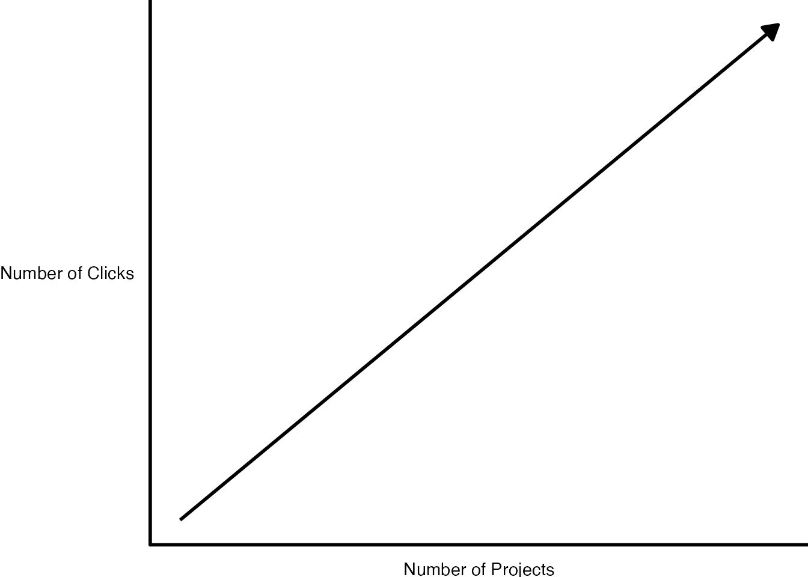


Endless pointing and clicking was just one problem I faced using Excel. Annoying though it was, it didn't affect the quality of my work. Or so I thought until I recalled a project I had worked on a few years earlier. 

In this project, I was looking at which school districts in the state of Oregon have [outdoor education programs known as Outdoor School](https://oregonstate.app.box.com/s/83g5sjdm88xgqdxfze0ri7qo4uff5sj7). As part of this project, I had to download data on all school districts throughout Oregon, filter to only include relevant districts with fifth or sixth graders (the ages Outdoor School takes place), and then merge this with data that I collected as part of a survey I conducted. 

I did the work in Excel, using a lot of (you guessed it!) pointing and clicking. The problem came when I was almost done with the project. I've blocked the details from my memory (as I've done with most things Excel-related), but what I do recall is not being 100% certain I had done my filtering and joining correctly. And, to make it worse, I had no way to check my work. Why? Because all my pointing and clicking was ephemeral, gone in the ether as soon as I had completed it. 

I finished the Outdoor School project and submitted my report. The work I did was *probably* accurate, but maybe it wasn't? 

Now, you may be reading this thinking: why didn't you write down the steps you used in Excel so you could retrace them later? Sure, I could (and should) have done that. But let's be honest: most of us don't. 

We're human. We're lazy. We all make mistakes. And without a straightforward way to audit your work (and keeping a list of all of your Excel points and clicks in a separate document is not, in my view, straightforward), mistakes will happen. If you've used Excel to work with data, I guarantee you've made a mistake, just like me. 

The good news is that it's okay. There's a solution. And that solution is R. 

If I were to redo that project on Outdoor School with R, here's what I'd do differently. Rather than watching points and clicks disappear into the ether, I'd write code that would serve as a record of everything I did. This code would: 

Download data on all school districts:


```r
# Download the data directly from the Oregon Department of Education website
download.file(url = "https://www.oregon.gov/ode/educator-resources/assessment/Documents/TestResults2019/pagr_schools_ela_tot_raceethnicity_1819.xlsx",
              destfile = here::here("data/pagr_schools_ela_tot_raceethnicity_1819.xlsx"))
```


```r
# Import the downloaded data and use the `clean_names()` function to make the variable names easy to work with
oregon_schools <- read_excel(here::here("data/pagr_schools_ela_tot_raceethnicity_1819.xlsx")) %>% 
  clean_names()
```

Filter to only include districts with fifth or sixth graders:


```r
# Start with the oregon_schools data from above
oregon_schools_fifth_sixth_grade <- oregon_schools %>% 
  
  # Only keep schools with fifth or sixth graders
  filter(grade_level == "Grade 5" | grade_level == "Grade 6") %>% 
  
  # Only keep the variables we need
  select(district_id:school) %>% 
  
  # There are multiple observations of the same school, just keep one of each
  distinct()
```


Join the filtered data on school districts with my survey data:


```r
# Use the school_id variable to join the survey data with the oregon_schools_fifth_sixth_grade from above 
left_join(survey_data, oregon_schools_fifth_sixth_grade,
          by = "school_id")
```

## Code is Just a Written Record of Your Work {-}

Code can be scary. Having to write code is one of the reasons many people never learn R. But code is just a list of things you want to do to your data. It may be written in a hard-to-parse syntax (though it gets easier over time), but it's just a set of steps. The same steps that we should write out when we're working in Excel, but never do. Rather than having a separate document with my steps written down, I can see my steps in my code. See that line that says filter? Guess what it's doing? Yep, it's filtering!

If I had done things this way when working on the Outdoor School project, I could have looked back at any point to make sure what I thought was happening to my data was in fact happening. That nagging sensation I had near the end of the project that I may have made a mistake in one of my early points or clicks? It never would have come up because I could have just reviewed my code to make sure it did what I thought it did. And if it didn't, I could rewrite and rerun my code to get updated results. 

Using R won't mean you'll never make mistakes again (trust me, you will). But it will mean that you can easily spot your mistakes, make changes, and fix any issues. 

I started learning R to avoid tedious pointing and clicking. But what I found was that R improved my work in ways I never expected. It's not just that my wrists are less tired. I now have more confidence that my work is accurate. 

## R Can Do Much More Than Just Statistics {-}

I used to feel ashamed about the way I use R. I use R, a tool for statistical analysis, but I don't use it for complex statistical analysis. I don't do machine learning. I don't know what a random forest is. I've never run a regression in R. [The only statistics I do in R are descriptive statistics](https://rfortherestofus.com/2018/12/descriptive-stats-r/): counts, sums, averages, that type of thing. 

For a long time, I felt like I wasn't a "real" R user. Real R users, in my mind, used R for hardcore stats. I "only" used R for descriptive stats. I sometimes felt like I was using a souped up sports car to drive 20 miles an hour to the grocery store. What was the point in using a high-powered machine like R to do "simple" things?  

Eventually, I realized that this framing misses the point. [R started out as a tool created by statisticians for other statisticians](https://rss.onlinelibrary.wiley.com/doi/10.1111/j.1740-9713.2018.01169.x). But, over a quarter century since its creation, R can do much more than statistical analysis. 

My own use of R is an example of this. I think of my work with R in three buckets:

**Illuminate** through data visualization: making graphs, maps, and tables that look good and share results effectively. 

<div class="figure">

<p class="caption">(\#fig:unnamed-chunk-7)Sample pages from a report on housing in demographics in Hartford, Connecticut</p>
</div>

**Communicate** by doing reporting with RMarkdown: moving away from the inefficient and error-prone workflow of using multiple tools to create reports by instead doing it all in the one tool that I think of as [R's killer feature](https://rfortherestofus.com/2019/03/r-killer-feature-rmarkdown/). 

A typical workflow looks like this:

1. Analyze data in SPSS
2. Copy data into Excel to make graphs
3. Copy graphs into Word and write your report


<div class="figure">

<p class="caption">(\#fig:unnamed-chunk-8)A typical non-R workflow</p>
</div>


What happens, though, if you forget to include some data at step one? Or if you need to produce the same report with new data? You have to manually repeat the steps. It's painful.

With R, things are different. You do your data analysis, make your graphs, and write your report all in one tool (RStudio). Once you like what you have, you export it to a format (like Word) to share. 

<div class="figure">

<p class="caption">(\#fig:unnamed-chunk-9)An R-based workflow</p>
</div>

And, best of all, if you forget to include data or need to produce your report again with new data, just re-run your code and you end up with a new Word document, ready to share. 

**Automate** tedious practices: Remember my Excel-burdened wrists? Since I moved to R I've found so many ways to automate tedious practices, from gathering data directly from the U.S. Census Bureau to pulling survey results in from Google Sheets and more.

<div class="figure">

<p class="caption">(\#fig:unnamed-chunk-10)An workflow that brings data from Google Sheets directly into R</p>
</div>

The main reason I've come to accept that my way of using R is as valid as anyone else's has come through realizing that more "sophisticated" R users are doing many of the same things I am. Sure, they may also be doing statistical analyses that I am not, but everyone who uses R needs to illuminate, communicate, and automate.  

Canadian statistician Sharla Gelfand has [talked about how they used R to automate an annual report on nursing registration exams in Ontario](https://twitter.com/sharlagelfand/status/1135962094938009601). Sharla told me in 2019 that, despite being a statistician, [the most statistical thing they did was calculating a median](https://rfortherestofus.com/2019/09/my-r-journey-sharla-gelfand/).

Take a look at the R community on Twitter (where users congregate under the #rstats hashtag). What gets people most excited is not the latest complex statistical analysis. [It's tips and tricks on the foundational work that everyone who uses R needs to do](https://twitter.com/dgkeyes/status/1479473689225695234). Things like:

- [Making illuminating data visualizations](https://twitter.com/CedScherer/status/1220843943224578050) as part of the [Tidy Tuesday project](https://github.com/rfordatascience/tidytuesday).


```r
tweet_embed("https://twitter.com/CedScherer/status/1220843943224578050")
```

- [Video tutorials on how to communicate through effective presentations using R](https://twitter.com/spcanelon/status/1424932510065209348).


```r
tweet_embed("https://twitter.com/spcanelon/status/1424932510065209348")
```

- [Love letters to the `clean_names()` function from the `janitor` package, which automates the process of making messy variable names easy to work with in R](https://twitter.com/WeAreRLadies/status/1228049014601342976). 


```r
tweet_embed("https://twitter.com/WeAreRLadies/status/1228049014601342976")
```

No matter what else you do in R, you have to **illuminate** your findings and **communicate** your results. And, the more you use R, the more you'll find yourself wanting to **automate** things you used to do manually (your wrists will thank you). I realize now that the things that I use R for *are* the things that everyone uses R for. R was created for statistics. But today people are just as likely to use R without statistics. 

Ten years ago, if you had told me I'd be writing a book on R, I'd have laughed. As someone with an extremely non-quantitative background (I did a PhD in anthropology) who never used R in graduate school, I never thought I'd be in a position to teach people about R. But here we are. And I'm excited to be your guide on this journey through the ways you can use R without statistics. 

If I only used R for the things I thought "real" R users used it for, I wouldn't be writing this book. But, instead of slogging away in the world of complex statistical analysis, far outside of my area of expertise, I have found a place for myself in the world of R. Expanding my conception of what this tool can do has enabled me to get more out of R.

And here's the thing: if I, a qualitatively-trained anthropologist whose most complex statistical use for R is calculating averages, can find value in R, so can you. No matter what your background or what you think about R right now, using R without statistics can transform how you work in the future. 

## How This Book Works {-}

This book shows the many ways that people use R without statistics. It's not comprehensive (trust me, there are many ways people use R not covered here). But I hope the ideas inspire you to think about learning to use R (if you're not yet an R user) or (if you are already on board the R train) learning to use R in ways you hadn't previously considered. 

Each chapter focuses on one novel use of R. You'll begin by learning about a user or users who have transformed their work using R. You'll learn about a problem they had and how R helped them to solve it.We'll dive into their code, analyzing it line by line in order to help you understand how they used R. Each chapter will conclude with a short summary, offering lessons you can take from this novel way of using R. 

I've tried to choose topics for each chapter that are relevant to a broad audience. Things like data visualization, report generation, and creating your own functions are things that anyone, no matter what you use R for, will find valuable. 

There are some great topics that I thought to include but were just too narrow in their focus (for example, [the world of generative art made with R](https://blog.djnavarro.net/posts/2021-10-19_rtistry-posts/). If, at any point while you're reading this book, you think, "why didn't David include X topic?" please know that X might be a great topic, but I can only cover so much. The fact that you're able to come up with other ideas for things that R can do is a) fantastic and b) a further display of R's versatility. I eagerly await your follow-up book highlighting the myriad other things R can do that I am unable to cover in this book!

## A Favor to Ask {-}

Pedants of the world (as one of you, I come in peace), I have a favor to ask. 

This book is called R Without Statistics. But it's not meant to be taken literally. Of course it's true that if you're making a graph you're using statistics. So, before you start typing an angry email to me, please know that R Without Statistics is a mindset rather than a literal statement. 

We're all using R with statistics already. Let's also learn to use R without statistics. 


<!--chapter:end:introduction.Rmd-->

---
output: html_document
editor_options: 
  chunk_output_type: inline
---

# (PART\*) Illuminate {-}

<!--chapter:end:illuminate.Rmd-->

---
output: html_document
editor_options: 
  chunk_output_type: console
---


# Use General Principles of High-Quality Data Viz in R {#data-viz-chapter}

In the spring of 2021, nearly all of the American West was in a drought. In April of that year, officials in Southern California declared a water emergency, citing unprecedented conditions. 

This wouldn't have come as news to those living in California and other Western states. In addition to the direct impact of drought (leading areas of California to implement water use restrictions), people could see the indirect impact of drought in the skies. With forests dried out by years of drought conditions, wildfires became more frequent, filling the air with smoke. By the summer, there were be so many wildfires that smoke from drifted across the country, making even East Coast skies hazy and the air dangerous to breathe. 

Drought conditions like those in the West in 2021 are becoming increasingly common. Yet communicating the extent of problem remains difficult. How can we show the data in a way that accurately represents the data while is also compelling enough to get people to take notice? 

This was the challenge that data visualization designers Cédric Scherer and Georgios Karamanis took on in the fall of 2021. Commissioned by the magazine Scientific American to create a data visualization of drought conditions in the last two decades in the United States, they turned to the `ggplot2` package to turn what could be (pardon the pun) dry data into a visually arresting and impactful graph.

There was nothing unique about the data that Cédric and Georgios used. It was the same data from the National Drought Center that news organizations used in their stories. But Cédric and Georgios visualized the data in a way that it both grabs attention and communicates the scale of the phenomenon.

Figure \@ref(fig:final-viz) shows a section of the final visualization (If you're incredibly eagle-eyed, you'll see a few minor elements that differ from the version published in Scientific American). These are things I had to change to make the plots fit in this book (e.g. text size and putting legend text on two rows) or things that Scientific American added in post-production (e.g. some annotations). Showing four regions over the last two decades, the increase in drought conditions, especially in California and the Southwest, is made apparent. 


<div class="figure">
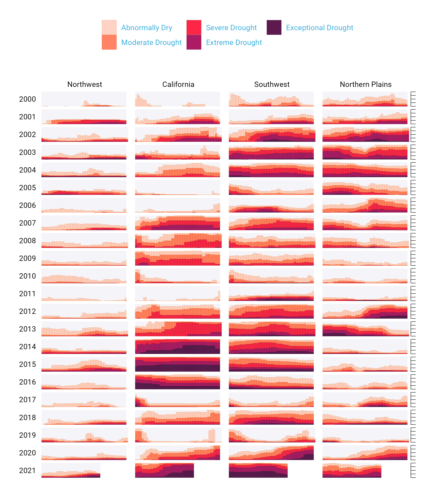
<p class="caption">(\#fig:final-viz)Section of the final drought visualization</p>
</div>


To understand why this visualization is effective, let's break it down into pieces. 

At the broadest level, the data viz is also notable for its minimalist aesthetic. There are, for example, no grid lines, little text along the axes, and few text labels. What Cédric and Georgios have done is to remove what statistician Edward Tufte, in his 1983 book *The Visual Display of Quantitative Information*, calls "chartjunk." Tufte wrote (and researchers as well as data viz designers since have generally agreed) that extraneous elements often hinder, rather than help, our understanding of charts. 

Need proof that Cédric and Georgios's decluttered graph is better than the alternative? Figure \@ref(fig:cluttered-viz) shows a version with a few small tweaks to the code to include grid lines and text labels on axes. Prepare yourself for clutter!


<div class="figure">
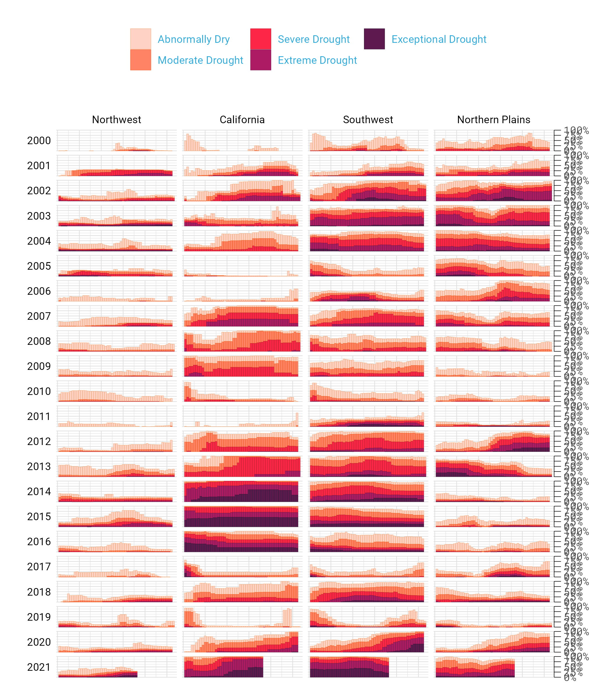
<p class="caption">(\#fig:cluttered-viz)Cluttered version of the drought visualization</p>
</div>


And, again, it's not just that this cluttered version looks worse. The clutter actively inhibits understanding. Rather than focus on overall drought patterns (the point of the graph), our brain gets stuck reading repetitive and unnecessary axis text. 

One of the best ways to reduce clutter is to break a single chart into what are known as small multiples. When we look closely at the data viz, we see that it is not one chart but actually a set of charts. Each rectangle represents one region in one year. If we filter to show the Southwest region in 2003 and add axis titles, we can see in Figure \@ref(fig:viz-sw-2003) that the x axis shows the week while the y axis shows the percentage of that region at different drought levels. 


<div class="figure">
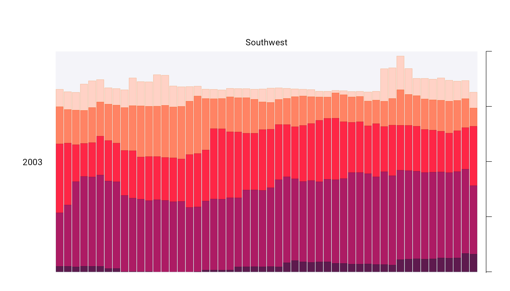
<p class="caption">(\#fig:viz-sw-2003)Drought visualization for Southwest in 2003</p>
</div>


Zooming in on a single region in a single year also makes the color choices more obvious. The lightest bars show the percentage of the region that is abnormally dry while the darkest bars shows the percentage in exceptional drought conditions. These colors, as we'll see shortly, are intentionally chosen to make differences in the drought levels visible to all readers. 

When I asked Cédric and Georgios to speak with me about this data visualization, they initially told me that the code for this piece might be too simple to highlight the power of R for data viz. No, I told them, I want to speak with you precisely *because* the code is not super complex. The fact that Cédric and Georgios were able to produce this complex graph with relatively simple code shows the power of R for data visualization. And it is possible because of a theory called the grammar of graphics.

## The Grammar of Graphics {-}

If you've used Excel to make graphs, you're probably familiar with the menu shown in Figure \@ref(fig:excel-chart-chooser): 


<div class="figure">

<p class="caption">(\#fig:excel-chart-chooser)Excel chart chooser menu</p>
</div>


Working in Excel, your graph-making journey begins with the step of selecting the type of graph you want to make. Want a bar chart? Click the bar chart icon. Want a line chart? Click the line chart icon. 

If you've only ever made data visualization in Excel, this first step may seem so obvious that you've never even considered conceptualizing the process of creating data visualization in any different way. This was certainly the case for me in my years as an Excel user.

But there are different ways to think about graphs. Rather than conceptualizing graphs types as being distinct, it is also possible to recognize the things that they have in common, and using these commonalities as the starting point for making graphs. 

This approach to thinking about graphs comes from the late statistician Leland Wilkinson. Wilkinson thought deeply for years about what data visualization is and how we can describe it. In 1999, he published a book called *The Grammar of Graphics* that sought to develop a consistent way of describing *all* graphs. 

Wilkinson argued that we should think of plots not as distinct types a la Excel, but as following a grammar that we can use to describe *any* plot. Throughout the book that Wilkinson is best remembered for, he presented general principles to describe graphs. Just as knowledge of English grammar tells us that a noun is typically followed by a verb ("he goes") works while the opposite ("goes he") does not, knowledge of the grammar of graphics allows us to understand why certain graph types "work." Or, as Wilkinson put it,

> A language consisting of words and no grammar (statement = word) expresses only as many ideas as there are words. ... The grammar of graphics takes us beyond a limited set of charts (words) to an almost unlimited world of graphical forms (statements). 

Thinking about data visualization through the lens of the grammar of graphics allow us to see, for example, that graphs typically have data that is plotted on the x axis and other data that is plotted on the y axis. And this is the case no matter whether the type of graph we end up with is, to take just two examples, a bar chart of a line chart. Consider Figure \@ref(fig:bar-line-chart), which shows two charts that use identical data on life expectancy in Afghanistan:


<div class="figure">

<p class="caption">(\#fig:bar-line-chart)Bar chart and line chart showing identical data on Afghanistan life expectancy</p>
</div>


While they look different (and would, to the Excel user, be different types of graphs), Wilkinson's grammar of graphics allows us to see their similarities. 

As an academic statistician, Wilkinson's goal in writing *The Grammar of Graphics*  was to provide a novel way of thinking about data visualization. But his feelings on graph-making tools like Excel were clear when he wrote that "most charting packages channel user requests into a rigid array of chart types." 

At the time Wilkinson wrote his book, there was no data viz tool that could implement his grammar of graphics. This would change in 2010, when Hadley Wickham announced the `ggplot2` package for R. Providing the tools to implement Wilkinson's ideas, `ggplot2` would come to revolutionize the world of data visualization. 

## The Arrival of ggplot2 {-}

Hadley Wickham's article announcing `ggplot2` (which I, like nearly everyone in the data viz world, will refer to simply as ggplot) was titled *A Layered Grammar of Graphics*. It showed a new R package that relied on the grammar of graphics and added on the idea of plots having multiple layers. Let's walk through some of the most important layers. 

When creating a graph with ggplot, we begin by mapping data to aesthetic properties. To the uninitiated, this may sound like complete nonsense. But all it means is that we use things like the x or y axis, color, size (aka aesthetic properties) to represent variables. 

Let's make this concrete using the same data on life expectancy in Afghanistan. Here's what this data looks like. 


```
#> # A tibble: 10 × 6
#>    country     continent  year lifeExp      pop gdpPercap
#>    <fct>       <fct>     <int>   <dbl>    <int>     <dbl>
#>  1 Afghanistan Asia       1952    28.8  8425333      779.
#>  2 Afghanistan Asia       1957    30.3  9240934      821.
#>  3 Afghanistan Asia       1962    32.0 10267083      853.
#>  4 Afghanistan Asia       1967    34.0 11537966      836.
#>  5 Afghanistan Asia       1972    36.1 13079460      740.
#>  6 Afghanistan Asia       1977    38.4 14880372      786.
#>  7 Afghanistan Asia       1982    39.9 12881816      978.
#>  8 Afghanistan Asia       1987    40.8 13867957      852.
#>  9 Afghanistan Asia       1992    41.7 16317921      649.
#> 10 Afghanistan Asia       1997    41.8 22227415      635.
```

If we want to make a chart with ggplot, we need to first decide which variable to use to put on the x axis and which to put on the y axis. Let's say we want to show life expectancy over time. That means using the variable `year` on the x axis and the variable `lifeExp` on the y axis. 

I begin by using the `ggplot()` function. Within this, I tell R that I'm using the data frame `gapminder_10_rows` (this is the filtered version I created from the full `gapminder` data frame, which includes over 1,700 rows of data). The line following this tells R to use `year` on the x and `lifeExp` on the y axis. When I run my code, what I get in Figure \@ref(fig:blank-ggplot) doesn't look like much.


```r
ggplot(
  data = gapminder_10_rows,
  mapping = aes(
    x = year,
    y = lifeExp
  )
)
```

<div class="figure">

<p class="caption">(\#fig:blank-ggplot)A blank chart</p>
</div>


But if I look closely, I can see the beginnings of a plot. Remember that x axis using `year`? There it is! And `lifeExp` on the y axis? Yup, it's there too. 

I can also see that the values on the x and y axes match up to our data. In the `gapminder_10_rows` data frame, the first year is 1952 and the last year is 1997. The range of the x axis seems to have been created with this data in mind (spoiler: it was). And `lifeExp`, which goes from about 28 to about 42 will fit nicely on our y axis.

Axes are nice, but we're missing any type of visual representation of the data. To get this, we need to add the next layer in ggplot: geoms. Short for geometric objects, geoms are different ways of representing data. For example, if we want to add points, we use `geom_point()`, as seen in Figure \@ref(fig:gapminder-points). 


```r
ggplot(
  data = gapminder_10_rows,
  mapping = aes(
    x = year,
    y = lifeExp
  )
) +
  geom_point()
```

<div class="figure">

<p class="caption">(\#fig:gapminder-points)The same chart but with points added</p>
</div>


There we go! 1952 shows the life expectancy of about 28 and so on through every year in our data. 

Let's say we change our mind and want to make a line chart instead. Well, all we have to do is replace `geom_point()` with `geom_line()` and we get Figure \@ref(fig:gapminder-line). 


```r
ggplot(
  data = gapminder_10_rows,
  mapping = aes(
    x = year,
    y = lifeExp
  )
) +
  geom_line()
```

<div class="figure">

<p class="caption">(\#fig:gapminder-line)The same data but as a line chart</p>
</div>


Or (and now we're really getting fancy), what if we add *both* `geom_point()` and `geom_line()`? The line chart with points seen in Figure \@ref(fig:gapminder-points-line)!  


```r
ggplot(
  data = gapminder_10_rows,
  mapping = aes(
    x = year,
    y = lifeExp
  )
) +
  geom_point() +
  geom_line()
```

<div class="figure">

<p class="caption">(\#fig:gapminder-points-line)The same data with points and a line</p>
</div>


We can extend this idea further, as seen in Figure \@ref(fig:gapminder-bar), swapping in `geom_col()` to create to a bar chart (note that the y axis range has been automatically updated now, going from 0 to 40 to account for the different geom). 


```r
ggplot(
  data = gapminder_10_rows,
  mapping = aes(
    x = year,
    y = lifeExp
  )
) +
  geom_col()
```

<div class="figure">

<p class="caption">(\#fig:gapminder-bar)The same data as a bar chart</p>
</div>


I hope you're seeing how ggplot is a direct implementation of Wilkinson's grammar of graphics. The difference between a line chart and a bar chart isn't as great as the Excel chart type picker might have us think. Both can have the same aesthetic properties (namely, putting year on the x axis and life expectancy on the y axis), but simply use different geometric objects to visually represent the data. 

Before we return to the drought data viz, let's look at a few additional layers that can help us can alter our bar chart. Let's say we want to change the color of our bars. In the grammar of graphics approach to chart-making, this means mapping some variable to the aesthetic property of fill (slightly confusingly, the aesthetic property "color" would, for a bar chart, change the outline of each bar). In the same way that we mapped `year` to the x axis and y to `lifeExp`, we can also map fill to a variable. Let's try mapping fill to the year variable. The result is shown in Figure \@ref(fig:gapminder-bar-colors).


```r
ggplot(
  data = gapminder_10_rows,
  mapping = aes(
    x = year,
    y = lifeExp,
    fill = year
  )
) +
  geom_col()
```

<div class="figure">

<p class="caption">(\#fig:gapminder-bar-colors)The same chart, now with added colors</p>
</div>


What we see now is that, for earlier years, the fill is darker while for later years, it is lighter (the legend, added to the right of our plot, shows this). What if we want to change the fill colors? For that, we use a new scale layer. In this case, I'll use the `scale_fill_viridis_c()` function (the c at the end of the function name refers to the fact that the data is continuous). This function, just one of many functions that start with `scale_` and can alter the fill scale, changes the default palette to one that is colorblind-friendly and prints well in grayscale. If you're looking at Figure \@ref(fig:gapminder-viridis) in a print version of the book, you're able to see differences in the bar colors because of this!


```r
ggplot(
  data = gapminder_10_rows,
  mapping = aes(
    x = year,
    y = lifeExp,
    fill = year
  )
) +
  geom_col() +
  scale_fill_viridis_c()
```

<div class="figure">

<p class="caption">(\#fig:gapminder-viridis)The same chart with a colorblind-friendly palette</p>
</div>


A final layer we'll look at is the theme layer. This layer allows us to change the overall look-and-feel of plots (think: plot backgrounds, grid lines, and so on). Just as there are a number of `scale_` functions, there are also a number of functions that start with `theme_`. Below, I've added `theme_minimal()`, which starts to declutter our plot in Figure \@ref(fig:gapminder-theme). 


```r
ggplot(
  data = gapminder_10_rows,
  mapping = aes(
    x = year,
    y = lifeExp,
    fill = year
  )
) +
  geom_col() +
  scale_fill_viridis_c() +
  theme_minimal()
```

<div class="figure">

<p class="caption">(\#fig:gapminder-theme)The same chart with theme_minimal() added</p>
</div>


We've now seen why Hadley Wickham described the `ggplot2` package as using a layered grammar of graphics. It relies on Leland Wilkinson's theory and implements it through the creation of multiple layers: 

- First, we select variables to map to aesthetic properties such as x or y axis, color/fill, etc
- Second, we choose the geometric object (aka geom) we want to use to represent our data
- Third, if we want to change aesthetic properties (for example, using a different palette), we do this with a `scale_` function
- Fourth, we use a `theme_` function to set the overall look-and-feel of our plot. 

There are many ways we could improve the plot we've been working on. But rather than improving an ugly plot, let's instead return to the drought data viz that Cédric Scherer and Georgios Karamanis made. Going through their code will show us some familiar aspects of ggplot -- and present some tips on how to make high-quality data visualization with R. 

## Recreating the Drought Visualization {-}

The code that Cédric and Georgios wrote to make their final data viz relies on a combination of ggplot fundamentals and some less-well-known tweaks that make it really shine. In order to understand how Cédric and Georgios made their data viz, we'll start out with a simplified version of their code. We'll build it up layer by layer, adding elements until we can see exactly how they made their drought data viz. 

Let's start by looking again at one region (Southwest) in one year (2003). First, we filter our data and save it as a new object called `southwest_2003`. 


```r
southwest_2003 <- dm_perc_cat_hubs %>%
  filter(hub == "Southwest") %>%
  filter(year == 2003)
```

We can take a look at this object to see the variables we have to work with:

- **date**: start date of the week of the observation
- **hub**: region
- **category**: level of drought (D0 = lowest level of drought; D5 = highest level)
- **percentage**: percentage of that region that is in that category of drought (0 = 0%, 1 = 100%)
- **year**: observation year
- **week**: week number (i.e. first week is week 1)
- **max_week**: the maximum number of weeks in a given year


```r
southwest_2003 %>%
  slice(1:10)
#> # A tibble: 10 × 7
#>    date       hub       category perce…¹  year  week max_w…²
#>    <date>     <fct>     <fct>      <dbl> <dbl> <dbl>   <dbl>
#>  1 2003-12-30 Southwest D0        0.0718  2003    52      52
#>  2 2003-12-30 Southwest D1        0.0828  2003    52      52
#>  3 2003-12-30 Southwest D2        0.269   2003    52      52
#>  4 2003-12-30 Southwest D3        0.311   2003    52      52
#>  5 2003-12-30 Southwest D4        0.0796  2003    52      52
#>  6 2003-12-23 Southwest D0        0.0823  2003    51      52
#>  7 2003-12-23 Southwest D1        0.131   2003    51      52
#>  8 2003-12-23 Southwest D2        0.189   2003    51      52
#>  9 2003-12-23 Southwest D3        0.382   2003    51      52
#> 10 2003-12-23 Southwest D4        0.0828  2003    51      52
#> # … with abbreviated variable names ¹​percentage, ²​max_week
```
Now we can use this `southwest_2003` object for our plotting. In the `ggplot()` function, we tell R to put week on the x axis, percentage on the y axis, and use the category variable (i.e. drought level) for our fill color. We then use `geom_col()` to create a bar chart where the fill color of each bar represents the percentage of the region in a single week that is at different drought levels. The colors don't match the final version of the plot, but with this code we can start to see the outlines of Cédric and Georgios's data viz in Figure \@ref(fig:southwest-2003-no-style).  


```r
ggplot(
  data = southwest_2003,
  aes(
    x = week,
    y = percentage,
    fill = category
  )
) +
  geom_col()
```

<div class="figure">
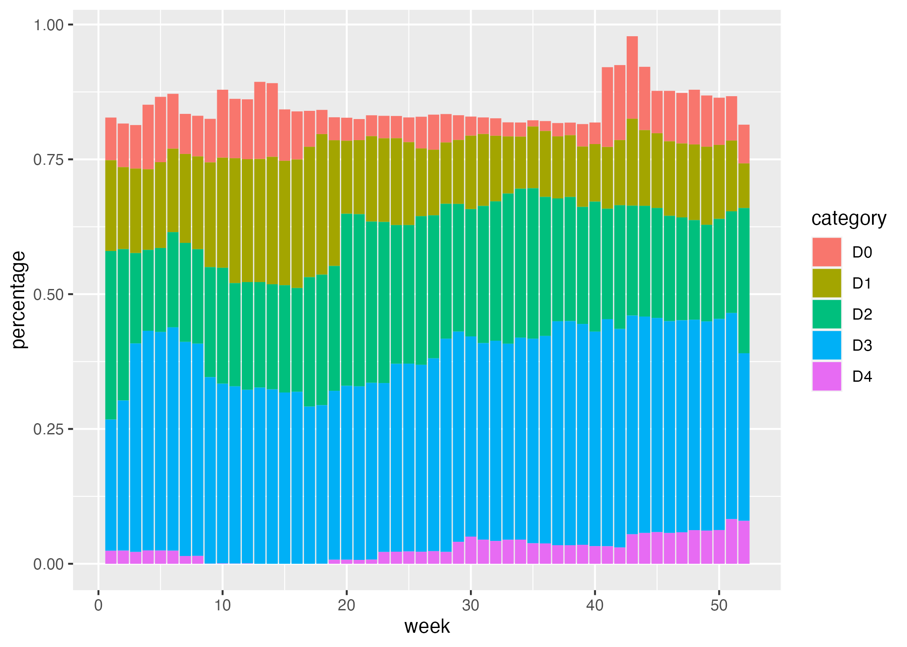
<p class="caption">(\#fig:southwest-2003-no-style)One year and one region of the drought visualization</p>
</div>


Cédric and Georgios next select different fill colors for their bars. They use the `scale_fill_viridis_d()` function. The "d" here means the data that the fill scale is being applied to has discrete categories (D0, D1, D2, D3, D4, D5). They use the argument `option = "rocket"` in order to select the "rocket" palette (the `scale_fill_viridis_d()` function has several other palettes). And they use the `direction = -1` argument to reverse the order of fill colors so that darker colors mean higher drought conditions, as seen in Figure \@ref(fig:southwest-2003-with-color). 


```r
ggplot(
  data = southwest_2003,
  aes(
    x = week,
    y = percentage,
    fill = category
  )
) +
  geom_col() +
  scale_fill_viridis_d(
    option = "rocket",
    direction = -1
  )
```

<div class="figure">

<p class="caption">(\#fig:southwest-2003-with-color)One year and one region of the drought visualization using a viridis palette</p>
</div>


In the language of ggplot, x and y axis are aesthetic properties, the same as fill color. Cédric and Georgios tweak the x axis to remove both the axis title ("week") using `name = NULL` and the 0-50 axis text with `guide = none`. On the y axis, they remove the axis title and axis text (which was showing percentages in 0.00, 0.25, 0.50, 0.75 format) using `labels = NULL` (this functionally does the same thing as `guide = "none"`). They also move the axis lines themselves to the right side using `position = "right"` (they are only apparent as tick marks at this point, but will become more visible later). Figure \@ref(fig:southwest-2003-xy-scales) shows the result of these tweaks.


```r
ggplot(
  data = southwest_2003,
  aes(
    x = week,
    y = percentage,
    fill = category
  )
) +
  geom_col() +
  scale_fill_viridis_d(
    option = "rocket",
    direction = -1
  ) +
  scale_x_continuous(name = NULL, 
                     guide = "none") +
  scale_y_continuous(name = NULL, 
                     labels = NULL, 
                     position = "right")
```

<div class="figure">

<p class="caption">(\#fig:southwest-2003-xy-scales)One year and one region of the drought visualization with adjustments to the x and y axes</p>
</div>


Up to this point, we've focused on one of the single plots that make up the larger data viz. But the final product that Cédric and Georgios made is actually 176 plots (22 years and 8 regions). One of the most useful features of ggplot is what's known as facetting (known more commonly in the data viz world as small multiples). With the `facet_grid()` function, we can select which variable to put in rows and which to put in columns of our facetted plot. Cédric and Georgios put `year` in rows and `hub` (region) in columns. The `switch = "y"` argument moves the year label from the right side (where it appears by default) to the left. With this code in place, we can see the final plot coming together in Figure \@ref(fig:drought-viz-facetted). Space considerations require me to again include only four regions, but you get the idea.


```r
dm_perc_cat_hubs %>%
  filter(hub %in% c("Northwest", 
                    "California", 
                    "Southwest", 
                    "Northern Plains")) %>%
  ggplot(aes(x = week, 
             y = percentage,
             fill = category)) +
  geom_col() +
  scale_fill_viridis_d(
    option = "rocket",
    direction = -1
  ) +
  scale_x_continuous(name = NULL, 
                     guide = "none") +
  scale_y_continuous(name = NULL, 
                     labels = NULL, 
                     position = "right") +
  facet_grid(rows = vars(year), 
             cols = vars(hub), 
             switch = "y")
```

<div class="figure">

<p class="caption">(\#fig:drought-viz-facetted)Facetted version of the drought visualization</p>
</div>


Incredibly, the broad outlines of the plot took us just 10 lines to create. All of the final code from here on out falls in the category of small polishes. That's not to minimize how important small polishes are (very) or the time it takes to create them (lots). But it is to say that a little bit of ggplot goes a long way. 

Let's look at a few of the small polishes that Cédric and Georgios make. The first is to apply a theme, as seen in Figure \@ref(fig:drought-viz-theme-light). They use `theme_light()`, which removes the default gray background and changes the font to Roboto. 


```r
dm_perc_cat_hubs %>%
  filter(hub %in% c("Northwest", 
                    "California", 
                    "Southwest", 
                    "Northern Plains")) %>%
  ggplot(aes(x = week, 
             y = percentage,
             fill = category)) +
  geom_col() +
  scale_fill_viridis_d(
    option = "rocket",
    direction = -1
  ) +
  scale_x_continuous(name = NULL, 
                     guide = "none") +
  scale_y_continuous(name = NULL, 
                     labels = NULL, 
                     position = "right") +
  facet_grid(rows = vars(year), 
             cols = vars(hub), 
             switch = "y") +
  theme_light(base_family = "Roboto")
```

<div class="figure">
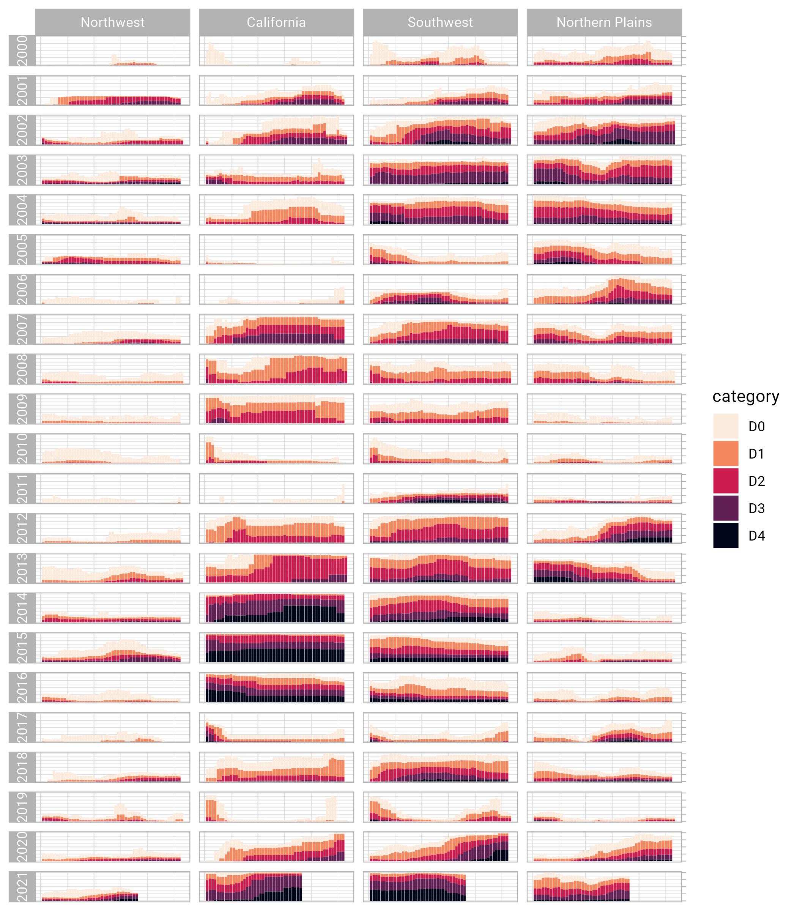
<p class="caption">(\#fig:drought-viz-theme-light)Drought visualization with theme_light() added</p>
</div>


`theme_light()` is what's known as a "complete theme." So-called complete themes change the overall look-and-feel of a plot. But Cédric and Georgios don't stop with applying a complete theme. From there, they use the `theme()` function to make additional tweaks to what `theme_light()` gives them. The drought visualization as it currently stands is seen in Figure \@ref(fig:drought-viz-theme-tweaks).


```r
dm_perc_cat_hubs %>%
  filter(hub %in% c("Northwest", 
                    "California", 
                    "Southwest", 
                    "Northern Plains")) %>%
  ggplot(aes(x = week, 
             y = percentage,
             fill = category)) +
  geom_col() +
  scale_fill_viridis_d(
    option = "rocket",
    direction = -1
  ) +
  scale_x_continuous(name = NULL, 
                     guide = "none") +
  scale_y_continuous(name = NULL, 
                     labels = NULL, 
                     position = "right") +
  facet_grid(rows = vars(year), 
             cols = vars(hub), 
             switch = "y") +
  theme_light(base_family = "Roboto") +
  theme(
    axis.title = element_text(size = 14, 
                              color = "black"),
    axis.text = element_text(family = "Roboto Mono", 
                             size = 11),
    axis.line.x = element_blank(),
    axis.line.y = element_line(color = "black", 
                               size = .2),
    axis.ticks.y = element_line(color = "black", 
                                size = .2),
    axis.ticks.length.y = unit(2, "mm"),
    legend.position = "top",
    legend.title = element_text(color = "#2DAADA", 
                                face = "bold"),
    legend.text = element_text(color = "#2DAADA"),
    strip.text.x = element_text(hjust = .5, 
                                face = "plain", 
                                color = "black", 
                                margin = margin(t = 20, b = 5)),
    strip.text.y.left = element_text(angle = 0, 
                                     vjust = .5, 
                                     face = "plain", 
                                     color = "black"),
    strip.background = element_rect(fill = "transparent", 
                                    color = "transparent"),
    panel.grid.minor = element_blank(),
    panel.grid.major = element_blank(),
    panel.spacing.x = unit(0.3, "lines"),
    panel.spacing.y = unit(0.25, "lines"),
    panel.background = element_rect(fill = "transparent", 
                                    color = "transparent"),
    panel.border = element_rect(color = "transparent", 
                                size = 0),
    plot.background = element_rect(fill = "transparent", 
                                   color = "transparent", 
                                   size = .4),
    plot.margin = margin(rep(18, 4))
  )
```

<div class="figure">

<p class="caption">(\#fig:drought-viz-theme-tweaks)Drought visualization with tweaks to the theme</p>
</div>


The code in the `theme()` function does many different things, but let's take a look at a few of the most important:

`legend.position = "top"` moves the legend from the right (the default) to the top of the plot. 

`strip.text.y.left = element_text(size = 18, angle = 0, vjust = .5, face = "plain", color = "black")` turns the year text in the columns so that it is no longer angled. Without the `angle = 0`, the years would be much less readable.


<div class="figure">
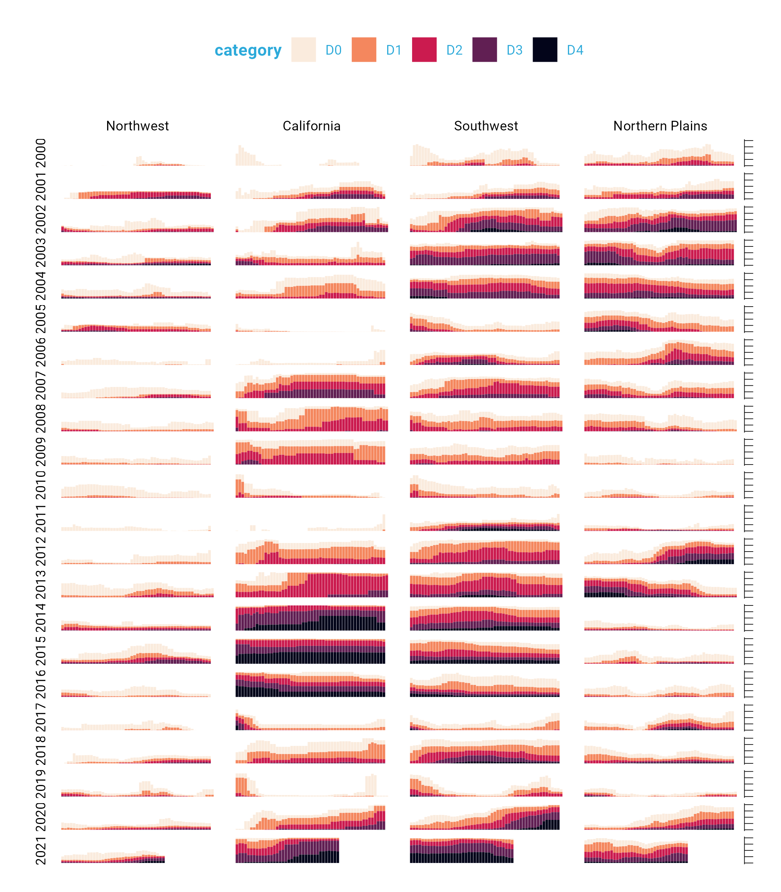
<p class="caption">(\#fig:drought-viz-more-tweaks)Drought visualization with additional tweaks to the theme</p>
</div>


The following lines make the distinctive axis lines and ticks that show up on the right side of the final plot:


```r
axis.line.x = element_blank(),
axis.line.y = element_line(color = "black", size = .2),
axis.ticks.y = element_line(color = "black", size = .2),
axis.ticks.length.y = unit(2, "mm")
```

`panel.grid.minor = element_blank()` and `panel.grid.major = element_blank()` remove all grid lines from the final plot. 

And finally, these three lines remove the borders and make each of the individual plots have a transparent background. 


```r
panel.background = element_rect(fill = "transparent", color = "transparent"),
panel.border = element_rect(color = "transparent", size = 0),
plot.background = element_rect(fill = "transparent", color = "transparent", size = .4)
```

Keen readers such as yourself may now be thinking: "wait, didn't the individual plots have a gray background behind them?" Yes, dear reader, they did. How did Cédric and Georgios make these? They did this with a separate geom: `geom_rect()`. Here, they set some additional aesthetic properties specific to `geom_rect()` (`xmin`, `xmax`, `ymin`, and `ymax`). The result is a gray background drawn behind each small multiple, as seen in Figure \@ref(fig:drought-viz-gray-backgrounds). 


```r
geom_rect(
  aes(
    xmin = .5,
    xmax = max_week + .5,
    ymin = -0.005,
    ymax = 1
  ),
  fill = "#f4f4f9",
  color = NA,
  size = 0.4
)
```


<div class="figure">
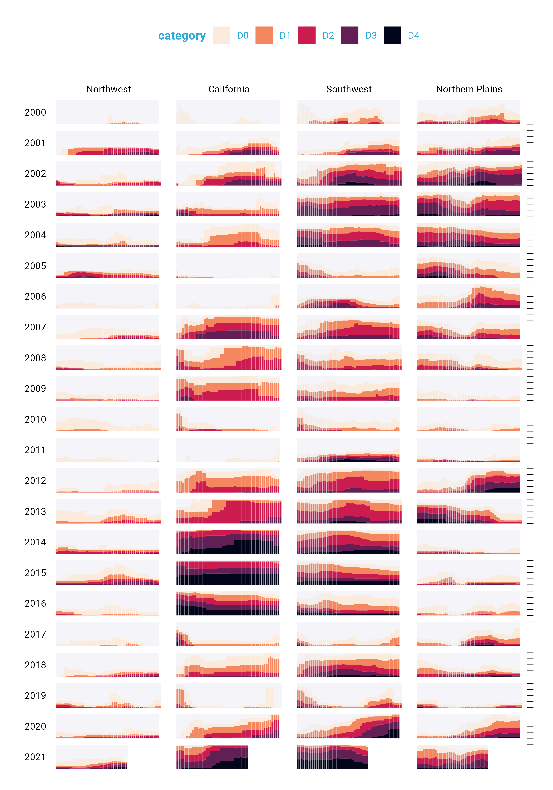
<p class="caption">(\#fig:drought-viz-gray-backgrounds)Facetted version of the drought visualization with gray backgrounds behind each small multiple</p>
</div>


The final polish to highlight is the tweaks to the legend. I previously showed a simplified version of the `scale_fill_viridis_d()` function. A more complete version is as follows. The `name` argument sets the legend title and the `labels` argument determine the labels that show up in the legend. Rather than D0, D1, D2, D3, and D4, we now have Abnormally Dry, Moderate Drought, Severe Drought, Extreme Drought, and Exceptional Drought. Figure \@ref(fig:drought-viz-legend-tweaks) shows the result of these changes.


```r
scale_fill_viridis_d(
  option = "rocket",
  direction = -1,
  name = "Category:",
  labels = c(
    "Abnormally Dry",
    "Moderate Drought",
    "Severe Drought",
    "Extreme Drought",
    "Exceptional Drought"
  )
)
```


<div class="figure">

<p class="caption">(\#fig:drought-viz-legend-tweaks)Drought visualization with changes made to the legend text</p>
</div>


While I've showed you a nearly complete version of the code, I have made some small changes along the way to make it easier to understand. If you're curious to see the full code Cédric and Georgios used to create the data viz, here it is. There are a few additional tweaks to colors and spacing, but nothing major beyond what we've seen so far. 


```r
ggplot(dm_perc_cat_hubs, aes(week, percentage)) +
  geom_rect(
    aes(
      xmin = .5,
      xmax = max_week + .5,
      ymin = -0.005,
      ymax = 1
    ),
    fill = "#f4f4f9",
    color = NA,
    size = 0.4,
    show.legend = FALSE
  ) +
  geom_col(
    aes(
      fill = category,
      fill = after_scale(addmix(darken(fill, .05, 
                                       space = "HLS"), 
                                "#d8005a", 
                                .15)),
      color = after_scale(darken(fill, .2, 
                                 space = "HLS"))
    ),
    width = .9,
    size = 0.12
  ) +
  facet_grid(rows = vars(year), 
             cols = vars(hub), 
             switch = "y") +
  coord_cartesian(clip = "off") +
  scale_x_continuous(expand = c(.02, .02), 
                     guide = "none", 
                     name = NULL) +
  scale_y_continuous(expand = c(0, 0), 
                     position = "right", 
                     labels = NULL, 
                     name = NULL) +
  scale_fill_viridis_d(
    option = "rocket",
    name = "Category:",
    direction = -1,
    begin = .17,
    end = .97,
    labels = c(
      "Abnormally Dry",
      "Moderate Drought",
      "Severe Drought",
      "Extreme Drought",
      "Exceptional Drought"
    )
  ) +
  guides(fill = guide_legend(nrow = 2,
                             override.aes = list(size = 1))) +
  theme_light(base_size = 18, 
              base_family = "Roboto") +
  theme(
    axis.title = element_text(size = 14, 
                              color = "black"),
    axis.text = element_text(family = "Roboto Mono", 
                             size = 11),
    axis.line.x = element_blank(),
    axis.line.y = element_line(color = "black", 
                               size = .2),
    axis.ticks.y = element_line(color = "black", 
                                size = .2),
    axis.ticks.length.y = unit(2, "mm"),
    legend.position = "top",
    legend.title = element_text(color = "#2DAADA", 
                                size = 18, 
                                face = "bold"),
    legend.text = element_text(color = "#2DAADA", 
                               size = 16),
    strip.text.x = element_text(size = 16, 
                                hjust = .5, 
                                face = "plain", 
                                color = "black", 
                                margin = margin(t = 20, b = 5)),
    strip.text.y.left = element_text(size = 18, 
                                     angle = 0, 
                                     vjust = .5, 
                                     face = "plain", 
                                     color = "black"),
    strip.background = element_rect(fill = "transparent", 
                                    color = "transparent"),
    panel.grid.minor = element_blank(),
    panel.grid.major = element_blank(),
    panel.spacing.x = unit(0.3, "lines"),
    panel.spacing.y = unit(0.25, "lines"),
    panel.background = element_rect(fill = "transparent", 
                                    color = "transparent"),
    panel.border = element_rect(color = "transparent", 
                                size = 0),
    plot.background = element_rect(fill = "transparent", 
                                   color = "transparent", 
                                   size = .4),
    plot.margin = margin(rep(18, 4))
  )
```


## ggplot is Your Data Viz Secret Weapon {-}

If you take up ggplot, you may start to think of it as a solution to all of your data viz problems. Yes, you have a new hammer, but no, everything is not a nail. If you look at the version of this data viz that appeared in Scientific American in November 2021, you'll see that there are some annotations not visible in our recreation. That's because they were added in post-production outside of ggplot. While you *can* come up with ways to do everything in ggplot, it's often not the best use of your time. Get yourself 90% of the way there with ggplot and then use Illustrator, Figma, or a similar tool to finish off your work. 

With that caveat in place, ggplot is a very powerful hammer. And it's a hammer used to make plots that you've seen in the New York Times, FiveThirtyEight, the BBC, and other well-known news outlets. ggplot is so popular not because it is the only tool that can make data viz that follows principles of high-quality data viz, but because it makes it straightforward to do so. The graph that Cédric Scherer and Georgios Karamanis made shows this in several ways:

1. **It strips away extraneous elements such as grid lines in order to keep the focus on the data itself**. Complete themes such as `theme_light()` and the `theme()` function allowed Cédric and Georgios to create a decluttered visualization that communicates effectively. 
1. **It uses well-chosen colors**. The `scale_fill_viridis_d()` allowed them to create a color scheme that shows differences between groups well, is both colorblind-friendly, and shows up well when printed in grayscale. 
1. **It uses small multiples to break data from two decades and eight regions into a set of graphs that come together to create a single plot.** With a single call to the `facet_grid()` function, Cédric and Georgios created over 100 small multiples that are automatically combined into a single plot. 

Learning to create data visualization in ggplot involves a significant time investment. But the long-term payoff is even greater. Once you learn how ggplot works, you can look at others' code and learn how to improve your own. Take Cédric and Georgios's code, run it on your own system, and the beautiful visualization they made will magically appear.  
Being able to run and learn from others' code is not something you can do in Excel. When you make a data viz in Excel, the series of point-and-click steps disappear into the ether with each use. Want to recreate a visualization you made last week? You'll need to remember the exact steps you used. Want to make a data viz that you saw someone else make? You'll need them to write up their process for you. 

Code-based data viz tools like ggplot allow you to keep that record of the steps you made. In the end, that's all code is: a set of instructions. And it's a set of instructions that you can re-run or you can share with others for them to run. Or the reverse: others can share their code and you can learn from them. You don't have to be the most talented designer to make high-quality data viz with ggplot. You can study others' code, adapt it to your own needs, and create your own data viz with ggplot that is beautiful and communicates effectively. 

<!--chapter:end:data-viz.Rmd-->

---
output: html_document
editor_options: 
  chunk_output_type: console
---


# Develop a Custom Theme to Keep Your Data Viz Consistent 

In 2017, BBC data journalist Nassos Stylianou was working with a backend developer on a particularly large data set. Nassos was primarily an Excel user at the time, but this data was too large for Excel. Seeing the developer work through the data with ease, a light bulb went off for Nassos: if he and his data journalism team learned to use R, they could do this type of analysis on their own. 

This realization began a journey into R. This journey, which started with needing to analyze data too large for Excel to handle, would ultimately end up in a very different place. In 2018, Nassos, his colleague Clara Guibourg, and their team created a custom ggplot theme to create plots that match the BBC style. The code in the `bbplot` package is a great example of the value of developing a custom theme. 

But the real story of the creation of bbplot is not just about technical tools. Through learning R and creating a custom theme for others to use, Nassos, Clara and their colleagues would change the culture, remove bottlenecks, and allow the BBC to be more creative with their data viz.

To understand how big these changes were, it's helpful to understand what things looked like at the BBC before bbplot. In the mid-2010s, journalists at the BBC who wanted to make data visualization had two choices:

1. They could use an internal tool. This tool could create data visualization, but only the predefined charts it had been designed to generate. 
2. They could use Excel to create mockups and then work with a graphic designer to finalize the charts. This approach led to better results, and was way more flexible, but required extensive back-and-forth with a designer. As Nassos described it, working with a designer "is just a very time consuming workflow if you think of how many visualizations the BBC does." 

Neither of these choices was ideal. And this limited set of less-than-ideal choices led to a limited output of data viz.   

That would all change when Nassos, Clara, and their colleagues realized that R, the tool they had decided to learn for data analysis, could also do data visualization. As they began playing around with ggplot, they quickly saw its power. Clara said she found it "immediately addictive when I started working with ggplot to make charts." No longer limited by the BBC's inflexible internal tool, she found that ggplot was "completely flexible in a way that was just completely new to me." 

The biggest change, though, came from not having to work with a designer. Not because the designers were bad (they weren't), but because ggplot allowed the BBC data journalists to explore different visualizations on their own. Working with a designer required the journalists to have a fully-formed idea that the designer could take and improve upon. Working in ggplot allowed BBC data journalists to explore different data viz ideas. 

Clara Guibourg believes this freedom is what explains the addictive quality of ggplot. As she told me, "even before we got anywhere near having a production-ready chart, just trying things out, visualizing things for the first time" was completely captivating. Having learned the basics of ggplot, she saw that "you can make like the simplest chart with just a couple of lines of code." Being able to explore different types of visualization on her own led Clara and others to produce more  data viz than they had previously. 

As the BBC data journalism team improved their ggplot skills, they realized that it might be possible produce not only exploratory data viz, but also production-ready charts. They had learned to use R for data analysis and they were starting to use it for exploratory data visualization. Could they go all the way and create a chart in R that could go straight onto the BBC website? 

Nassos, Clara, and their colleagues set about looking into what would be involved in creating production-ready charts from R. They realized that so much of the work required to create production-ready charts involved small tweaks. What font should they use? Where should the legend go? Should axes have titles? Should charts have grid lines? 

These questions may seem small but they have a big impact. Having consistent answers to them is what enabled BBC designers to turn Excel mockups into data viz ready to go on the website. As the BBC data journalism team dug further into ggplot, they realized that they might be able to write code to make their data viz production-ready. They realized that, if making production-ready charts required asking question about fonts, legends, axes, and grid lines, ggplot had the answer. And the answer was to make a custom theme. 

## Enter bbplot {-}

Take a look at this 2019 plot that Nassos, Clara, and their colleague  Helen Briggs made for an article on the carbon footprint of various food items. It's got a distinctive look, with the same minimalist aesthetic we saw in Chapter \@ref(data-viz-chapter). 


<div class="figure">
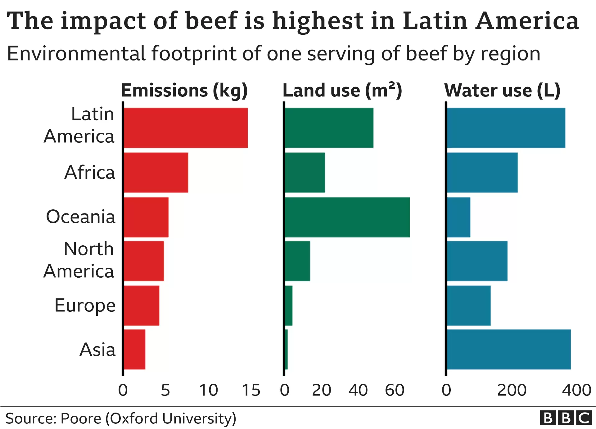
<p class="caption">(\#fig:bbc-beef-chart)BBC chart showing carbon impact of various foods</p>
</div>


This plot was made using the `bbplot` package. To show how this works, let's create our own plot. We'll do so using the `palmerpenguins` package, which has data on penguins living on three islands in Antarctica. To give you a sense of what this data looks like, let's load the `palmerpenguins` and `tidyverse` packages.


```r
library(palmerpenguins)
library(tidyverse)
```

We now have data that we can work with in an object called `penguins`. Here's what the first ten rows look like.


```r
penguins
#> # A tibble: 344 × 8
#>    species island    bill_le…¹ bill_…² flipp…³ body_…⁴ sex  
#>    <fct>   <fct>         <dbl>   <dbl>   <int>   <int> <fct>
#>  1 Adelie  Torgersen      39.1    18.7     181    3750 male 
#>  2 Adelie  Torgersen      39.5    17.4     186    3800 fema…
#>  3 Adelie  Torgersen      40.3    18       195    3250 fema…
#>  4 Adelie  Torgersen      NA      NA        NA      NA <NA> 
#>  5 Adelie  Torgersen      36.7    19.3     193    3450 fema…
#>  6 Adelie  Torgersen      39.3    20.6     190    3650 male 
#>  7 Adelie  Torgersen      38.9    17.8     181    3625 fema…
#>  8 Adelie  Torgersen      39.2    19.6     195    4675 male 
#>  9 Adelie  Torgersen      34.1    18.1     193    3475 <NA> 
#> 10 Adelie  Torgersen      42      20.2     190    4250 <NA> 
#> # … with 334 more rows, 1 more variable: year <int>, and
#> #   abbreviated variable names ¹​bill_length_mm,
#> #   ²​bill_depth_mm, ³​flipper_length_mm, ⁴​body_mass_g
```

To get our data in a more usable format, let's count how many penguins live on each island. We do this with the `count()` function from the `dplyr` package (one of several packages that are loaded when we load the `tidyverse`).


```r
penguins %>%
  count(island)
#> # A tibble: 3 × 2
#>   island        n
#>   <fct>     <int>
#> 1 Biscoe      168
#> 2 Dream       124
#> 3 Torgersen    52
```

Because we're going to use this data multiple times below, let's save it as an object called `penguins_summary`.


```r
penguins_summary <- penguins %>%
  count(island)
```

Now that we've got some data to work with, we're ready to create a plot. Before showing what `bbplot` does, let's make a plot with ggplot defaults. Of course, Figure \@ref(fig:basic-penguins-plot) isn't the most aesthetically pleasing chart. But we'll be improving it soon!


```r
ggplot(
  data = penguins_summary,
  aes(
    x = island,
    y = n,
    fill = island
  )
) +
  geom_col() +
  labs(
    title = "Number of Penguins",
    subtitle = "Islands are in Antarctica",
    caption = "Data from palmerpenguins package"
  )
```

<div class="figure">

<p class="caption">(\#fig:basic-penguins-plot)A chart with the default theme</p>
</div>


We're going to use this plot multiple times (with some modifications each time). To simplify things, let's save it as an object called `penguins_plot`. 


```r
penguins_plot <- ggplot(
  data = penguins_summary,
  aes(
    x = island,
    y = n,
    fill = island
  )
) +
  geom_col() +
  labs(
    title = "Number of Penguins",
    subtitle = "Islands are in Antarctica",
    caption = "Data from palmerpenguins package"
  )
```

Now that we have a basic plot to work with, let's make it look like a BBC chart. To do this, we load the `bbplot` package. 

This package has two functions: `bbc_style()` and `finalise_plot()`. The latter deals with things like adding the BBC logo, saving plots in the correct dimensions, and other tasks done after the plot is complete. We'll discuss this a bit more below. 

For now, let's look at the `bbc_style()` function. This function applies a custom ggplot theme to any plot. Watch what happens in Figure \@ref(fig:penguins-bbc-style) when I apply it to our `penguins_plot`.


```r
library(bbplot)

penguins_plot +
  bbc_style()
```

<div class="figure">

<p class="caption">(\#fig:penguins-bbc-style)The same chart with BBC style</p>
</div>


Way different, right? Larger font size, legend on top, no axis titles, stripped down grid lines, and a white background – these are the major changes that the `bbc_style()` function makes. Let's look at them one by one. 

Here's the code for the `bbc_style()` function (taken from the `bbplot` GitHub repository, found at https://github.com/bbc/bbplot). 

You may be a bit confused by the way some of the code is written. This is in part because it is the code used to create a function. The first line gives the function a name (`bbc_style`) and indicates that it is, in fact, a function definition. We'll discuss functions more in Chapter \@ref(functions).

You'll see that instead of loading the package `ggplot2` with the code `library(ggplot2)` and then using the `theme()` function, the code below uses `ggplot2::theme()`. This indicates that the `theme()` function comes from the `ggplot2` package. Writing code in this way is something that is done when making an R package, something we'll discuss in Chapter \@ref(custom-packages).

I've made some minor formatting tweaks for readability. For example, you can see the comments in ALL CAPS, which show the category of modification that the section which follows makes. Fortunately for us, the code is organized nicely and allows us to see what each section does. 


```r
bbc_style <- function() {
  font <- "Helvetica"
  
  ggplot2::theme(
    
    # TEXT FORMAT
    # This sets the font, size, type and colour of text for the chart's title
    plot.title = ggplot2::element_text(
      family = font,
      size = 28,
      face = "bold",
      color = "#222222"
    ),
    # This sets the font, size, type and colour of text for the chart's subtitle,
    # as well as setting a margin between the title and the subtitle
    plot.subtitle = ggplot2::element_text(
      family = font,
      size = 22,
      margin = ggplot2::margin(9, 0, 9, 0)
    ),
    # This leaves the caption text element empty, because it is set elsewhere in the finalise plot function
    plot.caption = ggplot2::element_blank(),
    
    # LEGEND FORMAT
    # This sets the position and alignment of the legend, removes a title and background for it
    # and sets the requirements for any text within the legend.
    # The legend may often need some more manual tweaking when it comes to its exact position based on the plot coordinates.
    legend.position = "top",
    legend.text.align = 0,
    legend.background = ggplot2::element_blank(),
    legend.title = ggplot2::element_blank(),
    legend.key = ggplot2::element_blank(),
    legend.text = ggplot2::element_text(
      family = font,
      size = 18,
      color = "#222222"
    ),
    
    # AXIS FORMAT
    # This sets the text font, size and colour for the axis test, as well as setting the margins and removes lines and ticks.
    # In some cases, axis lines and axis ticks are things we would want to have in the chart - the cookbook shows examples of how to do so.
    axis.title = ggplot2::element_blank(),
    axis.text = ggplot2::element_text(
      family = font,
      size = 18,
      color = "#222222"
    ),
    axis.text.x = ggplot2::element_text(margin = ggplot2::margin(5, b = 10)),
    axis.ticks = ggplot2::element_blank(),
    axis.line = ggplot2::element_blank(),
    
    # GRID LINES
    # This removes all minor gridlines and adds major y gridlines.
    # In many cases you will want to change this to remove y gridlines and add x gridlines.
    # The cookbook shows you examples for doing so.
    panel.grid.minor = ggplot2::element_blank(),
    panel.grid.major.y = ggplot2::element_line(color = "#cbcbcb"),
    panel.grid.major.x = ggplot2::element_blank(),
    
    # BLANK BACKGROUND
    # This sets the panel background as blank, removing the standard grey ggplot background colour from the plot.
    panel.background = ggplot2::element_blank(),
    
    # STRIP BACKGROUND
    # This sets the panel background for facet-wrapped plots to white,
    # removing the standard grey ggplot background colour and sets the title size of the facet-wrap title to font size 22.
    strip.background = ggplot2::element_rect(fill = "white"),
    strip.text = ggplot2::element_text(size = 22, hjust = 0)
  )
}
```

Nearly all of the code in the `bbc_style()` function exists within the `theme()` function from `ggplot2`. In the last chapter, we saw how Cédric Scherer and Georgios Karamanis customized their plot by applying the `theme_light()` function. This a so-called complete theme, meaning you can call the function and will change the whole look-and-feel of your plot. After applying `theme_light()`, Cédric and Georgios used the `theme()` function make additional tweaks. The `bbc_style()` theme does not use a complete theme to start. Instead, by jumping straight into the `theme()` function, they make tweaks to the ggplot defaults. 

It can be challenging to remember how to tweak different elements in a plot. Fortunately, there are cheatsheets available to help. This one by Clara Granell shows the various elements that you can tweak within the `theme()` function. 

https://github.com/claragranell/ggplot2/blob/main/ggplot_theme_system_cheatsheet.pdf

TODO: Add image. Also, is this cheatsheet going to be legible in the book?

As you can see, the `bbc_style()` function does a lot of tweaking. So, let's go through the changes it makes, section by section. 

The first section of the code deals with text formatting. First, it defines a variable called "font" and assigns it the value "Helvetica." This allows later sections of code to simply write "font" rather than repeating "Helvetica" over and over again. And, if the team ever wanted to use a different font, they could simply change "Helvetica" to, say, "Comic Sans" and change all BBC plots (I suspect higher-ups at the BBC might not be on board). 


```r
font <- "Helvetica"
```

Subsequent pieces of this section of the code make changes to the title, subtitle, and caption. The pattern used in code to make changes is as follows:


```r
AREA_OF_CHART = ELEMENT_TYPE(
  PROPERTY = VALUE
)
```

We begin by selecting an area of the chart (e.g. `plot.title`). Then, we have to say what type of element it is. The options are `element_text()`, `element_line()`, `element_rect()`, and `element_blank()`. We'll deal with the other three later on. For now, we're working with `element_text()` to handle formatting of the title, subtitle, and caption since they're all text elements. Within the element type, we give values to properties. This can be, say, setting the font family (the property) to Helvetica (the value).

One of the main things that the `bbc_style()` function does is to bump up the text size. As Nassos put it to me, on a lot of plots made with ggplot, "font and the numbers are just so small." Increasing font size helps with legibility, especially when plots made using the `bbplot` package are viewed on smaller mobile devices. 

The code first formats the title using Helvetica 28-point bold font in a nearly black color (that's the hex code #222222). The subtitle is 22-point Helvetica. Some spacing is added between the title and subtitle using the `margin()` function, which gives the spacing, in points, for the top (9), right (0), bottom (9), and left (0) sides. Finally, the caption is removed using the `element_blank()` function. This is done because the `finalise_plot()` function in the `bbplot` package adds elements, including a caption and the BBC logo to the bottom of plots. 


```r
penguins_plot +
  theme(
    plot.title = element_text(
      family = font,
      size = 28,
      face = "bold",
      color = "#222222"
    ),
    plot.subtitle = element_text(
      family = font,
      size = 22,
      margin = margin(9, 0, 9, 0)
    ),
    plot.caption = element_blank()
  )
```

<div class="figure">

<p class="caption">(\#fig:unnamed-chunk-17)Our chart with only text formatting changed</p>
</div>


We then save our plot as an object in order to work with it in the next section.


```r
penguins_plot_text <- penguins_plot +
  theme(
    plot.title = element_text(
      family = font,
      size = 28,
      face = "bold",
      color = "#222222"
    ),
    plot.subtitle = element_text(
      family = font,
      size = 22,
      margin = margin(9, 0, 9, 0)
    ),
    plot.caption = element_blank()
  )
```

Next, we deal with the legend. The code puts the legend on top of the plot, and left aligns the text within it. Then, it removes the legend background (this would only show up if the background color of the entire plot were different than the legend background), title, and legend key (this is a box that can show up around the boxes with the names of the islands). Finally, we make the legend text 18-point Helevetica with the same nearly black color. We can see the result in Figure \@ref(fig:penguins-plot-legend).


```r
penguins_plot_text +
  theme(
    legend.position = "top",
    legend.text.align = 0,
    legend.background = element_blank(),
    legend.title = element_blank(),
    legend.key = element_blank(),
    legend.text = element_text(
      family = font,
      size = 18,
      color = "#222222"
    )
  )
```

<div class="figure">

<p class="caption">(\#fig:penguins-plot-legend)Our chart with changes to the legend</p>
</div>


And again, we save this plot so we can continue to alter it below.


```r
penguins_plot_legend <- penguins_plot_text +
  theme(
    legend.position = "top",
    legend.text.align = 0,
    legend.background = element_blank(),
    legend.title = element_blank(),
    legend.key = element_blank(),
    legend.text = element_text(
      family = font,
      size = 18,
      color = "#222222"
    )
  )
```

Next up are the axes. The code first removes axis titles because, as Nassos told me, these tend to take up a lot of chart real estate and you can use the title and subtitle to make clear what the axes show. All text on axes becomes 18-point Helevetica nearly black. The text on the x axis (in our case, Biscoe, Dream, and Torgersen) gets a bit of spacing around it. And, finally, as we can see in Figure \@ref(fig:penguins-plot-axes), both axis ticks and axis lines are removed. 


```r
penguins_plot_legend +
  theme(
    axis.title = element_blank(),
    axis.text = element_text(
      family = font,
      size = 18,
      color = "#222222"
    ),
    axis.text.x = element_text(margin = margin(5, b = 10)),
    axis.ticks = element_blank(),
    axis.line = element_blank()
  )
```

<div class="figure">
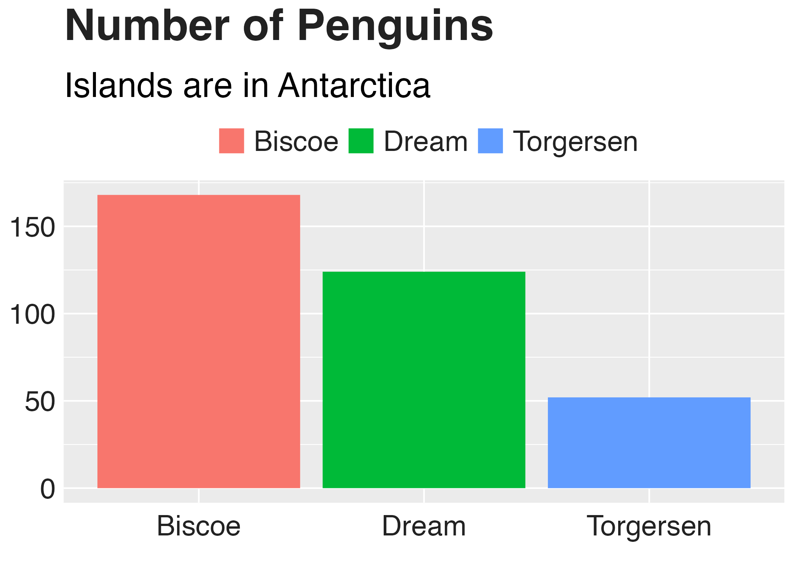
<p class="caption">(\#fig:penguins-plot-axes)Our chart with changes to axis formatting</p>
</div>


Let's now save this plot as an object for future tweaks.


```r
penguins_plot_axes <- penguins_plot_legend +
  theme(
    axis.title = element_blank(),
    axis.text = element_text(
      family = font,
      size = 18,
      color = "#222222"
    ),
    axis.text.x = element_text(margin = margin(5, b = 10)),
    axis.ticks = element_blank(),
    axis.line = element_blank()
  )
```

Now that we've tweaked overall text formatting, the legend, and the axes, let's move onto grid lines. The approach here is fairly straightforward: remove all minor grid lines, remove major grid lines on the x axis, keeping only major grid lines on the y axis, but making them a light gray (using the #cbcbcb hex code). We can see the result of these tweaks to the grid lines in Figure \@ref(fig:penguins-plot-gridlines).


```r
penguins_plot_axes +
  theme(
    panel.grid.minor = element_blank(),
    panel.grid.major.y = element_line(color = "#cbcbcb"),
    panel.grid.major.x = element_blank()
  )
```

<div class="figure">

<p class="caption">(\#fig:penguins-plot-gridlines)Our chart with tweaks to the grid lines</p>
</div>


And, once again, we save our plot to an object.


Of course, in the previous iteration of our plot, it still had a gray background. The `bbc_style()` function removes this with the following code (and the resulting plot, seen in Figure \@ref(fig:penguins-plot-no-bg)).


```r
penguins_plot_grid_lines +
  theme(
    panel.background = element_blank()
  )
```

<div class="figure">
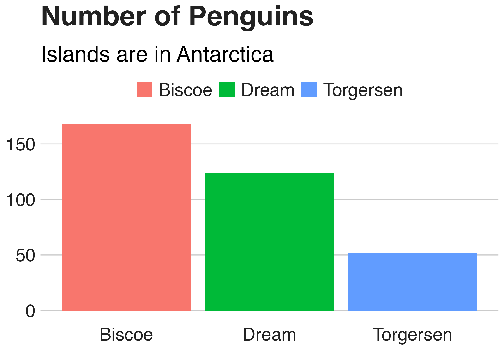
<p class="caption">(\#fig:penguins-plot-no-bg)Our chart with the gray background removed</p>
</div>


And there we go! We've now recreated the plot that we made above using the `bbc_style()` function. However, you may recall there is a bit more code in the `bbc_style()` function. This code deals with `strip.background` and `strip.text`. Both of these occur when we make small multiples charts. Small multiples is a common technique in data visualization, where, instead of making one chart that incorporates all of the available data, we break the chart into multiple charts in order to make the final results easier for the reader to comprehend. 

Let's make an example small multiples chart to show what this looks like. I've used the code from the `bbc_style()` function (though I've removed the legend as it's not necessary in this chart). See Figure \@ref(fig:penguin-facetted-plot) below.


<div class="figure">

<p class="caption">(\#fig:penguin-facetted-plot)Small multiples chart with no changes to the strip text formatting</p>
</div>


When we use the `facet_wrap()` function, we are left with one chart per island. But note that, by default, the text above each chart is noticeably smaller than the rest of the chart. And the gray background behind the text stands out when we have removed the gray background from other parts of the chart. 


I've saved the code used to make Figure \@ref(fig:penguin-facetted-plot) as an object (`penguins_plot_weight`). We now use this object in order to show how to change the text that shows up above each small multiples chart (in ggplot this text is called the "strip"). We remove the background (or, more accurately, make it white) and make the text larger, bold, and left aligned (using `hjust = 0`). (I did have to make the text size slightly smaller to fit in the book and added code to make it bold, something done in the chart on carbon impact of food chart, though not seen in the `bbc_style()` code.) The result shows up in Figure \@ref(fig:penguins-plot-facetted-bbc).


```r
penguins_plot_weight +
  theme(
    strip.background = element_rect(fill = "white"),
    strip.text = element_text(size = 17, hjust = 0, face = "bold")
  )
```

<div class="figure">

<p class="caption">(\#fig:penguins-plot-facetted-bbc)Small multiples chart in the BBC style</p>
</div>


If we now return to Figure \@ref(fig:bbc-beef-chart), the 2019 carbon impact of food chart that Nassos and Clara made, we can again see how similar it is. All of the tweaks in the `bbc_style()` function (text formatting, legends, axes, grid lines, and backgrounds) are visible. 


You might be thinking: wait, what about the colors? Doesn't the theme change that? It's a common point of confusion. If we read the documentation for the `theme()` function, though, it becomes clearer why this is the case:

> Themes are a powerful way to customize the non-data components of your plots: i.e. titles, labels, fonts, background, gridlines, and legends.

Color is used in plots as an aesthetic property to show something about data. In Figure \@ref(fig:bbc-beef-chart), for instance, color is mapped to the type of carbon impact (emissions, land use, and water use). As we saw in Chapter \@ref(data-viz-chapter), we can change color using the various `scale_` functions. It is because color is tied to the data rather than being about the overall look-and-feel that ggplot themes do not, on their own, change this component of plots. 

## Code is the Catalyst for Culture Change {-}

When Nassos Stylianou and Clara Guibourg started developing a custom theme for the BBC, they had one question: would they be able to create graphs in R that could go straight onto the BBC website? And, wouldn't you know, they succeeded! The creation of the the `bbplot` package allowed them to make plots that had a consistent look-and-feel, followed BBC standards, and, most importantly, did not need help from a designer. 

Many of the principles of high-quality data visualization that we discussed in Chapter \@ref(data-viz-chapter) can be seen in this custom theme. In particular, the removal of extraneous elements (axis titles and grid lines, for instance) helps keep the focus on the data itself. And by creating a custom theme that only requires users to add a single line to their ggplot code, it became simple to get others on board. Telling users they could just append `bbc_style()` to their code and get a BBC-style plot was an eye-opener.

The development of the `bbplot` package would lead to significant changes at the BBC. It inspired Nassos, Clara, and the other data journalists who created it to use ggplot more than before. Knowing that they had the flexibility of ggplot at their fingertips gave them license to explore. And knowing that they did not have to work with a designer to create production-ready graphics empowered them to make more and better graphics.

In addition to the `bbc_style()` function, the `bbplot` package also provides another function (`finalise_plot()`) that adds a source at the bottom of the chart (recall how the `bbc_style()` function removed the caption), adds the BBC logo in the footer, and gives height, width, and file name options for saving the plot. These two functions combined allowed Nassos, Clara, and others to achieve their holy grail: creating production-ready graphs that could go straight from R to the BBC website. 

The impact of `bbplot` would also come to be seen outside of the small team of data journalists that brought it to life. Others at the BBC saw how the data journalism team was now able to produce production-ready graphs and they wanted to do the same. This led the data journalism team to set up R trainings for their colleagues and to develop a "cookbook" (shown \@ref(fig: bbc-cookbook)) that provided examples of how to make various types of charts. 


<div class="figure">
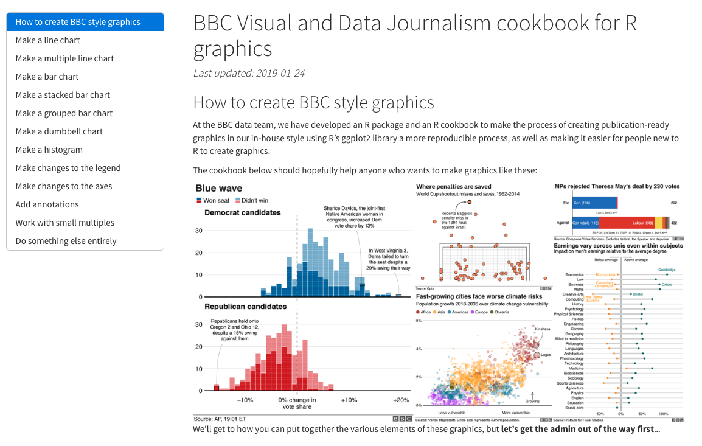
<p class="caption">(\#fig:bbc-cookbook)Screenshot of BBC graphics cookbook</p>
</div>

These two resources led to a large increase in R users at the BBC. As Nassos told me, they "spurred people a lot people outside of the data journalism team to take a real interest [in R]." Having `bbplot` made the value of R click for many people at the BBC. He continued:

> There is no, "why am I doing this?" in their mind. It's is worth the pain [to learn R], because it is a pain at first. But seeing this graphic that a few months ago you would have had to do in this old process ... if you devote a bit of time each day, here are the five lines of code that you can run and you can [make a production-ready graphic] yourself.

As so many more people at the BBC came to learn R, the quality and quantity of data visualization produced exploded. Nassos told me, "I don't think there's been a day where someone at the BBC hasn't used the package to produce a graphic." The `bbplot` package came in particularly helpful during COVID. Being able to produce on-brand graphics on a quick turnaround was possible in a way it would not have been previously. 

Reflecting on her experience, Clara attributes the successful transition to R at the BBC to its culture. As she put it, "I think that what helped me get started was that there was a really supportive environment internally at the BBC for learning." And, indeed, this same supportive culture that led Clara to organically explore what R was capable of was reinforced after she and the data journalism team released `bbplot`. The custom theme they developed enabled the creation of so many BBC graphics that otherwise never would have seen the light of day. A culture open to learning led the data journalism team to insights about the power of code. And this code then facilitated a culture change around how graphics are produced at the BBC. 

<!--chapter:end:custom-theme.Rmd-->

# R is a Full-Fledged Map-Making Tool 


<!--chapter:end:maps.Rmd-->

# Make Tables That Look Good and Share Results Effectively 

https://clauswilke.com/dataviz/figure-titles-captions.html#tables

<!--chapter:end:tables.Rmd-->

# (PART\*) Communicate {-}

# Use RMarkdown to Communicate Accurately and Efficiently 


<!--chapter:end:rmarkdown.Rmd-->

# Use RMarkdown to Instantly Generate Hundreds of Reports 

<!--chapter:end:parameterized-reports.Rmd-->

# Create Beautiful Presentations with RMarkdown 


<!--chapter:end:presentations.Rmd-->

# Make Websites to Share Results Online 

- When to do static vs when you need Shiny

<!--chapter:end:websites.Rmd-->

# (PART\*) Automate {-}

# Access Up to Date Census Data with the `tidycensus` Package 


<!--chapter:end:tidycensus.Rmd-->

# Pull in Survey Results as Soon as They Come In 


<!--chapter:end:qualtrics.Rmd-->

# Stop Copying and Pasting Code by Creating Your Own Functions {#functions}


<!--chapter:end:functions.Rmd-->

# Bundle Your Functions Together in Your Own R Package {#custom-packages}

<!--chapter:end:custom-packages.Rmd-->

# (PART\*) Conclusion {-}

# Come for the Data, Stay for the Community 


<!--chapter:end:conclusion.Rmd-->

