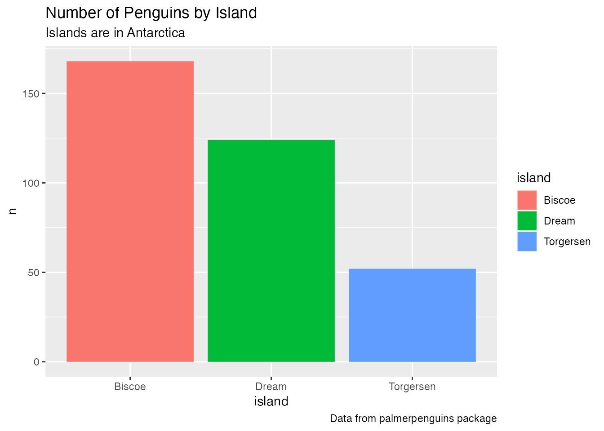
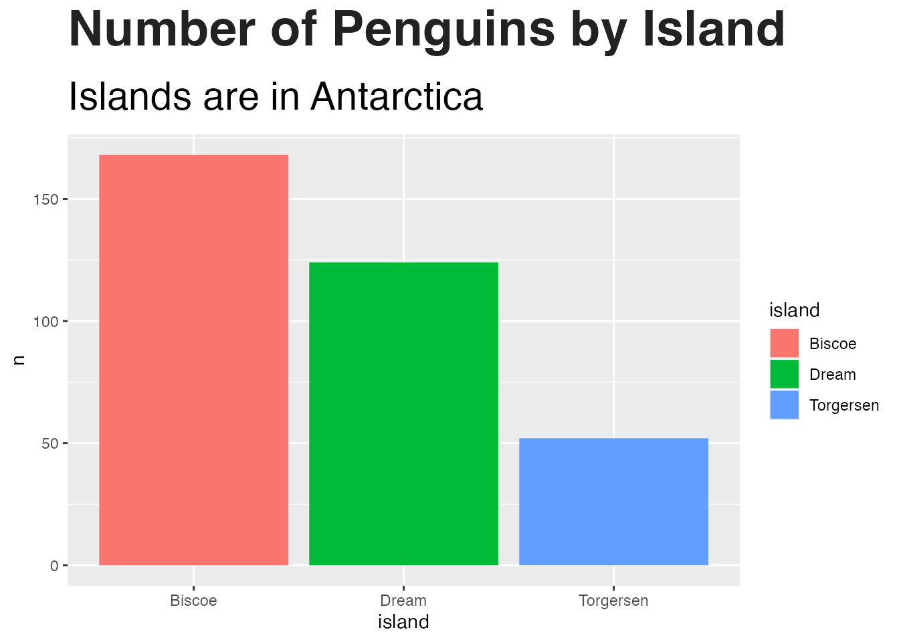
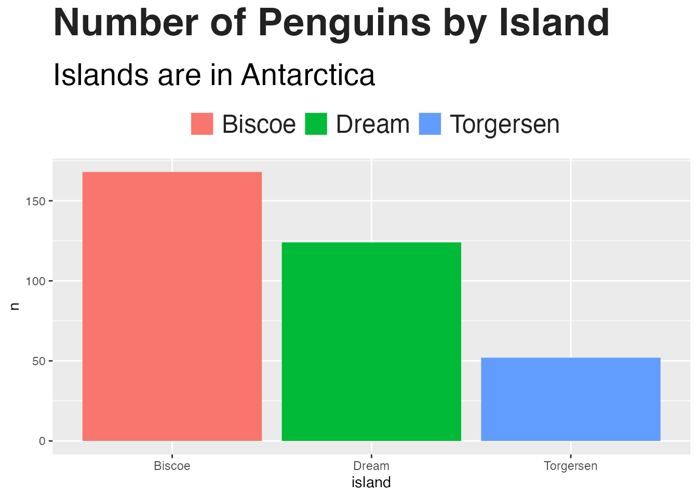
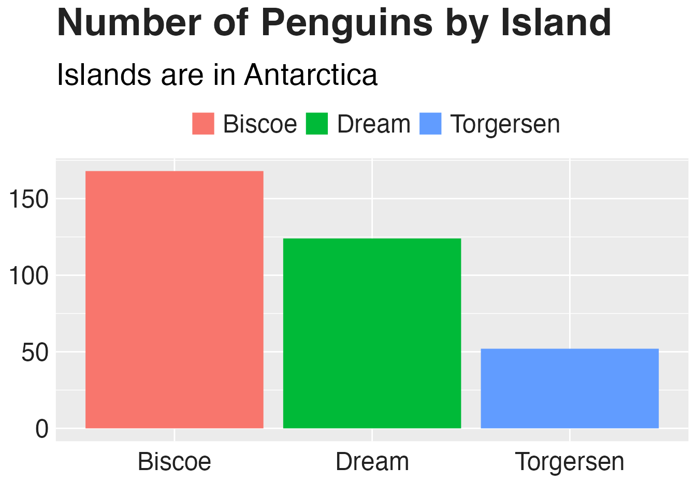
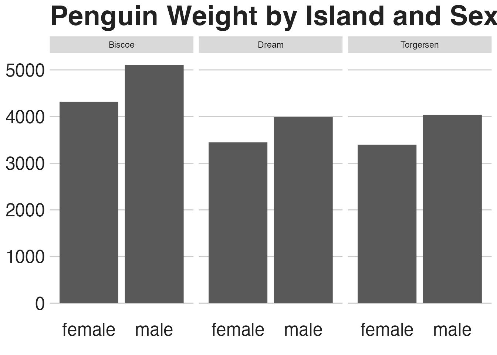
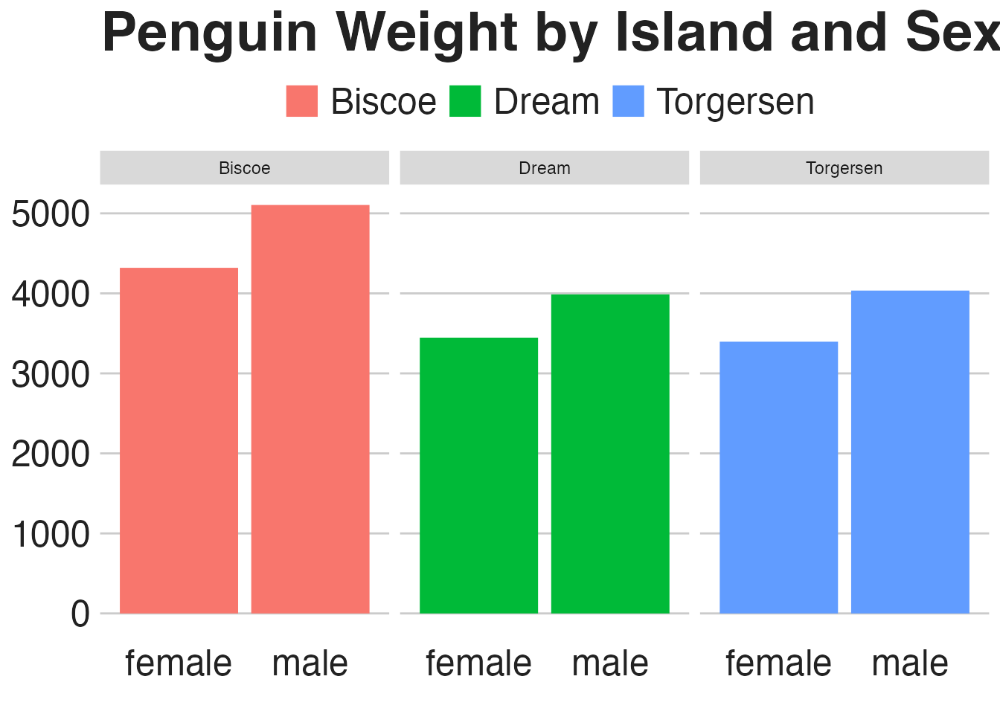

--- 
title: "R Without Statistics"
author: "David Keyes"
# date: "2022-08-11"
site: bookdown::bookdown_site
documentclass: book
url: https://book.rwithoutstatistics.com
cover-image: mock-cover.png
description: |
  Since R was invented in 1993, it has become a widely used programming language for statistical analysis. From academia to the tech world and beyond, R is used for a wide range of statistical analysis. R Without Statistics will show ways that R can be used beyond complex statistical analysis. Readers will learn about a range of uses for R, many of which they have likely never even considered.
biblio-style: apalike
---

# date: "2022-08-11"

Placeholder


<!--chapter:end:index.Rmd-->


# (PART\*) Introduction {-}
# Why R Without Statistics?

Placeholder


## How New Zealand Used R to Fight COVID {-}
## How I Came to Use R {-}
## How This Book Works {-}
## A Favor to Ask {-}

<!--chapter:end:introduction.Rmd-->

---
output: html_document
editor_options: 
  chunk_output_type: inline
---

# (PART\*) Illuminate {-}

<!--chapter:end:illuminate.Rmd-->


# Use General Principles of High-Quality Data Viz in R

Placeholder


## The Grammar of Graphics {-}
## ggplot2 {-}
## Recreating the Drought Visualization {-}
## ggplot is Your Data Viz Secret Weapon {-}

<!--chapter:end:data-viz.Rmd-->

# Develop a Custom Theme to Keep Your Data Viz Consistent 

In 2018, BBC data journalist Nassos Stylianou was working with a backend developer on a particularly large data set. Nassos was primarily an Excel user at the time, but this data was too large for Excel. Seeing the developer work, a light bulb went off for Nassos: if he and his data journalism team learned to use R, they could do this type of analysis on their own. 

This realization began a journey into R. This journey, which started with needing to analyze data too large for Excel to handle, would ultimately end up in a very different place. 

In 2019, Nassos, his colleague Clara Guibourg, and their team created a custom ggplot theme to create plots that match the BBC style. The code in the `bbplot` package is a great example of the value of developing a custom theme. 

But the real story of the creation of bbplot is not just about technical tools. Through learning R and creating a custom theme for others to use, Nassos, Clara and their colleagues would change the culture, remove bottlenecks, and allow the BBC to be more creative with their data viz.

To understand how big these changes were, it's helpful to understand what things looked like at the BBC before bbplot. In the mid-2010s, journalists at the BBC who wanted to make data visualization had two choices:

1. They could use an internal tool called Chart Tools. This tool could create data visualization, but only the predefined charts it had been designed to generate. 
2. They could use Excel to create mockups and then work with a graphic designer to finalize the charts. This approach led to better results, and was way more flexible, but required extensive back-and-forth with a designer. As Nassos described it, working with a designer "is just a very time consuming workflow if you think of how many visualizations the BBC does." 

Neither of these choices was ideal. And this limited set of less-than-ideal choices led to a limited output of data viz.   

That would all change when Nassos, Clara, and their colleagues realized that R, the tool they had decided to learn for data analysis, could also do data visualization. As they began playing around with ggplot, they quickly saw its power. 

Clara said she found it "immediately addictive when I started working with ggplot to make charts." No longer limited by Chart Tools, she found that ggplot was "completely flexible in a way that was just completely new to me." 

The biggest change, though, came from not having to work with a designer. Not because the designers were bad (they weren't). But because ggplot allowed the BBC data journalists to explore different visualizations on their own. Working with a designer required the journalists to have a fully-formed idea that the designer could take and improve upon. Working in ggplot allowed BBC data journalists to explore different data viz ideas. 

Clara Guibourg believes this freedom is what explains the addictive quality of ggplot. As she told me, "even before we got anywhere near having a production-ready chart, just trying things out, visualizing things for the first time" was completely captivating. Having learned the basics of ggplot, she saw that "you can make like the simplest chart with just a couple of lines of code." Being able to explore different types of visualization on her own led Clara and others to produce more  data viz than they had previously. 

As the BBC data journalism team improved their ggplot skills, they realized that they could produce not only exploratory data viz, but also production-ready charts. They had learned to use R for data analysis, were starting to use it for exploratory data visualization, could they go all the way and create a chart in R that could go straight onto the BBC website? 

Nassos, Clara, and their colleagues set about looking into what would be involved in creating production-ready charts from R. They realized that so much of the work required to create production-ready charts involved small tweaks. What font should they use? Where should the legend go? Should axes have titles? Should charts have grid lines? 

The answers to these questions are what makes charts on-brand. Having consistent answers to them is what enabled BBC designers to turn Excel mockups into data viz ready to go on the website. As the BBC data journalism team dug further into ggplot, they realized that they might be able to write code to make their data viz production-ready. They realized that, if making production-ready charts required asking question about fonts, legends, axes, and grid lines, ggplot had an answer. And the answer was to make a custom theme. 

## Enter bbplot

TODO: Show example plot: https://ichef.bbci.co.uk/news/976/cpsprodpb/82BA/production/_121266433_beef_by_region_ws_640x3-nc.png (source: https://www.bbc.com/news/science-environment-46459714) 

### Show data

To show how `bbplot` works, let's create our own plot. We'll do so using the `palmerpenguins` package, which has data on penguins living on three islands in Antarctica. To give you a sense of what this data looks like, let's load `palmerpenguins` and the `tidyverse` packages.


We now have data that we can work with in an object called `penguins`. Here's what the first ten rows look like.


```
#> # A tibble: 344 × 8
#>    species island    bill_le…¹ bill_…² flipp…³ body_…⁴ sex  
#>    <fct>   <fct>         <dbl>   <dbl>   <int>   <int> <fct>
#>  1 Adelie  Torgersen      39.1    18.7     181    3750 male 
#>  2 Adelie  Torgersen      39.5    17.4     186    3800 fema…
#>  3 Adelie  Torgersen      40.3    18       195    3250 fema…
#>  4 Adelie  Torgersen      NA      NA        NA      NA <NA> 
#>  5 Adelie  Torgersen      36.7    19.3     193    3450 fema…
#>  6 Adelie  Torgersen      39.3    20.6     190    3650 male 
#>  7 Adelie  Torgersen      38.9    17.8     181    3625 fema…
#>  8 Adelie  Torgersen      39.2    19.6     195    4675 male 
#>  9 Adelie  Torgersen      34.1    18.1     193    3475 <NA> 
#> 10 Adelie  Torgersen      42      20.2     190    4250 <NA> 
#> # … with 334 more rows, 1 more variable: year <int>, and
#> #   abbreviated variable names ¹​bill_length_mm,
#> #   ²​bill_depth_mm, ³​flipper_length_mm, ⁴​body_mass_g
#> # ℹ Use `print(n = ...)` to see more rows, and `colnames()` to see all variable names
```
To get our data in a more usable format, let's count how many penguins live on each island. We do this with the `count()` function from the `dplyr` package (one of several packages that are loaded when we load the `tidyverse`).


```
#> # A tibble: 3 × 2
#>   island        n
#>   <fct>     <int>
#> 1 Biscoe      168
#> 2 Dream       124
#> 3 Torgersen    52
```

Because we're going to use this data multiple times below, let's save it as an object called `penguins_summary`.


### Create plot

Now that we've got some data to work with, we're ready to create a plot. Before showing what `bbplot` does, let's make a plot with ggplot defaults. Of course, this isn't the most aesthetically pleasing chart. But we'll be improving it soon!



### Save plot as object

We're going to use this plot multiple times (with some modifications each time). To simplify things, let's save it as an object called `penguins_plot`. 


### Apply bbc_style()

Now that we have a basic plot to work with, let's make it look like a BBC chart. To do this, we load the `bbplot` package. 

This package has two functions: `bbc_style()` and `finalise_plot()`. The latter deals with things like adding the BBC logo, saving plots in the correct dimensions, and other tasks done after the plot is complete. We'll discuss this a bit more below. 

For now, let's look at the `bbc_style()` function. This function applies a custom ggplot theme to any plot. Watch what happens when I apply it to our `penguins_plot`.


Way different, right? Larger font size, legend on top, no axis titles, stripped down grid lines, and a white background – these are the major changes that the `bbc_style()` function makes. Let's look at them one by one. 

### Look at bbc_style() function

Here's the code for the `bbc_style()` function (taken from the `bbplot` GitHub repository, found at https://github.com/bbc/bbplot). 

You may be a bit confused by some of the code syntax used. First of all, this is the code used to create a function. The first line gives the function a name (`bbc_style`) and indicates that it is, in fact, a function definition. We'll discuss functions more in Chapter \@ref(functions).

You'll see that instead of loading the package `ggplot2` with the code `library(ggplot2)` and then using the `theme()` function, the code below uses `ggplot2::theme()`. This indicates that the `theme()` function comes from the `ggplot2` package. Writing code in this way is something that is done when making an R package, something we'll discuss in Chapter \@ref(custom-packages).


I've made some minor formatting tweaks for readability. For example, you can see the comments in ALL CAPS, which show the category of modification that the section which follows makes. Fortunately for us, the code is organized nicely and allows us to see what each section does. 


### Text formatting




### Legend


### Axes




### Grid lines




### Backgrounds

#### Panel


#### Strip







TODO: Return to example plot: https://ichef.bbci.co.uk/news/976/cpsprodpb/82BA/production/_121266433_beef_by_region_ws_640x3-nc.png (source: https://www.bbc.com/news/science-environment-46459714) 

## Conclusion

Technical stuff
- Discuss adding logo etc with finalise_plot()
- Discuss cookbook
- Link to ggplot theme reference sheet Henry Wang: https://henrywang.nl/ggplot2-theme-elements-demonstration/

Larger message stuff
- They never intended to make custom theme
- It was all very gradual
- BBC made tons of data viz during pandemic because of bbplot

<!--chapter:end:custom-theme.Rmd-->

# R is a Full-Fledged Map-Making Tool 


<!--chapter:end:maps.Rmd-->

# Make Tables That Look Good and Share Results Effectively 

https://clauswilke.com/dataviz/figure-titles-captions.html#tables

<!--chapter:end:tables.Rmd-->

# (PART\*) Communicate {-}

# Use RMarkdown to Communicate Accurately and Efficiently 


<!--chapter:end:rmarkdown.Rmd-->

# Use RMarkdown to Instantly Generate Hundreds of Reports 

<!--chapter:end:parameterized-reports.Rmd-->

# Create Beautiful Presentations with RMarkdown 


<!--chapter:end:presentations.Rmd-->

# Make Websites to Share Results Online 

- When to do static vs when you need Shiny

<!--chapter:end:websites.Rmd-->

# (PART\*) Automate {-}

# Access Up to Date Census Data with the `tidycensus` Package 


<!--chapter:end:tidycensus.Rmd-->

# Pull in Survey Results as Soon as They Come In 


<!--chapter:end:qualtrics.Rmd-->

# Stop Copying and Pasting Code by Creating Your Own Functions 


<!--chapter:end:functions.Rmd-->

# Bundle Your Functions Together in Your Own R Package 

<!--chapter:end:custom-packages.Rmd-->

# (PART\*) Conclusion {-}

# Come for the Data, Stay for the Community 


<!--chapter:end:conclusion.Rmd-->

