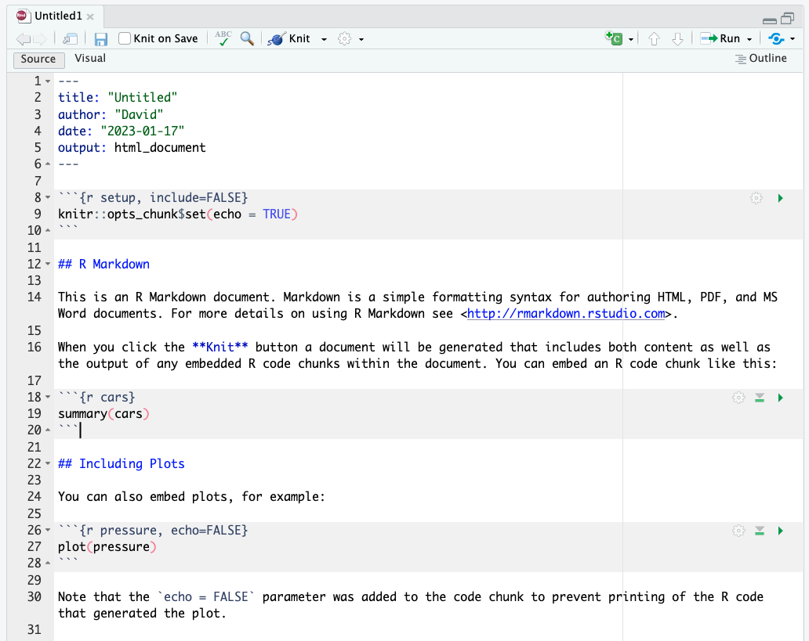
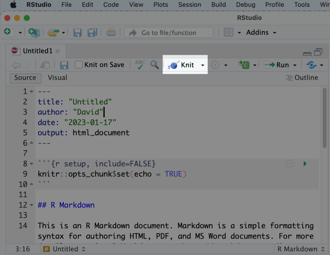
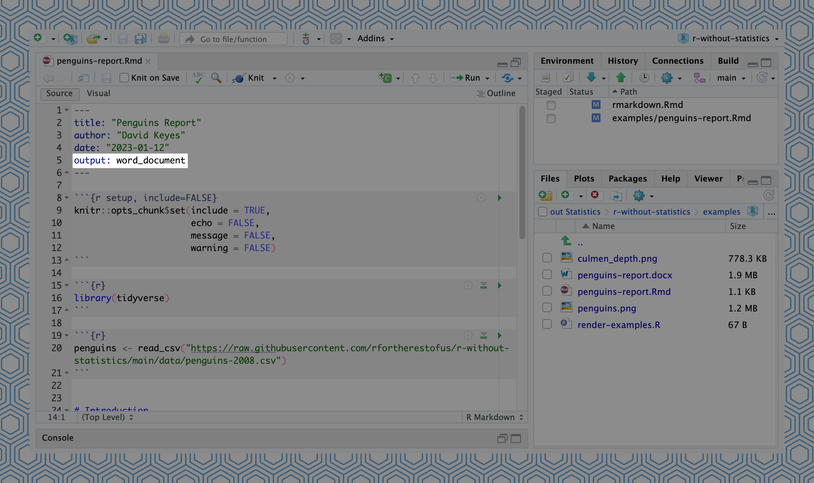
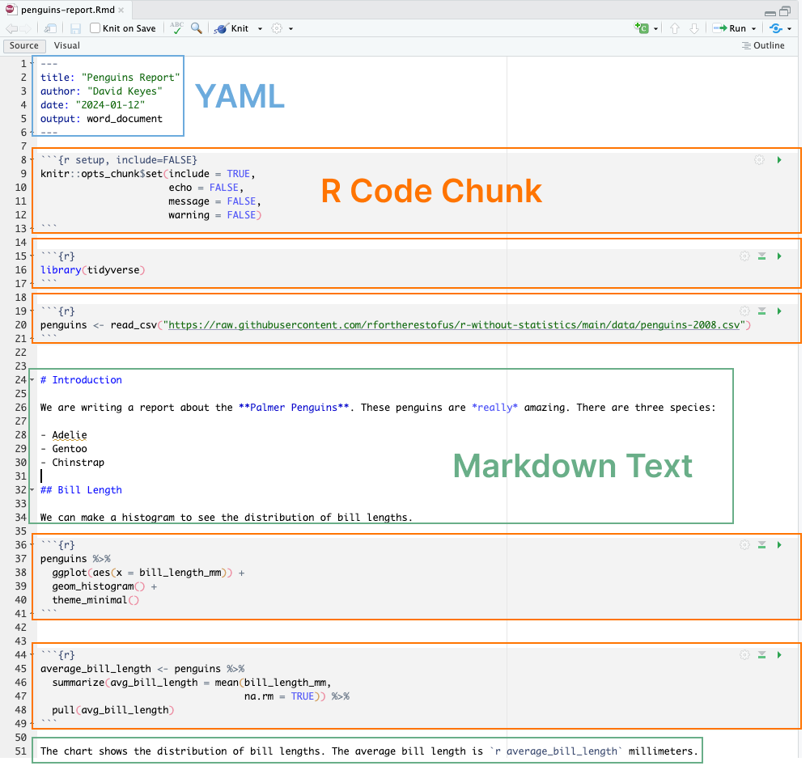

# Use R Markdown to Communicate Accurately and Efficiently {#rmarkdown-chapter}

Imagine this scenario. It's January, you've collected some surveys, and now you're ready to do your data analysis and write up your results. Your workflow looks something like this:

1. Download your data from Google Sheets import it into SPSS. 
2. Use SPSS to do your data cleaning and analysis. 
3. Export summaries of your data as Excel spreadsheets.
4. Use Excel to make some charts.
5. Write your report in Word, copying in your charts from Excel along the way.

Sound familiar? If so, you're not alone. It's the workflow that many people use when doing data analysis. But what happens when new surveys roll in and you have to redo your analysis in February? Yup, back through steps one through five. Same thing in March. And April. You get the idea.

You may be thinking: okay, but the multitool workflow can work for a one-time project, right? Maybe, but let's be honest: few projects are really one-time. Either you have to redo them the next month or you realize you forgot to include a few surveys in your original analysis or you realize you made a mistake in SPSS that means you need to redo steps one through six. 

R Markdown is the solution to this problem. It combines data analysis, data visualization, and anything you can do with code (all the pieces you might do in SPSS and Excel in the multitool workflow) alongside narrative text (the Word piece). Your combination code and text R Markdown document can be exported to many formats, including Word, PDF, and HTML, so that you can share them with non-R users. 

By combining all of the pieces from the multitool workflow in a single tool, your workflow becomes way more efficient. Need to recreate that January report in February? Just rerun your code and you've got a new report, complete with the newest data. Need to add in a few surveys you missed at any point? Rerun your code and generate a new report. Need to fix an error in your analysis? Make the fix to your code, rerun it, and your corrected report is ready to go. 

I interviewed Alison Hill to learn more about R Markdown from both a technical and conceptual perspective. Hill is currently Director of Knowledge, Product Strategy at Voltron Data, but previously worked at Posit (the company that makes the RStudio editor) doing all sorts of development and education work on R Markdown. Bits of her wisdom are sprinkled throughout, both in direct quotes and general knowledge about how R Markdown works.

In this chapter, we'll begin by breaking down the pieces of R Markdown documents. We'll then talk about some potential pitfalls and best practices when using R Markdown. And we'll conclude with some reflections on the value of the R Markdown workflow.

## How R Markdown Works {-}

To create an R Markdown document while working in RStudio, you go to File > New File > R Markdown. You can choose the title, author, and date as well as your default output format (HTML, PDF, or Word). All of these can be changed later. 


<div class="figure">

<p class="caption">(\#fig:new-rmd)How to create a new R Markdown file</p>
</div>


Hit OK and RStudio will create an R Markdown document with some placeholder content. 


<div class="figure">

<p class="caption">(\#fig:default-rmd-content)The placeholder content in a new R Markdown document</p>
</div>


My first step is always to delete the content and replace it with my own. I'm going to create a report on penguins using data from the `palmerpenguins` package (for reasons that will become clear later, I've broken it into pieces by year; for now we're just using 2007 data). Here is the content I'll add to my R Markdown document.


````default
---
title: "Penguins Report"
author: "David"
date: "2023-01-12"
output: word_document
---

```{r setup, include=FALSE}
knitr::opts_chunk$set(include = TRUE, 
                      echo = FALSE,
                      message = FALSE,
                      warning = FALSE)
```

```{r}
library(tidyverse)
```

```{r}
penguins <- read_csv("https://raw.githubusercontent.com/rfortherestofus/r-without-statistics/main/data/penguins-2007.csv")
```

# Introduction

We are writing a report about the **Palmer Penguins**. These penguins are *really* amazing. There are three species:

- Adelie
- Gentoo
- Chinstrap

## Bill Length

We can make a histogram to see the distribution of bill lengths.

```{r}
penguins %>% 
  ggplot(aes(x = bill_length_mm)) +
  geom_histogram() +
  theme_minimal()
```

```{r}
average_bill_length <- penguins %>% 
  summarize(avg_bill_length = mean(bill_length_mm,
                                   na.rm = TRUE)) %>% 
  pull(avg_bill_length)
```

The chart shows the distribution of bill lengths. The average bill length is `r average_bill_length` millimeters.
````

This document has several pieces, each of which we will discuss below. For now, though, let's skip straight to the finish line by doing what's called knitting (also known as rendering or, in plain English, exporting) our document. If we hit the knit button at the top of RStudio, our R Markdown document is converted into whatever format we selected upon creating it.


<div class="figure">

<p class="caption">(\#fig:knit-button)The knit button in RStudio</p>
</div>


I set the output format to be Word (see the line at the top that says "`output_format: word_document`" so I now have a Word document. 


<div class="figure">

<p class="caption">(\#fig:rmd-output-word-doc)An R Markdown document with the output format set to Word</p>
</div>


There are some things that were not visible in R Markdown but are in Word (the histogram, for example). This is because our R Markdown document does not include this plot directly, but instead has the code needed to produce the plot, which is then produced when we knit our document. 

It may seem convoluted to constantly knit R Markdown documents to Word, but this workflow is what allows us to update our reports at any point with updated code or new data. This is known as *reproducibility*, and it is central to the value of R Markdown. But before we discuss reproducibility in depth, let's make sure we understand how R Markdown documents are structured.

## R Markdown Documents Structure {-}

All R Markdown documents have three main pieces:

1. YAML
2. R code chunks
3. Markdown text

Each document has one YAML, but multiple code chunks and sections of markdown text. 


<div class="figure">

<p class="caption">(\#fig:rmarkdown-pieces)All of the pieces of an R Markdown document</p>
</div>


Let's take these pieces one at a time.

### The YAML {-}

The YAML is the very first piece at the top of our R Markdown document (the name YAML comes from the recursive acronym "YAML ain't markup language" whose meaning is not important for our purposes). With three dashes indicating its beginning and end, the text inside of the YAML contains metadata about the R Markdown document. My YAML, shown below, tell us the title, author, date, and the output format for when we knit.


```default
---
title: "Penguins Report"
author: "David Keyes"
date: "2023-01-12"
output: word_document
---
```

### R Code Chunks {-}

Listen to the name R Markdown and you get a sense of the other two pieces of an R Markdown document: R code and markdown text. Let's discuss the R code first.

If you've only ever worked in R script files (they use the extension .R), you'll need to reorient your thinking. In R script files everything is treated as code unless you comment it out by putting a # in front of it. In the code below, the first line is a comment while the second line is code.


```r
# Import our data
data <- read_csv("data.csv")
```

In R Markdown, the situation is reversed. After the YAML, everything is treated as text unless we specify otherwise. And we do this specifying by creating what are known as code chunks. These start with three back ticks, followed by the lower case letter r surrounded by curly brackets. Three back ticks indicate the end of the code chunk. 


````default
```{r}
library(tidyverse)
```
````

Working in RStudio, code chunks have a light gray background. Anything between the beginning and end of the code chunk is treated as R code when we knit. The code in this code chunk will give us a histogram in our Word document.


````default
```{r}
penguins %>% 
  ggplot(aes(x = bill_length_mm)) +
  geom_histogram() +
  theme_minimal()
```
````

The histogram can be seen in Figure \@ref(fig:simple-histogram) below.


