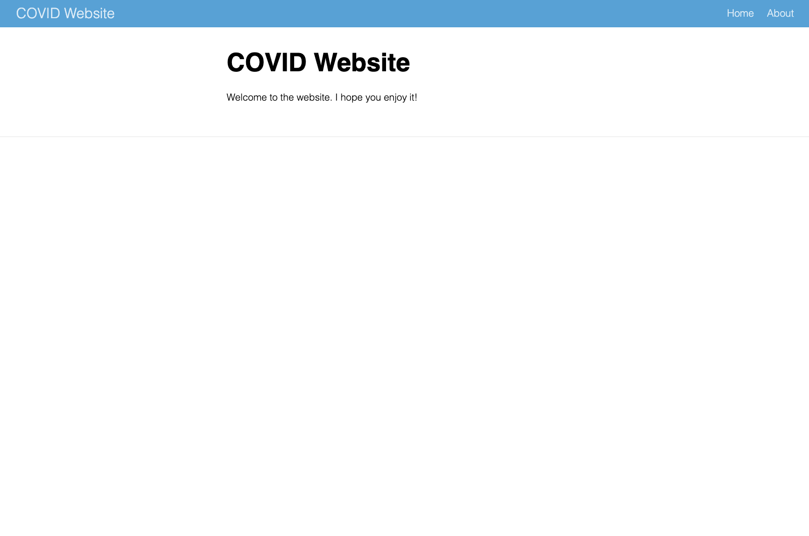

# Make Websites to Share Results Online {#websites-chapter} 

In summer 2020, Matt Herman and his family moved from Brooklyn to Westchester County, New York. It was the first summer of the COVID pandemic, and Herman was shocked to see that the high-quality data put out by the City of New York was not replicated in Westchester County. At a time before vaccines were available, daily choices depended on access to good data. Not having it made simple decisions, like whether to take children to the park, feel impossible.

Matt Herman was not just any person with an interest in COVID data. He was also, at the time, the Deputy Director of the ChildStat Data Unit in the Office of Research and Analytics at the New York City Administration for Children’s Services. This handful of a title meant that he was skilled at working with data. And with these skills, Herman realized that he could create a COVID Westchester County COVID data resource that he and others needed. The data was out there; it just needed someone to make it accessible.

What Herman ended up creating was the Westchester Covid-19 (TODO: he uses Covid while I say COVID; make consistent?) Tracking website. Built entirely in R, this website had charts, maps, tables, and text that summarized the latest COVID data for Westchester County. Although the website is no longer consistently updated, it is still available at https://westchester-covid.mattherman.info/, and it shows what is possible with R. 

```{r results='asis'}
print_nostarch_file_name(file_type_to_print = "png")
```

```{r westchester-website-screenshot, out.width="100%", fig.cap="A screenshot of the Westchester COVID-19 website"}
knitr::include_graphics(here::here("assets/westchester-website.png"))
```

```{r results='asis'}
save_image_for_nostarch(here::here("assets/westchester-website.png"))
```

The code that Herman wrote to make the website is a set of R Markdown files, strung together with the `distill` package. You may not think of R as a tool for making websites, but it can make them quite well – and `distill` makes it straightforward to do so. If you already use R to work with your data, creating a website is a great way to share results.

In this chapter, I'll explain the basics of how `distill` works by creating a simple website with it (the Westchester Covid-19  website that Matt Herman created is quite complicated so I'll use examples from it, but won't walk through it line by line). Within this website, we'll show how to create things like different page layouts, navigation menus, interactive graphics, and more. We'll then discuss how to use GitHub Pages to host your website for free. We'll conclude with some reflections on why the `distill` package to make websites is a great option for R users looking to get their results online.

## Creating a Website With the `distill` Package {-}

There are a few different ways to make websites using R Markdown (Quarto, the language-agnostic version of R Markdown, can also make websites). There is the `blogdown` package, which uses the Hugo static site generator under the surface. It is imminently flexible but finicky (updates to Hugo themes are notorious for breaking `blogdown` websites). For those looking for a simple option, the `distill` package is the way to go. It's what Matt Herman and many others have used to quickly and attractively get R Markdown-based websites up and running.

To understand how `distill` works, think back to when we have knitted our R Markdown documents to HTML (for example, in chapter \@ref(rmarkdown-chapter). These have all been one-offs, with a single R Markdown document generating a single HTML file. A website, on the other hand, is a collection of HTML files. The `distill` package is what enables us to use multiple R Markdown documents to create multiple HTML files, and have them all connected with a navigation menu and more.

To create a `distill` website, you'll first need to install the package using `install.packages("distill")`. Once you've done that, the easiest way to start a `distill` website project is to go to File > New Project > New Directory. Once you get the menu visible in Figure \@ref(fig:new-distill-website), scroll down and select Distill Website.

```{r results='asis'}
print_nostarch_file_name(file_type_to_print = "png")
```

```{r new-distill-website, out.width="100%", fig.cap="Menu to create a new distill website"}
knitr::include_graphics(here::here("assets/new-distill-website.png"))
```

```{r results='asis'}
save_image_for_nostarch(here::here("assets/new-distill-website.png"))
```

Once you do that, you'll see the menu in Figure \@ref(fig:create-distill-website).

```{r results='asis'}
print_nostarch_file_name(file_type_to_print = "png")
```

```{r create-distill-website, out.width="100%", fig.cap="Giving your distill website a name"}
knitr::include_graphics(here::here("assets/create-distill-website.png"))
```

```{r results='asis'}
save_image_for_nostarch(here::here("assets/create-distill-website.png"))
```

Here, in addition to specifying the directory and subdirectory where your project will live on your computer, you'll also want to give your website a title. You can also select Configure for GitHub Pages if you'd like. GitHub Pages is an easy way to get your website online, and I'll show how it works below. I'm going to create a new website called COVID Website and select the option to configure it for GitHub Pages.

Let's now take a look at the files in our project. In addition to the `covid-website.Rproj` file that indicates we're working in an RStudio project, we've got two R Markdown documents (`about.Rmd` and `index.Rmd`), a `_site.yml` file, and a `docs` folder. The `docs` folder is where the rendered HTML files that make up our website will go, and we'll talk about them later. Let's look at the two R Markdown documents and the `_site.yml` file.

## Working with R Markdown Documents in `distill` {-}

If we open up the `index.Rmd` file, we see the following code. 

````{verbatim echo = TRUE, eval = FALSE, lang = "markdown"}
---
title: "COVID Website"
description: |
  Welcome to the website. I hope you enjoy it!
site: distill::distill_website
---

```{r setup, include=FALSE}
knitr::opts_chunk$set(echo = FALSE)

# Learn more about creating websites with Distill at:
# https://rstudio.github.io/distill/website.html

# Learn more about publishing to GitHub Pages at:
# https://rstudio.github.io/distill/publish_website.html#github-pages
```
````

For the most part, this looks like a standard R Markdown document. In the YAML, we can see a couple differences with other R Markdown documents we've worked with: the `description` parameter and the line that says `site: distill::distill_website`. The `description` specifies text that will go below the title of each page, as seen in Figure \@ref(fig:TODO).

```{r results='asis'}
print_nostarch_file_name(file_type_to_print = "png")
```

```{r website-description, out.width="100%", fig.cap="The default website description"}
knitr::include_graphics(here::here("assets/website-description.png"))
```

```{r results='asis'}
save_image_for_nostarch(here::here("assets/website-description.png"))
```

The `site: distill::distill_website` specifies that the R Markdown document is the root page of a `distill` website. This means that when we knit, R Markdown knows to create a website, rather than an individual HTML file.

On top of these two new parameters, we also are missing one parameter that we've seen in other R Markdown documents. This is the `output` parameter, which we've used to specify the output format of our R Markdown document on knitting. The reason we don't have this `output` parameter in our R Markdown documents is that we specify the output for the entire website in our `_site.yml` file.

## Setting Options for Our Website with `_site.yml` {-}

The promise of `distill` is that it we can make several R Markdown documents and combine them into a website. To do this, we need a place to tell R which R Markdown documents make up the website, what the knitted files should look like, what the website should be called, and more. This all happens in the `_site.yml` file. If we open up the `_site.yml` file, we see the following code. 

````{verbatim echo = TRUE, eval = FALSE, lang = "yaml"}
name: "covid-website"
title: "Information about COVID rates in the United States over time"
description: |
  COVID Website
output_dir: "docs"
navbar:
  right:
    - text: "Home"
      href: index.html
    - text: "About"
      href: about.html
output: distill::distill_article
````

Let's go backwards through this file, starting with the `output: distill::distill_article` line. This line specifies that all R Markdown documents should be rendered using the `distill_article` format. This format, which we'll discuss more below, allows for things such as layouts of different widths, asides (parenthetical items that live in a sidebar next to the main content), easily customizable CSS, and more.

Next, let's look at the `navbar` section. This, as you might guess from the name, is where we define the top navigation bar on our website. Our navigation bar is placed on the right side (swapping `right` for `left` would switch its position) with two pages: Home and About. Figure \@ref(fig:navbar) below highlights the navigation bar created from our code.

```{r results='asis'}
print_nostarch_file_name(file_type_to_print = "png")
```

```{r navbar, out.width="100%", fig.cap="The website navigation bar"}
knitr::include_graphics(here::here("assets/navbar.png"))
```

```{r results='asis'}
save_image_for_nostarch(here::here("assets/navbar.png"))
```

Breaking down the `navbar` code, the `text` parameter determines what shows up in the menu. For example, if I wanted to change "About" to "About this Website", I would change this portion of the `_site.yml` to this:

````{verbatim echo = TRUE, eval = FALSE, lang = "yaml"}
navbar:
  right:
    - text: "Home"
      href: index.html
    - text: "About this Website"
      href: about.html
````

 The `href` parameter determines where the text in the navigation bar links to. You'll probably have noticed that the HTML files linked to have the same names as our R Markdown documents. This is because of the behavior we saw in Chapter \@ref(rmarkdown-chapter), where the names of HTML files are the same as the R Markdown documents used to create them, swapping out `.Rmd` for `.html`. 
 
 Moving up in the `_site.yml` file, the `output_dir` parameter determines where the rendered HTML files live when we generate our website. The `docs` directory is listed here because we selected the Configure for GitHub Pages option when creating our website (more on this below). However, you can change the output directory to any folder you choose.
 
 TODO: Figure out what description does
 
 Finally, we have the `title` and `name`. The `title` parameter creates the title for the entire website and shows up in the top left of the navigation bar by the default. The `name` parameter TODO: Figure it out.

## Building our Site {-}

So far, we've looked at our R Markdown documents and the `_site.yml` file. We haven't, however, created our website. There are three ways to do this. 

The first option is to use the Build Website button, which can be found in the Build tab of the top right pane on RStudio.

TODO: Add screenshot

The second option to create your website is to use the function `rmarkdown::render_site()`. You can run this in the console or in an R script file. 

The third option, applicable if you're working in RStudio, is to use the keyboard shortcut command/control (Mac/Windows) + shift + B. 

All three options will render all of the R Markdown documents and add the top navigation bar to them, with the options specified in the `_site.yml` file. To find the rendered files, look in the output directory you specified (for us, that was `docs`). Open up any HTML file and you'll find your website.

TODO: Add screenshot of website
 
## Custom CSS {-}

Websites made with `distill` tend to look similar (it's the tradeoff of working with a simple approach). But you can change how your website looks using some custom CSS. The `distill` package even provides a function to simplify the process.

To get started, the easiest approach is to run the `create_theme()` function from `distill`. Doing so will create a file called `theme.css`, which we can see below.

````{verbatim echo = TRUE, eval = FALSE, lang = "css"}
/* base variables */

/* Edit the CSS properties in this file to create a custom
   Distill theme. Only edit values in the right column
   for each row; values shown are the CSS defaults.
   To return any property to the default,
   you may set its value to: unset
   All rows must end with a semi-colon.                      */

/* Optional: embed custom fonts here with `@import`          */
/* This must remain at the top of this file.                 */

html {
  /*-- Main font sizes --*/
  --title-size:      50px;
  --body-size:       1.06rem;
  --code-size:       14px;
  --aside-size:      12px;
  --fig-cap-size:    13px;
  /*-- Main font colors --*/
  --title-color:     #000000;
  --header-color:    rgba(0, 0, 0, 0.8);
  --body-color:      rgba(0, 0, 0, 0.8);
  --aside-color:     rgba(0, 0, 0, 0.6);
  --fig-cap-color:   rgba(0, 0, 0, 0.6);
  /*-- Specify custom fonts ~~~ must be imported above   --*/
  --heading-font:    sans-serif;
  --mono-font:       monospace;
  --body-font:       sans-serif;
  --navbar-font:     sans-serif;  /* websites + blogs only */
}

/*-- ARTICLE METADATA --*/
d-byline {
  --heading-size:    0.6rem;
  --heading-color:   rgba(0, 0, 0, 0.5);
  --body-size:       0.8rem;
  --body-color:      rgba(0, 0, 0, 0.8);
}

/*-- ARTICLE TABLE OF CONTENTS --*/
.d-contents {
  --heading-size:    18px;
  --contents-size:   13px;
}

/*-- ARTICLE APPENDIX --*/
d-appendix {
  --heading-size:    15px;
  --heading-color:   rgba(0, 0, 0, 0.65);
  --text-size:       0.8em;
  --text-color:      rgba(0, 0, 0, 0.5);
}

/*-- WEBSITE HEADER + FOOTER --*/
/* These properties only apply to Distill sites and blogs  */

.distill-site-header {
  --title-size:       18px;
  --text-color:       rgba(255, 255, 255, 0.8);
  --text-size:        15px;
  --hover-color:      white;
  --bkgd-color:       #0F2E3D;
}

.distill-site-footer {
  --text-color:       rgba(255, 255, 255, 0.8);
  --text-size:        15px;
  --hover-color:      white;
  --bkgd-color:       #0F2E3D;
}

/*-- Additional custom styles --*/
/* Add any additional CSS rules below                      */
````

Within that file, there are a set of what are known as CSS variables. Most of them have names that clearly show their purpose. Our `theme.css` file contains the default values for our CSS variables. If we want to make tweaks, we simply change them. For example, I've taken a section of the `theme.css` file and made the title and text size larger and made the background color a light blue.

````{verbatim echo = TRUE, eval = FALSE, lang = "markdown"}
.distill-site-header {
  --title-size:       28px;
  --text-color:       rgba(255, 255, 255, 0.8);
  --text-size:        20px;
  --hover-color:      white;
  --bkgd-color:       #6cabdd;
}
````

Before we rebuild our site to see these changes, we need to do one other thing: tell `distill` to use this custom CSS when rendering. We do this by adding this line in the `_site.yml` file: `theme: theme.css`. Our `_site.yml` will now look like this:

````{verbatim echo = TRUE, eval = FALSE, lang = "yaml"}
name: "covid-website"
title: "COVID Website"
description: |
  COVID Website
theme: theme.css
output_dir: "docs"
navbar:
  right:
    - text: "Home"
      href: index.html
    - text: "About"
      href: about.html
output: distill::distill_article
````

Now we can generate our site again using any of the three options above. The website with our CSS tweaks can be seen in Figure \@ref(fig:TODO) below.



As you can see in the `theme.css` file, there are a lot of CSS variables we can change to tweak the appearance of our website. Playing around with them and rebuilding your site is a great way to figure out what does what.
 
## Adding Content to Our Website {-}

So far, we've only been talking about customizing what our website looks like. But if we look at our website, it only has placeholder content, and there's not much of it. Let's talk now about adding content to our `distill` website.

The advantage of creating content in a `distill` website, of course, is that you do it just as you would with any other R Markdown document. All of the markdown text and code chunks that we discussed in Chapter \@ref(rmarkdown-chapter) will work in `distill` as well. 

I've written some code below that creates a table, a map, and a chart on our COVID website. After the YAML and `setup` code chunk, we load several packages: 

1. `tidyverse` for data import, manipulation, and plotting (with ggplot)
1. `janitor` for the `clean_names()` function, which makes our variable names easier to work with 
1. `tigris` to import geospatial data on states
1. `gt` for making nice tables, as discussed in \@ref(tables-chapter)
1. `lubridate` to which makes working with dates easier

In the next code chunk, we import and clean the data. We also create a variable called `most_recent_day`, which allow us to use inline R code to put an always-up-to-date latest day in our text (see the header directly below this code chunk). 

We then make a table that shows the death rates per 100,000 people in four states (the table would be long if we showed all 50 states). Next, we make a map of this same data, but for all states. Finally, we make a chart that shows COVID death rates over time (for legibility in this book, we only show four states).

TODO: Update date
TODO: Add numbers to annotate code in Word version

````{verbatim echo = TRUE, eval = FALSE, lang = "markdown"}
---
title: "COVID Website"
description: "Information about COVID rates in the United States over time"
site: distill::distill_website
---

```{r setup, include=FALSE}
knitr::opts_chunk$set(echo = FALSE,
                      warning = FALSE,
                      message = FALSE)
```

```{r}
# Load packages

library(tidyverse)
library(janitor)
library(tigris)
library(gt)
library(lubridate)
```

```{r}
# Import data

us_states <- states(cb = TRUE, 
                    resolution = "20m",
                    progress_bar = FALSE) %>%
  shift_geometry() %>% 
  clean_names() %>% 
  select(geoid, name) %>% 
  rename(state = name) %>% 
  filter(state %in% state.name)

covid_data <- read_csv("https://raw.githubusercontent.com/nytimes/covid-19-data/master/rolling-averages/us-states.csv") %>% 
  filter(state %in% state.name) %>% 
  mutate(geoid = str_remove(geoid, "USA-")) 

most_recent_day <- covid_data %>% 
  slice_max(order_by = date,
            n = 1) %>% 
  distinct(date) %>% 
  mutate(date_nice_format = str_glue("{month(date, label = TRUE, abbr = FALSE)} {day(date)}, {year(date)}")) %>% 
  pull(date_nice_format)
```

# COVID Death Rates as of `r most_recent_day`

This table shows COVID death rates per 100,000 people in four states states.

```{r}
# Make table

covid_data %>% 
  filter(state %in% c("Alabama",
                      "Alaska",
                      "Arizona",
                      "Arkansas")) %>% 
  slice_max(order_by = date,
            n = 1) %>% 
  select(state, deaths_avg_per_100k) %>% 
  arrange(state) %>% 
  set_names("State", "Death rate") %>% 
  gt() %>% 
  tab_style(
    style = cell_text(weight = "bold"),
    locations = cells_column_labels()
  )
```

We can see this same death rate data for all states on a map.

```{r}
# Make map

most_recent <- us_states %>% 
  left_join(covid_data, by = "state") %>% 
  slice_max(order_by = date,
            n = 1) 

most_recent %>% 
  ggplot(aes(fill = deaths_avg_per_100k)) +
  geom_sf() +
  scale_fill_viridis_c(option = "rocket") +
  labs(fill = "Deaths per\n100,000 people") +
  theme_void()
```

# COVID Death Rates Over Time

The following chart shows COVID death rates from the start of COVID in early 2020 until `r most_recent_day`.

```{r}
# Make chart

covid_data %>% 
  filter(state %in% c("Alabama",
                      "Alaska",
                      "Arizona",
                      "Arkansas")) %>% 
  ggplot(aes(x = date,
             y = deaths_avg_per_100k,
             group = state,
             fill = deaths_avg_per_100k)) +
  geom_col() +
  scale_fill_viridis_c(option = "rocket") +
  theme_minimal() +
  labs(title = "Deaths per 100,000 people over time") +
  theme(legend.position = "none",
        plot.title.position = "plot",
        plot.title = element_text(face = "bold"),
        panel.grid.minor = element_blank(),
        axis.title = element_blank()) +
  facet_wrap(~state,
             nrow = 2)
```
````

We can see what this website looks like in \@ref(fig:TODO) below.

TODO: Add screenshot of website covid-website-static-page.png

## Using Different Layouts {-}

One nice feature of `distill` is the ability to make certain code chunks output wider widths. To show how this works, let's focus on our map. Because many states are quite small, especially in the northeast, it's a bit challenging to see them. If we could make the entire map bigger, that would be helpful. 

The `distill` package has three layouts that you can apply to a code chunk to make its output wider: `l-body-outset` (a bit wider than default), `l-page` (wider still), and `l-screen` (full screen). Let's apply `l-page` to the map code chunk as follows:

````{verbatim echo = TRUE, eval = FALSE, lang = "markdown"}
```{r layout = "l-page"}
# Make map

most_recent <- us_states %>% 
  left_join(covid_data, by = "state") %>% 
  slice_max(order_by = date,
            n = 1) 

most_recent %>% 
  ggplot(aes(fill = deaths_avg_per_100k)) +
  geom_sf() +
  scale_fill_viridis_c(option = "rocket") +
  labs(fill = "Deaths per\n100,000 people") +
  theme_void()
```
````

Doing this makes our map wider (and taller), and, as a result, much easier to read. You can see what the entire page looks like in Figure \@ref(fig:TODO) below.

TODO: Add covid-website-static-page-wide-map.png 
TODO: Update this and previous screenshot because I switched to bar chart

## Making Our Content Interactive {-}

Up to this point, all of the content we've added to our website has been static. There is none of the interactivity common in websites. Since we're developing a website, it makes sense to take advantage of the medium. Matt Herman uses interactive graphics and maps on his Westchester County COVID website. Figure \@ref(fig:TODO), for example, shows a simple tooltip that allows the user to see results for any single day.

TODO: Add screenshot

Herman also makes interactive tables with the `DT` package, allowing the user to scroll through the data and sort by any of the variables in it.

TODO: Add screenshot

Let's add some interactivity to our national COVID website. We'll begin by making our table interactive. Remember how we had to only include four states in order to keep our table from getting super long? With an interactive table, we can avoid this. The `reactable` package, like the `DT` package, is a great option for interactive tables. If we swap out the `gt` package code we used to make our static table with the `reactable()` function, we can show all states. 

```{r}
covid_data %>% 
  slice_max(order_by = date,
            n = 1) %>% 
  select(state, deaths_avg_per_100k) %>% 
  arrange(state) %>% 
  set_names("State", "Death rate") %>% 
  reactable()
```

The `reactable` package shows ten rows by default, with pagination added below our table, as seen in Figure \@ref(fig:TODO).

TODO: Add screenshot

The `reactable()` function also enables sorting by default. Although we used the `arrange()` function in our code above to sort by state name, if users click the "Death rate" column, the table will be sorted by that variable. Figure \@ref(fig:TODO) shows this.

TODO: Add screenshot

We can also give our chart some interactivity. To do this, we'll use the same package that Matt Herman uses: `plotly`. The basic idea with `plotly` is this: create a plot with ggplot and save it as an object. Then, pass it to the `ggplotly()` function, which turns it into an interactive plot. Here's how it would work with my chart showing COVID death rates over time.

```{r}
library(plotly)

covid_chart <- covid_data %>% 
  filter(state %in% c("Alabama",
                      "Alaska",
                      "Arizona",
                      "Arkansas")) %>% 
  ggplot(aes(x = date,
             y = deaths_avg_per_100k,
             group = state,
             fill = deaths_avg_per_100k)) +
  geom_col() +
  scale_fill_viridis_c(option = "rocket") +
  theme_minimal() +
  labs(title = "Deaths per 100,000 people over time") +
  theme(legend.position = "none",
        plot.title.position = "plot",
        plot.title = element_text(face = "bold"),
        panel.grid.minor = element_blank(),
        axis.title = element_blank()) +
  facet_wrap(~state,
             nrow = 2)


ggplotly(covid_chart)
```

With this code, I get an interactive chart. But the tooltip that users see on hover (see Figure \@ref(fig:TODO) below) is cluttered and overwhelming because the `ggplotly()` function shows all data by default. 

TODO: Add screenshot

To make our tooltip more informative, we can also create a single variable and then tell `ggplotly()` to just use this. Below, I begin by creating a `date_nice_format` variable so that we get, say, January 1, 2021 instead of 2021-01-01. I then combine this with the state and death rates (`deaths_avg_per_100k`) variables, saving my result as `tooltip_text`. I then add a new aesthetic property in the `ggplot()` function: `text = tooltip_text`. On its own, this doesn't do anything. But when I add `tooltip = "tooltip_text"` to the `ggplotly()` function, it changes the tooltip.

TODO: Add code annotation numbers in No Starch book in code places below

```{r}
covid_chart <- covid_data %>% 
  filter(state %in% c("Alabama",
                      "Alaska",
                      "Arizona",
                      "Arkansas")) %>% 
    mutate(date_nice_format = str_glue("{month(date, label = TRUE, abbr = FALSE)} {day(date)}, {year(date)}")) %>% 
  mutate(tooltip_text = str_glue("{state}<br>{date_nice_format}<br>{deaths_avg_per_100k} per 100,000 people")) %>% 
  ggplot(aes(x = date,
             y = deaths_avg_per_100k,
             group = state,
             text = tooltip_text,
             fill = deaths_avg_per_100k)) +
  geom_col() +
  scale_fill_viridis_c(option = "rocket") +
  theme_minimal() +
  labs(title = "Deaths per 100,000 people over time") +
  theme(legend.position = "none",
        plot.title.position = "plot",
        plot.title = element_text(face = "bold"),
        panel.grid.minor = element_blank(),
        axis.title = element_blank()) +
  facet_wrap(~state,
             nrow = 2)


ggplotly(covid_chart,
                 tooltip = "tooltip_text")
```

Figure \@ref(fig:TODO) shows what our new tooltip looks like: a simple summary of the state, nicely formatted date, and death rate on that day.

TODO: Add screenshot

Adding interactivity in this way is a great way to take advantage of the medium of a website. Users who might feel overwhelmed looking at the static chart can explore the interactive version, hovering to see a summary of the results on any single day.

## Hosting {-}

Making a website is great, but you also need a way to share it. There are various ways to do this, ranging from quite simple to quite complex. 

The simplest solution is to zip up of the files in your `docs` folder (or whatever folder you put your rendered website in) and emailing your ZIP file to others. They can unzip it and open the HTML files in their browser. This works fine if you know you won't want to make changes to the data or styling of your website. But, as we discussed in \@ref(rmarkdown-chapter), what we think of as a one-time project rarely is.

A better approach is to put your entire `docs` folder in a place where others can see it. This could be an internal network, Dropbox, Google Drive, Box, or something similar. This has the advantage of being simple to implement while allowing you to only give access to those you want to see your website. You can even automate the process of copying your `docs` folder to various online file sharing sites using R packages: the `rdrop2` package works with Dropbox, `googledrive` works with Google Drive, and `boxr` works with Box. In the past, I have written code like that below, which renders my site before copying the `docs` folder to Google Drive. Having your code to render and upload it to Google Drive all in one file means you can just run your entire file, generating and uploading your website in one go.

```{r eval = FALSE, echo = TRUE}
library(rmarkdown)
library(fs)
library(googledrive)

# Render the website
render_site()

# Copy the `docs` folder to Google Drive
# TODO: Add code
```

The most complicated yet most powerful solution is to use what's known as *continuous deployment*. TODO: check on definition of this. The idea behind continuous deployment is that, each time you commit your code to GitHub (or a similar service for posting code online), it deploys to a website you have set up. Learning to use GitHub is an investment (the book *Happy Git and GitHub for the useR* by Jenny Bryan is a great resource), but being able to host your website for free makes it worth the time and effort. 

Here's how this works. GitHub has a service called GitHub Pages. Most of the time, when you look at a file on GitHub, it shows you its underlying source code. If you look at an HTML file, you see the HTML code. GitHub Pages, on the other hand, doesn't show you the code of HTML files, it shows you the rendered HTML files. This is what we want when we create a website. 

To host your website on GitHub Pages, you'll need to first push your code to GitHub. Once you have a repository set up there, you'll go to it, then go to the Settings tab. From there, what you see should look like Figure \@ref(fig:TODO).

TODO: Add screenshot gh-pages.png

On this screen, you now choose how you want GitHub to deploy the raw HTML into a rendered website. The easiest approach is to keep the default source ("Deploy from a branch") and then select your default branch (usually `main` or `master`). You then select a directory where the HTML files you want to be rendered are found. You have two options: `root` or `docs`. My files are in `docs` so I'll choose that. Do you remember, way back in the beginning, how we told RStudio to configure our website for GitHub pages? Doing so put our HTML files in the `docs` folder because that is one place that GitHub Pages looks for such files. After we hit save, wait a few minutes, and GitHub will show us a URL where it is now hosting our website.

TODO: Add screenshot

The best part about hosting your website on GitHub Pages is that, any time you make updates to your code or data, the website will update as well. If I were to run my code next week, render my website again, and push it to GitHub, GitHub Pages would automatically update the website it serves online. RMarkdown-based websites made with `distill`, combined with continuous deployment powered by GitHub Pages, makes building and maintaining websites a snap.

## Conclusion {-}
